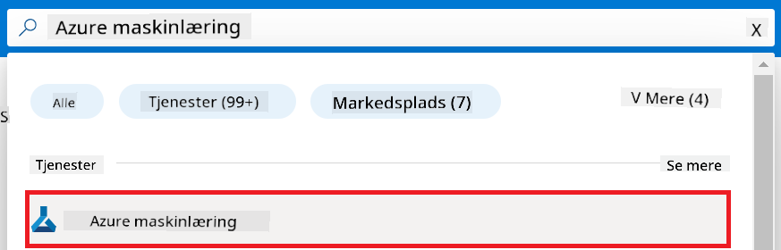
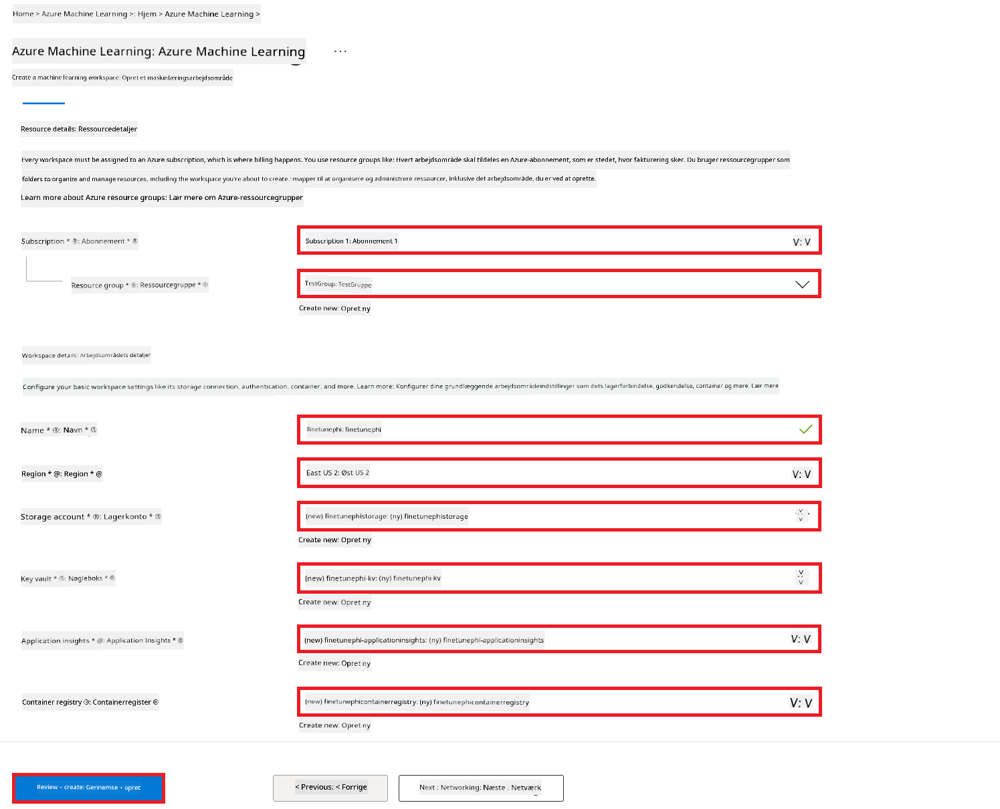
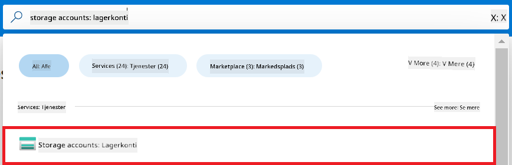
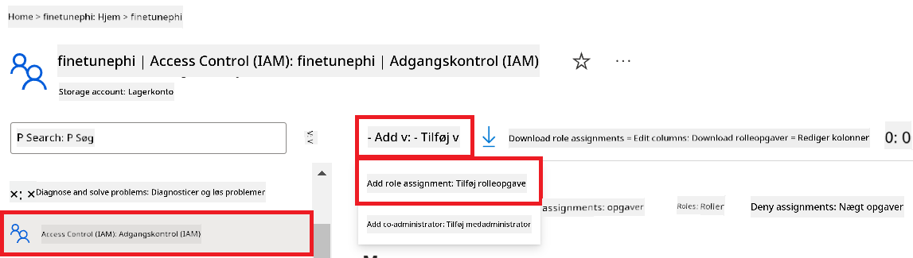
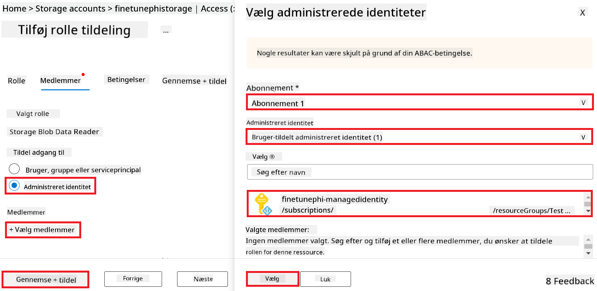
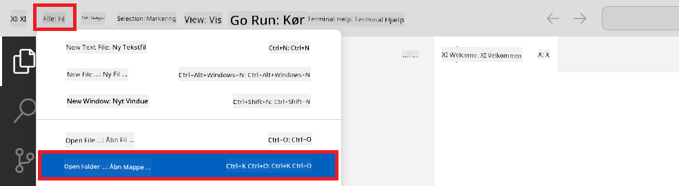
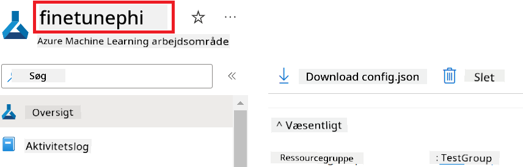
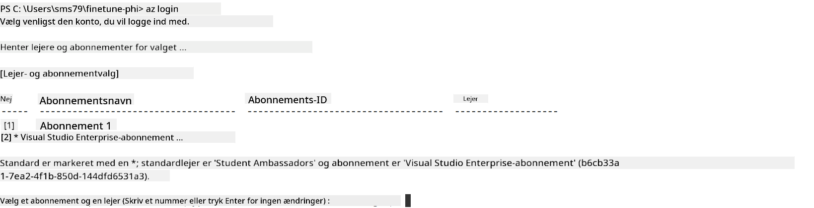

<!--
CO_OP_TRANSLATOR_METADATA:
{
  "original_hash": "455be2b7b9c3390d367d528f8fab2aa0",
  "translation_date": "2025-07-17T00:31:08+00:00",
  "source_file": "md/02.Application/01.TextAndChat/Phi3/E2E_Phi-3-FineTuning_PromptFlow_Integration.md",
  "language_code": "da"
}
-->
# Finjuster og integrer tilpassede Phi-3 modeller med Prompt flow

Dette end-to-end (E2E) eksempel er baseret på guiden "[Fine-Tune and Integrate Custom Phi-3 Models with Prompt Flow: Step-by-Step Guide](https://techcommunity.microsoft.com/t5/educator-developer-blog/fine-tune-and-integrate-custom-phi-3-models-with-prompt-flow/ba-p/4178612?WT.mc_id=aiml-137032-kinfeylo)" fra Microsoft Tech Community. Det introducerer processerne for finjustering, implementering og integration af tilpassede Phi-3 modeller med Prompt flow.

## Oversigt

I dette E2E eksempel vil du lære, hvordan du finjusterer Phi-3 modellen og integrerer den med Prompt flow. Ved at udnytte Azure Machine Learning og Prompt flow vil du etablere en arbejdsgang til implementering og brug af tilpassede AI-modeller. Dette E2E eksempel er opdelt i tre scenarier:

**Scenario 1: Opsæt Azure-ressourcer og forbered til finjustering**

**Scenario 2: Finjuster Phi-3 modellen og implementer i Azure Machine Learning Studio**

**Scenario 3: Integrer med Prompt flow og chat med din tilpassede model**

Her er en oversigt over dette E2E eksempel.


### Indholdsfortegnelse

1. **[Scenario 1: Opsæt Azure-ressourcer og forbered til finjustering](../../../../../../md/02.Application/01.TextAndChat/Phi3)**
    - [Opret et Azure Machine Learning Workspace](../../../../../../md/02.Application/01.TextAndChat/Phi3)
    - [Anmod om GPU-kvoter i Azure Subscription](../../../../../../md/02.Application/01.TextAndChat/Phi3)
    - [Tilføj rolle-tildeling](../../../../../../md/02.Application/01.TextAndChat/Phi3)
    - [Opsæt projekt](../../../../../../md/02.Application/01.TextAndChat/Phi3)
    - [Forbered datasæt til finjustering](../../../../../../md/02.Application/01.TextAndChat/Phi3)

1. **[Scenario 2: Finjuster Phi-3 modellen og implementer i Azure Machine Learning Studio](../../../../../../md/02.Application/01.TextAndChat/Phi3)**
    - [Opsæt Azure CLI](../../../../../../md/02.Application/01.TextAndChat/Phi3)
    - [Finjuster Phi-3 modellen](../../../../../../md/02.Application/01.TextAndChat/Phi3)
    - [Implementer den finjusterede model](../../../../../../md/02.Application/01.TextAndChat/Phi3)

1. **[Scenario 3: Integrer med Prompt flow og chat med din tilpassede model](../../../../../../md/02.Application/01.TextAndChat/Phi3)**
    - [Integrer den tilpassede Phi-3 model med Prompt flow](../../../../../../md/02.Application/01.TextAndChat/Phi3)
    - [Chat med din tilpassede model](../../../../../../md/02.Application/01.TextAndChat/Phi3)

## Scenario 1: Opsæt Azure-ressourcer og forbered til finjustering

### Opret et Azure Machine Learning Workspace

1. Skriv *azure machine learning* i **søgefeltet** øverst på portal-siden og vælg **Azure Machine Learning** fra de viste muligheder.

    

1. Vælg **+ Create** i navigationsmenuen.

1. Vælg **New workspace** i navigationsmenuen.

    

1. Udfør følgende opgaver:

    - Vælg din Azure **Subscription**.
    - Vælg den **Resource group**, der skal bruges (opret en ny, hvis nødvendigt).
    - Indtast **Workspace Name**. Det skal være en unik værdi.
    - Vælg den **Region**, du ønsker at bruge.
    - Vælg den **Storage account**, der skal bruges (opret en ny, hvis nødvendigt).
    - Vælg den **Key vault**, der skal bruges (opret en ny, hvis nødvendigt).
    - Vælg den **Application insights**, der skal bruges (opret en ny, hvis nødvendigt).
    - Vælg den **Container registry**, der skal bruges (opret en ny, hvis nødvendigt).

    

1. Vælg **Review + Create**.

1. Vælg **Create**.

### Anmod om GPU-kvoter i Azure Subscription

I dette E2E eksempel vil du bruge *Standard_NC24ads_A100_v4 GPU* til finjustering, hvilket kræver en kvoteanmodning, og *Standard_E4s_v3* CPU til implementering, som ikke kræver en kvoteanmodning.

> [!NOTE]
>
> Kun Pay-As-You-Go abonnementer (standard abonnementstype) er berettigede til GPU-tildeling; benefit-abonnementer understøttes ikke i øjeblikket.
>
> For dem, der bruger benefit-abonnementer (såsom Visual Studio Enterprise Subscription) eller ønsker hurtigt at teste finjusterings- og implementeringsprocessen, giver denne vejledning også vejledning til finjustering med et minimalt datasæt ved brug af CPU. Det er dog vigtigt at bemærke, at finjusteringsresultater er betydeligt bedre, når man bruger en GPU med større datasæt.

1. Besøg [Azure ML Studio](https://ml.azure.com/home?wt.mc_id=studentamb_279723).

1. Udfør følgende opgaver for at anmode om *Standard NCADSA100v4 Family* kvote:

    - Vælg **Quota** i venstre sidepanel.
    - Vælg den **Virtual machine family**, der skal bruges. For eksempel vælg **Standard NCADSA100v4 Family Cluster Dedicated vCPUs**, som inkluderer *Standard_NC24ads_A100_v4* GPU.
    - Vælg **Request quota** i navigationsmenuen.

        

    - På siden Request quota, indtast den **New cores limit**, du ønsker at bruge. For eksempel 24.
    - På siden Request quota, vælg **Submit** for at anmode om GPU-kvoten.

> [!NOTE]
> Du kan vælge den passende GPU eller CPU til dine behov ved at se i dokumentationen [Sizes for Virtual Machines in Azure](https://learn.microsoft.com/azure/virtual-machines/sizes/overview?tabs=breakdownseries%2Cgeneralsizelist%2Ccomputesizelist%2Cmemorysizelist%2Cstoragesizelist%2Cgpusizelist%2Cfpgasizelist%2Chpcsizelist).

### Tilføj rolle-tildeling

For at finjustere og implementere dine modeller skal du først oprette en User Assigned Managed Identity (UAI) og tildele den de nødvendige tilladelser. Denne UAI vil blive brugt til autentificering under implementeringen.

#### Opret User Assigned Managed Identity (UAI)

1. Skriv *managed identities* i **søgefeltet** øverst på portal-siden og vælg **Managed Identities** fra de viste muligheder.

    

1. Vælg **+ Create**.

    

1. Udfør følgende opgaver:

    - Vælg din Azure **Subscription**.
    - Vælg den **Resource group**, der skal bruges (opret en ny, hvis nødvendigt).
    - Vælg den **Region**, du ønsker at bruge.
    - Indtast **Name**. Det skal være en unik værdi.

1. Vælg **Review + create**.

1. Vælg **+ Create**.

#### Tilføj Contributor rolle-tildeling til Managed Identity

1. Gå til den Managed Identity-ressource, du oprettede.

1. Vælg **Azure role assignments** i venstre sidepanel.

1. Vælg **+Add role assignment** i navigationsmenuen.

1. På siden Add role assignment, udfør følgende opgaver:
    - Vælg **Scope** til **Resource group**.
    - Vælg din Azure **Subscription**.
    - Vælg den **Resource group**, der skal bruges.
    - Vælg **Role** til **Contributor**.

    

1. Vælg **Save**.

#### Tilføj Storage Blob Data Reader rolle-tildeling til Managed Identity

1. Skriv *storage accounts* i **søgefeltet** øverst på portal-siden og vælg **Storage accounts** fra de viste muligheder.

    

1. Vælg den storage account, der er tilknyttet Azure Machine Learning workspace, som du oprettede. For eksempel *finetunephistorage*.

1. Udfør følgende opgaver for at navigere til siden Add role assignment:

    - Gå til den Azure Storage account, du oprettede.
    - Vælg **Access Control (IAM)** i venstre sidepanel.
    - Vælg **+ Add** i navigationsmenuen.
    - Vælg **Add role assignment** i navigationsmenuen.

    

1. På siden Add role assignment, udfør følgende opgaver:

    - På Role-siden, skriv *Storage Blob Data Reader* i **søgefeltet** og vælg **Storage Blob Data Reader** fra de viste muligheder.
    - På Role-siden, vælg **Next**.
    - På Members-siden, vælg **Assign access to** **Managed identity**.
    - På Members-siden, vælg **+ Select members**.
    - På siden Select managed identities, vælg din Azure **Subscription**.
    - På siden Select managed identities, vælg **Managed identity** til **Manage Identity**.
    - På siden Select managed identities, vælg den Manage Identity, du oprettede. For eksempel *finetunephi-managedidentity*.
    - På siden Select managed identities, vælg **Select**.

    

1. Vælg **Review + assign**.

#### Tilføj AcrPull rolle-tildeling til Managed Identity

1. Skriv *container registries* i **søgefeltet** øverst på portal-siden og vælg **Container registries** fra de viste muligheder.

    

1. Vælg den container registry, der er tilknyttet Azure Machine Learning workspace. For eksempel *finetunephicontainerregistries*

1. Udfør følgende opgaver for at navigere til siden Add role assignment:

    - Vælg **Access Control (IAM)** i venstre sidepanel.
    - Vælg **+ Add** i navigationsmenuen.
    - Vælg **Add role assignment** i navigationsmenuen.

1. På siden Add role assignment, udfør følgende opgaver:

    - På Role-siden, skriv *AcrPull* i **søgefeltet** og vælg **AcrPull** fra de viste muligheder.
    - På Role-siden, vælg **Next**.
    - På Members-siden, vælg **Assign access to** **Managed identity**.
    - På Members-siden, vælg **+ Select members**.
    - På siden Select managed identities, vælg din Azure **Subscription**.
    - På siden Select managed identities, vælg **Managed identity** til **Manage Identity**.
    - På siden Select managed identities, vælg den Manage Identity, du oprettede. For eksempel *finetunephi-managedidentity*.
    - På siden Select managed identities, vælg **Select**.
    - Vælg **Review + assign**.

### Opsæt projekt

Nu vil du oprette en mappe at arbejde i og opsætte et virtuelt miljø til at udvikle et program, der interagerer med brugere og bruger gemt chat-historik fra Azure Cosmos DB til at informere sine svar.

#### Opret en mappe til at arbejde i

1. Åbn et terminalvindue og skriv følgende kommando for at oprette en mappe med navnet *finetune-phi* i standardstien.

    ```console
    mkdir finetune-phi
    ```

1. Skriv følgende kommando i terminalen for at navigere til den *finetune-phi* mappe, du oprettede.

    ```console
    cd finetune-phi
    ```

#### Opret et virtuelt miljø

1. Skriv følgende kommando i terminalen for at oprette et virtuelt miljø med navnet *.venv*.

    ```console
    python -m venv .venv
    ```

1. Skriv følgende kommando i terminalen for at aktivere det virtuelle miljø.

    ```console
    .venv\Scripts\activate.bat
    ```
> [!NOTE]
>
> Hvis det virkede, skulle du se *(.venv)* før kommandoprompten.
#### Installer de nødvendige pakker

1. Skriv følgende kommandoer i din terminal for at installere de nødvendige pakker.

    ```console
    pip install datasets==2.19.1
    pip install transformers==4.41.1
    pip install azure-ai-ml==1.16.0
    pip install torch==2.3.1
    pip install trl==0.9.4
    pip install promptflow==1.12.0
    ```

#### Opret projektfiler

I denne øvelse skal du oprette de væsentlige filer til vores projekt. Disse filer inkluderer scripts til at downloade datasættet, opsætte Azure Machine Learning-miljøet, finjustere Phi-3 modellen og implementere den finjusterede model. Du vil også oprette en *conda.yml* fil til opsætning af finjusteringsmiljøet.

I denne øvelse vil du:

- Oprette en *download_dataset.py* fil til at downloade datasættet.
- Oprette en *setup_ml.py* fil til at opsætte Azure Machine Learning-miljøet.
- Oprette en *fine_tune.py* fil i *finetuning_dir* mappen til at finjustere Phi-3 modellen ved hjælp af datasættet.
- Oprette en *conda.yml* fil til opsætning af finjusteringsmiljøet.
- Oprette en *deploy_model.py* fil til at implementere den finjusterede model.
- Oprette en *integrate_with_promptflow.py* fil til at integrere den finjusterede model og køre modellen ved hjælp af Prompt flow.
- Oprette en flow.dag.yml fil til at opsætte workflow-strukturen for Prompt flow.
- Oprette en *config.py* fil til at indtaste Azure-oplysninger.

> [!NOTE]
>
> Fuld mappestruktur:
>
> ```text
> └── YourUserName
> .    └── finetune-phi
> .        ├── finetuning_dir
> .        │      └── fine_tune.py
> .        ├── conda.yml
> .        ├── config.py
> .        ├── deploy_model.py
> .        ├── download_dataset.py
> .        ├── flow.dag.yml
> .        ├── integrate_with_promptflow.py
> .        └── setup_ml.py
> ```

1. Åbn **Visual Studio Code**.

1. Vælg **File** i menulinjen.

1. Vælg **Open Folder**.

1. Vælg *finetune-phi* mappen, som du har oprettet, og som ligger i *C:\Users\yourUserName\finetune-phi*.

    

1. I venstre panel i Visual Studio Code, højreklik og vælg **New File** for at oprette en ny fil med navnet *download_dataset.py*.

1. I venstre panel i Visual Studio Code, højreklik og vælg **New File** for at oprette en ny fil med navnet *setup_ml.py*.

1. I venstre panel i Visual Studio Code, højreklik og vælg **New File** for at oprette en ny fil med navnet *deploy_model.py*.

    

1. I venstre panel i Visual Studio Code, højreklik og vælg **New Folder** for at oprette en ny mappe med navnet *finetuning_dir*.

1. I *finetuning_dir* mappen, opret en ny fil med navnet *fine_tune.py*.

#### Opret og konfigurer *conda.yml* fil

1. I venstre panel i Visual Studio Code, højreklik og vælg **New File** for at oprette en ny fil med navnet *conda.yml*.

1. Tilføj følgende kode til *conda.yml* filen for at opsætte finjusteringsmiljøet til Phi-3 modellen.

    ```yml
    name: phi-3-training-env
    channels:
      - defaults
      - conda-forge
    dependencies:
      - python=3.10
      - pip
      - numpy<2.0
      - pip:
          - torch==2.4.0
          - torchvision==0.19.0
          - trl==0.8.6
          - transformers==4.41
          - datasets==2.21.0
          - azureml-core==1.57.0
          - azure-storage-blob==12.19.0
          - azure-ai-ml==1.16
          - azure-identity==1.17.1
          - accelerate==0.33.0
          - mlflow==2.15.1
          - azureml-mlflow==1.57.0
    ```

#### Opret og konfigurer *config.py* fil

1. I venstre panel i Visual Studio Code, højreklik og vælg **New File** for at oprette en ny fil med navnet *config.py*.

1. Tilføj følgende kode til *config.py* filen for at inkludere dine Azure-oplysninger.

    ```python
    # Azure settings
    AZURE_SUBSCRIPTION_ID = "your_subscription_id"
    AZURE_RESOURCE_GROUP_NAME = "your_resource_group_name" # "TestGroup"

    # Azure Machine Learning settings
    AZURE_ML_WORKSPACE_NAME = "your_workspace_name" # "finetunephi-workspace"

    # Azure Managed Identity settings
    AZURE_MANAGED_IDENTITY_CLIENT_ID = "your_azure_managed_identity_client_id"
    AZURE_MANAGED_IDENTITY_NAME = "your_azure_managed_identity_name" # "finetunephi-mangedidentity"
    AZURE_MANAGED_IDENTITY_RESOURCE_ID = f"/subscriptions/{AZURE_SUBSCRIPTION_ID}/resourceGroups/{AZURE_RESOURCE_GROUP_NAME}/providers/Microsoft.ManagedIdentity/userAssignedIdentities/{AZURE_MANAGED_IDENTITY_NAME}"

    # Dataset file paths
    TRAIN_DATA_PATH = "data/train_data.jsonl"
    TEST_DATA_PATH = "data/test_data.jsonl"

    # Fine-tuned model settings
    AZURE_MODEL_NAME = "your_fine_tuned_model_name" # "finetune-phi-model"
    AZURE_ENDPOINT_NAME = "your_fine_tuned_model_endpoint_name" # "finetune-phi-endpoint"
    AZURE_DEPLOYMENT_NAME = "your_fine_tuned_model_deployment_name" # "finetune-phi-deployment"

    AZURE_ML_API_KEY = "your_fine_tuned_model_api_key"
    AZURE_ML_ENDPOINT = "your_fine_tuned_model_endpoint_uri" # "https://{your-endpoint-name}.{your-region}.inference.ml.azure.com/score"
    ```

#### Tilføj Azure miljøvariabler

1. Udfør følgende for at tilføje Azure Subscription ID:

    - Skriv *subscriptions* i **søgefeltet** øverst på portal-siden og vælg **Subscriptions** fra de viste muligheder.
    - Vælg den Azure Subscription, du bruger.
    - Kopiér og indsæt dit Subscription ID i *config.py* filen.

    

1. Udfør følgende for at tilføje Azure Workspace Navn:

    - Gå til den Azure Machine Learning-ressource, du har oprettet.
    - Kopiér og indsæt dit kontonavn i *config.py* filen.

    

1. Udfør følgende for at tilføje Azure Resource Group Navn:

    - Gå til den Azure Machine Learning-ressource, du har oprettet.
    - Kopiér og indsæt dit Azure Resource Group Navn i *config.py* filen.

    

2. Udfør følgende for at tilføje Azure Managed Identity navn:

    - Gå til Managed Identities ressourcen, du har oprettet.
    - Kopiér og indsæt dit Azure Managed Identity navn i *config.py* filen.

    

### Forbered datasæt til finjustering

I denne øvelse skal du køre *download_dataset.py* filen for at downloade *ULTRACHAT_200k* datasættet til dit lokale miljø. Du vil derefter bruge dette datasæt til at finjustere Phi-3 modellen i Azure Machine Learning.

#### Download dit datasæt med *download_dataset.py*

1. Åbn *download_dataset.py* filen i Visual Studio Code.

1. Tilføj følgende kode i *download_dataset.py*.

    ```python
    import json
    import os
    from datasets import load_dataset
    from config import (
        TRAIN_DATA_PATH,
        TEST_DATA_PATH)

    def load_and_split_dataset(dataset_name, config_name, split_ratio):
        """
        Load and split a dataset.
        """
        # Load the dataset with the specified name, configuration, and split ratio
        dataset = load_dataset(dataset_name, config_name, split=split_ratio)
        print(f"Original dataset size: {len(dataset)}")
        
        # Split the dataset into train and test sets (80% train, 20% test)
        split_dataset = dataset.train_test_split(test_size=0.2)
        print(f"Train dataset size: {len(split_dataset['train'])}")
        print(f"Test dataset size: {len(split_dataset['test'])}")
        
        return split_dataset

    def save_dataset_to_jsonl(dataset, filepath):
        """
        Save a dataset to a JSONL file.
        """
        # Create the directory if it does not exist
        os.makedirs(os.path.dirname(filepath), exist_ok=True)
        
        # Open the file in write mode
        with open(filepath, 'w', encoding='utf-8') as f:
            # Iterate over each record in the dataset
            for record in dataset:
                # Dump the record as a JSON object and write it to the file
                json.dump(record, f)
                # Write a newline character to separate records
                f.write('\n')
        
        print(f"Dataset saved to {filepath}")

    def main():
        """
        Main function to load, split, and save the dataset.
        """
        # Load and split the ULTRACHAT_200k dataset with a specific configuration and split ratio
        dataset = load_and_split_dataset("HuggingFaceH4/ultrachat_200k", 'default', 'train_sft[:1%]')
        
        # Extract the train and test datasets from the split
        train_dataset = dataset['train']
        test_dataset = dataset['test']

        # Save the train dataset to a JSONL file
        save_dataset_to_jsonl(train_dataset, TRAIN_DATA_PATH)
        
        # Save the test dataset to a separate JSONL file
        save_dataset_to_jsonl(test_dataset, TEST_DATA_PATH)

    if __name__ == "__main__":
        main()

    ```

> [!TIP]
>
> **Vejledning til finjustering med et minimalt datasæt ved brug af CPU**
>
> Hvis du vil bruge en CPU til finjustering, er denne metode ideel for dem med fordelabonnementer (som Visual Studio Enterprise Subscription) eller til hurtigt at teste finjusterings- og implementeringsprocessen.
>
> Erstat `dataset = load_and_split_dataset("HuggingFaceH4/ultrachat_200k", 'default', 'train_sft[:1%]')` med `dataset = load_and_split_dataset("HuggingFaceH4/ultrachat_200k", 'default', 'train_sft[:10]')`
>

1. Skriv følgende kommando i din terminal for at køre scriptet og downloade datasættet til dit lokale miljø.

    ```console
    python download_data.py
    ```

1. Bekræft, at datasættene blev gemt korrekt i din lokale *finetune-phi/data* mappe.

> [!NOTE]
>
> **Datasætstørrelse og finjusteringstid**
>
> I dette E2E-eksempel bruger du kun 1% af datasættet (`train_sft[:1%]`). Dette reducerer mængden af data betydeligt og fremskynder både upload og finjusteringsprocessen. Du kan justere procentdelen for at finde den rette balance mellem træningstid og modelpræstation. Brug af et mindre datasæt reducerer tiden, der kræves til finjustering, hvilket gør processen mere håndterbar for et E2E-eksempel.

## Scenario 2: Finjuster Phi-3 modellen og implementer i Azure Machine Learning Studio

### Opsæt Azure CLI

Du skal opsætte Azure CLI for at autentificere dit miljø. Azure CLI giver dig mulighed for at administrere Azure-ressourcer direkte fra kommandolinjen og leverer de nødvendige legitimationsoplysninger, så Azure Machine Learning kan få adgang til disse ressourcer. For at komme i gang, installer [Azure CLI](https://learn.microsoft.com/cli/azure/install-azure-cli)

1. Åbn et terminalvindue og skriv følgende kommando for at logge ind på din Azure-konto.

    ```console
    az login
    ```

1. Vælg den Azure-konto, du vil bruge.

1. Vælg den Azure-subscription, du vil bruge.

    

> [!TIP]
>
> Hvis du har problemer med at logge ind på Azure, kan du prøve at bruge en enhedskode. Åbn et terminalvindue og skriv følgende kommando for at logge ind på din Azure-konto:
>
> ```console
> az login --use-device-code
> ```
>

### Finjuster Phi-3 modellen

I denne øvelse vil du finjustere Phi-3 modellen ved hjælp af det leverede datasæt. Først definerer du finjusteringsprocessen i *fine_tune.py* filen. Derefter konfigurerer du Azure Machine Learning-miljøet og starter finjusteringsprocessen ved at køre *setup_ml.py* filen. Dette script sikrer, at finjusteringen foregår inden for Azure Machine Learning-miljøet.

Ved at køre *setup_ml.py* starter du finjusteringsprocessen i Azure Machine Learning-miljøet.

#### Tilføj kode til *fine_tune.py* filen

1. Gå til *finetuning_dir* mappen og åbn *fine_tune.py* filen i Visual Studio Code.

1. Tilføj følgende kode i *fine_tune.py*.

    ```python
    import argparse
    import sys
    import logging
    import os
    from datasets import load_dataset
    import torch
    import mlflow
    from transformers import AutoModelForCausalLM, AutoTokenizer, TrainingArguments
    from trl import SFTTrainer

    # To avoid the INVALID_PARAMETER_VALUE error in MLflow, disable MLflow integration
    os.environ["DISABLE_MLFLOW_INTEGRATION"] = "True"

    # Logging setup
    logging.basicConfig(
        format="%(asctime)s - %(levelname)s - %(name)s - %(message)s",
        datefmt="%Y-%m-%d %H:%M:%S",
        handlers=[logging.StreamHandler(sys.stdout)],
        level=logging.WARNING
    )
    logger = logging.getLogger(__name__)

    def initialize_model_and_tokenizer(model_name, model_kwargs):
        """
        Initialize the model and tokenizer with the given pretrained model name and arguments.
        """
        model = AutoModelForCausalLM.from_pretrained(model_name, **model_kwargs)
        tokenizer = AutoTokenizer.from_pretrained(model_name)
        tokenizer.model_max_length = 2048
        tokenizer.pad_token = tokenizer.unk_token
        tokenizer.pad_token_id = tokenizer.convert_tokens_to_ids(tokenizer.pad_token)
        tokenizer.padding_side = 'right'
        return model, tokenizer

    def apply_chat_template(example, tokenizer):
        """
        Apply a chat template to tokenize messages in the example.
        """
        messages = example["messages"]
        if messages[0]["role"] != "system":
            messages.insert(0, {"role": "system", "content": ""})
        example["text"] = tokenizer.apply_chat_template(
            messages, tokenize=False, add_generation_prompt=False
        )
        return example

    def load_and_preprocess_data(train_filepath, test_filepath, tokenizer):
        """
        Load and preprocess the dataset.
        """
        train_dataset = load_dataset('json', data_files=train_filepath, split='train')
        test_dataset = load_dataset('json', data_files=test_filepath, split='train')
        column_names = list(train_dataset.features)

        train_dataset = train_dataset.map(
            apply_chat_template,
            fn_kwargs={"tokenizer": tokenizer},
            num_proc=10,
            remove_columns=column_names,
            desc="Applying chat template to train dataset",
        )

        test_dataset = test_dataset.map(
            apply_chat_template,
            fn_kwargs={"tokenizer": tokenizer},
            num_proc=10,
            remove_columns=column_names,
            desc="Applying chat template to test dataset",
        )

        return train_dataset, test_dataset

    def train_and_evaluate_model(train_dataset, test_dataset, model, tokenizer, output_dir):
        """
        Train and evaluate the model.
        """
        training_args = TrainingArguments(
            bf16=True,
            do_eval=True,
            output_dir=output_dir,
            eval_strategy="epoch",
            learning_rate=5.0e-06,
            logging_steps=20,
            lr_scheduler_type="cosine",
            num_train_epochs=3,
            overwrite_output_dir=True,
            per_device_eval_batch_size=4,
            per_device_train_batch_size=4,
            remove_unused_columns=True,
            save_steps=500,
            seed=0,
            gradient_checkpointing=True,
            gradient_accumulation_steps=1,
            warmup_ratio=0.2,
        )

        trainer = SFTTrainer(
            model=model,
            args=training_args,
            train_dataset=train_dataset,
            eval_dataset=test_dataset,
            max_seq_length=2048,
            dataset_text_field="text",
            tokenizer=tokenizer,
            packing=True
        )

        train_result = trainer.train()
        trainer.log_metrics("train", train_result.metrics)

        mlflow.transformers.log_model(
            transformers_model={"model": trainer.model, "tokenizer": tokenizer},
            artifact_path=output_dir,
        )

        tokenizer.padding_side = 'left'
        eval_metrics = trainer.evaluate()
        eval_metrics["eval_samples"] = len(test_dataset)
        trainer.log_metrics("eval", eval_metrics)

    def main(train_file, eval_file, model_output_dir):
        """
        Main function to fine-tune the model.
        """
        model_kwargs = {
            "use_cache": False,
            "trust_remote_code": True,
            "torch_dtype": torch.bfloat16,
            "device_map": None,
            "attn_implementation": "eager"
        }

        # pretrained_model_name = "microsoft/Phi-3-mini-4k-instruct"
        pretrained_model_name = "microsoft/Phi-3.5-mini-instruct"

        with mlflow.start_run():
            model, tokenizer = initialize_model_and_tokenizer(pretrained_model_name, model_kwargs)
            train_dataset, test_dataset = load_and_preprocess_data(train_file, eval_file, tokenizer)
            train_and_evaluate_model(train_dataset, test_dataset, model, tokenizer, model_output_dir)

    if __name__ == "__main__":
        parser = argparse.ArgumentParser()
        parser.add_argument("--train-file", type=str, required=True, help="Path to the training data")
        parser.add_argument("--eval-file", type=str, required=True, help="Path to the evaluation data")
        parser.add_argument("--model_output_dir", type=str, required=True, help="Directory to save the fine-tuned model")
        args = parser.parse_args()
        main(args.train_file, args.eval_file, args.model_output_dir)

    ```

1. Gem og luk *fine_tune.py* filen.

> [!TIP]
> **Du kan finjustere Phi-3.5 modellen**
>
> I *fine_tune.py* filen kan du ændre `pretrained_model_name` fra `"microsoft/Phi-3-mini-4k-instruct"` til en hvilken som helst model, du ønsker at finjustere. For eksempel, hvis du ændrer den til `"microsoft/Phi-3.5-mini-instruct"`, vil du bruge Phi-3.5-mini-instruct modellen til finjustering. For at finde og bruge det modelnavn, du foretrækker, besøg [Hugging Face](https://huggingface.co/), søg efter den ønskede model, og kopier derefter navnet ind i `pretrained_model_name` feltet i dit script.
>
> :::image type="content" source="../../imgs/03/FineTuning-PromptFlow/finetunephi3.5.png" alt-text="Finjuster Phi-3.5.":::
>

#### Tilføj kode til *setup_ml.py* filen

1. Åbn *setup_ml.py* filen i Visual Studio Code.

1. Tilføj følgende kode i *setup_ml.py*.

    ```python
    import logging
    from azure.ai.ml import MLClient, command, Input
    from azure.ai.ml.entities import Environment, AmlCompute
    from azure.identity import AzureCliCredential
    from config import (
        AZURE_SUBSCRIPTION_ID,
        AZURE_RESOURCE_GROUP_NAME,
        AZURE_ML_WORKSPACE_NAME,
        TRAIN_DATA_PATH,
        TEST_DATA_PATH
    )

    # Constants

    # Uncomment the following lines to use a CPU instance for training
    # COMPUTE_INSTANCE_TYPE = "Standard_E16s_v3" # cpu
    # COMPUTE_NAME = "cpu-e16s-v3"
    # DOCKER_IMAGE_NAME = "mcr.microsoft.com/azureml/openmpi4.1.0-ubuntu20.04:latest"

    # Uncomment the following lines to use a GPU instance for training
    COMPUTE_INSTANCE_TYPE = "Standard_NC24ads_A100_v4"
    COMPUTE_NAME = "gpu-nc24s-a100-v4"
    DOCKER_IMAGE_NAME = "mcr.microsoft.com/azureml/curated/acft-hf-nlp-gpu:59"

    CONDA_FILE = "conda.yml"
    LOCATION = "eastus2" # Replace with the location of your compute cluster
    FINETUNING_DIR = "./finetuning_dir" # Path to the fine-tuning script
    TRAINING_ENV_NAME = "phi-3-training-environment" # Name of the training environment
    MODEL_OUTPUT_DIR = "./model_output" # Path to the model output directory in azure ml

    # Logging setup to track the process
    logger = logging.getLogger(__name__)
    logging.basicConfig(
        format="%(asctime)s - %(levelname)s - %(name)s - %(message)s",
        datefmt="%Y-%m-%d %H:%M:%S",
        level=logging.WARNING
    )

    def get_ml_client():
        """
        Initialize the ML Client using Azure CLI credentials.
        """
        credential = AzureCliCredential()
        return MLClient(credential, AZURE_SUBSCRIPTION_ID, AZURE_RESOURCE_GROUP_NAME, AZURE_ML_WORKSPACE_NAME)

    def create_or_get_environment(ml_client):
        """
        Create or update the training environment in Azure ML.
        """
        env = Environment(
            image=DOCKER_IMAGE_NAME,  # Docker image for the environment
            conda_file=CONDA_FILE,  # Conda environment file
            name=TRAINING_ENV_NAME,  # Name of the environment
        )
        return ml_client.environments.create_or_update(env)

    def create_or_get_compute_cluster(ml_client, compute_name, COMPUTE_INSTANCE_TYPE, location):
        """
        Create or update the compute cluster in Azure ML.
        """
        try:
            compute_cluster = ml_client.compute.get(compute_name)
            logger.info(f"Compute cluster '{compute_name}' already exists. Reusing it for the current run.")
        except Exception:
            logger.info(f"Compute cluster '{compute_name}' does not exist. Creating a new one with size {COMPUTE_INSTANCE_TYPE}.")
            compute_cluster = AmlCompute(
                name=compute_name,
                size=COMPUTE_INSTANCE_TYPE,
                location=location,
                tier="Dedicated",  # Tier of the compute cluster
                min_instances=0,  # Minimum number of instances
                max_instances=1  # Maximum number of instances
            )
            ml_client.compute.begin_create_or_update(compute_cluster).wait()  # Wait for the cluster to be created
        return compute_cluster

    def create_fine_tuning_job(env, compute_name):
        """
        Set up the fine-tuning job in Azure ML.
        """
        return command(
            code=FINETUNING_DIR,  # Path to fine_tune.py
            command=(
                "python fine_tune.py "
                "--train-file ${{inputs.train_file}} "
                "--eval-file ${{inputs.eval_file}} "
                "--model_output_dir ${{inputs.model_output}}"
            ),
            environment=env,  # Training environment
            compute=compute_name,  # Compute cluster to use
            inputs={
                "train_file": Input(type="uri_file", path=TRAIN_DATA_PATH),  # Path to the training data file
                "eval_file": Input(type="uri_file", path=TEST_DATA_PATH),  # Path to the evaluation data file
                "model_output": MODEL_OUTPUT_DIR
            }
        )

    def main():
        """
        Main function to set up and run the fine-tuning job in Azure ML.
        """
        # Initialize ML Client
        ml_client = get_ml_client()

        # Create Environment
        env = create_or_get_environment(ml_client)
        
        # Create or get existing compute cluster
        create_or_get_compute_cluster(ml_client, COMPUTE_NAME, COMPUTE_INSTANCE_TYPE, LOCATION)

        # Create and Submit Fine-Tuning Job
        job = create_fine_tuning_job(env, COMPUTE_NAME)
        returned_job = ml_client.jobs.create_or_update(job)  # Submit the job
        ml_client.jobs.stream(returned_job.name)  # Stream the job logs
        
        # Capture the job name
        job_name = returned_job.name
        print(f"Job name: {job_name}")

    if __name__ == "__main__":
        main()

    ```

1. Erstat `COMPUTE_INSTANCE_TYPE`, `COMPUTE_NAME` og `LOCATION` med dine specifikke oplysninger.

    ```python
   # Uncomment the following lines to use a GPU instance for training
    COMPUTE_INSTANCE_TYPE = "Standard_NC24ads_A100_v4"
    COMPUTE_NAME = "gpu-nc24s-a100-v4"
    ...
    LOCATION = "eastus2" # Replace with the location of your compute cluster
    ```

> [!TIP]
>
> **Vejledning til finjustering med et minimalt datasæt ved brug af CPU**
>
> Hvis du vil bruge en CPU til finjustering, er denne metode ideel for dem med fordelabonnementer (som Visual Studio Enterprise Subscription) eller til hurtigt at teste finjusterings- og implementeringsprocessen.
>
> 1. Åbn *setup_ml* filen.
> 1. Erstat `COMPUTE_INSTANCE_TYPE`, `COMPUTE_NAME` og `DOCKER_IMAGE_NAME` med følgende. Hvis du ikke har adgang til *Standard_E16s_v3*, kan du bruge en tilsvarende CPU-instans eller anmode om en ny kvote.
> 1. Erstat `LOCATION` med dine specifikke oplysninger.
>
>    ```python
>    # Uncomment the following lines to use a CPU instance for training
>    COMPUTE_INSTANCE_TYPE = "Standard_E16s_v3" # cpu
>    COMPUTE_NAME = "cpu-e16s-v3"
>    DOCKER_IMAGE_NAME = "mcr.microsoft.com/azureml/openmpi4.1.0-ubuntu20.04:latest"
>    LOCATION = "eastus2" # Replace with the location of your compute cluster
>    ```
>

1. Skriv følgende kommando for at køre *setup_ml.py* scriptet og starte finjusteringsprocessen i Azure Machine Learning.

    ```python
    python setup_ml.py
    ```

1. I denne øvelse har du med succes finjusteret Phi-3 modellen ved hjælp af Azure Machine Learning. Ved at køre *setup_ml.py* scriptet har du opsat Azure Machine Learning-miljøet og startet finjusteringsprocessen defineret i *fine_tune.py* filen. Bemærk, at finjusteringsprocessen kan tage en betydelig tid. Efter at have kørt `python setup_ml.py` kommandoen, skal du vente på, at processen bliver færdig. Du kan følge status for finjusteringsjobbet via linket, der vises i terminalen til Azure Machine Learning-portalen.

    

### Implementer den finjusterede model

For at integrere den finjusterede Phi-3 model med Prompt Flow, skal du implementere modellen, så den er tilgængelig til realtidsinference. Denne proces involverer registrering af modellen, oprettelse af en online endpoint og implementering af modellen.

#### Indstil modelnavn, endpoint-navn og implementeringsnavn til implementering

1. Åbn *config.py* filen.

1. Erstat `AZURE_MODEL_NAME = "your_fine_tuned_model_name"` med det ønskede navn til din model.

1. Erstat `AZURE_ENDPOINT_NAME = "your_fine_tuned_model_endpoint_name"` med det ønskede navn til din endpoint.

1. Erstat `AZURE_DEPLOYMENT_NAME = "your_fine_tuned_model_deployment_name"` med det ønskede navn til din implementering.

#### Tilføj kode til *deploy_model.py* filen

Når du kører *deploy_model.py* filen, automatiseres hele implementeringsprocessen. Den registrerer modellen, opretter en endpoint og udfører implementeringen baseret på indstillingerne i *config.py* filen, som inkluderer modelnavn, endpoint-navn og implementeringsnavn.

1. Åbn *deploy_model.py* filen i Visual Studio Code.

1. Tilføj følgende kode i *deploy_model.py*.

    ```python
    import logging
    from azure.identity import AzureCliCredential
    from azure.ai.ml import MLClient
    from azure.ai.ml.entities import Model, ProbeSettings, ManagedOnlineEndpoint, ManagedOnlineDeployment, IdentityConfiguration, ManagedIdentityConfiguration, OnlineRequestSettings
    from azure.ai.ml.constants import AssetTypes

    # Configuration imports
    from config import (
        AZURE_SUBSCRIPTION_ID,
        AZURE_RESOURCE_GROUP_NAME,
        AZURE_ML_WORKSPACE_NAME,
        AZURE_MANAGED_IDENTITY_RESOURCE_ID,
        AZURE_MANAGED_IDENTITY_CLIENT_ID,
        AZURE_MODEL_NAME,
        AZURE_ENDPOINT_NAME,
        AZURE_DEPLOYMENT_NAME
    )

    # Constants
    JOB_NAME = "your-job-name"
    COMPUTE_INSTANCE_TYPE = "Standard_E4s_v3"

    deployment_env_vars = {
        "SUBSCRIPTION_ID": AZURE_SUBSCRIPTION_ID,
        "RESOURCE_GROUP_NAME": AZURE_RESOURCE_GROUP_NAME,
        "UAI_CLIENT_ID": AZURE_MANAGED_IDENTITY_CLIENT_ID,
    }

    # Logging setup
    logging.basicConfig(
        format="%(asctime)s - %(levelname)s - %(name)s - %(message)s",
        datefmt="%Y-%m-%d %H:%M:%S",
        level=logging.DEBUG
    )
    logger = logging.getLogger(__name__)

    def get_ml_client():
        """Initialize and return the ML Client."""
        credential = AzureCliCredential()
        return MLClient(credential, AZURE_SUBSCRIPTION_ID, AZURE_RESOURCE_GROUP_NAME, AZURE_ML_WORKSPACE_NAME)

    def register_model(ml_client, model_name, job_name):
        """Register a new model."""
        model_path = f"azureml://jobs/{job_name}/outputs/artifacts/paths/model_output"
        logger.info(f"Registering model {model_name} from job {job_name} at path {model_path}.")
        run_model = Model(
            path=model_path,
            name=model_name,
            description="Model created from run.",
            type=AssetTypes.MLFLOW_MODEL,
        )
        model = ml_client.models.create_or_update(run_model)
        logger.info(f"Registered model ID: {model.id}")
        return model

    def delete_existing_endpoint(ml_client, endpoint_name):
        """Delete existing endpoint if it exists."""
        try:
            endpoint_result = ml_client.online_endpoints.get(name=endpoint_name)
            logger.info(f"Deleting existing endpoint {endpoint_name}.")
            ml_client.online_endpoints.begin_delete(name=endpoint_name).result()
            logger.info(f"Deleted existing endpoint {endpoint_name}.")
        except Exception as e:
            logger.info(f"No existing endpoint {endpoint_name} found to delete: {e}")

    def create_or_update_endpoint(ml_client, endpoint_name, description=""):
        """Create or update an endpoint."""
        delete_existing_endpoint(ml_client, endpoint_name)
        logger.info(f"Creating new endpoint {endpoint_name}.")
        endpoint = ManagedOnlineEndpoint(
            name=endpoint_name,
            description=description,
            identity=IdentityConfiguration(
                type="user_assigned",
                user_assigned_identities=[ManagedIdentityConfiguration(resource_id=AZURE_MANAGED_IDENTITY_RESOURCE_ID)]
            )
        )
        endpoint_result = ml_client.online_endpoints.begin_create_or_update(endpoint).result()
        logger.info(f"Created new endpoint {endpoint_name}.")
        return endpoint_result

    def create_or_update_deployment(ml_client, endpoint_name, deployment_name, model):
        """Create or update a deployment."""

        logger.info(f"Creating deployment {deployment_name} for endpoint {endpoint_name}.")
        deployment = ManagedOnlineDeployment(
            name=deployment_name,
            endpoint_name=endpoint_name,
            model=model.id,
            instance_type=COMPUTE_INSTANCE_TYPE,
            instance_count=1,
            environment_variables=deployment_env_vars,
            request_settings=OnlineRequestSettings(
                max_concurrent_requests_per_instance=3,
                request_timeout_ms=180000,
                max_queue_wait_ms=120000
            ),
            liveness_probe=ProbeSettings(
                failure_threshold=30,
                success_threshold=1,
                period=100,
                initial_delay=500,
            ),
            readiness_probe=ProbeSettings(
                failure_threshold=30,
                success_threshold=1,
                period=100,
                initial_delay=500,
            ),
        )
        deployment_result = ml_client.online_deployments.begin_create_or_update(deployment).result()
        logger.info(f"Created deployment {deployment.name} for endpoint {endpoint_name}.")
        return deployment_result

    def set_traffic_to_deployment(ml_client, endpoint_name, deployment_name):
        """Set traffic to the specified deployment."""
        try:
            # Fetch the current endpoint details
            endpoint = ml_client.online_endpoints.get(name=endpoint_name)
            
            # Log the current traffic allocation for debugging
            logger.info(f"Current traffic allocation: {endpoint.traffic}")
            
            # Set the traffic allocation for the deployment
            endpoint.traffic = {deployment_name: 100}
            
            # Update the endpoint with the new traffic allocation
            endpoint_poller = ml_client.online_endpoints.begin_create_or_update(endpoint)
            updated_endpoint = endpoint_poller.result()
            
            # Log the updated traffic allocation for debugging
            logger.info(f"Updated traffic allocation: {updated_endpoint.traffic}")
            logger.info(f"Set traffic to deployment {deployment_name} at endpoint {endpoint_name}.")
            return updated_endpoint
        except Exception as e:
            # Log any errors that occur during the process
            logger.error(f"Failed to set traffic to deployment: {e}")
            raise


    def main():
        ml_client = get_ml_client()

        registered_model = register_model(ml_client, AZURE_MODEL_NAME, JOB_NAME)
        logger.info(f"Registered model ID: {registered_model.id}")

        endpoint = create_or_update_endpoint(ml_client, AZURE_ENDPOINT_NAME, "Endpoint for finetuned Phi-3 model")
        logger.info(f"Endpoint {AZURE_ENDPOINT_NAME} is ready.")

        try:
            deployment = create_or_update_deployment(ml_client, AZURE_ENDPOINT_NAME, AZURE_DEPLOYMENT_NAME, registered_model)
            logger.info(f"Deployment {AZURE_DEPLOYMENT_NAME} is created for endpoint {AZURE_ENDPOINT_NAME}.")

            set_traffic_to_deployment(ml_client, AZURE_ENDPOINT_NAME, AZURE_DEPLOYMENT_NAME)
            logger.info(f"Traffic is set to deployment {AZURE_DEPLOYMENT_NAME} at endpoint {AZURE_ENDPOINT_NAME}.")
        except Exception as e:
            logger.error(f"Failed to create or update deployment: {e}")

    if __name__ == "__main__":
        main()

    ```

1. Udfør følgende for at finde `JOB_NAME`:

    - Gå til Azure Machine Learning-ressourcen, du har oprettet.
    - Vælg **Studio web URL** for at åbne Azure Machine Learning workspace.
    - Vælg **Jobs** i venstre sidepanel.
    - Vælg eksperimentet for finjustering, f.eks. *finetunephi*.
    - Vælg det job, du har oprettet.
- Kopiér og indsæt dit jobnavn i `JOB_NAME = "your-job-name"` i *deploy_model.py*-filen.

1. Erstat `COMPUTE_INSTANCE_TYPE` med dine specifikke oplysninger.

1. Skriv følgende kommando for at køre *deploy_model.py*-scriptet og starte udrulningsprocessen i Azure Machine Learning.

    ```python
    python deploy_model.py
    ```


> [!WARNING]
> For at undgå ekstra omkostninger på din konto, skal du sørge for at slette det oprettede endpoint i Azure Machine Learning-arbejdsområdet.
>

#### Tjek udrulningsstatus i Azure Machine Learning Workspace

1. Besøg [Azure ML Studio](https://ml.azure.com/home?wt.mc_id=studentamb_279723).

1. Naviger til det Azure Machine Learning-arbejdsområde, du har oprettet.

1. Vælg **Studio web URL** for at åbne Azure Machine Learning-arbejdsområdet.

1. Vælg **Endpoints** i venstre sidepanel.

    

2. Vælg det endpoint, du har oprettet.

    

3. På denne side kan du administrere de endpoints, der blev oprettet under udrulningsprocessen.

## Scenario 3: Integrer med Prompt flow og chat med din tilpassede model

### Integrer den tilpassede Phi-3 model med Prompt flow

Efter du med succes har udrullet din finjusterede model, kan du nu integrere den med Prompt flow for at bruge din model i realtidsapplikationer, hvilket muliggør en række interaktive opgaver med din tilpassede Phi-3 model.

#### Indstil api-nøgle og endpoint URI for den finjusterede Phi-3 model

1. Naviger til det Azure Machine Learning-arbejdsområde, du har oprettet.
1. Vælg **Endpoints** i venstre sidepanel.
1. Vælg det endpoint, du har oprettet.
1. Vælg **Consume** i navigationsmenuen.
1. Kopiér og indsæt din **REST endpoint** i *config.py*-filen, og erstat `AZURE_ML_ENDPOINT = "your_fine_tuned_model_endpoint_uri"` med din **REST endpoint**.
1. Kopiér og indsæt din **Primary key** i *config.py*-filen, og erstat `AZURE_ML_API_KEY = "your_fine_tuned_model_api_key"` med din **Primary key**.

    

#### Tilføj kode til *flow.dag.yml*-filen

1. Åbn *flow.dag.yml*-filen i Visual Studio Code.

1. Tilføj følgende kode i *flow.dag.yml*.

    ```yml
    inputs:
      input_data:
        type: string
        default: "Who founded Microsoft?"

    outputs:
      answer:
        type: string
        reference: ${integrate_with_promptflow.output}

    nodes:
    - name: integrate_with_promptflow
      type: python
      source:
        type: code
        path: integrate_with_promptflow.py
      inputs:
        input_data: ${inputs.input_data}
    ```

#### Tilføj kode til *integrate_with_promptflow.py*-filen

1. Åbn *integrate_with_promptflow.py*-filen i Visual Studio Code.

1. Tilføj følgende kode i *integrate_with_promptflow.py*.

    ```python
    import logging
    import requests
    from promptflow.core import tool
    import asyncio
    import platform
    from config import (
        AZURE_ML_ENDPOINT,
        AZURE_ML_API_KEY
    )

    # Logging setup
    logging.basicConfig(
        format="%(asctime)s - %(levelname)s - %(name)s - %(message)s",
        datefmt="%Y-%m-%d %H:%M:%S",
        level=logging.DEBUG
    )
    logger = logging.getLogger(__name__)

    def query_azml_endpoint(input_data: list, endpoint_url: str, api_key: str) -> str:
        """
        Send a request to the Azure ML endpoint with the given input data.
        """
        headers = {
            "Content-Type": "application/json",
            "Authorization": f"Bearer {api_key}"
        }
        data = {
            "input_data": [input_data],
            "params": {
                "temperature": 0.7,
                "max_new_tokens": 128,
                "do_sample": True,
                "return_full_text": True
            }
        }
        try:
            response = requests.post(endpoint_url, json=data, headers=headers)
            response.raise_for_status()
            result = response.json()[0]
            logger.info("Successfully received response from Azure ML Endpoint.")
            return result
        except requests.exceptions.RequestException as e:
            logger.error(f"Error querying Azure ML Endpoint: {e}")
            raise

    def setup_asyncio_policy():
        """
        Setup asyncio event loop policy for Windows.
        """
        if platform.system() == 'Windows':
            asyncio.set_event_loop_policy(asyncio.WindowsSelectorEventLoopPolicy())
            logger.info("Set Windows asyncio event loop policy.")

    @tool
    def my_python_tool(input_data: str) -> str:
        """
        Tool function to process input data and query the Azure ML endpoint.
        """
        setup_asyncio_policy()
        return query_azml_endpoint(input_data, AZURE_ML_ENDPOINT, AZURE_ML_API_KEY)

    ```

### Chat med din tilpassede model

1. Skriv følgende kommando for at køre *deploy_model.py*-scriptet og starte udrulningsprocessen i Azure Machine Learning.

    ```python
    pf flow serve --source ./ --port 8080 --host localhost
    ```

1. Her er et eksempel på resultaterne: Nu kan du chatte med din tilpassede Phi-3 model. Det anbefales at stille spørgsmål baseret på de data, der blev brugt til finjusteringen.

    

**Ansvarsfraskrivelse**:  
Dette dokument er blevet oversat ved hjælp af AI-oversættelsestjenesten [Co-op Translator](https://github.com/Azure/co-op-translator). Selvom vi bestræber os på nøjagtighed, bedes du være opmærksom på, at automatiserede oversættelser kan indeholde fejl eller unøjagtigheder. Det oprindelige dokument på dets oprindelige sprog bør betragtes som den autoritative kilde. For kritisk information anbefales professionel menneskelig oversættelse. Vi påtager os intet ansvar for misforståelser eller fejltolkninger, der opstår som følge af brugen af denne oversættelse.