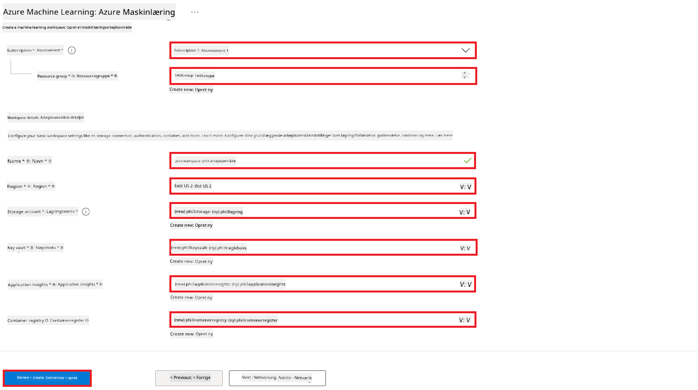
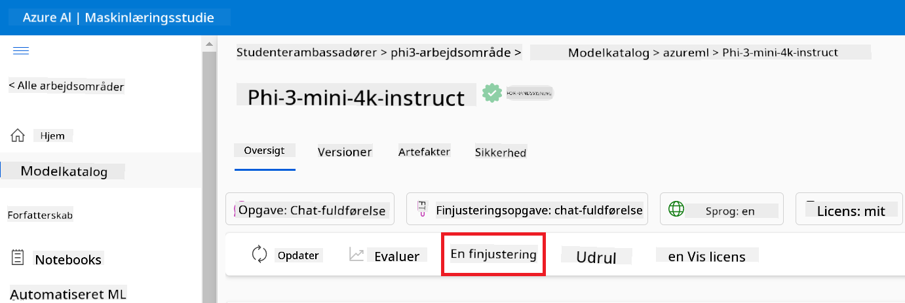
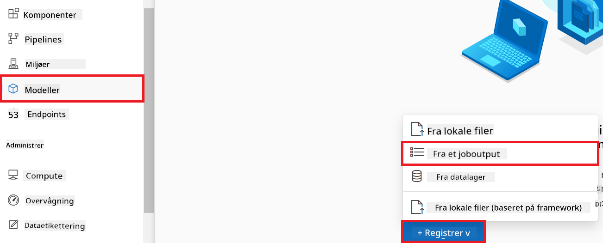
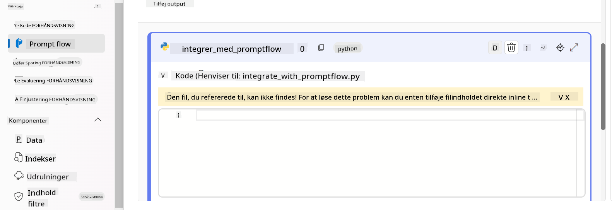

<!--
CO_OP_TRANSLATOR_METADATA:
{
  "original_hash": "0df910a227098303cc392b6ad204c271",
  "translation_date": "2026-01-06T04:44:42+00:00",
  "source_file": "md/02.Application/01.TextAndChat/Phi3/E2E_Phi-3-FineTuning_PromptFlow_Integration_AIFoundry.md",
  "language_code": "da"
}
-->
# Finjuster og integrer brugerdefinerede Phi-3-modeller med Prompt flow i Azure AI Foundry

Dette end-to-end (E2E) eksempel er baseret på guiden "[Fine-Tune and Integrate Custom Phi-3 Models with Prompt Flow in Azure AI Foundry](https://techcommunity.microsoft.com/t5/educator-developer-blog/fine-tune-and-integrate-custom-phi-3-models-with-prompt-flow-in/ba-p/4191726?WT.mc_id=aiml-137032-kinfeylo)" fra Microsoft Tech Community. Det introducerer processerne med finjustering, implementering og integration af brugerdefinerede Phi-3-modeller med Prompt flow i Azure AI Foundry.
I modsætning til E2E-eksemplet, "[Fine-Tune and Integrate Custom Phi-3 Models with Prompt Flow](./E2E_Phi-3-FineTuning_PromptFlow_Integration.md)", som involverede at køre kode lokalt, fokuserer denne vejledning fuldstændigt på at finjustere og integrere din model inden for Azure AI / ML Studio.

## Oversigt

I dette E2E-eksempel vil du lære, hvordan du finjusterer Phi-3-modellen og integrerer den med Prompt flow i Azure AI Foundry. Ved at udnytte Azure AI / ML Studio vil du etablere en arbejdsgang til at implementere og anvende brugerdefinerede AI-modeller. Dette E2E-eksempel er opdelt i tre scenarier:

**Scenario 1: Opsæt Azure-ressourcer og Forbered finjustering**

**Scenario 2: Finjustér Phi-3-modellen og implementér i Azure Machine Learning Studio**

**Scenario 3: Integrer med Prompt flow og chat med din brugerdefinerede model i Azure AI Foundry**

Her er en oversigt over dette E2E-eksempel.


### Indholdsfortegnelse

1. **[Scenario 1: Opsæt Azure-ressourcer og Forbered finjustering](../../../../../../md/02.Application/01.TextAndChat/Phi3)**
    - [Opret et Azure Machine Learning Workspace](../../../../../../md/02.Application/01.TextAndChat/Phi3)
    - [Anmod om GPU-kvoter i Azure Subscription](../../../../../../md/02.Application/01.TextAndChat/Phi3)
    - [Tilføj rolleopgave](../../../../../../md/02.Application/01.TextAndChat/Phi3)
    - [Opsæt projekt](../../../../../../md/02.Application/01.TextAndChat/Phi3)
    - [Forbered datasæt til finjustering](../../../../../../md/02.Application/01.TextAndChat/Phi3)

1. **[Scenario 2: Finjustér Phi-3-model og implementér i Azure Machine Learning Studio](../../../../../../md/02.Application/01.TextAndChat/Phi3)**
    - [Finjustér Phi-3-modellen](../../../../../../md/02.Application/01.TextAndChat/Phi3)
    - [Implementér den finjusterede Phi-3-model](../../../../../../md/02.Application/01.TextAndChat/Phi3)

1. **[Scenario 3: Integrer med Prompt flow og chat med din brugerdefinerede model i Azure AI Foundry](../../../../../../md/02.Application/01.TextAndChat/Phi3)**
    - [Integrer den brugerdefinerede Phi-3-model med Prompt flow](../../../../../../md/02.Application/01.TextAndChat/Phi3)
    - [Chat med din brugerdefinerede Phi-3-model](../../../../../../md/02.Application/01.TextAndChat/Phi3)

## Scenario 1: Opsæt Azure-ressourcer og Forbered finjustering

### Opret et Azure Machine Learning Workspace

1. Skriv *azure machine learning* i **søgefeltet** øverst på portalsiden, og vælg **Azure Machine Learning** fra de muligheder, der vises.

    

2. Vælg **+ Opret** i navigationsmenuen.

3. Vælg **Nyt workspace** i navigationsmenuen.

    

4. Udfør følgende opgaver:

    - Vælg din Azure **Subscription**.
    - Vælg den **Resource group**, der skal bruges (opret en ny om nødvendigt).
    - Indtast **Workspace Name**. Det skal være en unik værdi.
    - Vælg den **Region**, du ønsker at bruge.
    - Vælg den **Storage account**, der skal bruges (opret en ny om nødvendigt).
    - Vælg den **Key vault**, der skal bruges (opret en ny om nødvendigt).
    - Vælg den **Application insights**, der skal bruges (opret en ny om nødvendigt).
    - Vælg den **Container registry**, der skal bruges (opret en ny om nødvendigt).

    

5. Vælg **Gennemse + opret**.

6. Vælg **Opret**.

### Anmod om GPU-kvoter i Azure Subscription

I denne vejledning vil du lære, hvordan du finjusterer og implementerer en Phi-3-model ved brug af GPUs. Til finjustering vil du bruge *Standard_NC24ads_A100_v4* GPU, som kræver en kvoteanmodning. Til implementering vil du bruge *Standard_NC6s_v3* GPU, som også kræver en kvoteanmodning.

> [!NOTE]
>
> Kun Pay-As-You-Go-abonnementer (standard abonnementsform) er berettiget til GPU-tildeling; fordel-abonnementer understøttes ikke på nuværende tidspunkt.
>

1. Besøg [Azure ML Studio](https://ml.azure.com/home?wt.mc_id=studentamb_279723).

1. Udfør følgende opgaver for at anmode om *Standard NCADSA100v4 Family* kvote:

    - Vælg **Quota** fra venstre sidebjælke.
    - Vælg den **Virtual machine family**, der skal bruges. For eksempel, vælg **Standard NCADSA100v4 Family Cluster Dedicated vCPUs**, som inkluderer *Standard_NC24ads_A100_v4* GPU.
    - Vælg **Request quota** i navigationsmenuen.

        

    - På Request quota-siden, indtast den **New cores limit**, du ønsker at bruge. For eksempel 24.
    - På Request quota-siden, vælg **Submit** for at anmode om GPU-kvoten.

1. Udfør følgende opgaver for at anmode om *Standard NCSv3 Family* kvote:

    - Vælg **Quota** fra venstre sidebjælke.
    - Vælg den **Virtual machine family**, der skal bruges. For eksempel, vælg **Standard NCSv3 Family Cluster Dedicated vCPUs**, som inkluderer *Standard_NC6s_v3* GPU.
    - Vælg **Request quota** i navigationsmenuen.
    - På Request quota-siden, indtast den **New cores limit**, du ønsker at bruge. For eksempel 24.
    - På Request quota-siden, vælg **Submit** for at anmode om GPU-kvoten.

### Tilføj rolleopgave

For at finjustere og implementere dine modeller, skal du først oprette en User Assigned Managed Identity (UAI) og give den de nødvendige tilladelser. Denne UAI vil blive brugt til godkendelse under implementeringen.

#### Opret User Assigned Managed Identity (UAI)

1. Skriv *managed identities* i **søgefeltet** øverst på portalsiden, og vælg **Managed Identities** fra de muligheder, der vises.

    

1. Vælg **+ Opret**.

    

1. Udfør følgende opgaver:

    - Vælg din Azure **Subscription**.
    - Vælg den **Resource group**, der skal bruges (opret en ny om nødvendigt).
    - Vælg den **Region**, du ønsker at bruge.
    - Indtast **Navn**. Det skal være en unik værdi.

    

1. Vælg **Gennemse + opret**.

1. Vælg **+ Opret**.

#### Tilføj Contributor rolleopgave til Managed Identity

1. Navigér til den Managed Identity-ressource, du oprettede.

1. Vælg **Azure role assignments** fra venstre sidebjælke.

1. Vælg **+Tilføj rolleopgave** i navigationsmenuen.

1. På siden Tilføj rolleopgave, udfør følgende opgaver:
    - Vælg **Scope** til **Resource group**.
    - Vælg din Azure **Subscription**.
    - Vælg den **Resource group**, der skal bruges.
    - Vælg **Role** til **Contributor**.

    

2. Vælg **Gem**.

#### Tilføj Storage Blob Data Reader rolleopgave til Managed Identity

1. Skriv *storage accounts* i **søgefeltet** øverst på portalsiden, og vælg **Storage accounts** fra de muligheder, der vises.

    

1. Vælg den storagekonto, der er tilknyttet Azure Machine Learning-workspacet, som du oprettede. For eksempel *finetunephistorage*.

1. Udfør følgende opgaver for at navigere til siden Tilføj rolleopgave:

    - Navigér til Azure Storage-kontoen, du oprettede.
    - Vælg **Access Control (IAM)** fra venstre sidebjælke.
    - Vælg **+ Tilføj** i navigationsmenuen.
    - Vælg **Tilføj rolleopgave** i navigationsmenuen.

    

1. På siden Tilføj rolleopgave, udfør følgende opgaver:

    - På Role-siden, skriv *Storage Blob Data Reader* i **søgefeltet**, og vælg **Storage Blob Data Reader** fra de muligheder, der vises.
    - På Role-siden, vælg **Næste**.
    - På Members-siden, vælg **Tildel adgang til** **Managed identity**.
    - På Members-siden, vælg **+ Vælg medlemmer**.
    - På siden Vælg managed identities, vælg din Azure **Subscription**.
    - På siden Vælg managed identities, vælg **Managed identity** til **Manage Identity**.
    - På siden Vælg managed identities, vælg den Manage Identity, du oprettede. For eksempel *finetunephi-managedidentity*.
    - På siden Vælg managed identities, vælg **Vælg**.

    

1. Vælg **Gennemse + tildel**.

#### Tilføj AcrPull rolleopgave til Managed Identity

1. Skriv *container registries* i **søgefeltet** øverst på portalsiden, og vælg **Container registries** fra de muligheder, der vises.

    

1. Vælg containerregistry'et, der er tilknyttet Azure Machine Learning-workspacet. For eksempel *finetunephicontainerregistry*

1. Udfør følgende opgaver for at navigere til siden Tilføj rolleopgave:

    - Vælg **Access Control (IAM)** fra venstre sidebjælke.
    - Vælg **+ Tilføj** i navigationsmenuen.
    - Vælg **Tilføj rolleopgave** i navigationsmenuen.

1. På siden Tilføj rolleopgave, udfør følgende opgaver:

    - På Role-siden, skriv *AcrPull* i **søgefeltet**, og vælg **AcrPull** fra de muligheder, der vises.
    - På Role-siden, vælg **Næste**.
    - På Members-siden, vælg **Tildel adgang til** **Managed identity**.
    - På Members-siden, vælg **+ Vælg medlemmer**.
    - På siden Vælg managed identities, vælg din Azure **Subscription**.
    - På siden Vælg managed identities, vælg **Managed identity** til **Manage Identity**.
    - På siden Vælg managed identities, vælg den Manage Identity, du oprettede. For eksempel *finetunephi-managedidentity*.
    - På siden Vælg managed identities, vælg **Vælg**.
    - Vælg **Gennemse + tildel**.

### Opsæt projekt

For at downloade de datasæt, der er nødvendige til finjustering, skal du opsætte et lokalt miljø.

I denne øvelse vil du

- Oprette en mappe at arbejde i.
- Oprette et virtuelt miljø.
- Installere de nødvendige pakker.
- Oprette en fil *download_dataset.py* til at downloade datasættet.

#### Opret en mappe at arbejde i

1. Åbn et terminalvindue, og skriv følgende kommando for at oprette en mappe med navnet *finetune-phi* i standardstien.

    ```console
    mkdir finetune-phi
    ```

2. Skriv følgende kommando i din terminal for at navigere til mappen *finetune-phi*, som du har oprettet.

    ```console
    cd finetune-phi
    ```

#### Opret et virtuelt miljø

1. Skriv følgende kommando i din terminal for at oprette et virtuelt miljø med navnet *.venv*.

    ```console
    python -m venv .venv
    ```

2. Skriv følgende kommando i din terminal for at aktivere det virtuelle miljø.

    ```console
    .venv\Scripts\activate.bat
    ```

> [!NOTE]
> Hvis det virkede, skulle du kunne se *(.venv)* før kommandoprompten.

#### Installer de nødvendige pakker

1. Skriv følgende kommandoer i din terminal for at installere de nødvendige pakker.

    ```console
    pip install datasets==2.19.1
    ```

#### Opret `donload_dataset.py`

> [!NOTE]
> Færdig mappestruktur:
>
> ```text
> └── YourUserName
> .    └── finetune-phi
> .        └── download_dataset.py
> ```

1. Åbn **Visual Studio Code**.

1. Vælg **File** i menulinjen.

1. Vælg **Open Folder**.

1. Vælg mappen *finetune-phi*, som du har oprettet, og som ligger i *C:\Users\yourUserName\finetune-phi*.

    

1. I venstre rude i Visual Studio Code, højreklik og vælg **New File** for at oprette en ny fil med navnet *download_dataset.py*.

    

### Forbered datasæt til finjustering

I denne øvelse vil du køre filen *download_dataset.py* for at downloade datasættet *ultrachat_200k* til dit lokale miljø. Du vil derefter bruge dette datasæt til at finjustere Phi-3 modellen i Azure Machine Learning.

I denne øvelse vil du:

- Tilføje kode til filen *download_dataset.py* for at downloade datasættene.
- Køre filen *download_dataset.py* for at downloade datasættene til dit lokale miljø.

#### Download dit datasæt ved at bruge *download_dataset.py*

1. Åbn filen *download_dataset.py* i Visual Studio Code.

1. Tilføj følgende kode i filen *download_dataset.py*.

    ```python
    import json
    import os
    from datasets import load_dataset

    def load_and_split_dataset(dataset_name, config_name, split_ratio):
        """
        Load and split a dataset.
        """
        # Indlæs datasættet med det angivne navn, konfiguration og splitforhold
        dataset = load_dataset(dataset_name, config_name, split=split_ratio)
        print(f"Original dataset size: {len(dataset)}")
        
        # Opdel datasættet i trænings- og testdatasæt (80 % træning, 20 % test)
        split_dataset = dataset.train_test_split(test_size=0.2)
        print(f"Train dataset size: {len(split_dataset['train'])}")
        print(f"Test dataset size: {len(split_dataset['test'])}")
        
        return split_dataset

    def save_dataset_to_jsonl(dataset, filepath):
        """
        Save a dataset to a JSONL file.
        """
        # Opret mappen, hvis den ikke findes
        os.makedirs(os.path.dirname(filepath), exist_ok=True)
        
        # Åbn filen i skrive-tilstand
        with open(filepath, 'w', encoding='utf-8') as f:
            # Iterer over hver post i datasættet
            for record in dataset:
                # Gem posten som et JSON-objekt og skriv det til filen
                json.dump(record, f)
                # Skriv et linjeskift for at adskille poster
                f.write('\n')
        
        print(f"Dataset saved to {filepath}")

    def main():
        """
        Main function to load, split, and save the dataset.
        """
        # Indlæs og del ULTRACHAT_200k datasættet med en specifik konfiguration og splitforhold
        dataset = load_and_split_dataset("HuggingFaceH4/ultrachat_200k", 'default', 'train_sft[:1%]')
        
        # Udtræk trænings- og testdatasættene fra opdelingen
        train_dataset = dataset['train']
        test_dataset = dataset['test']

        # Gem træningsdatasættet til en JSONL-fil
        save_dataset_to_jsonl(train_dataset, "data/train_data.jsonl")
        
        # Gem testdatasættet til en separat JSONL-fil
        save_dataset_to_jsonl(test_dataset, "data/test_data.jsonl")

    if __name__ == "__main__":
        main()

    ```

1. Skriv følgende kommando i din terminal for at køre scriptet og downloade datasættet til dit lokale miljø.

    ```console
    python download_dataset.py
    ```

1. Bekræft, at datasættene blev gemt korrekt i den lokale *finetune-phi/data* mappe.

> [!NOTE]
>
> #### Bemærkning om datasætstørrelse og finjusteringstid
>
> I denne vejledning bruger du kun 1% af datasættet (`split='train[:1%]'`). Dette reducerer markant datamængden og fremskynder både upload- og finjusteringsprocesserne. Du kan justere procentdelen for at finde den rette balance mellem træningstid og modelpræstation. At bruge et mindre udsnit af datasættet reducerer den nødvendige tid til finjustering, hvilket gør processen mere håndterbar i en vejledning.

## Scenario 2: Finjuster Phi-3 modellen og deployér i Azure Machine Learning Studio

### Finjuster Phi-3 modellen

I denne øvelse vil du finjustere Phi-3 modellen i Azure Machine Learning Studio.

I denne øvelse vil du:

- Oprette et computercluster til finjustering.
- Finjustere Phi-3 modellen i Azure Machine Learning Studio.

#### Opret computercluster til finjustering

1. Besøg [Azure ML Studio](https://ml.azure.com/home?wt.mc_id=studentamb_279723).

1. Vælg **Compute** i fanen til venstre.

1. Vælg **Compute clusters** i navigationsmenuen.

1. Vælg **+ New**.

    

1. Udfør følgende opgaver:

    - Vælg den **Region**, du ønsker at bruge.
    - Vælg **Virtual machine tier** til **Dedicated**.
    - Vælg **Virtual machine type** til **GPU**.
    - Vælg filteret **Virtual machine size** til **Select from all options**.
    - Vælg **Virtual machine size** til **Standard_NC24ads_A100_v4**.

    

1. Vælg **Next**.

1. Udfør følgende opgaver:

    - Indtast **Compute name**. Det skal være et unikt navn.
    - Vælg **Minimum number of nodes** til **0**.
    - Vælg **Maximum number of nodes** til **1**.
    - Vælg **Idle seconds before scale down** til **120**.

    

1. Vælg **Create**.

#### Finjuster Phi-3 modellen

1. Besøg [Azure ML Studio](https://ml.azure.com/home?wt.mc_id=studentamb_279723).

1. Vælg det Azure Machine Learning workspace, som du har oprettet.

    

1. Udfør følgende opgaver:

    - Vælg **Model catalog** i venstre faneblad.
    - Skriv *phi-3-mini-4k* i **søgefeltet** og vælg **Phi-3-mini-4k-instruct** i de viste muligheder.

    

1. Vælg **Fine-tune** i navigationsmenuen.

    

1. Udfør følgende opgaver:

    - Vælg **Select task type** til **Chat completion**.
    - Vælg **+ Select data** for at uploade **Træningsdata**.
    - Vælg typen til upload af valideringsdata til **Provide different validation data**.
    - Vælg **+ Select data** for at uploade **Valideringsdata**.

    

> [!TIP]
>
> Du kan vælge **Advanced settings** for at tilpasse konfigurationer såsom **learning_rate** og **lr_scheduler_type** for at optimere finjusteringsprocessen efter dine specifikke behov.

1. Vælg **Finish**.

1. I denne øvelse har du med succes finjusteret Phi-3 modellen ved at bruge Azure Machine Learning. Bemærk, at finjusteringsprocessen kan tage en væsentlig tid. Efter at have startet finjusteringsjobbet, skal du vente på, at det fuldføres. Du kan overvåge status for finjusteringsjobbet ved at åbne fanen Jobs til venstre i dit Azure Machine Learning Workspace. I den næste serie vil du deployere den finjusterede model og integrere den med Prompt flow.

    

### Deploy den finjusterede Phi-3 model

For at integrere den finjusterede Phi-3 model med Prompt flow, skal du deployere modellen for at gøre den tilgængelig til realtidsinferenz. Denne proces involverer at registrere modellen, oprette en online endpoint og deployere modellen.

I denne øvelse vil du:

- Registrere den finjusterede model i Azure Machine Learning workspace.
- Oprette en online endpoint.
- Deployere den registrerede finjusterede Phi-3 model.

#### Registrer den finjusterede model

1. Besøg [Azure ML Studio](https://ml.azure.com/home?wt.mc_id=studentamb_279723).

1. Vælg det Azure Machine Learning workspace, som du har oprettet.

    

1. Vælg **Models** i venstre faneblad.
1. Vælg **+ Register**.
1. Vælg **From a job output**.

    

1. Vælg jobbet, som du har oprettet.

    

1. Vælg **Next**.

1. Vælg **Model type** til **MLflow**.

1. Sørg for, at **Job output** er valgt; det skulle vælges automatisk.

    

2. Vælg **Next**.

3. Vælg **Register**.

    

4. Du kan se din registrerede model ved at navigere til menuen **Models** i venstre faneblad.

    

#### Deploy den finjusterede model

1. Gå til det Azure Machine Learning workspace, som du har oprettet.

1. Vælg **Endpoints** i venstre faneblad.

1. Vælg **Real-time endpoints** i navigationsmenuen.

    

1. Vælg **Create**.

1. Vælg den registrerede model, som du har oprettet.

    

1. Vælg **Select**.

1. Udfør følgende opgaver:

    - Vælg **Virtual machine** til *Standard_NC6s_v3*.
    - Vælg det ønskede antal instanser. For eksempel *1*.
    - Vælg **Endpoint** til **New** for at oprette en endpoint.
    - Indtast **Endpoint name**. Det skal være unikt.
    - Indtast **Deployment name**. Det skal være unikt.

    

1. Vælg **Deploy**.

> [!WARNING]
> For at undgå ekstra gebyrer på din konto, skal du sørge for at slette den oprettede endpoint i Azure Machine Learning workspace.
>

#### Tjek deploymentsstatus i Azure Machine Learning Workspace

1. Gå til Azure Machine Learning workspace, som du har oprettet.

1. Vælg **Endpoints** i venstre faneblad.

1. Vælg den endpoint, som du har oprettet.

    

1. På denne side kan du administrere endpoints under deploymentsprocessen.

> [!NOTE]
> Når deployment er fuldført, skal du sikre, at **Live traffic** er sat til **100%**. Hvis ikke, vælg **Update traffic** for at justere trafikindstillingerne. Du kan ikke teste modellen, hvis trafikken er sat til 0%.
>
> 
>

## Scenario 3: Integrer med Prompt flow og chat med din custom model i Azure AI Foundry

### Integrer den custom Phi-3 model med Prompt flow

Efter du har deployeret din finjusterede model, kan du nu integrere den med Prompt Flow for at bruge din model i realtidsapplikationer, hvilket muliggør en række interaktive opgaver med din custom Phi-3 model.

I denne øvelse vil du:

- Oprette Azure AI Foundry Hub.
- Oprette Azure AI Foundry Projekt.
- Oprette Prompt flow.
- Tilføje en custom forbindelse til den finjusterede Phi-3 model.
- Sætte Prompt flow op til at chatte med din custom Phi-3 model.

> [!NOTE]
> Du kan også integrere med Promptflow ved hjælp af Azure ML Studio. Samme integrationsproces kan anvendes på Azure ML Studio.

#### Opret Azure AI Foundry Hub

Du skal oprette en Hub, før du opretter Projektet. En Hub fungerer som en Ressourcegruppe, som giver dig mulighed for at organisere og administrere flere Projekter inden for Azure AI Foundry.

1. Besøg [Azure AI Foundry](https://ai.azure.com/?WT.mc_id=aiml-137032-kinfeylo).

1. Vælg **All hubs** i venstre faneblad.

1. Vælg **+ New hub** i navigationsmenuen.
    

1. Udfør følgende opgaver:

    - Indtast **Hub navn**. Det skal være en unik værdi.
    - Vælg din Azure **Subscription**.
    - Vælg den **Resource group**, der skal bruges (opret en ny om nødvendigt).
    - Vælg den **Location**, du ønsker at bruge.
    - Vælg **Connect Azure AI Services**, der skal bruges (opret en ny om nødvendigt).
    - Vælg **Connect Azure AI Search** til **Skip connecting**.

    

1. Vælg **Next**.

#### Opret Azure AI Foundry-projekt

1. I det hub, du oprettede, skal du vælge **All projects** fra venstre faneblad.

1. Vælg **+ New project** fra navigationsmenuen.

    

1. Indtast **Project name**. Det skal være en unik værdi.

    

1. Vælg **Create a project**.

#### Tilføj en brugerdefineret forbindelse til den finjusterede Phi-3-model

For at integrere din brugerdefinerede Phi-3-model med Prompt flow skal du gemme modellens endpoint og nøgle i en brugerdefineret forbindelse. Denne opsætning sikrer adgang til din brugerdefinerede Phi-3-model i Prompt flow.

#### Indstil api-nøgle og endpoint-uri for den finjusterede Phi-3-model

1. Besøg [Azure ML Studio](https://ml.azure.com/home?WT.mc_id=aiml-137032-kinfeylo).

1. Naviger til den Azure Machine Learning-arbejdsplads, som du oprettede.

1. Vælg **Endpoints** fra venstre faneblad.

    

1. Vælg det endpoint, som du oprettede.

    

1. Vælg **Consume** fra navigationsmenuen.

1. Kopier din **REST endpoint** og **Primary key**.

    

#### Tilføj den brugerdefinerede forbindelse

1. Besøg [Azure AI Foundry](https://ai.azure.com/?WT.mc_id=aiml-137032-kinfeylo).

1. Naviger til det Azure AI Foundry-projekt, du oprettede.

1. I det projekt, du oprettede, skal du vælge **Settings** fra venstre faneblad.

1. Vælg **+ New connection**.

    

1. Vælg **Custom keys** fra navigationsmenuen.

    

1. Udfør følgende opgaver:

    - Vælg **+ Add key value pairs**.
    - For nøglens navn skal du indtaste **endpoint** og indsætte det endpoint, du kopierede fra Azure ML Studio, i værdifeltet.
    - Vælg **+ Add key value pairs** igen.
    - For nøglens navn skal du indtaste **key** og indsætte den nøgle, du kopierede fra Azure ML Studio, i værdifeltet.
    - Efter tilføjelse af nøglerne skal du vælge **is secret** for at forhindre, at nøglen bliver eksponeret.

    

1. Vælg **Add connection**.

#### Opret Prompt flow

Du har tilføjet en brugerdefineret forbindelse i Azure AI Foundry. Lad os nu oprette en Prompt flow ved at følge nedenstående trin. Derefter forbinder du denne Prompt flow til den brugerdefinerede forbindelse, så du kan bruge den finjusterede model inden for Prompt flow.

1. Naviger til det Azure AI Foundry-projekt, du oprettede.

1. Vælg **Prompt flow** fra venstre faneblad.

1. Vælg **+ Create** fra navigationsmenuen.

    

1. Vælg **Chat flow** fra navigationsmenuen.

    

1. Indtast **Folder name**, der skal bruges.

    

2. Vælg **Create**.

#### Sæt Prompt flow op til at chatte med din brugerdefinerede Phi-3-model

Du skal integrere den finjusterede Phi-3-model i en Prompt flow. Den eksisterende Prompt flow, som leveres, er dog ikke designet til dette formål. Derfor skal du redesigne Prompt flow for at muliggøre integrationen af den brugerdefinerede model.

1. I Prompt flow skal du udføre følgende opgaver for at genskabe den eksisterende flow:

    - Vælg **Raw file mode**.
    - Slet al eksisterende kode i *flow.dag.yml*-filen.
    - Tilføj følgende kode i *flow.dag.yml*-filen.

        ```yml
        inputs:
          input_data:
            type: string
            default: "Who founded Microsoft?"

        outputs:
          answer:
            type: string
            reference: ${integrate_with_promptflow.output}

        nodes:
        - name: integrate_with_promptflow
          type: python
          source:
            type: code
            path: integrate_with_promptflow.py
          inputs:
            input_data: ${inputs.input_data}
        ```

    - Vælg **Save**.

    

1. Tilføj følgende kode til *integrate_with_promptflow.py*-filen for at bruge den brugerdefinerede Phi-3-model i Prompt flow.

    ```python
    import logging
    import requests
    from promptflow import tool
    from promptflow.connections import CustomConnection

    # Logningsopsætning
    logging.basicConfig(
        format="%(asctime)s - %(levelname)s - %(name)s - %(message)s",
        datefmt="%Y-%m-%d %H:%M:%S",
        level=logging.DEBUG
    )
    logger = logging.getLogger(__name__)

    def query_phi3_model(input_data: str, connection: CustomConnection) -> str:
        """
        Send a request to the Phi-3 model endpoint with the given input data using Custom Connection.
        """

        # "connection" er navnet på den tilpassede forbindelse, "endpoint", "key" er nøglerne i den tilpassede forbindelse
        endpoint_url = connection.endpoint
        api_key = connection.key

        headers = {
            "Content-Type": "application/json",
            "Authorization": f"Bearer {api_key}"
        }
        data = {
            "input_data": {
                "input_string": [
                    {"role": "user", "content": input_data}
                ],
                "parameters": {
                    "temperature": 0.7,
                    "max_new_tokens": 128
                }
            }
        }
        try:
            response = requests.post(endpoint_url, json=data, headers=headers)
            response.raise_for_status()
            
            # Log den komplette JSON-respons
            logger.debug(f"Full JSON response: {response.json()}")

            result = response.json()["output"]
            logger.info("Successfully received response from Azure ML Endpoint.")
            return result
        except requests.exceptions.RequestException as e:
            logger.error(f"Error querying Azure ML Endpoint: {e}")
            raise

    @tool
    def my_python_tool(input_data: str, connection: CustomConnection) -> str:
        """
        Tool function to process input data and query the Phi-3 model.
        """
        return query_phi3_model(input_data, connection)

    ```

    

> [!NOTE]
> For mere detaljeret information om brug af Prompt flow i Azure AI Foundry kan du se [Prompt flow in Azure AI Foundry](https://learn.microsoft.com/azure/ai-studio/how-to/prompt-flow).

1. Vælg **Chat input**, **Chat output** for at aktivere chat med din model.

    

1. Nu er du klar til at chatte med din brugerdefinerede Phi-3-model. I den næste øvelse vil du lære, hvordan du starter Prompt flow og bruger det til at chatte med din finjusterede Phi-3-model.

> [!NOTE]
>
> Den genskabte flow skal se ud som billedet nedenfor:
>
> 
>

### Chat med din brugerdefinerede Phi-3-model

Nu hvor du har finjusteret og integreret din brugerdefinerede Phi-3-model med Prompt flow, er du klar til at begynde at interagere med den. Denne øvelse guider dig gennem processen med at sætte op og starte en chat med din model ved hjælp af Prompt flow. Ved at følge disse trin vil du kunne udnytte funktionerne i din finjusterede Phi-3-model fuldt ud til forskellige opgaver og samtaler.

- Chat med din brugerdefinerede Phi-3-model ved hjælp af Prompt flow.

#### Start Prompt flow

1. Vælg **Start compute sessions** for at starte Prompt flow.

    

1. Vælg **Validate and parse input** for at forny parametrene.

    

1. Vælg **Value** af **connection** til den brugerdefinerede forbindelse, du oprettede. For eksempel *connection*.

    

#### Chat med din brugerdefinerede model

1. Vælg **Chat**.

    

1. Her er et eksempel på resultaterne: Nu kan du chatte med din brugerdefinerede Phi-3-model. Det anbefales at stille spørgsmål baseret på dataene, der blev brugt til finjusteringen.

    

---

<!-- CO-OP TRANSLATOR DISCLAIMER START -->
**Ansvarsfraskrivelse**:
Dette dokument er blevet oversat ved hjælp af AI-oversættelsestjenesten [Co-op Translator](https://github.com/Azure/co-op-translator). Selvom vi bestræber os på nøjagtighed, bedes du være opmærksom på, at automatiserede oversættelser kan indeholde fejl eller unøjagtigheder. Det oprindelige dokument på dets modersmål bør betragtes som den autoritative kilde. For kritisk information anbefales professionel menneskelig oversættelse. Vi er ikke ansvarlige for eventuelle misforståelser eller fejltolkninger, der opstår som følge af brugen af denne oversættelse.
<!-- CO-OP TRANSLATOR DISCLAIMER END -->