# Finjuster og integrer tilpassede Phi-3-modeller med Prompt flow i Microsoft Foundry

Dette ende-til-ende (E2E) eksempel er baseret på guiden "[Finjuster og integrer tilpassede Phi-3-modeller med Prompt Flow i Microsoft Foundry](https://techcommunity.microsoft.com/t5/educator-developer-blog/fine-tune-and-integrate-custom-phi-3-models-with-prompt-flow-in/ba-p/4191726?WT.mc_id=aiml-137032-kinfeylo)" fra Microsoft Tech Community. Det introducerer processerne for finjustering, udrulning og integration af tilpassede Phi-3-modeller med Prompt flow i Microsoft Foundry.
I modsætning til E2E-eksemplet, "[Finjuster og integrer tilpassede Phi-3-modeller med Prompt Flow](./E2E_Phi-3-FineTuning_PromptFlow_Integration.md)", som involverede kørsel af kode lokalt, fokuserer denne vejledning udelukkende på finjustering og integration af din model inden for Azure AI / ML Studio.

## Oversigt

I dette E2E-eksempel lærer du, hvordan du finjusterer Phi-3-modellen og integrerer den med Prompt flow i Microsoft Foundry. Ved at udnytte Azure AI / ML Studio opretter du en arbejdsproces til udrulning og anvendelse af tilpassede AI-modeller. Dette E2E-eksempel er opdelt i tre scenarier:

**Scenario 1: Opsæt Azure-ressourcer og forbered til finjustering**

**Scenario 2: Finjuster Phi-3-modellen og udrul i Azure Machine Learning Studio**

**Scenario 3: Integrer med Prompt flow og chat med din tilpassede model i Microsoft Foundry**

Her er en oversigt over dette E2E-eksempel.

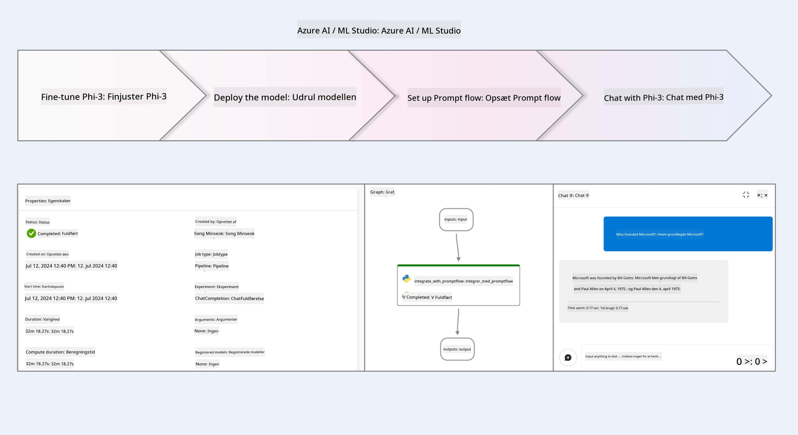

### Indholdsfortegnelse

1. **[Scenario 1: Opsæt Azure-ressourcer og forbered til finjustering](../../../../../../md/02.Application/01.TextAndChat/Phi3)**
    - [Opret et Azure Machine Learning-arbejdsområde](../../../../../../md/02.Application/01.TextAndChat/Phi3)
    - [Anmod om GPU-kvoter i Azure-abonnement](../../../../../../md/02.Application/01.TextAndChat/Phi3)
    - [Tilføj rolle tildeling](../../../../../../md/02.Application/01.TextAndChat/Phi3)
    - [Opsæt projekt](../../../../../../md/02.Application/01.TextAndChat/Phi3)
    - [Forbered datasæt til finjustering](../../../../../../md/02.Application/01.TextAndChat/Phi3)

1. **[Scenario 2: Finjuster Phi-3-modellen og udrul i Azure Machine Learning Studio](../../../../../../md/02.Application/01.TextAndChat/Phi3)**
    - [Finjuster Phi-3-modellen](../../../../../../md/02.Application/01.TextAndChat/Phi3)
    - [Udrul den finjusterede Phi-3-model](../../../../../../md/02.Application/01.TextAndChat/Phi3)

1. **[Scenario 3: Integrer med Prompt flow og chat med din tilpassede model i Microsoft Foundry](../../../../../../md/02.Application/01.TextAndChat/Phi3)**
    - [Integrer den tilpassede Phi-3-model med Prompt flow](../../../../../../md/02.Application/01.TextAndChat/Phi3)
    - [Chat med din tilpassede Phi-3-model](../../../../../../md/02.Application/01.TextAndChat/Phi3)

## Scenario 1: Opsæt Azure-ressourcer og forbered til finjustering

### Opret et Azure Machine Learning-arbejdsområde

1. Skriv *azure machine learning* i **søgefeltet** øverst på portalens side, og vælg **Azure Machine Learning** fra de viste muligheder.

    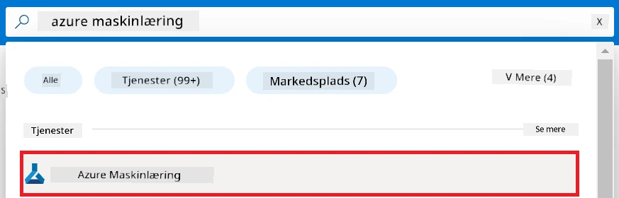

2. Vælg **+ Opret** i navigationsmenuen.

3. Vælg **Nyt arbejdsområde** i navigationsmenuen.

    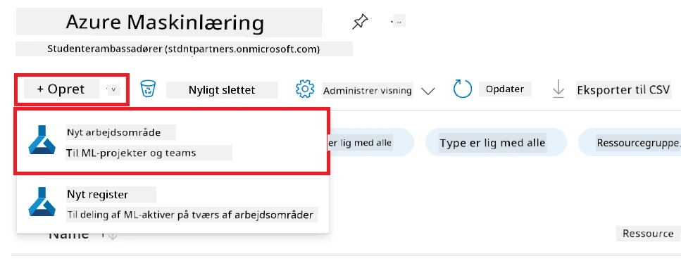

4. Udfør følgende opgaver:

    - Vælg dit Azure-**Abonnement**.
    - Vælg den **Ressourcegruppe**, der skal bruges (opret en ny om nødvendigt).
    - Indtast **Navn på arbejdsområde**. Det skal være en unik værdi.
    - Vælg den **Region**, du ønsker at bruge.
    - Vælg den **Lagerkonto**, der skal bruges (opret en ny om nødvendigt).
    - Vælg den **Key Vault**, der skal bruges (opret en ny om nødvendigt).
    - Vælg den **Application Insights**, der skal bruges (opret en ny om nødvendigt).
    - Vælg det **Containerregister**, der skal bruges (opret et nyt om nødvendigt).

    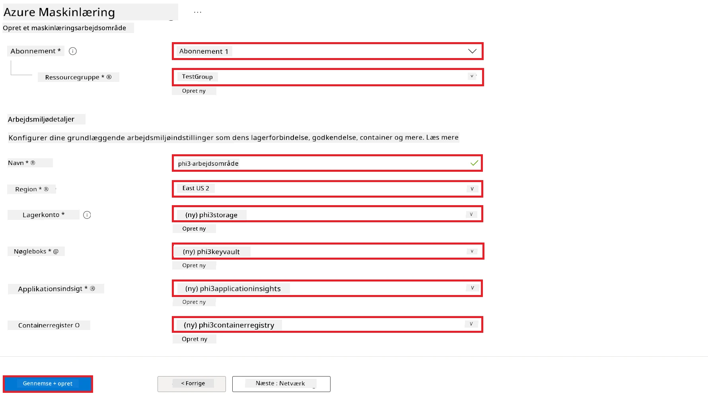

5. Vælg **Gennemse + opret**.

6. Vælg **Opret**.

### Anmod om GPU-kvoter i Azure-abonnement

I denne vejledning lærer du, hvordan du finjusterer og udruller en Phi-3-model ved brug af GPU'er. Til finjustering bruger du *Standard_NC24ads_A100_v4*-GPU'en, som kræver en kvoteanmodning. Til udrulning bruger du *Standard_NC6s_v3*-GPU'en, som også kræver en kvoteanmodning.

> [!NOTE]
>
> Kun Pay-As-You-Go-abonnementer (den standard abonnementsform) er berettigede til GPU-tildeling; benefit-abonnementer understøttes ikke i øjeblikket.
>

1. Besøg [Azure ML Studio](https://ml.azure.com/home?wt.mc_id=studentamb_279723).

1. Udfør følgende trin for at anmode om *Standard NCADSA100v4 Family* kvote:

    - Vælg **Kvote** fra venstresidetab'en.
    - Vælg den **Virtuelle maskinefamilie**, der skal bruges. For eksempel vælg **Standard NCADSA100v4 Family Cluster Dedicated vCPUs**, som inkluderer *Standard_NC24ads_A100_v4*-GPU'en.
    - Vælg **Anmod om kvote** i navigationsmenuen.

        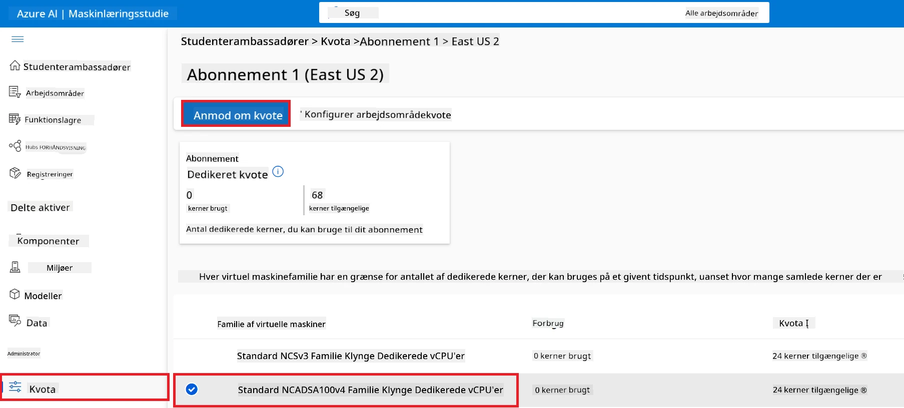

    - Indtast på Anmod om kvote-siden den **Nye kernegrænse**, du ønsker at bruge. For eksempel 24.
    - Vælg **Indsend** på Anmod om kvote-siden for at anmode om GPU-kvoten.

1. Udfør følgende trin for at anmode om *Standard NCSv3 Family* kvote:

    - Vælg **Kvote** fra venstresidetab'en.
    - Vælg den **Virtuelle maskinefamilie**, der skal bruges. For eksempel vælg **Standard NCSv3 Family Cluster Dedicated vCPUs**, som inkluderer *Standard_NC6s_v3*-GPU'en.
    - Vælg **Anmod om kvote** i navigationsmenuen.
    - Indtast på Anmod om kvote-siden den **Nye kernegrænse**, du ønsker at bruge. For eksempel 24.
    - Vælg **Indsend** på Anmod om kvote-siden for at anmode om GPU-kvoten.

### Tilføj rolle tildeling

For at finjustere og udrulle dine modeller skal du først oprette en Bruger-Tildelt Administreret Identitet (User Assigned Managed Identity, UAI) og tildele den de relevante tilladelser. Denne UAI vil blive brugt til autentificering under udrulningen.

#### Opret Bruger-Tildelt Administreret Identitet (UAI)

1. Skriv *managed identities* i **søgefeltet** øverst på portalens side, og vælg **Managed Identities** blandt mulighederne.

    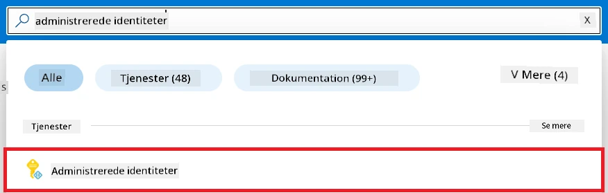

1. Vælg **+ Opret**.

    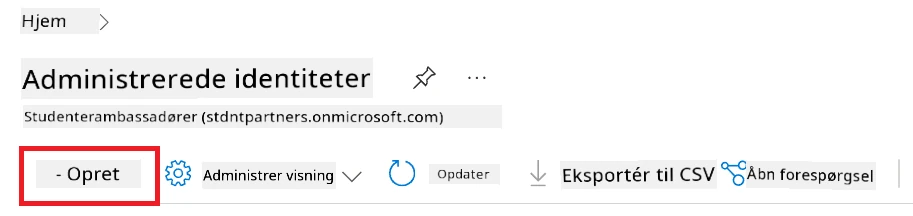

1. Udfør følgende opgaver:

    - Vælg dit Azure-**Abonnement**.
    - Vælg den **Ressourcegruppe**, der skal bruges (opret en ny om nødvendigt).
    - Vælg den **Region**, du ønsker at bruge.
    - Indtast **Navn**. Det skal være en unik værdi.

    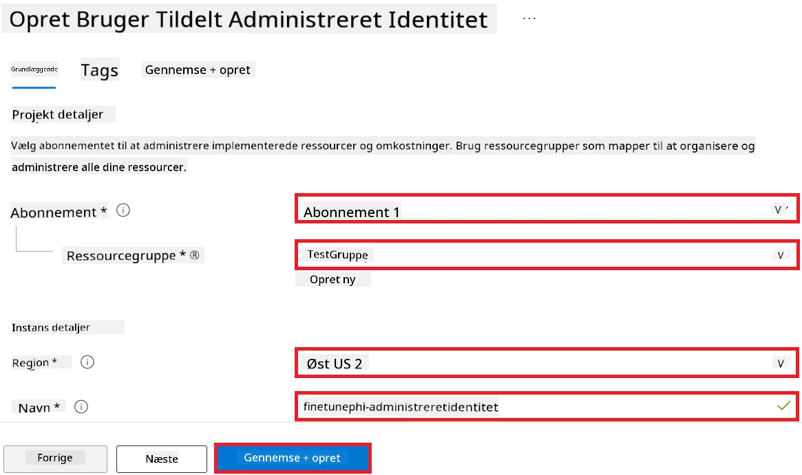

1. Vælg **Gennemse + opret**.

1. Vælg **+ Opret**.

#### Tilføj Contributor-rolle tildeling til Administreret Identitet

1. Gå til den Administrerede Identitet-ressource, du oprettede.

1. Vælg **Azure rolle tildelinger** i venstresidetab'en.

1. Vælg **+ Tilføj rolle tildeling** i navigationsmenuen.

1. Inden for Tilføj rolle tildeling-siden, udfør følgende opgaver:
    - Vælg **Omfang** til **Ressourcegruppe**.
    - Vælg dit Azure-**Abonnement**.
    - Vælg den **Ressourcegruppe**, der skal bruges.
    - Vælg **Rolle** til **Contributor**.

    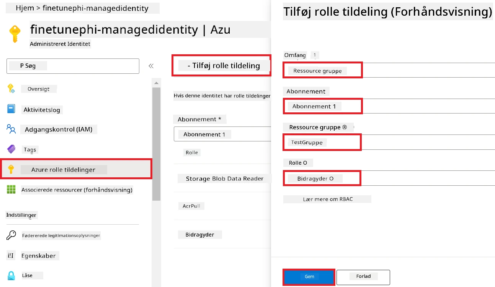

2. Vælg **Gem**.

#### Tilføj Storage Blob Data Reader-rolle tildeling til Administreret Identitet

1. Skriv *storage accounts* i **søgefeltet** øverst på portalens side, og vælg **Storage accounts** blandt mulighederne.

    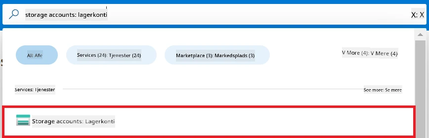

1. Vælg den lagerkonto, som er tilknyttet det Azure Machine Learning-arbejdsområde, du oprettede. For eksempel *finetunephistorage*.

1. Udfør følgende opgaver for at navigere til Tilføj rolle tildeling-siden:

    - Gå til Azure Storage-kontoen, du oprettede.
    - Vælg **Adgangskontrol (IAM)** i venstresidetab'en.
    - Vælg **+ Tilføj** i navigationsmenuen.
    - Vælg **Tilføj rolle tildeling** i navigationsmenuen.

    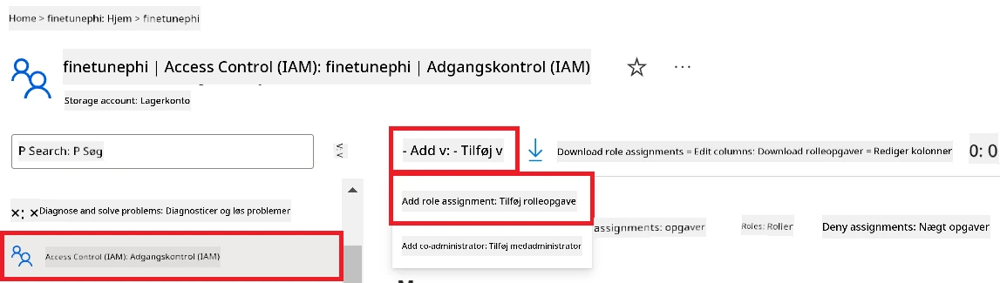

1. Inden for Tilføj rolle tildeling-siden, udfør følgende:

    - På Rollesiden, skriv *Storage Blob Data Reader* i **søgefeltet** og vælg **Storage Blob Data Reader** blandt mulighederne.
    - På Rollesiden, vælg **Næste**.
    - På Medlemsiden, vælg **Tildel adgang til** **Administreret identitet**.
    - På Medlemsiden, vælg **+ Vælg medlemmer**.
    - På Vælg administrerede identiteter-siden, vælg dit Azure-**Abonnement**.
    - På Vælg administrerede identiteter-siden, vælg **Administreret identitet** til **Administrer identitet**.
    - På Vælg administrerede identiteter-siden, vælg den oprettede Administrerede Identitet. For eksempel *finetunephi-managedidentity*.
    - På Vælg administrerede identiteter-siden, vælg **Vælg**.

    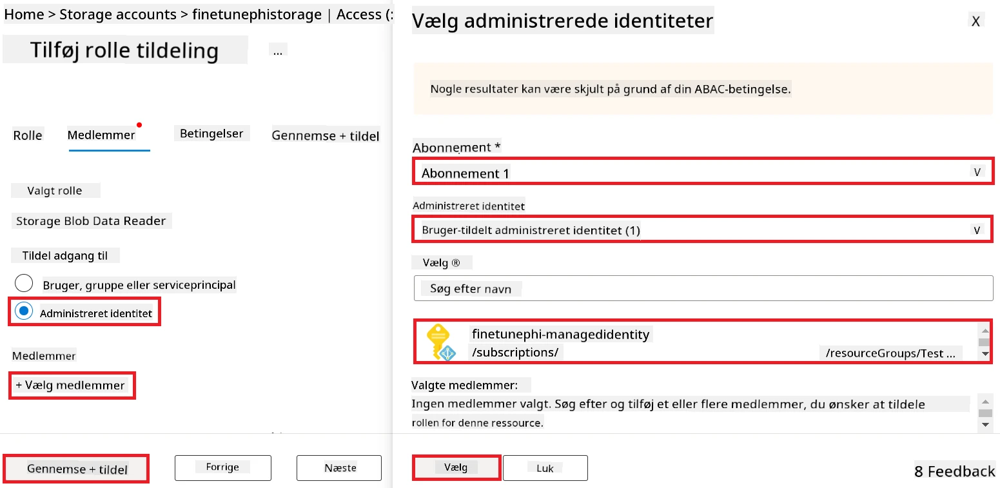

1. Vælg **Gennemse + tilføj**.

#### Tilføj AcrPull-rolle tildeling til Administreret Identitet

1. Skriv *container registries* i **søgefeltet** øverst på portalens side, og vælg **Container registries** blandt mulighederne.

    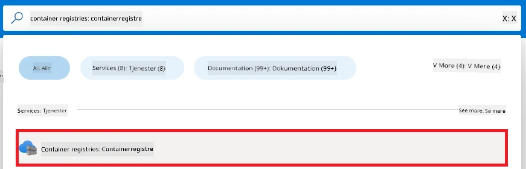

1. Vælg containerregisteret, som er tilknyttet Azure Machine Learning-arbejdsområdet. For eksempel *finetunephicontainerregistry*

1. Udfør følgende opgaver for at navigere til Tilføj rolle tildeling-siden:

    - Vælg **Adgangskontrol (IAM)** i venstresidetab'en.
    - Vælg **+ Tilføj** i navigationsmenuen.
    - Vælg **Tilføj rolle tildeling** i navigationsmenuen.

1. Inden for Tilføj rolle tildeling-siden, udfør følgende:

    - På Rollesiden, skriv *AcrPull* i **søgefeltet** og vælg **AcrPull** blandt mulighederne.
    - På Rollesiden, vælg **Næste**.
    - På Medlemsiden, vælg **Tildel adgang til** **Administreret identitet**.
    - På Medlemsiden, vælg **+ Vælg medlemmer**.
    - På Vælg administrerede identiteter-siden, vælg dit Azure-**Abonnement**.
    - På Vælg administrerede identiteter-siden, vælg **Administreret identitet** til **Administrer identitet**.
    - På Vælg administrerede identiteter-siden, vælg den oprettede Administrerede Identitet. For eksempel *finetunephi-managedidentity*.
    - På Vælg administrerede identiteter-siden, vælg **Vælg**.
    - Vælg **Gennemse + tilføj**.

### Opsæt projekt

For at downloade de datasæt, der er nødvendige for finjustering, sætter du et lokalt miljø op.

I denne øvelse skal du

- Oprette en mappe til at arbejde i.
- Oprette et virtuelt miljø.
- Installere de nødvendige pakker.
- Oprette en *download_dataset.py*-fil til at downloade datasættet.

#### Opret en mappe til at arbejde i

1. Åbn et terminalvindue, og skriv følgende kommando for at oprette en mappe med navnet *finetune-phi* i standardstien.

    ```console
    mkdir finetune-phi
    ```

2. Skriv følgende kommando i terminalen for at navigere til *finetune-phi* mappen, du har oprettet.

    ```console
    cd finetune-phi
    ```

#### Opret et virtuelt miljø

1. Skriv følgende kommando i terminalen for at oprette et virtuelt miljø med navnet *.venv*.
    ```console
    python -m venv .venv
    ```

2. Skriv følgende kommando i din terminal for at aktivere det virtuelle miljø.

    ```console
    .venv\Scripts\activate.bat
    ```

> [!NOTE]
> Hvis det lykkedes, skal du se *(.venv)* før kommandoprompten.

#### Installer de nødvendige pakker

1. Skriv følgende kommandoer i din terminal for at installere de nødvendige pakker.

    ```console
    pip install datasets==2.19.1
    ```

#### Opret `donload_dataset.py`

> [!NOTE]
> Fuldstændig mappe struktur:
>
> ```text
> └── YourUserName
> .    └── finetune-phi
> .        └── download_dataset.py
> ```

1. Åbn **Visual Studio Code**.

1. Vælg **Fil** i menulinjen.

1. Vælg **Åbn mappe**.

1. Vælg *finetune-phi* mappen, som du har oprettet, og som ligger i *C:\Users\ditBrugernavn\finetune-phi*.

    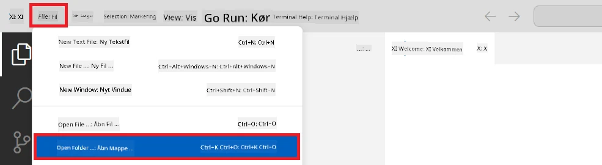

1. Klik i venstre rude i Visual Studio Code med højre museknap og vælg **Ny fil** for at oprette en ny fil med navnet *download_dataset.py*.

    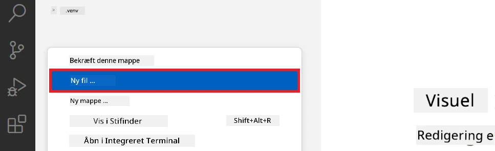

### Forbered datasættet til finjustering

I denne øvelse vil du køre *download_dataset.py* filen for at downloade *ultrachat_200k* datasættene til dit lokale miljø. Du vil derefter bruge disse datasæt til at finjustere Phi-3 modellen i Azure Machine Learning.

I denne øvelse vil du:

- Tilføje kode til *download_dataset.py* filen for at downloade datasættene.
- Køre *download_dataset.py* filen for at downloade datasættene til dit lokale miljø.

#### Download dit datasæt ved hjælp af *download_dataset.py*

1. Åbn *download_dataset.py* filen i Visual Studio Code.

1. Tilføj følgende kode i *download_dataset.py* filen.

    ```python
    import json
    import os
    from datasets import load_dataset

    def load_and_split_dataset(dataset_name, config_name, split_ratio):
        """
        Load and split a dataset.
        """
        # Indlæs datasættet med det angivne navn, konfiguration og splitforhold
        dataset = load_dataset(dataset_name, config_name, split=split_ratio)
        print(f"Original dataset size: {len(dataset)}")
        
        # Del datasættet op i trænings- og testsæt (80% træning, 20% test)
        split_dataset = dataset.train_test_split(test_size=0.2)
        print(f"Train dataset size: {len(split_dataset['train'])}")
        print(f"Test dataset size: {len(split_dataset['test'])}")
        
        return split_dataset

    def save_dataset_to_jsonl(dataset, filepath):
        """
        Save a dataset to a JSONL file.
        """
        # Opret biblioteket, hvis det ikke findes
        os.makedirs(os.path.dirname(filepath), exist_ok=True)
        
        # Åbn filen i skrive-tilstand
        with open(filepath, 'w', encoding='utf-8') as f:
            # Iterer over hver post i datasættet
            for record in dataset:
                # Dump posten som et JSON-objekt og skriv det til filen
                json.dump(record, f)
                # Skriv et linjeskifttegn for at adskille poster
                f.write('\n')
        
        print(f"Dataset saved to {filepath}")

    def main():
        """
        Main function to load, split, and save the dataset.
        """
        # Indlæs og del ULTRACHAT_200k datasættet med en specifik konfiguration og splitforhold
        dataset = load_and_split_dataset("HuggingFaceH4/ultrachat_200k", 'default', 'train_sft[:1%]')
        
        # Udtræk trænings- og testdatasættene fra splitten
        train_dataset = dataset['train']
        test_dataset = dataset['test']

        # Gem træningsdatasættet i en JSONL-fil
        save_dataset_to_jsonl(train_dataset, "data/train_data.jsonl")
        
        # Gem testdatasættet i en separat JSONL-fil
        save_dataset_to_jsonl(test_dataset, "data/test_data.jsonl")

    if __name__ == "__main__":
        main()

    ```

1. Skriv følgende kommando i din terminal for at køre scriptet og downloade datasættet til dit lokale miljø.

    ```console
    python download_dataset.py
    ```

1. Bekræft, at datasættene blev gemt korrekt i din lokale *finetune-phi/data* mappe.

> [!NOTE]
>
> #### Bemærkning om datasætstørrelse og finjusteringstid
>
> I denne vejledning bruger du kun 1 % af datasættet (`split='train[:1%]'`). Dette reducerer mængden af data betydeligt og fremskynder både upload- og finjusteringsprocesserne. Du kan justere procentdelen for at finde den rette balance mellem træningstid og modelpræstation. Brug af et mindre udsnit af datasættet reducerer den nødvendige tid til finjustering, hvilket gør processen mere håndterbar i en vejledning.

## Scenario 2: Finjuster Phi-3 modellen og implementer i Azure Machine Learning Studio

### Finjuster Phi-3 modellen

I denne øvelse vil du finjustere Phi-3 modellen i Azure Machine Learning Studio.

I denne øvelse vil du:

- Oprette computercluster til finjustering.
- Finjustere Phi-3 modellen i Azure Machine Learning Studio.

#### Opret computercluster til finjustering

1. Besøg [Azure ML Studio](https://ml.azure.com/home?wt.mc_id=studentamb_279723).

1. Vælg **Compute** i venstre sidepanel.

1. Vælg **Compute clusters** i navigationsmenuen.

1. Vælg **+ Ny**.

    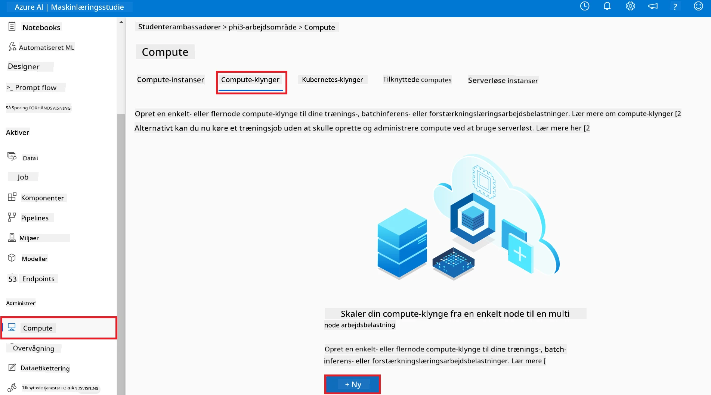

1. Udfør følgende opgaver:

    - Vælg den **Region**, du vil bruge.
    - Vælg **Virtual machine tier** til **Dedicated**.
    - Vælg **Virtual machine type** til **GPU**.
    - Vælg filteret for **Virtual machine size** til **Vælg blandt alle muligheder**.
    - Vælg **Virtual machine size** til **Standard_NC24ads_A100_v4**.

    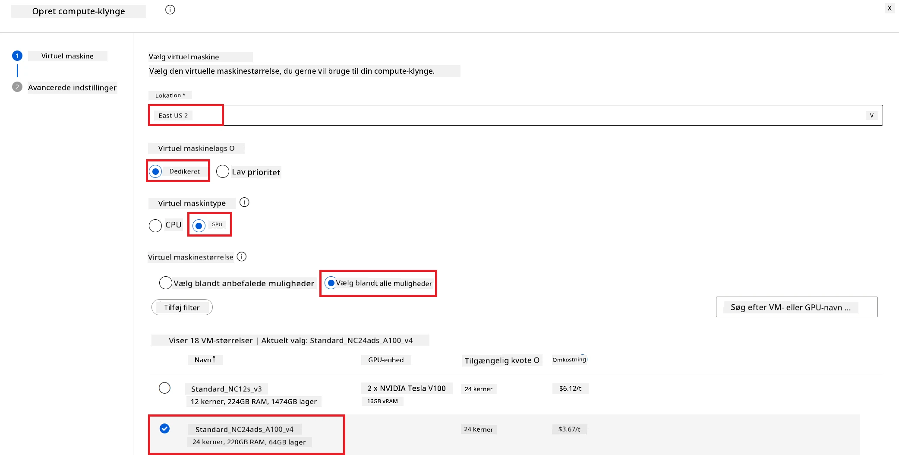

1. Vælg **Næste**.

1. Udfør følgende opgaver:

    - Indtast **Compute navn**. Det skal være en unik værdi.
    - Vælg **Minimum antal noder** til **0**.
    - Vælg **Maksimum antal noder** til **1**.
    - Vælg **Idle sekunder før skalering ned** til **120**.

    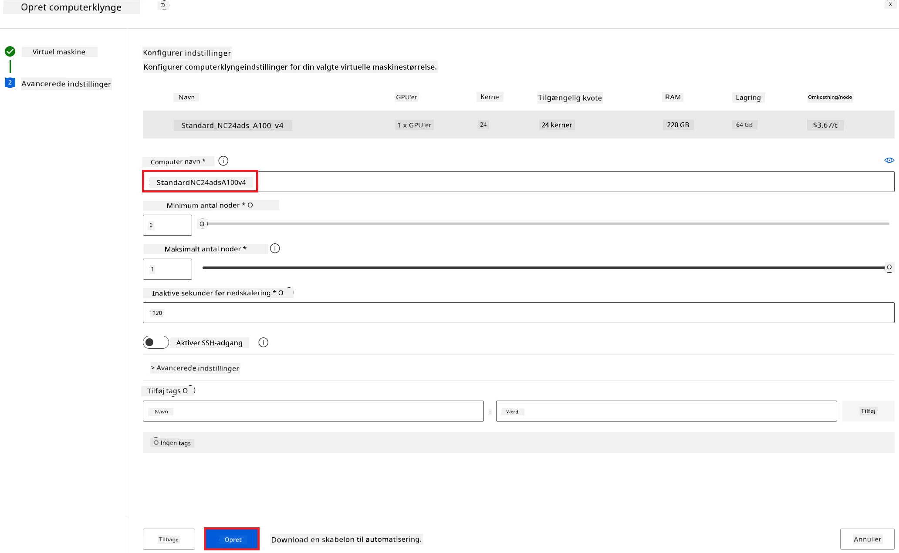

1. Vælg **Opret**.

#### Finjuster Phi-3 modellen

1. Besøg [Azure ML Studio](https://ml.azure.com/home?wt.mc_id=studentamb_279723).

1. Vælg det Azure Machine Learning workspace, som du har oprettet.

    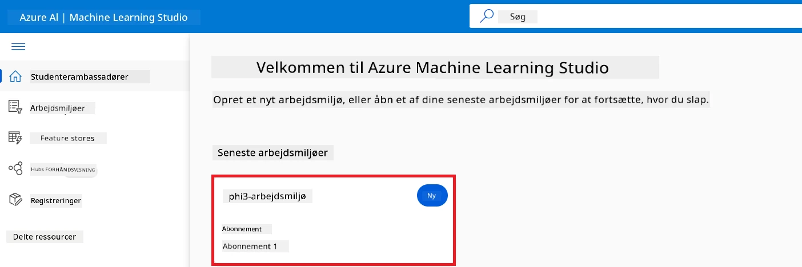

1. Udfør følgende opgaver:

    - Vælg **Model katalog** i venstre sidepanel.
    - Skriv *phi-3-mini-4k* i **søgefeltet** og vælg **Phi-3-mini-4k-instruct** fra de viste muligheder.

    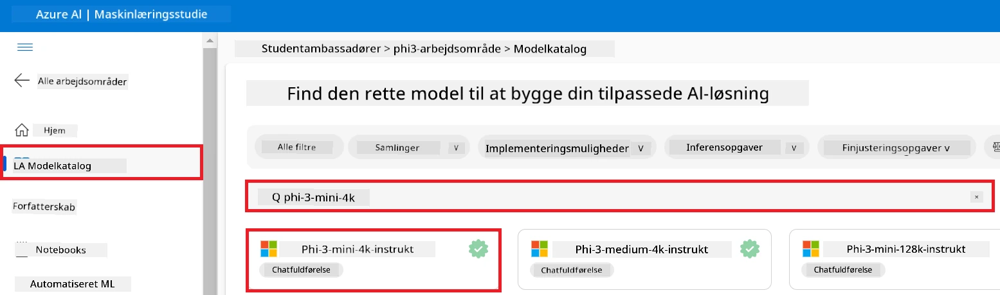

1. Vælg **Finjuster** i navigationsmenuen.

    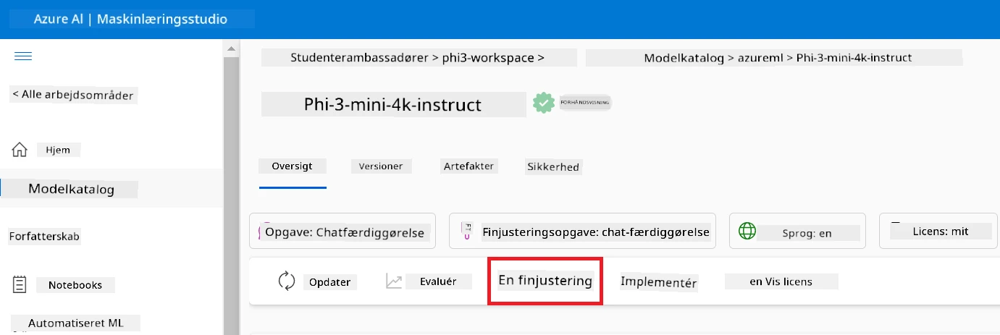

1. Udfør følgende opgaver:

    - Vælg **Vælg opgavetype** til **Chat completion**.
    - Vælg **+ Vælg data** for at uploade **Træningsdata**.
    - Vælg uploadtypen af Valideringsdata til **Angiv forskelligt valideringsdata**.
    - Vælg **+ Vælg data** for at uploade **Valideringsdata**.

    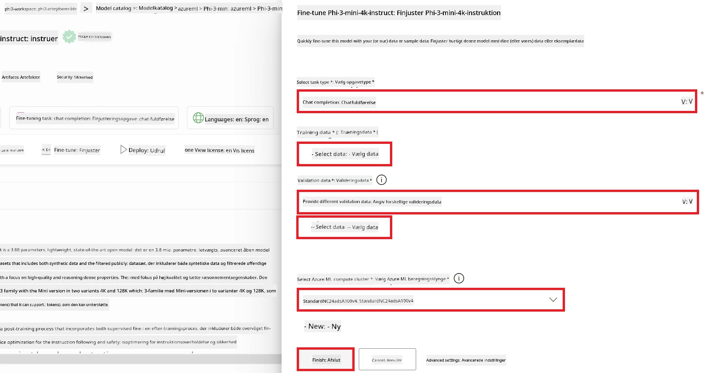

> [!TIP]
>
> Du kan vælge **Avancerede indstillinger** for at tilpasse konfigurationer såsom **learning_rate** og **lr_scheduler_type** for at optimere finjusteringsprocessen efter dine specifikke behov.

1. Vælg **Afslut**.

1. I denne øvelse har du med succes finjusteret Phi-3 modellen ved hjælp af Azure Machine Learning. Bemærk, at finjusteringsprocessen kan tage en betydelig tid. Efter du har startet finjusteringsjobbet, skal du vente på, at det bliver færdigt. Du kan overvåge status for finjusteringsjobbet ved at gå til fanen Jobs i venstre side af dit Azure Machine Learning Workspace. I næste serie vil du implementere den finjusterede model og integrere den med Prompt flow.

    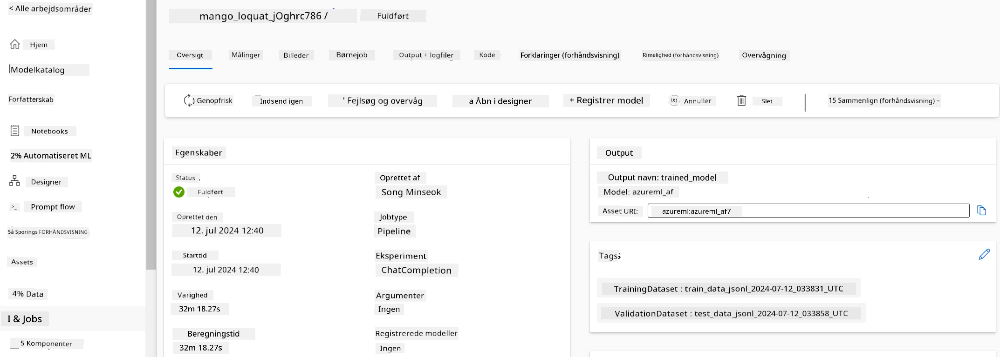

### Implementer den finjusterede Phi-3 model

For at integrere den finjusterede Phi-3 model med Prompt flow skal du implementere modellen for at gøre den tilgængelig til realtids inferens. Denne proces involverer registrering af modellen, oprettelse af en online endpoint og implementering af modellen.

I denne øvelse vil du:

- Registrere den finjusterede model i Azure Machine Learning workspace.
- Oprette en online endpoint.
- Implementere den registrerede finjusterede Phi-3 model.

#### Registrer den finjusterede model

1. Besøg [Azure ML Studio](https://ml.azure.com/home?wt.mc_id=studentamb_279723).

1. Vælg det Azure Machine Learning workspace, som du har oprettet.

    

1. Vælg **Modeller** i venstre sidepanel.
1. Vælg **+ Registrer**.
1. Vælg **Fra en joboutput**.

    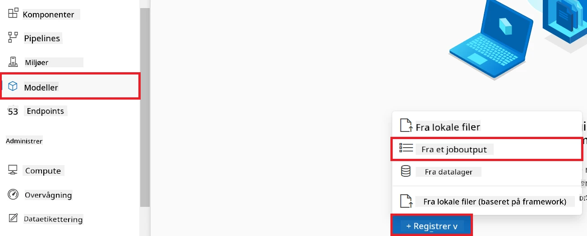

1. Vælg det job, som du har oprettet.

    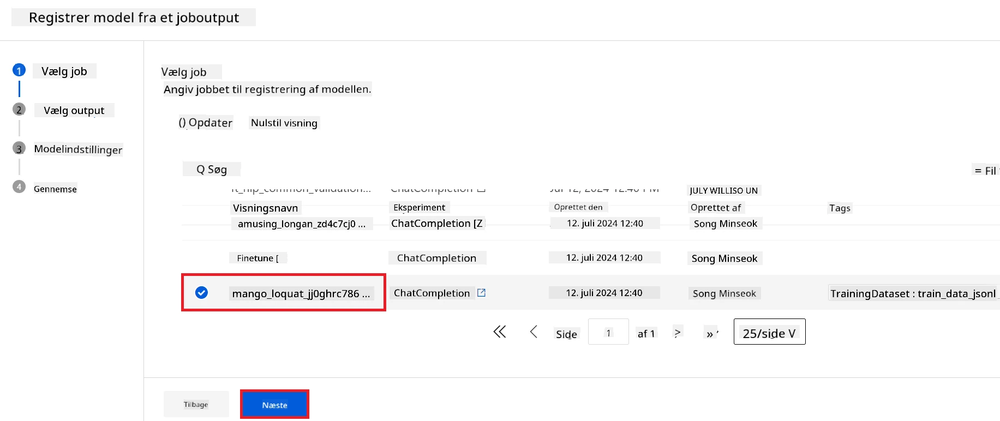

1. Vælg **Næste**.

1. Vælg **Model type** til **MLflow**.

1. Sørg for, at **Job output** er valgt; det burde være valgt automatisk.

    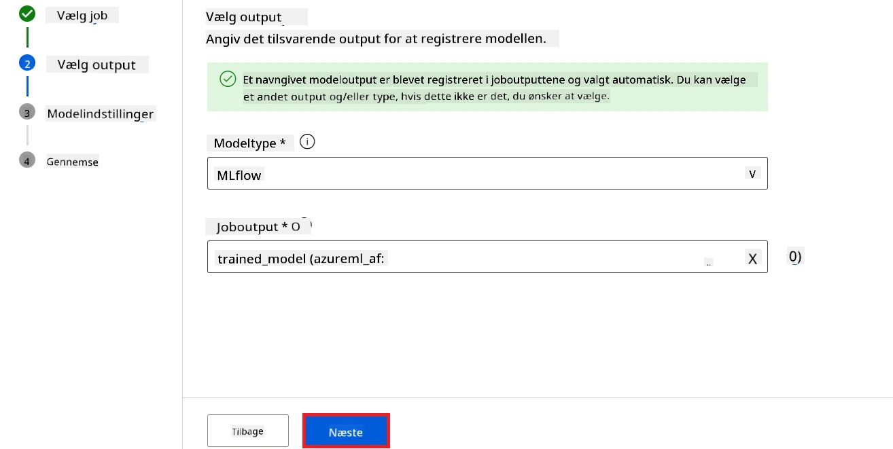

2. Vælg **Næste**.

3. Vælg **Registrer**.

    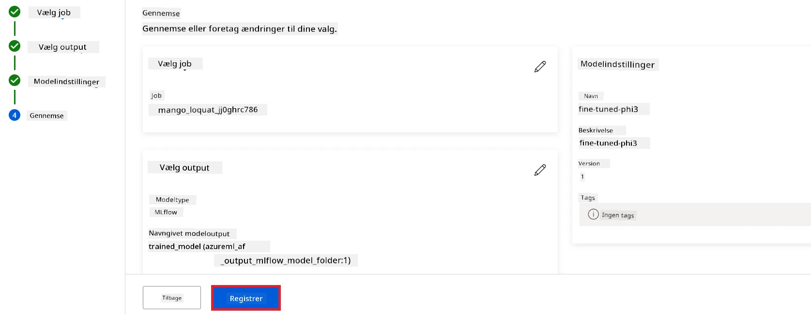

4. Du kan se din registrerede model ved at navigere til **Modeller** menuen i venstre sidepanel.

    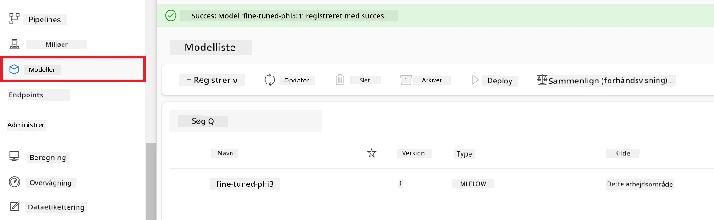

#### Implementer den finjusterede model

1. Naviger til det Azure Machine Learning workspace, som du har oprettet.

1. Vælg **Endpoints** i venstre sidepanel.

1. Vælg **Real-time endpoints** i navigationsmenuen.

    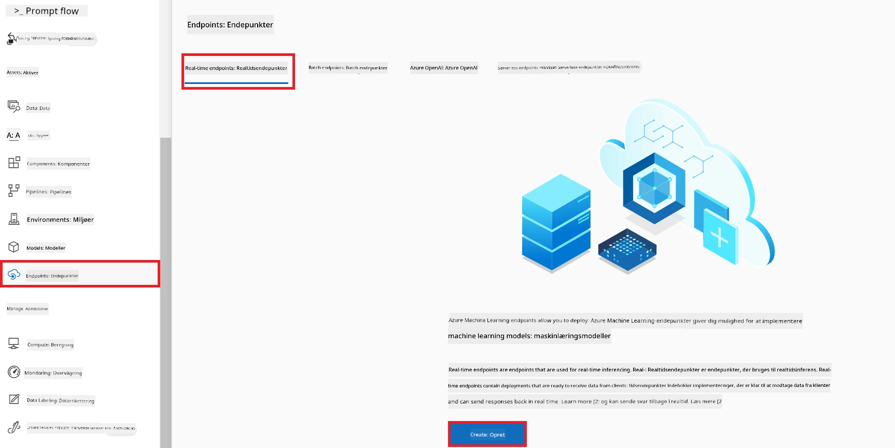

1. Vælg **Opret**.

1. vælg den registrerede model, som du har oprettet.

    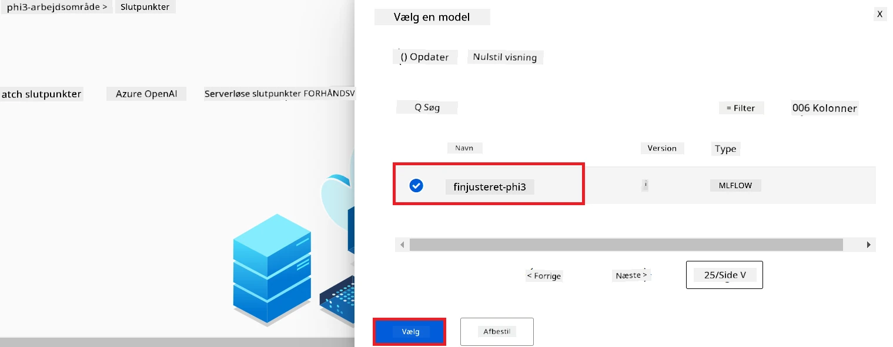

1. Vælg **Vælg**.

1. Udfør følgende opgaver:

    - Vælg **Virtual machine** til *Standard_NC6s_v3*.
    - Vælg **Instans antal** som du vil bruge. For eksempel, *1*.
    - Vælg **Endpoint** til **Ny** for at oprette en endpoint.
    - Indtast **Endpoint navn**. Det skal være en unik værdi.
    - Indtast **Implementeringsnavn**. Det skal være en unik værdi.

    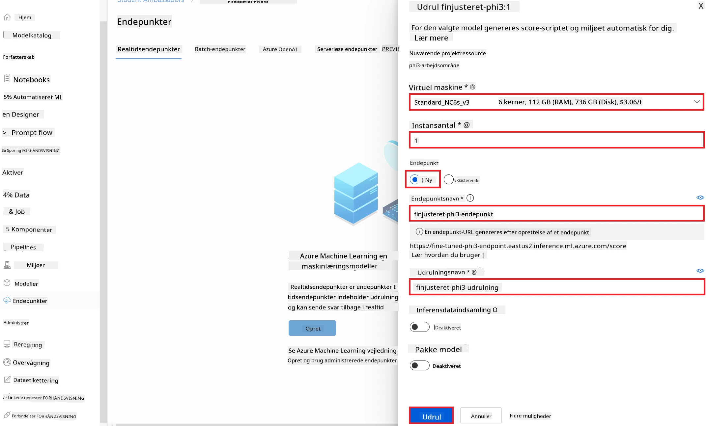

1. Vælg **Implementer**.

> [!WARNING]
> For at undgå ekstra omkostninger på din konto, skal du sørge for at slette den oprettede endpoint i Azure Machine Learning workspace.
>

#### Tjek implementeringsstatus i Azure Machine Learning Workspace

1. Naviger til det Azure Machine Learning workspace, som du har oprettet.

1. Vælg **Endpoints** i venstre sidepanel.

1. Vælg den endpoint, som du har oprettet.

    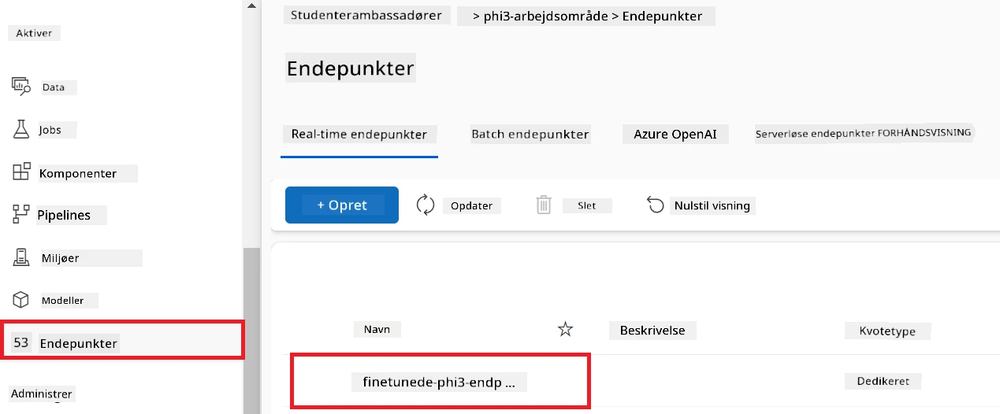

1. På denne side kan du administrere endpoints under implementeringsprocessen.

> [!NOTE]
> Når implementeringen er færdig, skal du sikre dig, at **Live traffic** er indstillet til **100%**. Hvis det ikke er, skal du vælge **Opdater trafik** for at justere trafikindstillingerne. Bemærk, at du ikke kan teste modellen, hvis trafikken er sat til 0%.
>
> 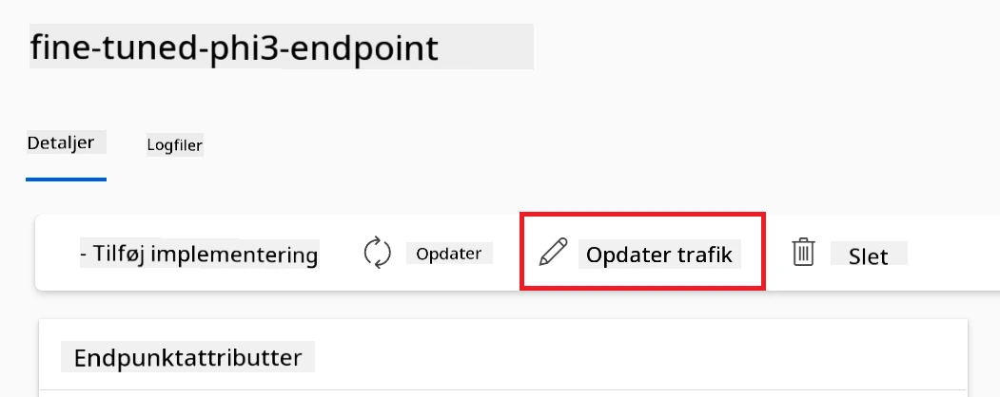
>

## Scenario 3: Integrer med Prompt flow og chat med din tilpassede model i Microsoft Foundry

### Integrer den tilpassede Phi-3 model med Prompt flow

Efter at have gennemført implementeringen af din finjusterede model, kan du nu integrere den med Prompt Flow for at bruge din model i realtidsapplikationer, hvilket muliggør en række interaktive opgaver med din tilpassede Phi-3 model.

I denne øvelse vil du:

- Oprette Microsoft Foundry Hub.
- Oprette Microsoft Foundry Project.
- Oprette Prompt flow.
- Tilføje en brugerdefineret forbindelse til den finjusterede Phi-3 model.
- Opsætte Prompt flow til at chatte med din tilpassede Phi-3 model.

> [!NOTE]
> Du kan også integrere med Promptflow ved hjælp af Azure ML Studio. Den samme integrationsproces kan anvendes til Azure ML Studio.

#### Opret Microsoft Foundry Hub

Du skal oprette en Hub, før du kan oprette et Project. En Hub fungerer som en Ressourcegruppe og giver dig mulighed for at organisere og administrere flere projekter i Microsoft Foundry.
1. Besøg [Microsoft Foundry](https://ai.azure.com/?WT.mc_id=aiml-137032-kinfeylo).

1. Vælg **All hubs** fra fanen i venstre side.

1. Vælg **+ New hub** fra navigationsmenuen.

    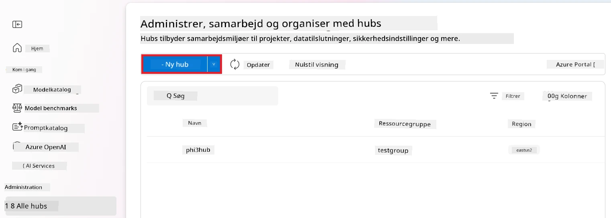

1. Udfør følgende opgaver:

    - Indtast **Hub name**. Det skal være en unik værdi.
    - Vælg dit Azure **Subscription**.
    - Vælg den **Resource group**, der skal bruges (opret en ny, hvis nødvendigt).
    - Vælg den **Location**, du vil bruge.
    - Vælg **Connect Azure AI Services**, der skal bruges (opret en ny, hvis nødvendigt).
    - Vælg **Connect Azure AI Search** til **Skip connecting**.

    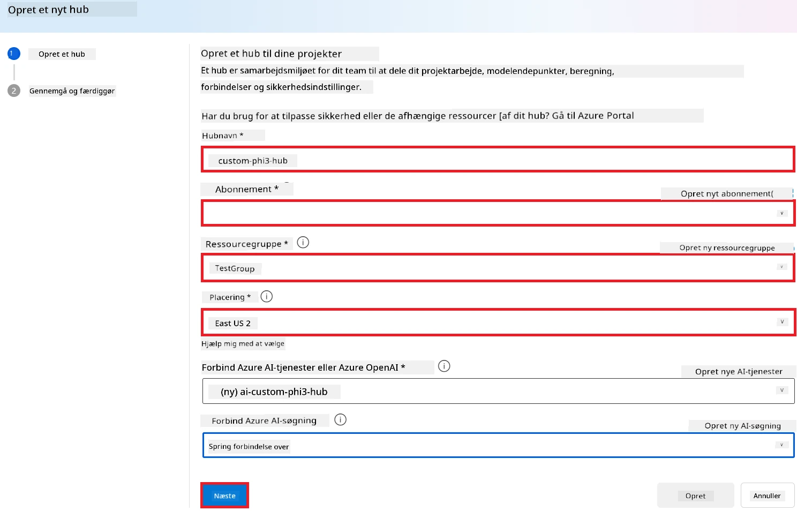

1. Vælg **Next**.

#### Opret Microsoft Foundry Projekt

1. I den hub, du oprettede, vælg **All projects** fra fanen i venstre side.

1. Vælg **+ New project** fra navigationsmenuen.

    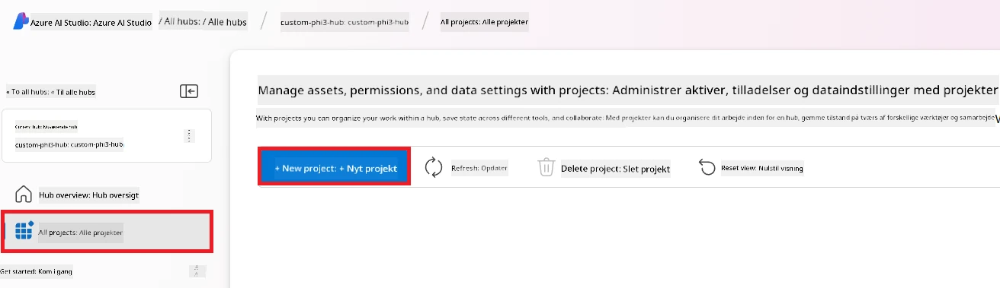

1. Indtast **Project name**. Det skal være en unik værdi.

    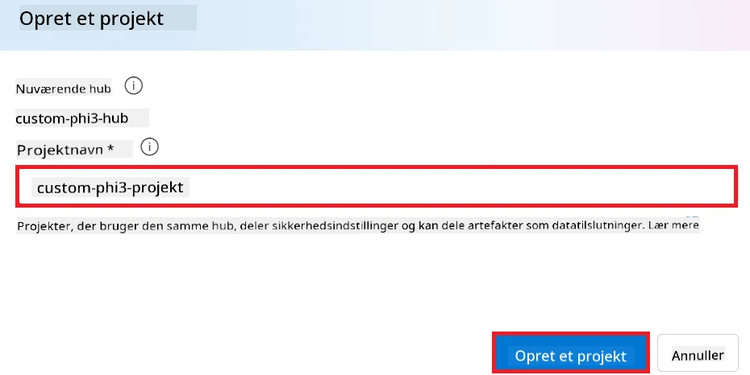

1. Vælg **Create a project**.

#### Tilføj en brugerdefineret forbindelse til den fintunede Phi-3 model

For at integrere din brugerdefinerede Phi-3 model med Prompt flow skal du gemme modellens endpoint og nøgle i en brugerdefineret forbindelse. Denne opsætning sikrer adgang til din brugerdefinerede Phi-3 model i Prompt flow.

#### Indstil api-nøgle og endpoint-uri for den fintunede Phi-3 model

1. Besøg [Azure ML Studio](https://ml.azure.com/home?WT.mc_id=aiml-137032-kinfeylo).

1. Naviger til den Azure Machine learning workspace, du oprettede.

1. Vælg **Endpoints** fra fanen i venstre side.

    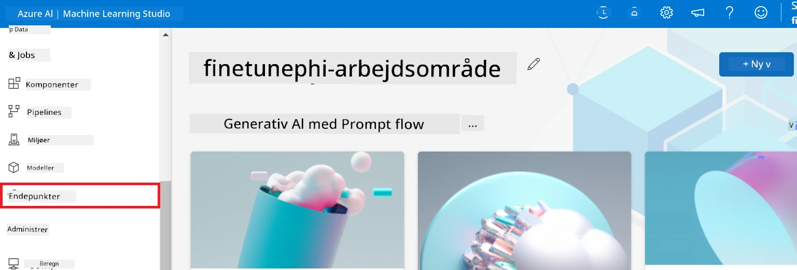

1. Vælg det endpoint, du oprettede.

    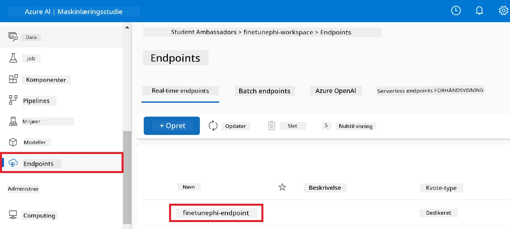

1. Vælg **Consume** fra navigationsmenuen.

1. Kopier dit **REST endpoint** og **Primary key**.

    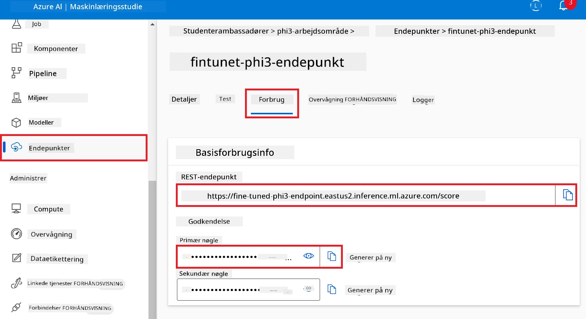

#### Tilføj den brugerdefinerede forbindelse

1. Besøg [Microsoft Foundry](https://ai.azure.com/?WT.mc_id=aiml-137032-kinfeylo).

1. Naviger til det Microsoft Foundry projekt, du oprettede.

1. I projektet, du oprettede, vælg **Settings** fra fanen i venstre side.

1. Vælg **+ New connection**.

    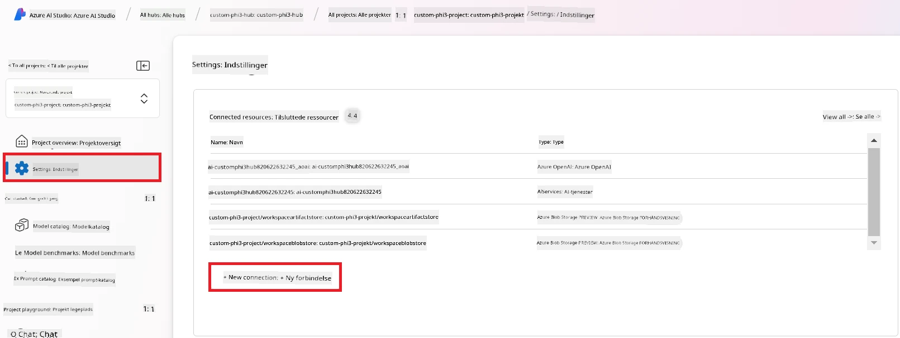

1. Vælg **Custom keys** fra navigationsmenuen.

    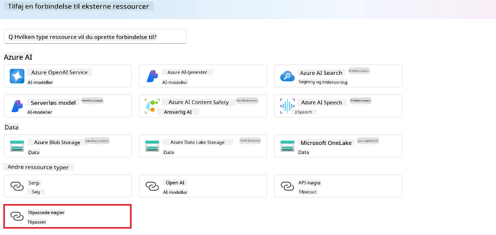

1. Udfør følgende opgaver:

    - Vælg **+ Add key value pairs**.
    - For nøglens navn, indtast **endpoint** og indsæt det endpoint, du kopierede fra Azure ML Studio, i værdifeltet.
    - Vælg **+ Add key value pairs** igen.
    - For nøglens navn, indtast **key** og indsæt nøglen, du kopierede fra Azure ML Studio, i værdifeltet.
    - Efter at have tilføjet nøglerne, vælg **is secret** for at forhindre, at nøglen bliver eksponeret.

    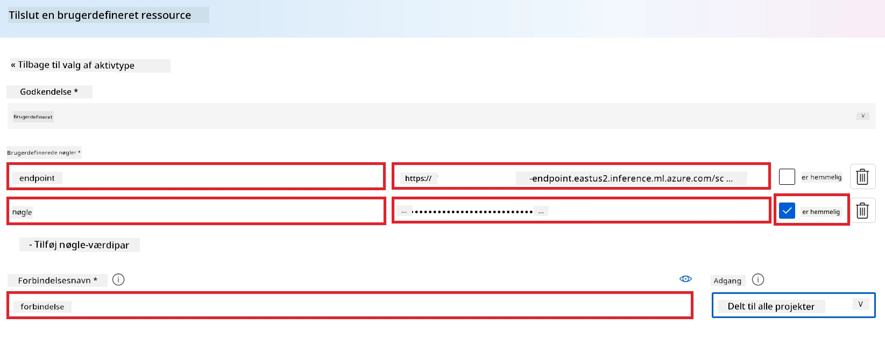

1. Vælg **Add connection**.

#### Opret Prompt flow

Du har tilføjet en brugerdefineret forbindelse i Microsoft Foundry. Lad os nu oprette en Prompt flow ved hjælp af følgende trin. Derefter vil du forbinde denne Prompt flow til den brugerdefinerede forbindelse, så du kan bruge den fintunede model inden for Prompt flow.

1. Naviger til det Microsoft Foundry projekt, du oprettede.

1. Vælg **Prompt flow** fra fanen i venstre side.

1. Vælg **+ Create** fra navigationsmenuen.

    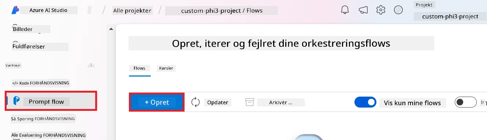

1. Vælg **Chat flow** fra navigationsmenuen.

    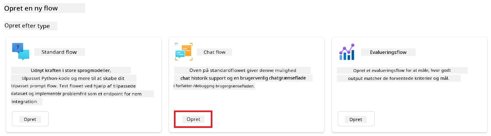

1. Indtast **Folder name** til brug.

    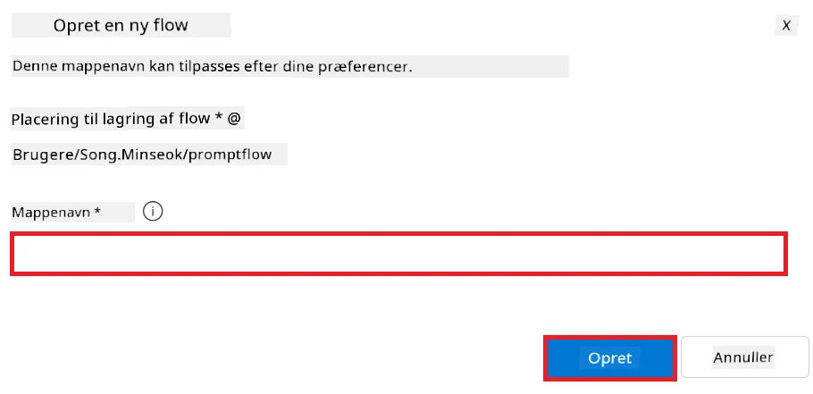

2. Vælg **Create**.

#### Indstil Prompt flow til at chatte med din brugerdefinerede Phi-3 model

Du skal integrere den fintunede Phi-3 model i en Prompt flow. Den eksisterende Prompt flow, der leveres, er dog ikke designet til dette formål. Derfor skal du redesigne Prompt flow for at muliggøre integrationen af den brugerdefinerede model.

1. I Prompt flow udfør følgende opgaver for at genskabe den eksisterende flow:

    - Vælg **Raw file mode**.
    - Slet al eksisterende kode i *flow.dag.yml*-filen.
    - Tilføj følgende kode til *flow.dag.yml*-filen.

        ```yml
        inputs:
          input_data:
            type: string
            default: "Who founded Microsoft?"

        outputs:
          answer:
            type: string
            reference: ${integrate_with_promptflow.output}

        nodes:
        - name: integrate_with_promptflow
          type: python
          source:
            type: code
            path: integrate_with_promptflow.py
          inputs:
            input_data: ${inputs.input_data}
        ```

    - Vælg **Save**.

    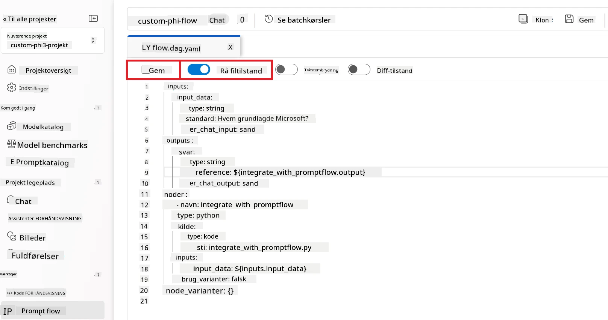

1. Tilføj følgende kode til *integrate_with_promptflow.py*-filen for at bruge den brugerdefinerede Phi-3 model i Prompt flow.

    ```python
    import logging
    import requests
    from promptflow import tool
    from promptflow.connections import CustomConnection

    # Opsætning af logning
    logging.basicConfig(
        format="%(asctime)s - %(levelname)s - %(name)s - %(message)s",
        datefmt="%Y-%m-%d %H:%M:%S",
        level=logging.DEBUG
    )
    logger = logging.getLogger(__name__)

    def query_phi3_model(input_data: str, connection: CustomConnection) -> str:
        """
        Send a request to the Phi-3 model endpoint with the given input data using Custom Connection.
        """

        # "connection" er navnet på den brugerdefinerede forbindelse, "endpoint", "key" er nøglerne i den brugerdefinerede forbindelse
        endpoint_url = connection.endpoint
        api_key = connection.key

        headers = {
            "Content-Type": "application/json",
            "Authorization": f"Bearer {api_key}"
        }
        data = {
            "input_data": {
                "input_string": [
                    {"role": "user", "content": input_data}
                ],
                "parameters": {
                    "temperature": 0.7,
                    "max_new_tokens": 128
                }
            }
        }
        try:
            response = requests.post(endpoint_url, json=data, headers=headers)
            response.raise_for_status()
            
            # Log hele JSON-svaret
            logger.debug(f"Full JSON response: {response.json()}")

            result = response.json()["output"]
            logger.info("Successfully received response from Azure ML Endpoint.")
            return result
        except requests.exceptions.RequestException as e:
            logger.error(f"Error querying Azure ML Endpoint: {e}")
            raise

    @tool
    def my_python_tool(input_data: str, connection: CustomConnection) -> str:
        """
        Tool function to process input data and query the Phi-3 model.
        """
        return query_phi3_model(input_data, connection)

    ```

    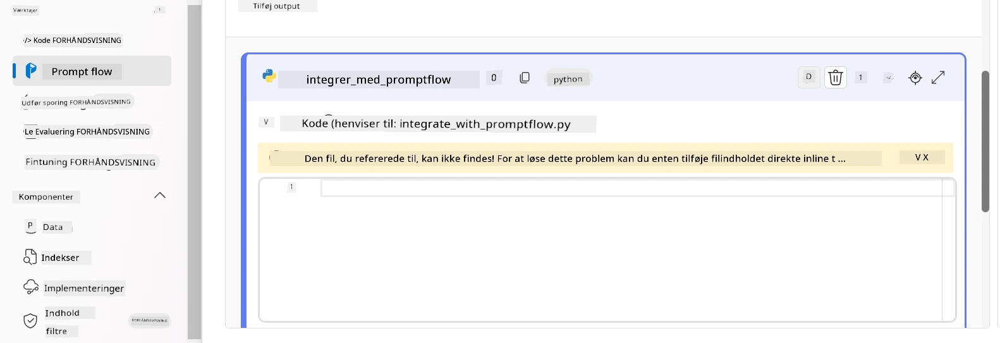

> [!NOTE]
> For mere detaljerede oplysninger om at bruge Prompt flow i Microsoft Foundry kan du se [Prompt flow in Microsoft Foundry](https://learn.microsoft.com/azure/ai-studio/how-to/prompt-flow).

1. Vælg **Chat input**, **Chat output** for at aktivere chat med din model.

    

1. Nu er du klar til at chatte med din brugerdefinerede Phi-3 model. I den næste øvelse vil du lære, hvordan du starter Prompt flow og bruger det til at chatte med din fintunede Phi-3 model.

> [!NOTE]
>
> Den genskabte flow skal se ud som billedet nedenfor:
>
> 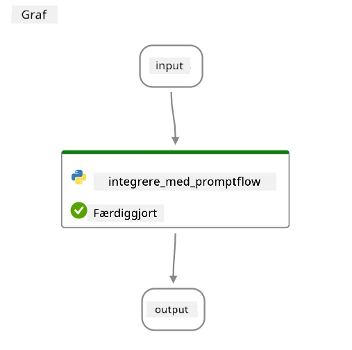
>

### Chat med din brugerdefinerede Phi-3 model

Nu hvor du har fintunet og integreret din brugerdefinerede Phi-3 model med Prompt flow, er du klar til at begynde at interagere med den. Denne øvelse vil guide dig gennem processen med at opsætte og starte en chat med din model ved hjælp af Prompt flow. Ved at følge disse trin vil du kunne udnytte alle mulighederne i din fintunede Phi-3 model til forskellige opgaver og samtaler.

- Chat med din brugerdefinerede Phi-3 model ved hjælp af Prompt flow.

#### Start Prompt flow

1. Vælg **Start compute sessions** for at starte Prompt flow.

    

1. Vælg **Validate and parse input** for at forny parametrene.

    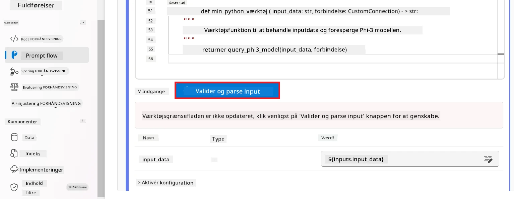

1. Vælg **Value** for **connection** til den brugerdefinerede forbindelse, du oprettede. For eksempel *connection*.

    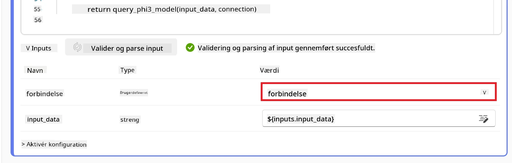

#### Chat med din brugerdefinerede model

1. Vælg **Chat**.

    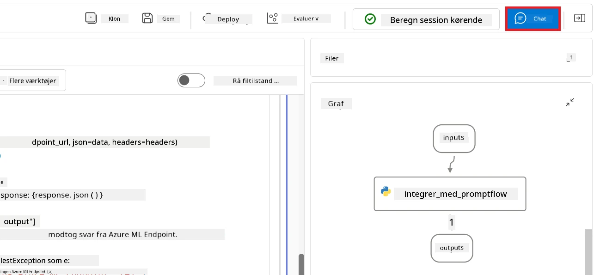

1. Her er et eksempel på resultaterne: Nu kan du chatte med din brugerdefinerede Phi-3 model. Det anbefales at stille spørgsmål baseret på de data, der blev brugt til fintuning.

    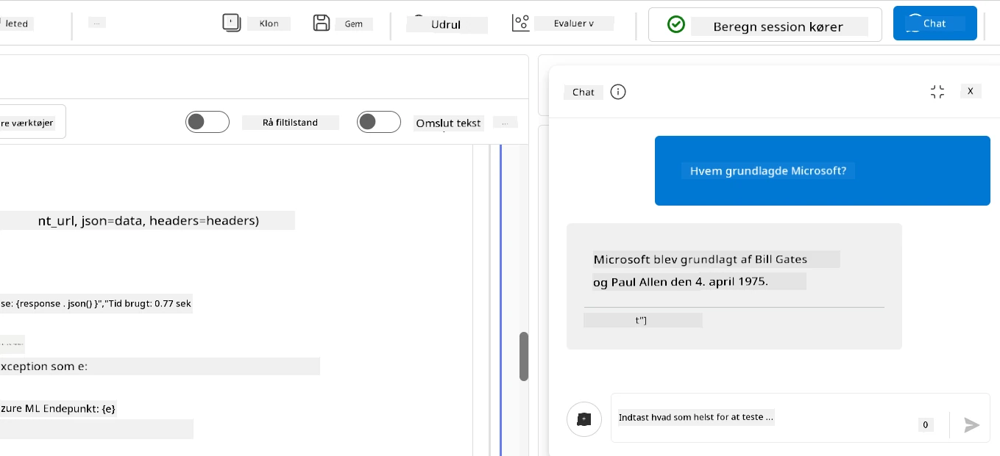

---

<!-- CO-OP TRANSLATOR DISCLAIMER START -->
**Ansvarsfraskrivelse**:
Dette dokument er blevet oversat ved hjælp af AI-oversættelsestjenesten [Co-op Translator](https://github.com/Azure/co-op-translator). Selvom vi bestræber os på nøjagtighed, bedes du være opmærksom på, at automatiserede oversættelser kan indeholde fejl eller unøjagtigheder. Det oprindelige dokument på dets oprindelige sprog bør betragtes som den autoritative kilde. For kritisk information anbefales professionel menneskelig oversættelse. Vi påtager os intet ansvar for eventuelle misforståelser eller fejlagtige fortolkninger, der opstår som følge af brugen af denne oversættelse.
<!-- CO-OP TRANSLATOR DISCLAIMER END -->