<!--
CO_OP_TRANSLATOR_METADATA:
{
  "original_hash": "ecbd9179a21edbaafaf114d47f09f3e3",
  "translation_date": "2025-07-17T01:34:03+00:00",
  "source_file": "md/02.Application/01.TextAndChat/Phi3/E2E_Phi-3-FineTuning_PromptFlow_Integration_AIFoundry.md",
  "language_code": "da"
}
-->
# Finjuster og integrer tilpassede Phi-3 modeller med Prompt flow i Azure AI Foundry

Dette end-to-end (E2E) eksempel er baseret på guiden "[Fine-Tune and Integrate Custom Phi-3 Models with Prompt Flow in Azure AI Foundry](https://techcommunity.microsoft.com/t5/educator-developer-blog/fine-tune-and-integrate-custom-phi-3-models-with-prompt-flow-in/ba-p/4191726?WT.mc_id=aiml-137032-kinfeylo)" fra Microsoft Tech Community. Det introducerer processerne for finjustering, implementering og integration af tilpassede Phi-3 modeller med Prompt flow i Azure AI Foundry.  
I modsætning til E2E-eksemplet, "[Fine-Tune and Integrate Custom Phi-3 Models with Prompt Flow](./E2E_Phi-3-FineTuning_PromptFlow_Integration.md)", som involverede at køre kode lokalt, fokuserer denne vejledning udelukkende på finjustering og integration af din model inden for Azure AI / ML Studio.

## Oversigt

I dette E2E-eksempel vil du lære, hvordan du finjusterer Phi-3 modellen og integrerer den med Prompt flow i Azure AI Foundry. Ved at udnytte Azure AI / ML Studio vil du etablere en arbejdsgang til implementering og brug af tilpassede AI-modeller. Dette E2E-eksempel er opdelt i tre scenarier:

**Scenario 1: Opsæt Azure-ressourcer og forbered til finjustering**

**Scenario 2: Finjuster Phi-3 modellen og implementer i Azure Machine Learning Studio**

**Scenario 3: Integrer med Prompt flow og chat med din tilpassede model i Azure AI Foundry**

Her er en oversigt over dette E2E-eksempel.


### Indholdsfortegnelse

1. **[Scenario 1: Opsæt Azure-ressourcer og forbered til finjustering](../../../../../../md/02.Application/01.TextAndChat/Phi3)**
    - [Opret et Azure Machine Learning Workspace](../../../../../../md/02.Application/01.TextAndChat/Phi3)
    - [Anmod om GPU-kvoter i Azure Subscription](../../../../../../md/02.Application/01.TextAndChat/Phi3)
    - [Tilføj rolle-tildeling](../../../../../../md/02.Application/01.TextAndChat/Phi3)
    - [Opsæt projekt](../../../../../../md/02.Application/01.TextAndChat/Phi3)
    - [Forbered datasæt til finjustering](../../../../../../md/02.Application/01.TextAndChat/Phi3)

1. **[Scenario 2: Finjuster Phi-3 model og implementer i Azure Machine Learning Studio](../../../../../../md/02.Application/01.TextAndChat/Phi3)**
    - [Finjuster Phi-3 modellen](../../../../../../md/02.Application/01.TextAndChat/Phi3)
    - [Implementer den finjusterede Phi-3 model](../../../../../../md/02.Application/01.TextAndChat/Phi3)

1. **[Scenario 3: Integrer med Prompt flow og chat med din tilpassede model i Azure AI Foundry](../../../../../../md/02.Application/01.TextAndChat/Phi3)**
    - [Integrer den tilpassede Phi-3 model med Prompt flow](../../../../../../md/02.Application/01.TextAndChat/Phi3)
    - [Chat med din tilpassede Phi-3 model](../../../../../../md/02.Application/01.TextAndChat/Phi3)

## Scenario 1: Opsæt Azure-ressourcer og forbered til finjustering

### Opret et Azure Machine Learning Workspace

1. Skriv *azure machine learning* i **søgefeltet** øverst på portal-siden og vælg **Azure Machine Learning** fra de viste muligheder.

    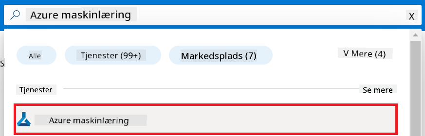

2. Vælg **+ Create** i navigationsmenuen.

3. Vælg **New workspace** i navigationsmenuen.

    

4. Udfør følgende opgaver:

    - Vælg din Azure **Subscription**.
    - Vælg den **Resource group**, der skal bruges (opret en ny, hvis nødvendigt).
    - Indtast **Workspace Name**. Det skal være en unik værdi.
    - Vælg den **Region**, du ønsker at bruge.
    - Vælg den **Storage account**, der skal bruges (opret en ny, hvis nødvendigt).
    - Vælg den **Key vault**, der skal bruges (opret en ny, hvis nødvendigt).
    - Vælg den **Application insights**, der skal bruges (opret en ny, hvis nødvendigt).
    - Vælg den **Container registry**, der skal bruges (opret en ny, hvis nødvendigt).

    

5. Vælg **Review + Create**.

6. Vælg **Create**.

### Anmod om GPU-kvoter i Azure Subscription

I denne vejledning lærer du, hvordan du finjusterer og implementerer en Phi-3 model ved brug af GPU’er. Til finjustering bruger du *Standard_NC24ads_A100_v4* GPU, som kræver en kvoteanmodning. Til implementering bruger du *Standard_NC6s_v3* GPU, som også kræver en kvoteanmodning.

> [!NOTE]
>
> Kun Pay-As-You-Go abonnementer (standard abonnementstype) er berettigede til GPU-tildeling; benefit-abonnementer understøttes ikke i øjeblikket.
>

1. Besøg [Azure ML Studio](https://ml.azure.com/home?wt.mc_id=studentamb_279723).

1. Udfør følgende for at anmode om *Standard NCADSA100v4 Family* kvote:

    - Vælg **Quota** i venstre sidepanel.
    - Vælg den **Virtual machine family**, der skal bruges. For eksempel vælg **Standard NCADSA100v4 Family Cluster Dedicated vCPUs**, som inkluderer *Standard_NC24ads_A100_v4* GPU’en.
    - Vælg **Request quota** i navigationsmenuen.

        

    - På siden Request quota, indtast den **New cores limit**, du ønsker at bruge. For eksempel 24.
    - På siden Request quota, vælg **Submit** for at anmode om GPU-kvoten.

1. Udfør følgende for at anmode om *Standard NCSv3 Family* kvote:

    - Vælg **Quota** i venstre sidepanel.
    - Vælg den **Virtual machine family**, der skal bruges. For eksempel vælg **Standard NCSv3 Family Cluster Dedicated vCPUs**, som inkluderer *Standard_NC6s_v3* GPU’en.
    - Vælg **Request quota** i navigationsmenuen.
    - På siden Request quota, indtast den **New cores limit**, du ønsker at bruge. For eksempel 24.
    - På siden Request quota, vælg **Submit** for at anmode om GPU-kvoten.

### Tilføj rolle-tildeling

For at finjustere og implementere dine modeller skal du først oprette en User Assigned Managed Identity (UAI) og tildele den de nødvendige tilladelser. Denne UAI vil blive brugt til autentificering under implementeringen.

#### Opret User Assigned Managed Identity (UAI)

1. Skriv *managed identities* i **søgefeltet** øverst på portal-siden og vælg **Managed Identities** fra de viste muligheder.

    

1. Vælg **+ Create**.

    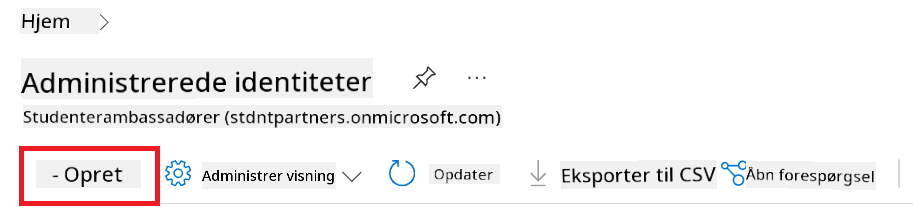

1. Udfør følgende opgaver:

    - Vælg din Azure **Subscription**.
    - Vælg den **Resource group**, der skal bruges (opret en ny, hvis nødvendigt).
    - Vælg den **Region**, du ønsker at bruge.
    - Indtast **Name**. Det skal være en unik værdi.

    

1. Vælg **Review + create**.

1. Vælg **+ Create**.

#### Tilføj Contributor rolle-tildeling til Managed Identity

1. Gå til den Managed Identity-ressource, du oprettede.

1. Vælg **Azure role assignments** i venstre sidepanel.

1. Vælg **+Add role assignment** i navigationsmenuen.

1. På siden Add role assignment, udfør følgende:

    - Vælg **Scope** til **Resource group**.
    - Vælg din Azure **Subscription**.
    - Vælg den **Resource group**, der skal bruges.
    - Vælg **Role** til **Contributor**.

    

2. Vælg **Save**.

#### Tilføj Storage Blob Data Reader rolle-tildeling til Managed Identity

1. Skriv *storage accounts* i **søgefeltet** øverst på portal-siden og vælg **Storage accounts** fra de viste muligheder.

    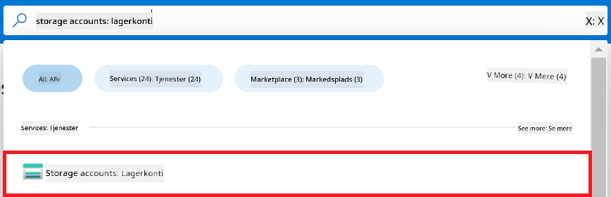

1. Vælg den storage account, der er tilknyttet det Azure Machine Learning workspace, du oprettede. For eksempel *finetunephistorage*.

1. Udfør følgende for at navigere til siden Add role assignment:

    - Gå til den Azure Storage account, du oprettede.
    - Vælg **Access Control (IAM)** i venstre sidepanel.
    - Vælg **+ Add** i navigationsmenuen.
    - Vælg **Add role assignment** i navigationsmenuen.

    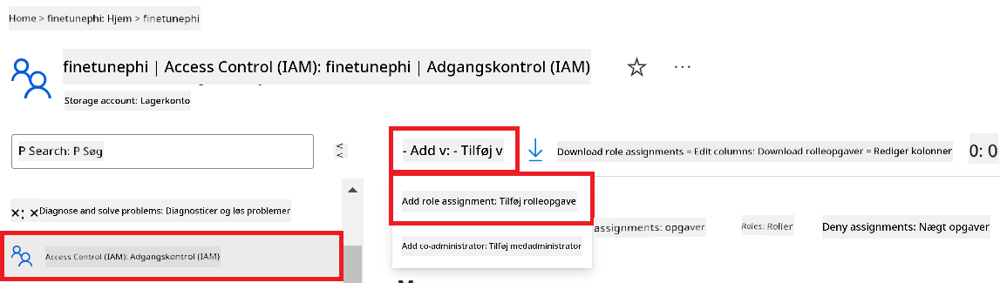

1. På siden Add role assignment, udfør følgende:

    - På Role-siden, skriv *Storage Blob Data Reader* i **søgefeltet** og vælg **Storage Blob Data Reader** fra de viste muligheder.
    - På Role-siden, vælg **Next**.
    - På Members-siden, vælg **Assign access to** **Managed identity**.
    - På Members-siden, vælg **+ Select members**.
    - På siden Select managed identities, vælg din Azure **Subscription**.
    - På siden Select managed identities, vælg den **Managed identity** til **Manage Identity**.
    - På siden Select managed identities, vælg den Manage Identity, du oprettede. For eksempel *finetunephi-managedidentity*.
    - På siden Select managed identities, vælg **Select**.

    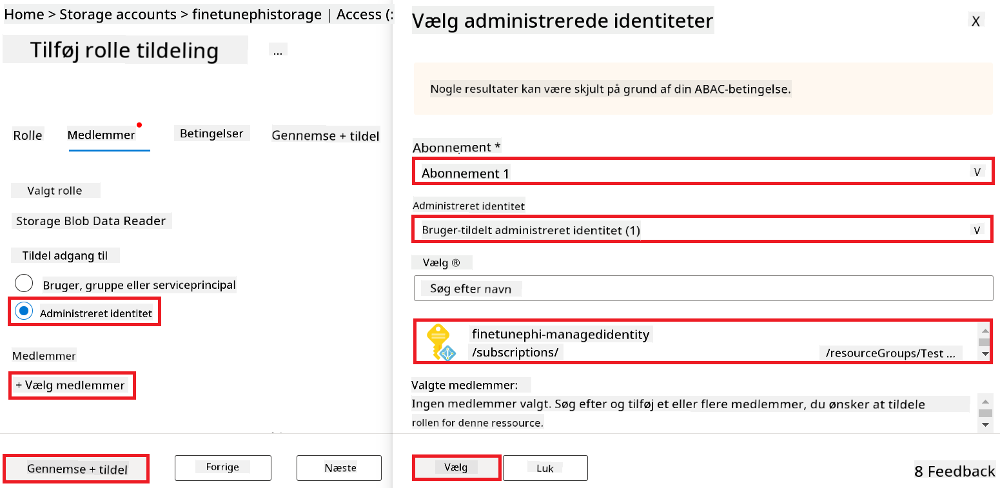

1. Vælg **Review + assign**.

#### Tilføj AcrPull rolle-tildeling til Managed Identity

1. Skriv *container registries* i **søgefeltet** øverst på portal-siden og vælg **Container registries** fra de viste muligheder.

    

1. Vælg den container registry, der er tilknyttet Azure Machine Learning workspace. For eksempel *finetunephicontainerregistry*

1. Udfør følgende for at navigere til siden Add role assignment:

    - Vælg **Access Control (IAM)** i venstre sidepanel.
    - Vælg **+ Add** i navigationsmenuen.
    - Vælg **Add role assignment** i navigationsmenuen.

1. På siden Add role assignment, udfør følgende:

    - På Role-siden, skriv *AcrPull* i **søgefeltet** og vælg **AcrPull** fra de viste muligheder.
    - På Role-siden, vælg **Next**.
    - På Members-siden, vælg **Assign access to** **Managed identity**.
    - På Members-siden, vælg **+ Select members**.
    - På siden Select managed identities, vælg din Azure **Subscription**.
    - På siden Select managed identities, vælg den **Managed identity** til **Manage Identity**.
    - På siden Select managed identities, vælg den Manage Identity, du oprettede. For eksempel *finetunephi-managedidentity*.
    - På siden Select managed identities, vælg **Select**.
    - Vælg **Review + assign**.

### Opsæt projekt

For at downloade de datasæt, der er nødvendige til finjustering, skal du opsætte et lokalt miljø.

I denne øvelse vil du

- Oprette en mappe til at arbejde i.
- Oprette et virtuelt miljø.
- Installere de nødvendige pakker.
- Oprette en *download_dataset.py* fil til at downloade datasættet.

#### Opret en mappe til at arbejde i

1. Åbn et terminalvindue og skriv følgende kommando for at oprette en mappe med navnet *finetune-phi* i standardstien.

    ```console
    mkdir finetune-phi
    ```

2. Skriv følgende kommando i din terminal for at navigere til den *finetune-phi* mappe, du oprettede.
#### Opret et virtuelt miljø

1. Skriv følgende kommando i din terminal for at oprette et virtuelt miljø med navnet *.venv*.

    ```console
    python -m venv .venv
    ```

2. Skriv følgende kommando i din terminal for at aktivere det virtuelle miljø.

    ```console
    .venv\Scripts\activate.bat
    ```


> [!NOTE]
> Hvis det virkede, skulle du se *(.venv)* før kommandoprompten.

#### Installer de nødvendige pakker

1. Skriv følgende kommandoer i din terminal for at installere de nødvendige pakker.

    ```console
    pip install datasets==2.19.1
    ```

#### Opret `download_dataset.py`

> [!NOTE]
> Fuldstændig mappestruktur:
>
> ```text
> └── YourUserName
> .    └── finetune-phi
> .        └── download_dataset.py
> ```

1. Åbn **Visual Studio Code**.

1. Vælg **File** i menulinjen.

1. Vælg **Open Folder**.

1. Vælg mappen *finetune-phi*, som du har oprettet, og som ligger i *C:\Users\yourUserName\finetune-phi*.

    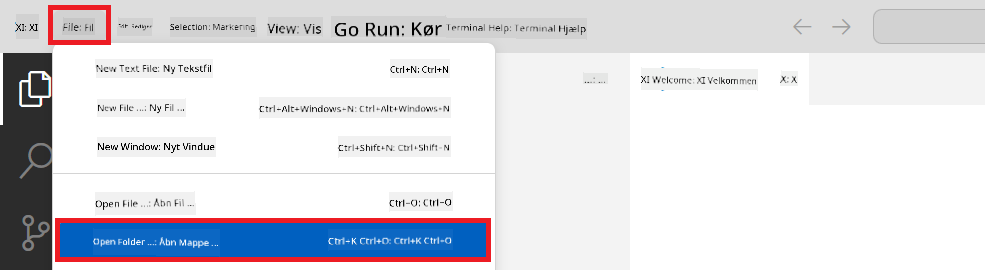

1. I venstre rude i Visual Studio Code, højreklik og vælg **New File** for at oprette en ny fil med navnet *download_dataset.py*.

    

### Forbered datasæt til finjustering

I denne øvelse skal du køre filen *download_dataset.py* for at downloade *ultrachat_200k* datasættene til dit lokale miljø. Du vil derefter bruge disse datasæt til at finjustere Phi-3 modellen i Azure Machine Learning.

I denne øvelse vil du:

- Tilføje kode til filen *download_dataset.py* for at downloade datasættene.
- Køre filen *download_dataset.py* for at downloade datasættene til dit lokale miljø.

#### Download dit datasæt ved hjælp af *download_dataset.py*

1. Åbn filen *download_dataset.py* i Visual Studio Code.

1. Tilføj følgende kode i filen *download_dataset.py*.

    ```python
    import json
    import os
    from datasets import load_dataset

    def load_and_split_dataset(dataset_name, config_name, split_ratio):
        """
        Load and split a dataset.
        """
        # Load the dataset with the specified name, configuration, and split ratio
        dataset = load_dataset(dataset_name, config_name, split=split_ratio)
        print(f"Original dataset size: {len(dataset)}")
        
        # Split the dataset into train and test sets (80% train, 20% test)
        split_dataset = dataset.train_test_split(test_size=0.2)
        print(f"Train dataset size: {len(split_dataset['train'])}")
        print(f"Test dataset size: {len(split_dataset['test'])}")
        
        return split_dataset

    def save_dataset_to_jsonl(dataset, filepath):
        """
        Save a dataset to a JSONL file.
        """
        # Create the directory if it does not exist
        os.makedirs(os.path.dirname(filepath), exist_ok=True)
        
        # Open the file in write mode
        with open(filepath, 'w', encoding='utf-8') as f:
            # Iterate over each record in the dataset
            for record in dataset:
                # Dump the record as a JSON object and write it to the file
                json.dump(record, f)
                # Write a newline character to separate records
                f.write('\n')
        
        print(f"Dataset saved to {filepath}")

    def main():
        """
        Main function to load, split, and save the dataset.
        """
        # Load and split the ULTRACHAT_200k dataset with a specific configuration and split ratio
        dataset = load_and_split_dataset("HuggingFaceH4/ultrachat_200k", 'default', 'train_sft[:1%]')
        
        # Extract the train and test datasets from the split
        train_dataset = dataset['train']
        test_dataset = dataset['test']

        # Save the train dataset to a JSONL file
        save_dataset_to_jsonl(train_dataset, "data/train_data.jsonl")
        
        # Save the test dataset to a separate JSONL file
        save_dataset_to_jsonl(test_dataset, "data/test_data.jsonl")

    if __name__ == "__main__":
        main()

    ```

1. Skriv følgende kommando i din terminal for at køre scriptet og downloade datasættet til dit lokale miljø.

    ```console
    python download_dataset.py
    ```

1. Bekræft, at datasættene blev gemt korrekt i din lokale *finetune-phi/data* mappe.

> [!NOTE]
>
> #### Bemærkning om datasætstørrelse og finjusteringstid
>
> I denne vejledning bruger du kun 1% af datasættet (`split='train[:1%]'`). Det reducerer mængden af data betydeligt og gør både upload og finjustering hurtigere. Du kan justere procentdelen for at finde den rette balance mellem træningstid og modelpræstation. Ved at bruge et mindre udsnit af datasættet mindskes tiden, der kræves til finjustering, hvilket gør processen mere overskuelig i en vejledning.

## Scenario 2: Finjuster Phi-3 modellen og deployér i Azure Machine Learning Studio

### Finjuster Phi-3 modellen

I denne øvelse skal du finjustere Phi-3 modellen i Azure Machine Learning Studio.

I denne øvelse vil du:

- Oprette en computerklynge til finjustering.
- Finjustere Phi-3 modellen i Azure Machine Learning Studio.

#### Opret computerklynge til finjustering

1. Besøg [Azure ML Studio](https://ml.azure.com/home?wt.mc_id=studentamb_279723).

1. Vælg **Compute** i venstre sidepanel.

1. Vælg **Compute clusters** i navigationsmenuen.

1. Vælg **+ New**.

    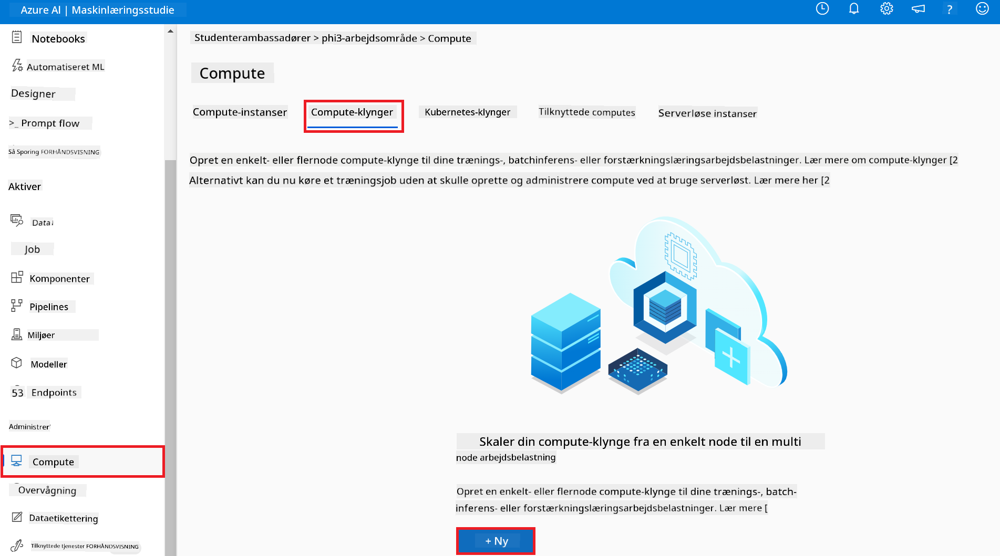

1. Udfør følgende opgaver:

    - Vælg den **Region**, du ønsker at bruge.
    - Vælg **Virtual machine tier** til **Dedicated**.
    - Vælg **Virtual machine type** til **GPU**.
    - Vælg filteret for **Virtual machine size** til **Select from all options**.
    - Vælg **Virtual machine size** til **Standard_NC24ads_A100_v4**.

    

1. Vælg **Next**.

1. Udfør følgende opgaver:

    - Indtast **Compute name**. Det skal være et unikt navn.
    - Vælg **Minimum number of nodes** til **0**.
    - Vælg **Maximum number of nodes** til **1**.
    - Vælg **Idle seconds before scale down** til **120**.

    

1. Vælg **Create**.

#### Finjuster Phi-3 modellen

1. Besøg [Azure ML Studio](https://ml.azure.com/home?wt.mc_id=studentamb_279723).

1. Vælg det Azure Machine Learning workspace, du har oprettet.

    

1. Udfør følgende opgaver:

    - Vælg **Model catalog** i venstre sidepanel.
    - Skriv *phi-3-mini-4k* i **søgefeltet** og vælg **Phi-3-mini-4k-instruct** fra de viste muligheder.

    

1. Vælg **Fine-tune** i navigationsmenuen.

    

1. Udfør følgende opgaver:

    - Vælg **Select task type** til **Chat completion**.
    - Vælg **+ Select data** for at uploade **Training data**.
    - Vælg uploadtypen for valideringsdata til **Provide different validation data**.
    - Vælg **+ Select data** for at uploade **Validation data**.

    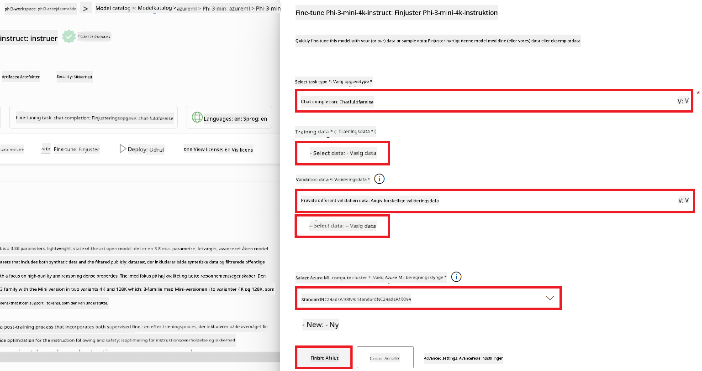

    > [!TIP]
    >
    > Du kan vælge **Advanced settings** for at tilpasse indstillinger som **learning_rate** og **lr_scheduler_type** for at optimere finjusteringsprocessen efter dine behov.

1. Vælg **Finish**.

1. I denne øvelse har du med succes finjusteret Phi-3 modellen ved hjælp af Azure Machine Learning. Bemærk, at finjusteringsprocessen kan tage en del tid. Efter at have startet finjusteringsjobbet, skal du vente på, at det bliver færdigt. Du kan følge status for finjusteringsjobbet ved at gå til fanen Jobs i venstre side af dit Azure Machine Learning Workspace. I næste serie vil du deployere den finjusterede model og integrere den med Prompt flow.

    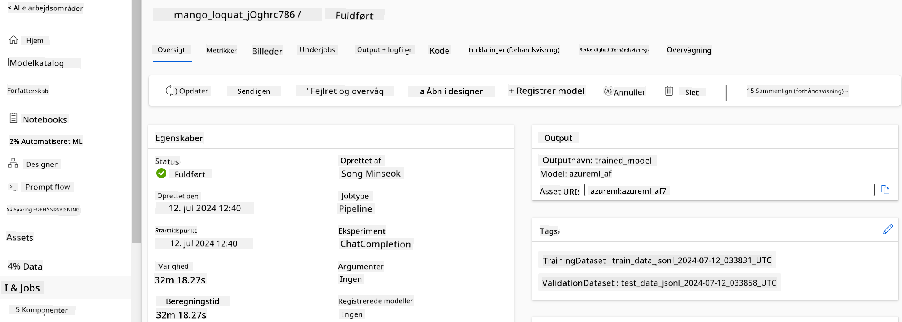

### Deployér den finjusterede Phi-3 model

For at integrere den finjusterede Phi-3 model med Prompt flow, skal du deployere modellen, så den er tilgængelig til realtidsinference. Denne proces involverer registrering af modellen, oprettelse af en online endpoint og deployment af modellen.

I denne øvelse vil du:

- Registrere den finjusterede model i Azure Machine Learning workspace.
- Oprette en online endpoint.
- Deployere den registrerede finjusterede Phi-3 model.

#### Registrer den finjusterede model

1. Besøg [Azure ML Studio](https://ml.azure.com/home?wt.mc_id=studentamb_279723).

1. Vælg det Azure Machine Learning workspace, du har oprettet.

    

1. Vælg **Models** i venstre sidepanel.
1. Vælg **+ Register**.
1. Vælg **From a job output**.

    

1. Vælg det job, du har oprettet.

    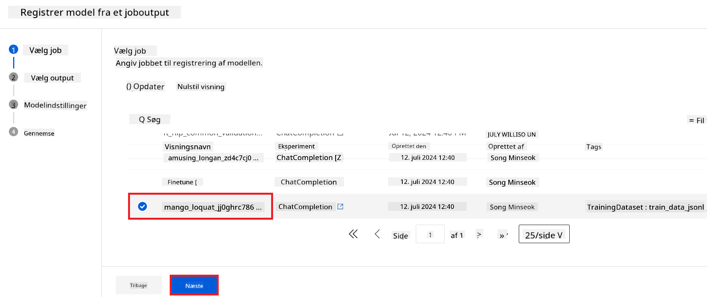

1. Vælg **Next**.

1. Vælg **Model type** til **MLflow**.

1. Sørg for, at **Job output** er valgt; det burde være valgt automatisk.

    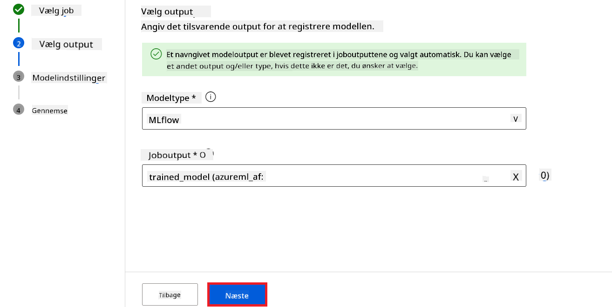

2. Vælg **Next**.

3. Vælg **Register**.

    

4. Du kan se din registrerede model ved at gå til menuen **Models** i venstre sidepanel.

    

#### Deployér den finjusterede model

1. Gå til det Azure Machine Learning workspace, du har oprettet.

1. Vælg **Endpoints** i venstre sidepanel.

1. Vælg **Real-time endpoints** i navigationsmenuen.

    

1. Vælg **Create**.

1. Vælg den registrerede model, du har oprettet.

    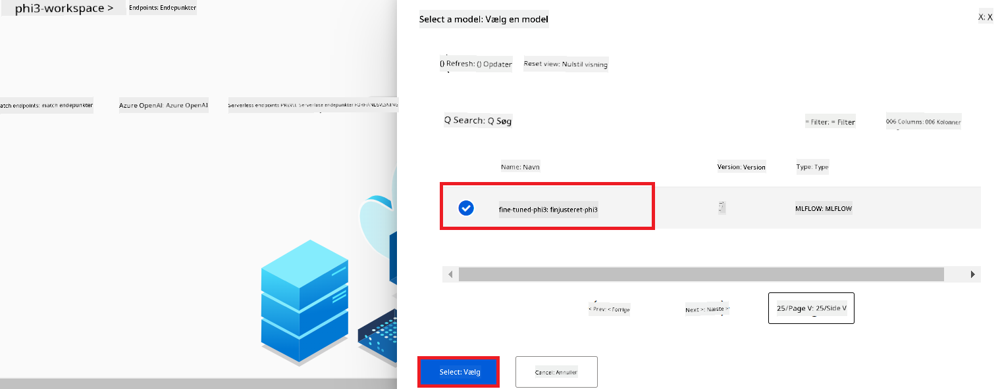

1. Vælg **Select**.

1. Udfør følgende opgaver:

    - Vælg **Virtual machine** til *Standard_NC6s_v3*.
    - Vælg det antal instanser, du ønsker at bruge. For eksempel *1*.
    - Vælg **Endpoint** til **New** for at oprette en endpoint.
    - Indtast **Endpoint name**. Det skal være et unikt navn.
    - Indtast **Deployment name**. Det skal være et unikt navn.

    

1. Vælg **Deploy**.

> [!WARNING]
> For at undgå ekstra omkostninger på din konto, skal du huske at slette den oprettede endpoint i Azure Machine Learning workspace.
>

#### Tjek deploymentsstatus i Azure Machine Learning Workspace

1. Gå til det Azure Machine Learning workspace, du har oprettet.

1. Vælg **Endpoints** i venstre sidepanel.

1. Vælg den endpoint, du har oprettet.

    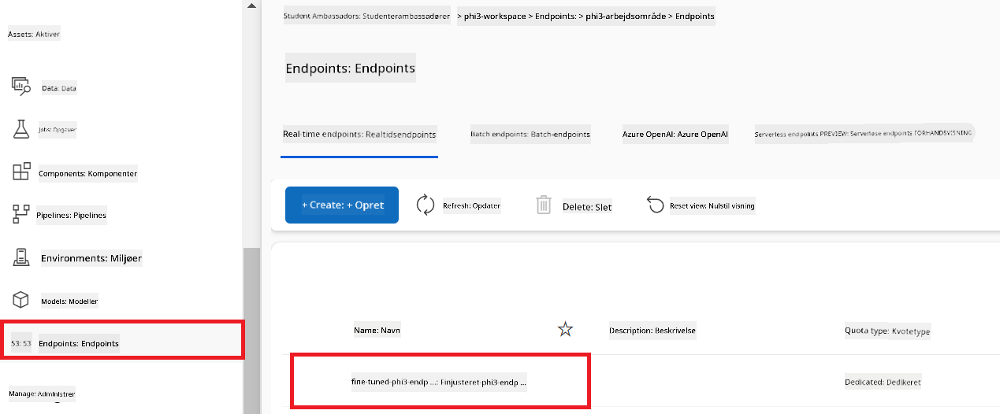

1. På denne side kan du administrere endpoints under deploymentsprocessen.

> [!NOTE]
> Når deployment er færdig, skal du sikre dig, at **Live traffic** er sat til **100%**. Hvis ikke, vælg **Update traffic** for at justere trafikindstillingerne. Bemærk, at du ikke kan teste modellen, hvis trafikken er sat til 0%.
>
> 
>

## Scenario 3: Integrer med Prompt flow og chat med din tilpassede model i Azure AI Foundry

### Integrer den tilpassede Phi-3 model med Prompt flow

Efter du har deployeret din finjusterede model, kan du nu integrere den med Prompt Flow for at bruge din model i realtidsapplikationer, hvilket muliggør en række interaktive opgaver med din tilpassede Phi-3 model.

I denne øvelse vil du:

- Oprette Azure AI Foundry Hub.
- Oprette Azure AI Foundry Project.
- Oprette Prompt flow.
- Tilføje en brugerdefineret forbindelse til den finjusterede Phi-3 model.
- Sætte Prompt flow op til at chatte med din tilpassede Phi-3 model.
> [!NOTE]
> Du kan også integrere med Promptflow ved hjælp af Azure ML Studio. Den samme integrationsproces kan anvendes i Azure ML Studio.
#### Opret Azure AI Foundry Hub

Du skal oprette en Hub, før du opretter Projektet. En Hub fungerer som en Resource Group, der giver dig mulighed for at organisere og administrere flere Projekter inden for Azure AI Foundry.

1. Besøg [Azure AI Foundry](https://ai.azure.com/?WT.mc_id=aiml-137032-kinfeylo).

1. Vælg **All hubs** i venstre sidepanel.

1. Vælg **+ New hub** i navigationsmenuen.

    

1. Udfør følgende opgaver:

    - Indtast **Hub name**. Det skal være en unik værdi.
    - Vælg dit Azure **Subscription**.
    - Vælg den **Resource group**, der skal bruges (opret en ny, hvis nødvendigt).
    - Vælg den **Location**, du ønsker at bruge.
    - Vælg **Connect Azure AI Services** der skal bruges (opret en ny, hvis nødvendigt).
    - Vælg **Connect Azure AI Search** og vælg **Skip connecting**.

    

1. Vælg **Next**.

#### Opret Azure AI Foundry Projekt

1. I den Hub, du oprettede, vælg **All projects** i venstre sidepanel.

1. Vælg **+ New project** i navigationsmenuen.

    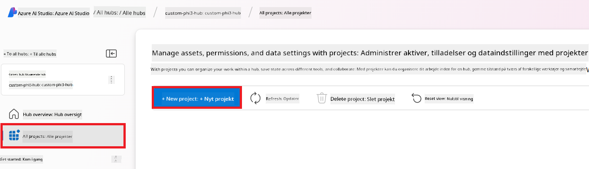

1. Indtast **Project name**. Det skal være en unik værdi.

    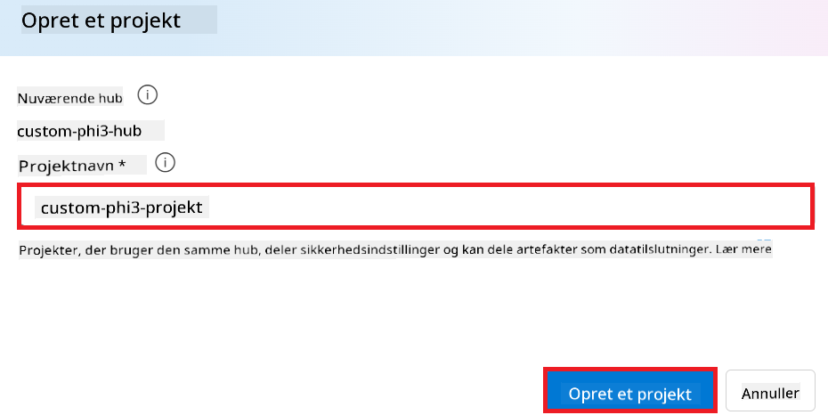

1. Vælg **Create a project**.

#### Tilføj en brugerdefineret forbindelse til den finjusterede Phi-3 model

For at integrere din brugerdefinerede Phi-3 model med Prompt flow, skal du gemme modellens endpoint og nøgle i en brugerdefineret forbindelse. Denne opsætning sikrer adgang til din brugerdefinerede Phi-3 model i Prompt flow.

#### Indstil api-nøgle og endpoint-uri for den finjusterede Phi-3 model

1. Besøg [Azure ML Studio](https://ml.azure.com/home?WT.mc_id=aiml-137032-kinfeylo).

1. Naviger til det Azure Machine learning workspace, du oprettede.

1. Vælg **Endpoints** i venstre sidepanel.

    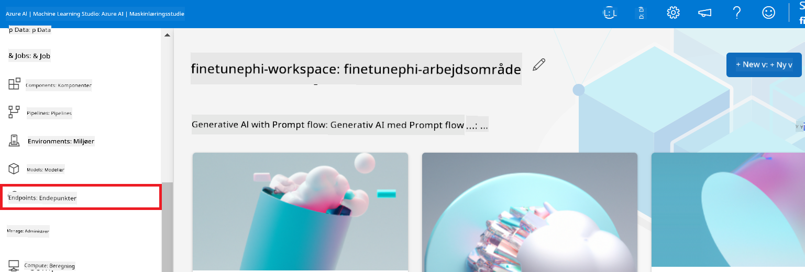

1. Vælg det endpoint, du oprettede.

    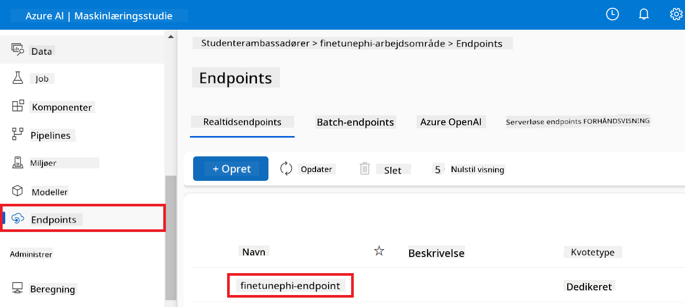

1. Vælg **Consume** i navigationsmenuen.

1. Kopiér dit **REST endpoint** og din **Primary key**.

    

#### Tilføj den brugerdefinerede forbindelse

1. Besøg [Azure AI Foundry](https://ai.azure.com/?WT.mc_id=aiml-137032-kinfeylo).

1. Naviger til det Azure AI Foundry projekt, du oprettede.

1. I det Projekt, du oprettede, vælg **Settings** i venstre sidepanel.

1. Vælg **+ New connection**.

    

1. Vælg **Custom keys** i navigationsmenuen.

    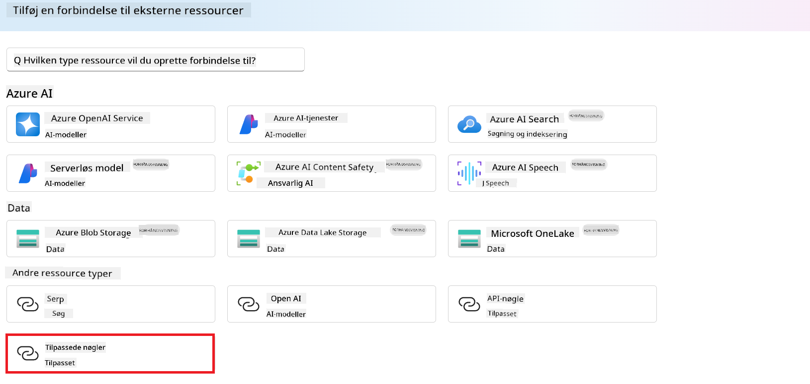

1. Udfør følgende opgaver:

    - Vælg **+ Add key value pairs**.
    - For nøglens navn, indtast **endpoint** og indsæt det endpoint, du kopierede fra Azure ML Studio, i værdifeltet.
    - Vælg **+ Add key value pairs** igen.
    - For nøglens navn, indtast **key** og indsæt den nøgle, du kopierede fra Azure ML Studio, i værdifeltet.
    - Efter at have tilføjet nøglerne, vælg **is secret** for at forhindre, at nøglen bliver synlig.

    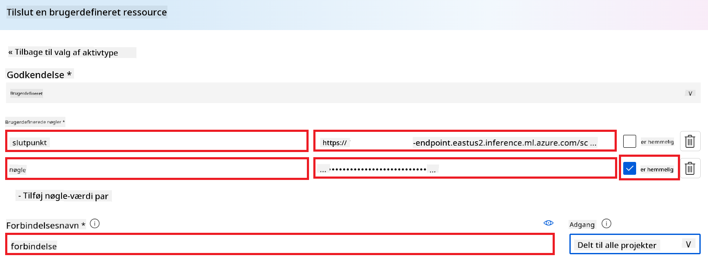

1. Vælg **Add connection**.

#### Opret Prompt flow

Du har tilføjet en brugerdefineret forbindelse i Azure AI Foundry. Lad os nu oprette en Prompt flow ved at følge nedenstående trin. Derefter vil du forbinde denne Prompt flow til den brugerdefinerede forbindelse, så du kan bruge den finjusterede model i Prompt flow.

1. Naviger til det Azure AI Foundry projekt, du oprettede.

1. Vælg **Prompt flow** i venstre sidepanel.

1. Vælg **+ Create** i navigationsmenuen.

    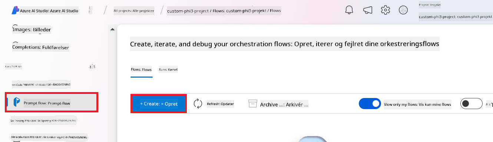

1. Vælg **Chat flow** i navigationsmenuen.

    

1. Indtast **Folder name**, som du vil bruge.

    

2. Vælg **Create**.

#### Opsæt Prompt flow til at chatte med din brugerdefinerede Phi-3 model

Du skal integrere den finjusterede Phi-3 model i en Prompt flow. Den eksisterende Prompt flow, der leveres, er dog ikke designet til dette formål. Derfor skal du redesigne Prompt flow for at muliggøre integrationen af den brugerdefinerede model.

1. I Prompt flow, udfør følgende opgaver for at genopbygge den eksisterende flow:

    - Vælg **Raw file mode**.
    - Slet al eksisterende kode i *flow.dag.yml* filen.
    - Tilføj følgende kode til *flow.dag.yml* filen.

        ```yml
        inputs:
          input_data:
            type: string
            default: "Who founded Microsoft?"

        outputs:
          answer:
            type: string
            reference: ${integrate_with_promptflow.output}

        nodes:
        - name: integrate_with_promptflow
          type: python
          source:
            type: code
            path: integrate_with_promptflow.py
          inputs:
            input_data: ${inputs.input_data}
        ```

    - Vælg **Save**.

    

1. Tilføj følgende kode til *integrate_with_promptflow.py* filen for at bruge den brugerdefinerede Phi-3 model i Prompt flow.

    ```python
    import logging
    import requests
    from promptflow import tool
    from promptflow.connections import CustomConnection

    # Logging setup
    logging.basicConfig(
        format="%(asctime)s - %(levelname)s - %(name)s - %(message)s",
        datefmt="%Y-%m-%d %H:%M:%S",
        level=logging.DEBUG
    )
    logger = logging.getLogger(__name__)

    def query_phi3_model(input_data: str, connection: CustomConnection) -> str:
        """
        Send a request to the Phi-3 model endpoint with the given input data using Custom Connection.
        """

        # "connection" is the name of the Custom Connection, "endpoint", "key" are the keys in the Custom Connection
        endpoint_url = connection.endpoint
        api_key = connection.key

        headers = {
            "Content-Type": "application/json",
            "Authorization": f"Bearer {api_key}"
        }
        data = {
            "input_data": {
                "input_string": [
                    {"role": "user", "content": input_data}
                ],
                "parameters": {
                    "temperature": 0.7,
                    "max_new_tokens": 128
                }
            }
        }
        try:
            response = requests.post(endpoint_url, json=data, headers=headers)
            response.raise_for_status()
            
            # Log the full JSON response
            logger.debug(f"Full JSON response: {response.json()}")

            result = response.json()["output"]
            logger.info("Successfully received response from Azure ML Endpoint.")
            return result
        except requests.exceptions.RequestException as e:
            logger.error(f"Error querying Azure ML Endpoint: {e}")
            raise

    @tool
    def my_python_tool(input_data: str, connection: CustomConnection) -> str:
        """
        Tool function to process input data and query the Phi-3 model.
        """
        return query_phi3_model(input_data, connection)

    ```

    

> [!NOTE]
> For mere detaljeret information om brug af Prompt flow i Azure AI Foundry, kan du se [Prompt flow in Azure AI Foundry](https://learn.microsoft.com/azure/ai-studio/how-to/prompt-flow).

1. Vælg **Chat input**, **Chat output** for at aktivere chat med din model.

    

1. Nu er du klar til at chatte med din brugerdefinerede Phi-3 model. I den næste øvelse vil du lære, hvordan du starter Prompt flow og bruger det til at chatte med din finjusterede Phi-3 model.

> [!NOTE]
>
> Den genopbyggede flow skulle se ud som billedet nedenfor:
>
> 
>

### Chat med din brugerdefinerede Phi-3 model

Nu hvor du har finjusteret og integreret din brugerdefinerede Phi-3 model med Prompt flow, er du klar til at begynde at interagere med den. Denne øvelse guider dig gennem processen med at opsætte og starte en chat med din model ved hjælp af Prompt flow. Ved at følge disse trin vil du kunne udnytte din finjusterede Phi-3 models fulde potentiale til forskellige opgaver og samtaler.

- Chat med din brugerdefinerede Phi-3 model ved hjælp af Prompt flow.

#### Start Prompt flow

1. Vælg **Start compute sessions** for at starte Prompt flow.

    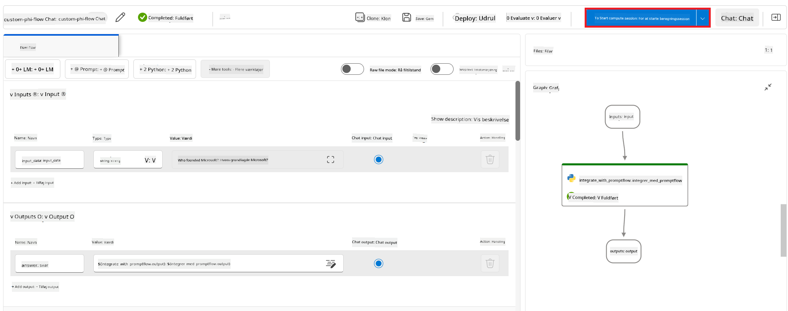

1. Vælg **Validate and parse input** for at opdatere parametrene.

    

1. Vælg **Value** for **connection** til den brugerdefinerede forbindelse, du oprettede. For eksempel *connection*.

    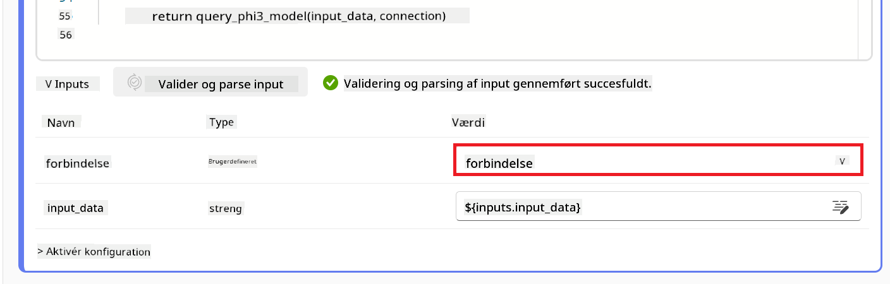

#### Chat med din brugerdefinerede model

1. Vælg **Chat**.

    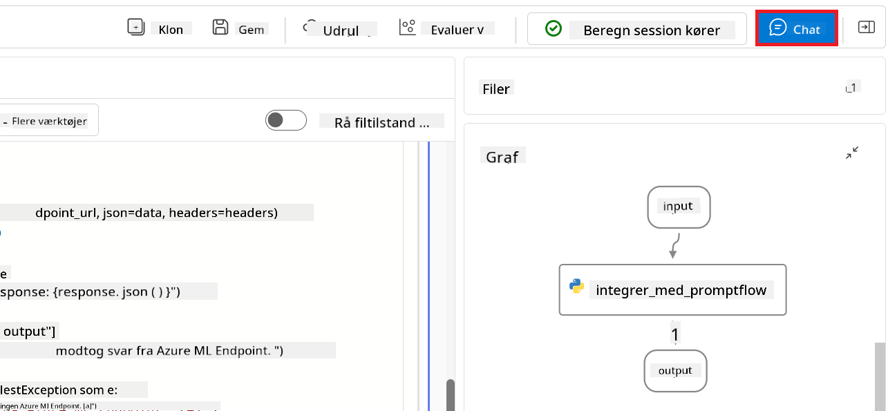

1. Her er et eksempel på resultaterne: Nu kan du chatte med din brugerdefinerede Phi-3 model. Det anbefales at stille spørgsmål baseret på de data, der blev brugt til finjusteringen.

    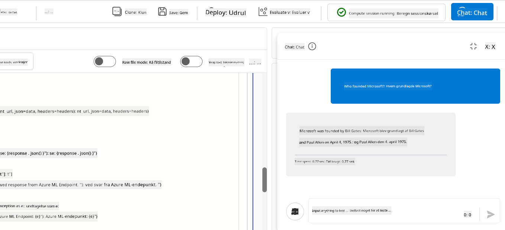

**Ansvarsfraskrivelse**:  
Dette dokument er blevet oversat ved hjælp af AI-oversættelsestjenesten [Co-op Translator](https://github.com/Azure/co-op-translator). Selvom vi bestræber os på nøjagtighed, bedes du være opmærksom på, at automatiserede oversættelser kan indeholde fejl eller unøjagtigheder. Det oprindelige dokument på dets oprindelige sprog bør betragtes som den autoritative kilde. For kritisk information anbefales professionel menneskelig oversættelse. Vi påtager os intet ansvar for misforståelser eller fejltolkninger, der opstår som følge af brugen af denne oversættelse.