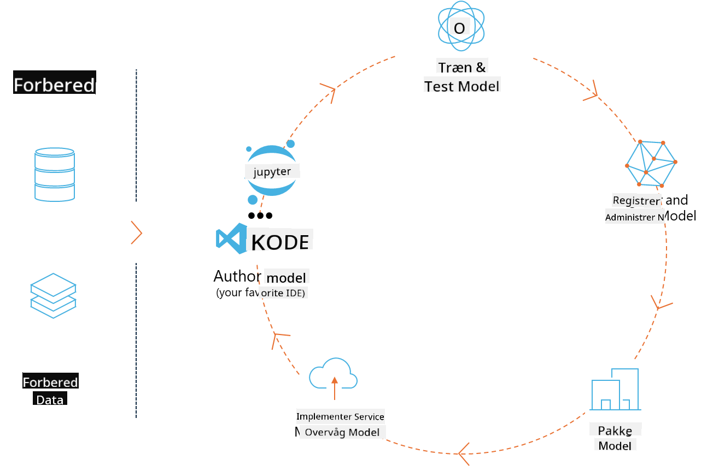
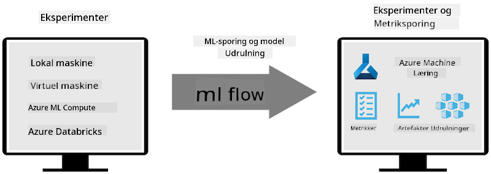
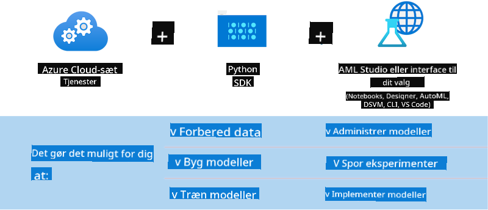

<!--
CO_OP_TRANSLATOR_METADATA:
{
  "original_hash": "f61c383bbf0c3dac97e43f833c258731",
  "translation_date": "2025-05-09T18:37:54+00:00",
  "source_file": "md/02.Application/01.TextAndChat/Phi3/E2E_Phi-3-MLflow.md",
  "language_code": "da"
}
-->
# MLflow

[MLflow](https://mlflow.org/) er en open source-platform designet til at håndtere hele livscyklussen for maskinlæring.



MLFlow bruges til at styre ML-livscyklussen, herunder eksperimenter, reproducerbarhed, udrulning og et centralt modelregister. MLflow tilbyder i øjeblikket fire komponenter.

- **MLflow Tracking:** Registrer og forespørg på eksperimenter, kode, data-konfiguration og resultater.
- **MLflow Projects:** Pak data science-kode ind i et format, der kan reproducere kørsel på enhver platform.
- **Mlflow Models:** Udrul maskinlæringsmodeller i forskellige serveringsmiljøer.
- **Model Registry:** Gem, annoter og administrer modeller i et centralt arkiv.

Det inkluderer funktioner til at spore eksperimenter, pakke kode til reproducerbare kørsel og dele og udrulle modeller. MLFlow er integreret i Databricks og understøtter en række ML-biblioteker, hvilket gør det bibliotek-agnostisk. Det kan bruges med ethvert maskinlæringsbibliotek og i ethvert programmeringssprog, da det tilbyder en REST API og CLI for nemheds skyld.



Nøglefunktioner i MLFlow inkluderer:

- **Experiment Tracking:** Registrer og sammenlign parametre og resultater.
- **Model Management:** Udrul modeller til forskellige serverings- og inferensplatforme.
- **Model Registry:** Samarbejd om at administrere livscyklussen for MLflow Models, inklusiv versionering og annotationer.
- **Projects:** Pak ML-kode til deling eller produktion.
MLFlow understøtter også MLOps-løkken, som inkluderer forberedelse af data, registrering og styring af modeller, pakning af modeller til eksekvering, udrulning af services og overvågning af modeller. Det har til formål at forenkle processen med at gå fra prototype til produktionsworkflow, især i cloud- og edge-miljøer.

## E2E Scenario - Bygning af en wrapper og brug af Phi-3 som en MLFlow-model

I dette E2E-eksempel vil vi demonstrere to forskellige tilgange til at bygge en wrapper omkring Phi-3 lille sprogmodel (SLM) og derefter køre den som en MLFlow-model enten lokalt eller i skyen, f.eks. i Azure Machine Learning workspace.



| Projekt | Beskrivelse | Placering |
| ------------ | ----------- | -------- |
| Transformer Pipeline | Transformer Pipeline er den nemmeste mulighed for at bygge en wrapper, hvis du vil bruge en HuggingFace-model med MLFlow’s eksperimentelle transformers-flavour. | [**TransformerPipeline.ipynb**](../../../../../../code/06.E2E/E2E_Phi-3-MLflow_TransformerPipeline.ipynb) |
| Custom Python Wrapper | På tidspunktet for skrivningen understøttede transformer pipeline ikke MLFlow-wrapper-generering for HuggingFace-modeller i ONNX-format, selv med den eksperimentelle optimum Python-pakke. Til sådanne tilfælde kan du bygge din egen custom Python-wrapper til MLFlow-mode | [**CustomPythonWrapper.ipynb**](../../../../../../code/06.E2E/E2E_Phi-3-MLflow_CustomPythonWrapper.ipynb) |

## Projekt: Transformer Pipeline

1. Du skal bruge relevante Python-pakker fra MLFlow og HuggingFace:

    ``` Python
    import mlflow
    import transformers
    ```

2. Dernæst skal du initialisere en transformer pipeline ved at referere til den ønskede Phi-3-model i HuggingFace-registret. Som det kan ses på modelkortet for _Phi-3-mini-4k-instruct_, er dens opgave af typen “Text Generation”:

    ``` Python
    pipeline = transformers.pipeline(
        task = "text-generation",
        model = "microsoft/Phi-3-mini-4k-instruct"
    )
    ```

3. Nu kan du gemme din Phi-3 models transformer pipeline i MLFlow-format og angive yderligere detaljer som mål for artefaktstien, specifikke modelkonfigurationsindstillinger og inferens-API-type:

    ``` Python
    model_info = mlflow.transformers.log_model(
        transformers_model = pipeline,
        artifact_path = "phi3-mlflow-model",
        model_config = model_config,
        task = "llm/v1/chat"
    )
    ```

## Projekt: Custom Python Wrapper

1. Her kan vi bruge Microsofts [ONNX Runtime generate() API](https://github.com/microsoft/onnxruntime-genai) til inferens og token-encoding/-decoding af ONNX-modellen. Du skal vælge _onnxruntime_genai_-pakken til din målcompute, i eksemplet nedenfor er CPU valgt:

    ``` Python
    import mlflow
    from mlflow.models import infer_signature
    import onnxruntime_genai as og
    ```

1. Vores custom klasse implementerer to metoder: _load_context()_ til at initialisere **ONNX-modellen** af Phi-3 Mini 4K Instruct, **generatorparametre** og **tokenizer**; og _predict()_ til at generere outputtokens for den givne prompt:

    ``` Python
    class Phi3Model(mlflow.pyfunc.PythonModel):
        def load_context(self, context):
            # Retrieving model from the artifacts
            model_path = context.artifacts["phi3-mini-onnx"]
            model_options = {
                 "max_length": 300,
                 "temperature": 0.2,         
            }
        
            # Defining the model
            self.phi3_model = og.Model(model_path)
            self.params = og.GeneratorParams(self.phi3_model)
            self.params.set_search_options(**model_options)
            
            # Defining the tokenizer
            self.tokenizer = og.Tokenizer(self.phi3_model)
    
        def predict(self, context, model_input):
            # Retrieving prompt from the input
            prompt = model_input["prompt"][0]
            self.params.input_ids = self.tokenizer.encode(prompt)
    
            # Generating the model's response
            response = self.phi3_model.generate(self.params)
    
            return self.tokenizer.decode(response[0][len(self.params.input_ids):])
    ```

1. Du kan nu bruge funktionen _mlflow.pyfunc.log_model()_ til at generere en custom Python-wrapper (i pickle-format) til Phi-3-modellen, sammen med den originale ONNX-model og nødvendige afhængigheder:

    ``` Python
    model_info = mlflow.pyfunc.log_model(
        artifact_path = artifact_path,
        python_model = Phi3Model(),
        artifacts = {
            "phi3-mini-onnx": "cpu_and_mobile/cpu-int4-rtn-block-32-acc-level-4",
        },
        input_example = input_example,
        signature = infer_signature(input_example, ["Run"]),
        extra_pip_requirements = ["torch", "onnxruntime_genai", "numpy"],
    )
    ```

## Signaturer for genererede MLFlow-modeller

1. I trin 3 i Transformer Pipeline-projektet ovenfor satte vi MLFlow-modellens opgave til “_llm/v1/chat_”. En sådan instruktion genererer en models API-wrapper, kompatibel med OpenAI’s Chat API som vist nedenfor:

    ``` Python
    {inputs: 
      ['messages': Array({content: string (required), name: string (optional), role: string (required)}) (required), 'temperature': double (optional), 'max_tokens': long (optional), 'stop': Array(string) (optional), 'n': long (optional), 'stream': boolean (optional)],
    outputs: 
      ['id': string (required), 'object': string (required), 'created': long (required), 'model': string (required), 'choices': Array({finish_reason: string (required), index: long (required), message: {content: string (required), name: string (optional), role: string (required)} (required)}) (required), 'usage': {completion_tokens: long (required), prompt_tokens: long (required), total_tokens: long (required)} (required)],
    params: 
      None}
    ```

1. Som resultat kan du indsende din prompt i følgende format:

    ``` Python
    messages = [{"role": "user", "content": "What is the capital of Spain?"}]
    ```

1. Derefter kan du bruge OpenAI API-kompatibel efterbehandling, f.eks. _response[0][‘choices’][0][‘message’][‘content’]_, til at gøre output mere læsbart som dette:

    ``` JSON
    Question: What is the capital of Spain?
    
    Answer: The capital of Spain is Madrid. It is the largest city in Spain and serves as the political, economic, and cultural center of the country. Madrid is located in the center of the Iberian Peninsula and is known for its rich history, art, and architecture, including the Royal Palace, the Prado Museum, and the Plaza Mayor.
    
    Usage: {'prompt_tokens': 11, 'completion_tokens': 73, 'total_tokens': 84}
    ```

1. I trin 3 i Custom Python Wrapper-projektet ovenfor tillader vi MLFlow-pakken at generere modellens signatur ud fra et givet inputeksempel. Vores MLFlow-wrapper-signatur vil se således ud:

    ``` Python
    {inputs: 
      ['prompt': string (required)],
    outputs: 
      [string (required)],
    params: 
      None}
    ```

1. Så vores prompt skal indeholde en "prompt"-nøgle i dictionary-format, lignende dette:

    ``` Python
    {"prompt": "<|system|>You are a stand-up comedian.<|end|><|user|>Tell me a joke about atom<|end|><|assistant|>",}
    ```

1. Modellens output vil derefter blive leveret som en streng:

    ``` JSON
    Alright, here's a little atom-related joke for you!
    
    Why don't electrons ever play hide and seek with protons?
    
    Because good luck finding them when they're always "sharing" their electrons!
    
    Remember, this is all in good fun, and we're just having a little atomic-level humor!
    ```

**Ansvarsfraskrivelse**:  
Dette dokument er blevet oversat ved hjælp af AI-oversættelsestjenesten [Co-op Translator](https://github.com/Azure/co-op-translator). Selvom vi bestræber os på nøjagtighed, skal du være opmærksom på, at automatiserede oversættelser kan indeholde fejl eller unøjagtigheder. Det oprindelige dokument på dets modersmål bør betragtes som den autoritative kilde. For kritisk information anbefales professionel menneskelig oversættelse. Vi påtager os intet ansvar for eventuelle misforståelser eller fejltolkninger, der opstår som følge af brugen af denne oversættelse.