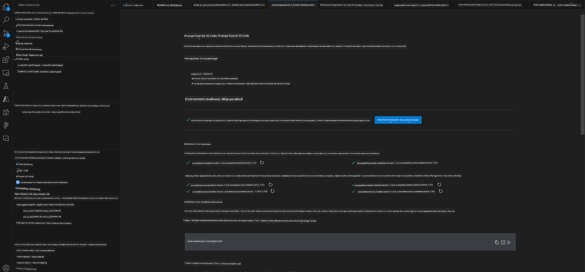
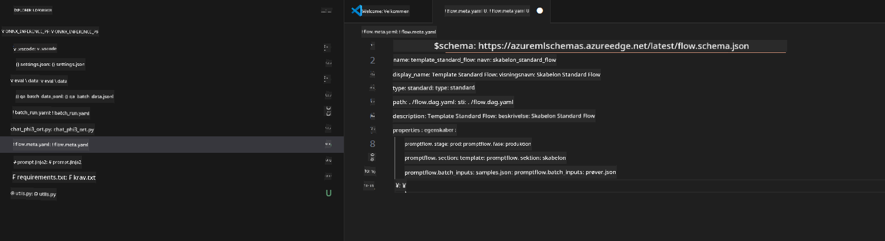
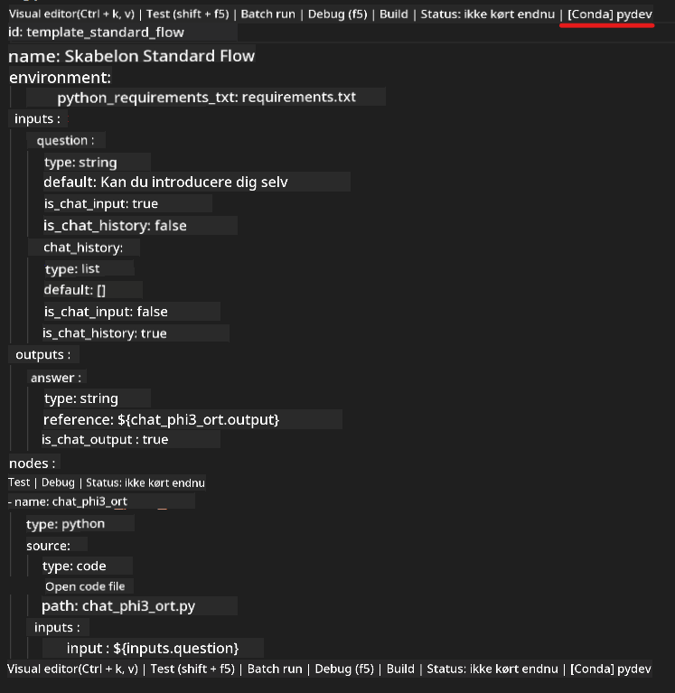
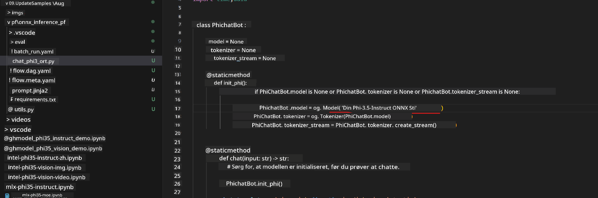
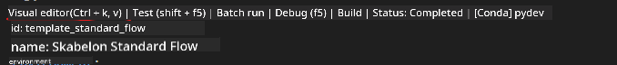
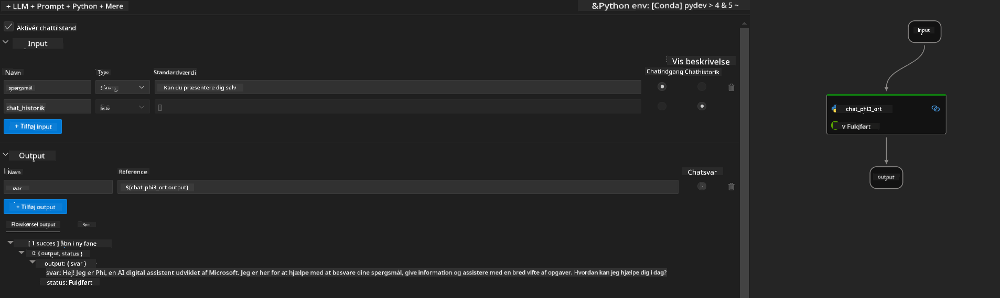
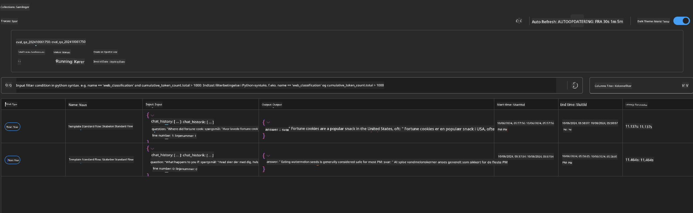

<!--
CO_OP_TRANSLATOR_METADATA:
{
  "original_hash": "92e7dac1e5af0dd7c94170fdaf6860fe",
  "translation_date": "2025-05-09T18:53:21+00:00",
  "source_file": "md/02.Application/01.TextAndChat/Phi3/UsingPromptFlowWithONNX.md",
  "language_code": "da"
}
-->
# Brug af Windows GPU til at skabe Prompt flow-løsning med Phi-3.5-Instruct ONNX

Dette dokument er et eksempel på, hvordan man bruger PromptFlow med ONNX (Open Neural Network Exchange) til udvikling af AI-applikationer baseret på Phi-3-modeller.

PromptFlow er en samling udviklingsværktøjer designet til at strømline hele udviklingscyklussen for LLM-baserede (Large Language Model) AI-applikationer, fra idéudvikling og prototyping til test og evaluering.

Ved at integrere PromptFlow med ONNX kan udviklere:

- Optimere modelydelse: Udnyt ONNX til effektiv modelinference og implementering.
- Forenkle udvikling: Brug PromptFlow til at styre workflow og automatisere gentagne opgaver.
- Forbedre samarbejde: Fremme bedre samarbejde blandt teammedlemmer ved at tilbyde et samlet udviklingsmiljø.

**Prompt flow** er en samling udviklingsværktøjer designet til at strømline hele udviklingscyklussen for LLM-baserede AI-applikationer, fra idéudvikling, prototyping, test, evaluering til produktionsimplementering og overvågning. Det gør prompt engineering meget nemmere og giver dig mulighed for at bygge LLM-apps med produktionskvalitet.

Prompt flow kan forbindes til OpenAI, Azure OpenAI Service og tilpassede modeller (Huggingface, lokale LLM/SLM). Vi håber at implementere Phi-3.5's kvantiserede ONNX-model til lokale applikationer. Prompt flow kan hjælpe os med bedre at planlægge vores forretning og færdiggøre lokale løsninger baseret på Phi-3.5. I dette eksempel vil vi kombinere ONNX Runtime GenAI Library for at færdiggøre Prompt flow-løsningen baseret på Windows GPU.

## **Installation**

### **ONNX Runtime GenAI for Windows GPU**

Læs denne vejledning for at sætte ONNX Runtime GenAI op til Windows GPU [klik her](./ORTWindowGPUGuideline.md)

### **Opsæt Prompt flow i VSCode**

1. Installer Prompt flow VS Code Extension


2. Efter installation af Prompt flow VS Code Extension, klik på udvidelsen og vælg **Installation dependencies** følg denne vejledning for at installere Prompt flow SDK i dit miljø



3. Download [Sample Code](../../../../../../code/09.UpdateSamples/Aug/pf/onnx_inference_pf) og brug VS Code til at åbne dette eksempel



4. Åbn **flow.dag.yaml** for at vælge dit Python-miljø



   Åbn **chat_phi3_ort.py** for at ændre placeringen af din Phi-3.5-instruct ONNX-model



5. Kør din prompt flow til test

Åbn **flow.dag.yaml** og klik på visual editor



efter klik, kør den for at teste



1. Du kan køre batch i terminalen for at tjekke flere resultater


```bash

pf run create --file batch_run.yaml --stream --name 'Your eval qa name'    

```

Du kan se resultaterne i din standardbrowser




**Ansvarsfraskrivelse**:  
Dette dokument er oversat ved hjælp af AI-oversættelsestjenesten [Co-op Translator](https://github.com/Azure/co-op-translator). Selvom vi bestræber os på nøjagtighed, bedes du være opmærksom på, at automatiserede oversættelser kan indeholde fejl eller unøjagtigheder. Det oprindelige dokument på dets modersmål bør betragtes som den autoritative kilde. For kritisk information anbefales professionel menneskelig oversættelse. Vi påtager os intet ansvar for misforståelser eller fejltolkninger, der måtte opstå som følge af brugen af denne oversættelse.