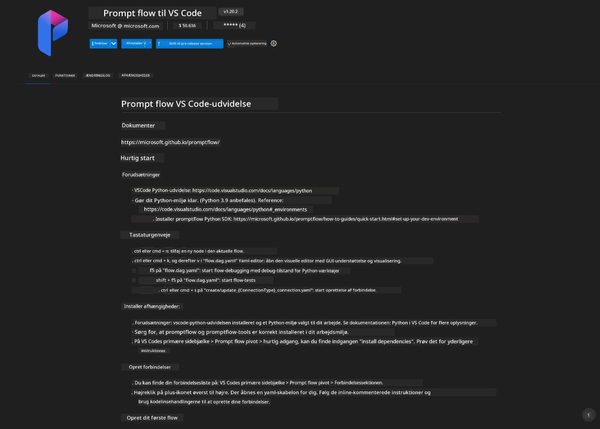
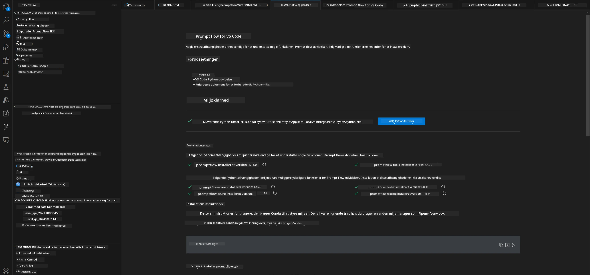
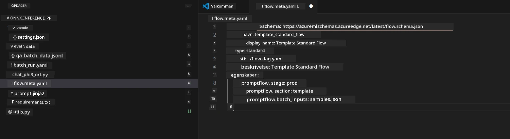
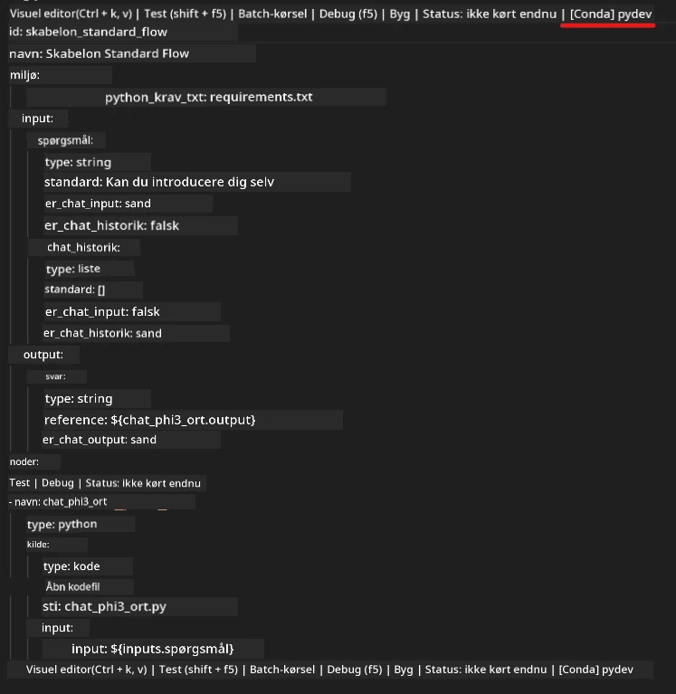
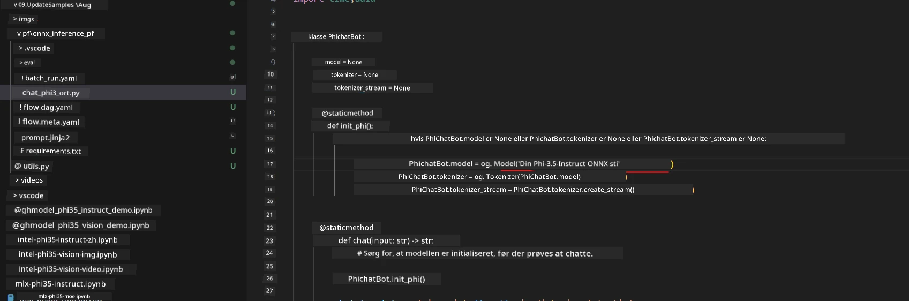
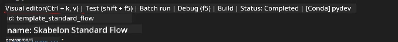
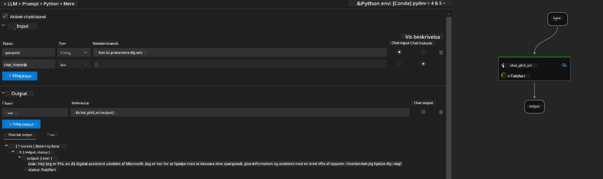
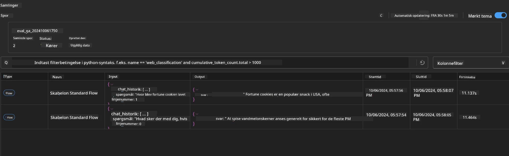

# Brug af Windows GPU til at oprette Prompt flow-løsning med Phi-3.5-Instruct ONNX 

Følgende dokument er et eksempel på, hvordan man bruger PromptFlow med ONNX (Open Neural Network Exchange) til at udvikle AI-applikationer baseret på Phi-3 modeller.

PromptFlow er et sæt udviklingsværktøjer designet til at strømline den end-to-end udviklingscyklus for LLM-baserede (Large Language Model) AI-applikationer, fra idéudvikling og prototyping til test og evaluering.

Ved at integrere PromptFlow med ONNX kan udviklere:

- Optimere modelydelse: Udnyt ONNX til effektiv model inference og implementering.
- Forenkle udvikling: Brug PromptFlow til at styre workflowet og automatisere gentagne opgaver.
- Forbedre samarbejde: Lettere samarbejde mellem teammedlemmer ved at tilbyde et ensartet udviklingsmiljø.

**Prompt flow** er et sæt udviklingsværktøjer designet til at strømline den end-to-end udviklingscyklus for LLM-baserede AI-applikationer, fra idéudvikling, prototyping, test, evaluering til produktionsimplementering og overvågning. Det gør prompt engineering meget nemmere og gør det muligt at bygge LLM-apps med produktionskvalitet.

Prompt flow kan forbinde til OpenAI, Azure OpenAI Service og tilpassede modeller (Huggingface, lokale LLM/SLM). Vi håber at implementere Phi-3.5's kvantiserede ONNX-model til lokale applikationer. Prompt flow kan hjælpe os med bedre at planlægge vores forretning og fuldføre lokale løsninger baseret på Phi-3.5. I dette eksempel kombinerer vi ONNX Runtime GenAI Library for at fuldføre Prompt flow-løsningen baseret på Windows GPU.

## **Installation**

### **ONNX Runtime GenAI til Windows GPU**

Læs denne vejledning for at sætte ONNX Runtime GenAI til Windows GPU  [klik her](./ORTWindowGPUGuideline.md)

### **Opsæt Prompt flow i VSCode**

1. Installer Prompt flow VS Code Extension



2. Efter installation af Prompt flow VS Code Extension, klik på udvidelsen og vælg **Installation dependencies** følg denne vejledning for at installere Prompt flow SDK i dit miljø



3. Download [Sample Code](../../../../../../code/09.UpdateSamples/Aug/pf/onnx_inference_pf) og brug VS Code til at åbne dette eksempel



4. Åbn **flow.dag.yaml** for at vælge dit Python-miljø



   Åbn **chat_phi3_ort.py** for at ændre din Phi-3.5-instruct ONNX Model placering



5. Kør din prompt flow for at teste

Åbn **flow.dag.yaml** klik på visual editor



Efter at have klikket på dette, kør det for at teste



1. Du kan køre batch i terminalen for at se flere resultater


```bash

pf run create --file batch_run.yaml --stream --name 'Your eval qa name'    

```

Du kan se resultater i din standardbrowser




---

<!-- CO-OP TRANSLATOR DISCLAIMER START -->
**Ansvarsfraskrivelse**:
Dette dokument er blevet oversat ved hjælp af AI-oversættelsestjenesten [Co-op Translator](https://github.com/Azure/co-op-translator). Selvom vi bestræber os på nøjagtighed, skal du være opmærksom på, at automatiserede oversættelser kan indeholde fejl eller unøjagtigheder. Det originale dokument på dets oprindelige sprog bør betragtes som den autoritative kilde. For kritisk information anbefales professionel menneskelig oversættelse. Vi påtager os intet ansvar for misforståelser eller fejltolkninger, der opstår som følge af brugen af denne oversættelse.
<!-- CO-OP TRANSLATOR DISCLAIMER END -->