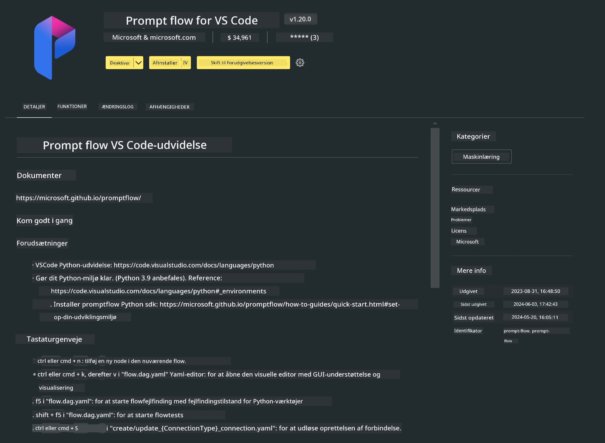

<!--
CO_OP_TRANSLATOR_METADATA:
{
  "original_hash": "a4ef39027902e82f2c33d568d2a2259a",
  "translation_date": "2025-07-17T03:50:56+00:00",
  "source_file": "md/02.Application/02.Code/Phi3/VSCodeExt/HOL/AIPC/01.Installations.md",
  "language_code": "da"
}
-->
# **Lab 0 - Installation**

Når vi går ind i laboratoriet, skal vi konfigurere det relevante miljø:


### **1. Python 3.11+**

Det anbefales at bruge miniforge til at konfigurere dit Python-miljø

For at konfigurere miniforge, se venligst [https://github.com/conda-forge/miniforge](https://github.com/conda-forge/miniforge)

Efter konfiguration af miniforge, kør følgende kommando i Power Shell

```bash

conda create -n pyenv python==3.11.8 -y

conda activate pyenv

```


### **2. Installer Prompt flow SDK**

I Lab 1 bruger vi Prompt flow, så du skal konfigurere Prompt flow SDK.

```bash

pip install promptflow --upgrade

```

Du kan tjekke promptflow sdk med denne kommando


```bash

pf --version

```

### **3. Installer Visual Studio Code Prompt flow Extension**




### **4. Intel NPU Acceleration Library**

Intels nye generation af processorer understøtter NPU. Hvis du vil bruge NPU til at køre LLMs / SLMs lokalt, kan du bruge ***Intel NPU Acceleration Library***. Hvis du vil vide mere, kan du læse [https://github.com/microsoft/PhiCookBook/blob/main/md/01.Introduction/03/AIPC_Inference.md](https://github.com/microsoft/PhiCookBook/blob/main/md/01.Introduction/03/AIPC_Inference.md).

Installer Intel NPU Acceleration Library i bash


```bash

pip install intel-npu-acceleration-library

```

***Note***: Bemærk venligst, at dette bibliotek understøtter transformers ***4.40.2***, bekræft venligst versionen


### **5. Andre Python-biblioteker**


opret requirements.txt og tilføj dette indhold

```txt

notebook
numpy 
scipy 
scikit-learn 
matplotlib 
pandas 
pillow 
graphviz

```


### **6. Installer NVM**

installer nvm i Powershell


```bash

winget install -e --id CoreyButler.NVMforWindows

```

installer nodejs 18.20


```bash

nvm install 18.20.0

nvm use 18.20.0

```

### **7. Installer Visual Studio Code Development Support**


```bash

npm install --global yo generator-code

```

Tillykke! Du har nu konfigureret SDK’en succesfuldt. Fortsæt nu til de praktiske trin.

**Ansvarsfraskrivelse**:  
Dette dokument er blevet oversat ved hjælp af AI-oversættelsestjenesten [Co-op Translator](https://github.com/Azure/co-op-translator). Selvom vi bestræber os på nøjagtighed, bedes du være opmærksom på, at automatiserede oversættelser kan indeholde fejl eller unøjagtigheder. Det oprindelige dokument på dets oprindelige sprog bør betragtes som den autoritative kilde. For kritisk information anbefales professionel menneskelig oversættelse. Vi påtager os intet ansvar for misforståelser eller fejltolkninger, der måtte opstå som følge af brugen af denne oversættelse.