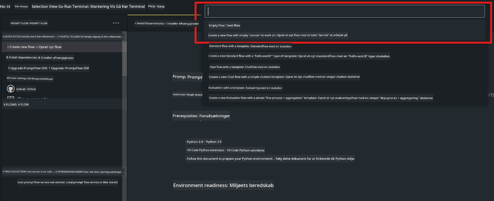
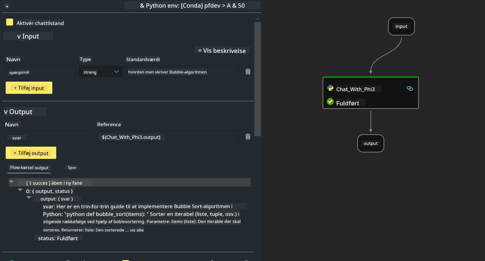

<!--
CO_OP_TRANSLATOR_METADATA:
{
  "original_hash": "bc29f7fe7fc16bed6932733eac8c81b8",
  "translation_date": "2025-05-09T19:24:06+00:00",
  "source_file": "md/02.Application/02.Code/Phi3/VSCodeExt/HOL/AIPC/02.PromptflowWithNPU.md",
  "language_code": "da"
}
-->
# **Lab 2 - Kør Prompt flow med Phi-3-mini i AIPC**

## **Hvad er Prompt flow**

Prompt flow er en samling udviklingsværktøjer designet til at forenkle hele udviklingscyklussen for LLM-baserede AI-applikationer, fra idéudvikling, prototyping, test, evaluering til produktion og overvågning. Det gør prompt engineering meget lettere og giver dig mulighed for at bygge LLM-apps med produktionskvalitet.

Med prompt flow kan du:

- Oprette flows, der forbinder LLMs, prompts, Python-kode og andre værktøjer i en eksekverbar arbejdsgang.

- Fejlsøge og iterere dine flows, især interaktionen med LLMs, nemt.

- Evaluere dine flows, beregne kvalitets- og ydelsesmetrikker med større datasæt.

- Integrere test og evaluering i dit CI/CD-system for at sikre flowets kvalitet.

- Udrulle dine flows til den valgte serveringsplatform eller nemt integrere dem i din apps kodebase.

- (Valgfrit, men stærkt anbefalet) Samarbejde med dit team ved at bruge cloud-versionen af Prompt flow i Azure AI.

## **Hvad er AIPC**

En AI PC har en CPU, en GPU og en NPU, hver med specifikke AI-accelerationsmuligheder. En NPU, eller neural processing unit, er en specialiseret accelerator, der håndterer kunstig intelligens (AI) og maskinlæring (ML) opgaver direkte på din PC i stedet for at sende data til behandling i skyen. GPU’en og CPU’en kan også håndtere disse opgaver, men NPU’en er særligt god til AI-beregninger med lavt strømforbrug. AI PC’en repræsenterer et fundamentalt skift i, hvordan vores computere fungerer. Det er ikke en løsning på et problem, der ikke fandtes før. I stedet lover den en stor forbedring i dagligdags PC-brug.

Hvordan fungerer det så? Sammenlignet med generativ AI og de enorme store sprogmodeller (LLMs), der er trænet på enorme mængder offentlige data, er AI’en, der kører på din PC, mere tilgængelig på næsten alle niveauer. Konceptet er lettere at forstå, og fordi det er trænet på dine data uden behov for adgang til skyen, er fordelene mere umiddelbart attraktive for en bredere brugergruppe.

På kort sigt involverer AI PC-verdenen personlige assistenter og mindre AI-modeller, der kører direkte på din PC og bruger dine data til at tilbyde personlige, private og mere sikre AI-forbedringer til ting, du allerede gør hver dag – tage mødereferater, organisere en fantasy football-liga, automatisere forbedringer til foto- og videoredigering eller lægge den perfekte rejseplan for en familiefest baseret på alles ankomst- og afgangstider.

## **Opbygning af genereringskode-flows på AIPC**

***Note*** ：Hvis du ikke har fuldført installationen af miljøet, besøg venligst [Lab 0 -Installations](./01.Installations.md)

1. Åbn Prompt flow Extension i Visual Studio Code og opret et tomt flow-projekt



2. Tilføj Inputs og Outputs parametre og tilføj Python Code som nyt flow



Du kan referere til denne struktur (flow.dag.yaml) for at bygge dit flow

```yaml

inputs:
  question:
    type: string
    default: how to write Bubble Algorithm
outputs:
  answer:
    type: string
    reference: ${Chat_With_Phi3.output}
nodes:
- name: Chat_With_Phi3
  type: python
  source:
    type: code
    path: Chat_With_Phi3.py
  inputs:
    question: ${inputs.question}


```

3. Tilføj kode i ***Chat_With_Phi3.py***

```python


from promptflow.core import tool

# import torch
from transformers import AutoTokenizer, pipeline,TextStreamer
import intel_npu_acceleration_library as npu_lib

import warnings

import asyncio
import platform

class Phi3CodeAgent:
    
    model = None
    tokenizer = None
    text_streamer = None
    
    model_id = "microsoft/Phi-3-mini-4k-instruct"

    @staticmethod
    def init_phi3():
        
        if Phi3CodeAgent.model is None or Phi3CodeAgent.tokenizer is None or Phi3CodeAgent.text_streamer is None:
            Phi3CodeAgent.model = npu_lib.NPUModelForCausalLM.from_pretrained(
                                    Phi3CodeAgent.model_id,
                                    torch_dtype="auto",
                                    dtype=npu_lib.int4,
                                    trust_remote_code=True
                                )
            Phi3CodeAgent.tokenizer = AutoTokenizer.from_pretrained(Phi3CodeAgent.model_id)
            Phi3CodeAgent.text_streamer = TextStreamer(Phi3CodeAgent.tokenizer, skip_prompt=True)

    

    @staticmethod
    def chat_with_phi3(prompt):
        
        Phi3CodeAgent.init_phi3()

        messages = "<|system|>You are a AI Python coding assistant. Please help me to generate code in Python.The answer only genertated Python code, but any comments and instructions do not need to be generated<|end|><|user|>" + prompt +"<|end|><|assistant|>"


        generation_args = {
            "max_new_tokens": 1024,
            "return_full_text": False,
            "temperature": 0.3,
            "do_sample": False,
            "streamer": Phi3CodeAgent.text_streamer,
        }

        pipe = pipeline(
            "text-generation",
            model=Phi3CodeAgent.model,
            tokenizer=Phi3CodeAgent.tokenizer,
            # **generation_args
        )

        result = ''

        with warnings.catch_warnings():
            warnings.simplefilter("ignore")
            response = pipe(messages, **generation_args)
            result =response[0]['generated_text']
            return result


@tool
def my_python_tool(question: str) -> str:
    if platform.system() == 'Windows':
        asyncio.set_event_loop_policy(asyncio.WindowsSelectorEventLoopPolicy())
    return Phi3CodeAgent.chat_with_phi3(question)


```

4. Du kan teste flowet via Debug eller Run for at tjekke, om genereringskoden fungerer korrekt


5. Kør flowet som udviklings-API i terminalen

```

pf flow serve --source ./ --port 8080 --host localhost   

```

Du kan teste det i Postman / Thunder Client

### **Note**

1. Første kørsel tager lang tid. Det anbefales at downloade phi-3 modellen via Hugging face CLI.

2. På grund af den begrænsede regnekraft i Intel NPU anbefales det at bruge Phi-3-mini-4k-instruct.

3. Vi bruger Intel NPU Acceleration til at kvantisere INT4-konvertering, men hvis du genstarter servicen, skal du slette cache- og nc_workshop-mapperne.

## **Ressourcer**

1. Lær Promptflow [https://microsoft.github.io/promptflow/](https://microsoft.github.io/promptflow/)

2. Lær Intel NPU Acceleration [https://github.com/intel/intel-npu-acceleration-library](https://github.com/intel/intel-npu-acceleration-library)

3. Eksempelkode, download [Local NPU Agent Sample Code](../../../../../../../../../code/07.Lab/01/AIPC)

**Ansvarsfraskrivelse**:  
Dette dokument er blevet oversat ved hjælp af AI-oversættelsestjenesten [Co-op Translator](https://github.com/Azure/co-op-translator). Selvom vi bestræber os på nøjagtighed, bedes du være opmærksom på, at automatiserede oversættelser kan indeholde fejl eller unøjagtigheder. Det oprindelige dokument på dets modersmål bør betragtes som den autoritative kilde. For kritisk information anbefales professionel menneskelig oversættelse. Vi påtager os intet ansvar for misforståelser eller fejltolkninger, der måtte opstå som følge af brugen af denne oversættelse.