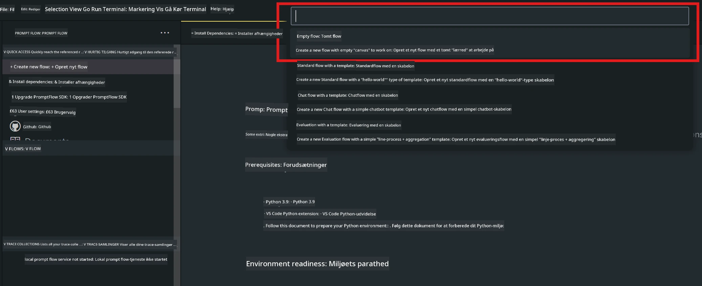
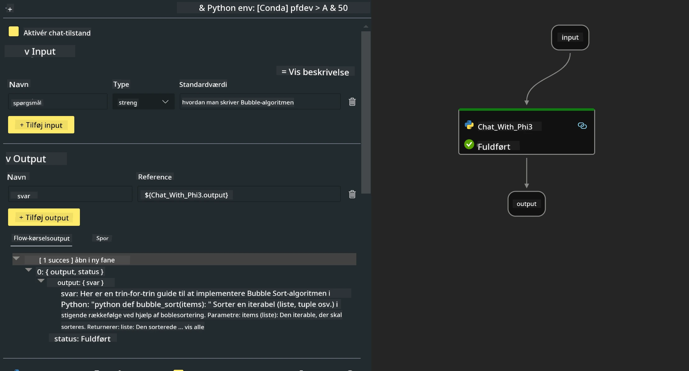
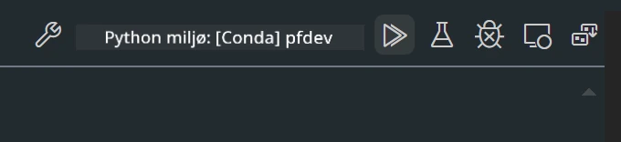

<!--
CO_OP_TRANSLATOR_METADATA:
{
  "original_hash": "3dbbf568625b1ee04b354c2dc81d3248",
  "translation_date": "2025-07-17T04:26:41+00:00",
  "source_file": "md/02.Application/02.Code/Phi3/VSCodeExt/HOL/Apple/02.PromptflowWithMLX.md",
  "language_code": "da"
}
-->
# **Lab 2 - Kør Prompt flow med Phi-3-mini i AIPC**

## **Hvad er Prompt flow**

Prompt flow er en samling udviklingsværktøjer designet til at strømline hele udviklingscyklussen for LLM-baserede AI-applikationer, fra idéudvikling, prototyping, test, evaluering til produktion, implementering og overvågning. Det gør prompt engineering meget nemmere og giver dig mulighed for at bygge LLM-apps med produktionskvalitet.

Med prompt flow kan du:

- Oprette flows, der forbinder LLM’er, prompts, Python-kode og andre værktøjer i en eksekverbar arbejdsgang.

- Fejlsøge og iterere dine flows, især interaktionen med LLM’er, på en nem måde.

- Evaluere dine flows, beregne kvalitets- og ydelsesmetrikker med større datasæt.

- Integrere test og evaluering i dit CI/CD-system for at sikre kvaliteten af dit flow.

- Udrulle dine flows til den serveringsplatform, du vælger, eller nemt integrere dem i din apps kodebase.

- (Valgfrit, men stærkt anbefalet) Samarbejde med dit team ved at bruge cloud-versionen af Prompt flow i Azure AI.

## **Bygning af genereringskode-flows på Apple Silicon**

***Note*** ：Hvis du ikke har fuldført installationen af miljøet, besøg venligst [Lab 0 -Installations](./01.Installations.md)

1. Åbn Prompt flow-udvidelsen i Visual Studio Code og opret et tomt flow-projekt



2. Tilføj Input- og Output-parametre og tilføj Python-kode som nyt flow



Du kan bruge denne struktur (flow.dag.yaml) som reference til at opbygge dit flow

```yaml

inputs:
  prompt:
    type: string
    default: Write python code for Fibonacci serie. Please use markdown as output
outputs:
  result:
    type: string
    reference: ${gen_code_by_phi3.output}
nodes:
- name: gen_code_by_phi3
  type: python
  source:
    type: code
    path: gen_code_by_phi3.py
  inputs:
    prompt: ${inputs.prompt}


```

3. Kvantificer phi-3-mini

Vi ønsker at køre SLM bedre på lokale enheder. Generelt kvantificerer vi modellen (INT4, FP16, FP32)

```bash

python -m mlx_lm.convert --hf-path microsoft/Phi-3-mini-4k-instruct

```

**Note:** standardmappen er mlx_model

4. Tilføj kode i ***Chat_With_Phi3.py***

```python


from promptflow import tool

from mlx_lm import load, generate


# The inputs section will change based on the arguments of the tool function, after you save the code
# Adding type to arguments and return value will help the system show the types properly
# Please update the function name/signature per need
@tool
def my_python_tool(prompt: str) -> str:

    model_id = './mlx_model_phi3_mini'

    model, tokenizer = load(model_id)

    # <|user|>\nWrite python code for Fibonacci serie. Please use markdown as output<|end|>\n<|assistant|>

    response = generate(model, tokenizer, prompt="<|user|>\n" + prompt  + "<|end|>\n<|assistant|>", max_tokens=2048, verbose=True)

    return response


```

4. Du kan teste flowet via Debug eller Run for at tjekke, om genereringskoden fungerer korrekt



5. Kør flowet som udviklings-API i terminalen

```

pf flow serve --source ./ --port 8080 --host localhost   

```

Du kan teste det i Postman / Thunder Client

### **Note**

1. Første kørsel tager lang tid. Det anbefales at downloade phi-3 modellen via Hugging face CLI.

2. På grund af den begrænsede regnekraft i Intel NPU anbefales det at bruge Phi-3-mini-4k-instruct.

3. Vi bruger Intel NPU Acceleration til at kvantificere INT4-konvertering, men hvis du genstarter servicen, skal du slette cache- og nc_workshop-mapperne.

## **Ressourcer**

1. Lær Promptflow [https://microsoft.github.io/promptflow/](https://microsoft.github.io/promptflow/)

2. Lær Intel NPU Acceleration [https://github.com/intel/intel-npu-acceleration-library](https://github.com/intel/intel-npu-acceleration-library)

3. Eksempelkode, download [Local NPU Agent Sample Code](../../../../../../../../../code/07.Lab/01/AIPC/local-npu-agent)

**Ansvarsfraskrivelse**:  
Dette dokument er blevet oversat ved hjælp af AI-oversættelsestjenesten [Co-op Translator](https://github.com/Azure/co-op-translator). Selvom vi bestræber os på nøjagtighed, bedes du være opmærksom på, at automatiserede oversættelser kan indeholde fejl eller unøjagtigheder. Det oprindelige dokument på dets oprindelige sprog bør betragtes som den autoritative kilde. For kritisk information anbefales professionel menneskelig oversættelse. Vi påtager os intet ansvar for misforståelser eller fejltolkninger, der opstår som følge af brugen af denne oversættelse.