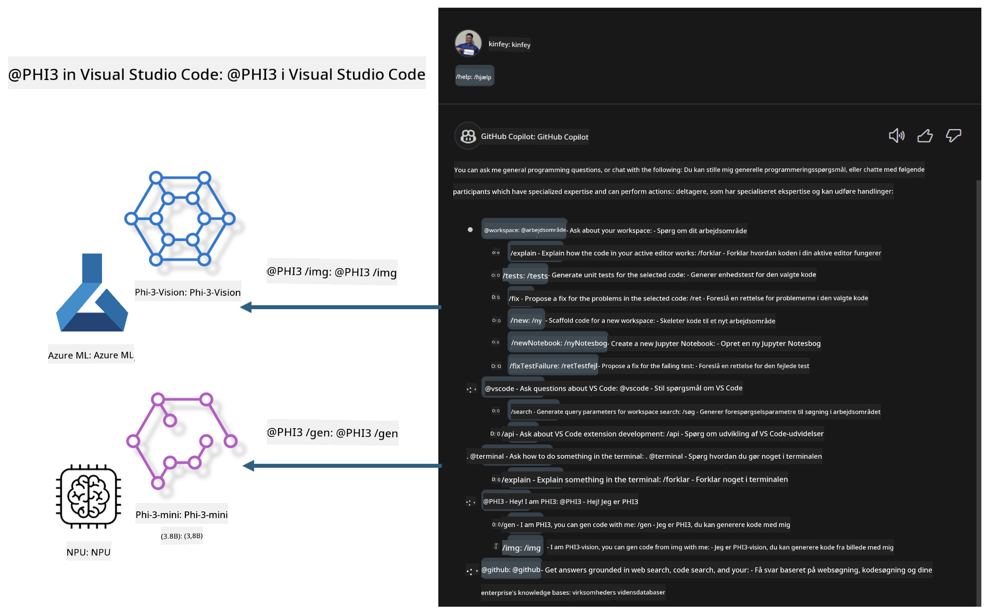

<!--
CO_OP_TRANSLATOR_METADATA:
{
  "original_hash": "00b7a699de8ac405fa821f4c0f7fc0ab",
  "translation_date": "2025-05-09T19:14:00+00:00",
  "source_file": "md/02.Application/02.Code/Phi3/VSCodeExt/README.md",
  "language_code": "da"
}
-->
# **Byg din egen Visual Studio Code GitHub Copilot Chat med Microsoft Phi-3 Family**

Har du brugt workspace-agenten i GitHub Copilot Chat? Vil du bygge dit eget teams kodeagent? Dette hands-on lab sigter mod at kombinere open source-modellen for at skabe en virksomhedsorienteret kodeagent.

## **Grundlag**

### **Hvorfor vælge Microsoft Phi-3**

Phi-3 er en familierække, som inkluderer phi-3-mini, phi-3-small og phi-3-medium baseret på forskellige træningsparametre til tekstgenerering, dialogfærdiggørelse og kodegenerering. Der findes også phi-3-vision baseret på Vision. Det er velegnet til virksomheder eller teams, der ønsker at skabe offline generative AI-løsninger.

Anbefales at læse dette link [https://github.com/microsoft/PhiCookBook/blob/main/md/01.Introduction/01/01.PhiFamily.md](https://github.com/microsoft/PhiCookBook/blob/main/md/01.Introduction/01/01.PhiFamily.md)

### **Microsoft GitHub Copilot Chat**

GitHub Copilot Chat-udvidelsen giver dig en chatgrænseflade, som lader dig interagere med GitHub Copilot og få svar på kode-relaterede spørgsmål direkte i VS Code, uden at du behøver at navigere i dokumentation eller søge på onlinefora.

Copilot Chat kan bruge syntaksfremhævning, indrykning og andre formateringsfunktioner for at gøre svaret mere klart. Afhængigt af typen af brugerens spørgsmål kan resultatet indeholde links til kontekst, som Copilot brugte til at generere svaret, som f.eks. kildekodefiler eller dokumentation, eller knapper til at få adgang til VS Code-funktionalitet.

- Copilot Chat integreres i din udviklerflow og hjælper dig, hvor du har brug for det:

- Start en inline chat direkte fra editoren eller terminalen for hjælp, mens du koder

- Brug Chat-visningen for at have en AI-assistent ved siden af, som kan hjælpe dig når som helst

- Start Quick Chat for at stille et hurtigt spørgsmål og komme videre med dit arbejde

Du kan bruge GitHub Copilot Chat i forskellige situationer, som f.eks.:

- Besvare spørgsmål om, hvordan man bedst løser et problem

- Forklare andres kode og foreslå forbedringer

- Foreslå kodefix

- Generere enhedstestcases

- Generere kodokumentation

Anbefales at læse dette link [https://code.visualstudio.com/docs/copilot/copilot-chat](https://code.visualstudio.com/docs/copilot/copilot-chat?WT.mc_id=aiml-137032-kinfeylo)

###  **Microsoft GitHub Copilot Chat @workspace**

At referere til **@workspace** i Copilot Chat lader dig stille spørgsmål om hele din kodebase. Baseret på spørgsmålet henter Copilot intelligent relevante filer og symboler, som den derefter refererer til i sit svar som links og kodeeksempler.

For at besvare dit spørgsmål søger **@workspace** gennem de samme kilder, som en udvikler ville bruge, når han navigerer i en kodebase i VS Code:

- Alle filer i workspace, undtagen filer, der er ignoreret af en .gitignore-fil

- Mappestruktur med indlejrede mapper og filnavne

- GitHubs kode-søgeindeks, hvis workspace er et GitHub-repository og indekseret af kode-søgning

- Symboler og definitioner i workspace

- Nuværende markeret tekst eller synlig tekst i den aktive editor

Bemærk: .gitignore ignoreres, hvis du har en fil åben eller har markeret tekst i en ignoreret fil.

Anbefales at læse dette link [[https://code.visualstudio.com/docs/copilot/copilot-chat](https://code.visualstudio.com/docs/copilot/workspace-context?WT.mc_id=aiml-137032-kinfeylo)]

## **Lær mere om dette Lab**

GitHub Copilot har i høj grad forbedret programmeringseffektiviteten i virksomheder, og hver virksomhed ønsker at tilpasse relevante funktioner i GitHub Copilot. Mange virksomheder har tilpasset Extensions, der ligner GitHub Copilot, baseret på deres egne forretningsscenarier og open source-modeller. For virksomheder er tilpassede Extensions lettere at kontrollere, men det påvirker også brugeroplevelsen. GitHub Copilot har trods alt stærkere funktioner til at håndtere generelle scenarier og faglighed. Hvis oplevelsen kan holdes ensartet, er det bedre at tilpasse virksomhedens egen Extension. GitHub Copilot Chat tilbyder relevante API’er for virksomheder til at udvide chatoplevelsen. At bevare en ensartet oplevelse samtidig med at have tilpassede funktioner giver en bedre brugeroplevelse.

Dette lab bruger primært Phi-3-modellen kombineret med lokal NPU og Azure hybrid til at bygge en tilpasset Agent i GitHub Copilot Chat ***@PHI3*** for at hjælpe virksomhedens udviklere med at fuldføre kodegenerering***(@PHI3 /gen)*** og generere kode baseret på billeder ***(@PHI3 /img)***.

### ***Note:*** 

Dette lab er i øjeblikket implementeret i AIPC på Intel CPU og Apple Silicon. Vi vil fortsætte med at opdatere Qualcomm-versionen af NPU.

## **Lab**

| Navn | Beskrivelse | AIPC | Apple |
| ------------ | ----------- | -------- |-------- |
| Lab0 - Installations(✅) | Konfigurer og installer relaterede miljøer og installationsværktøjer | [Go](./HOL/AIPC/01.Installations.md) |[Go](./HOL/Apple/01.Installations.md) |
| Lab1 - Kør Prompt flow med Phi-3-mini (✅) | Kombineret med AIPC / Apple Silicon, brug lokal NPU til at skabe kodegenerering via Phi-3-mini | [Go](./HOL/AIPC/02.PromptflowWithNPU.md) |  [Go](./HOL/Apple/02.PromptflowWithMLX.md) |
| Lab2 - Deploy Phi-3-vision på Azure Machine Learning Service(✅) | Generer kode ved at deployere Azure Machine Learning Service's Model Catalog - Phi-3-vision billede | [Go](./HOL/AIPC/03.DeployPhi3VisionOnAzure.md) |[Go](./HOL/Apple/03.DeployPhi3VisionOnAzure.md) |
| Lab3 - Opret en @phi-3 agent i GitHub Copilot Chat(✅)  | Opret en tilpasset Phi-3 agent i GitHub Copilot Chat til at fuldføre kodegenerering, grafgenerering, RAG osv. | [Go](./HOL/AIPC/04.CreatePhi3AgentInVSCode.md) | [Go](./HOL/Apple/04.CreatePhi3AgentInVSCode.md) |
| Sample Code (✅)  | Download eksempelkode | [Go](../../../../../../../code/07.Lab/01/AIPC) | [Go](../../../../../../../code/07.Lab/01/Apple) |

## **Ressourcer**

1. Phi-3 Cookbook [https://github.com/microsoft/Phi-3CookBook](https://github.com/microsoft/Phi-3CookBook)

2. Lær mere om GitHub Copilot [https://learn.microsoft.com/training/paths/copilot/](https://learn.microsoft.com/training/paths/copilot/?WT.mc_id=aiml-137032-kinfeylo)

3. Lær mere om GitHub Copilot Chat [https://learn.microsoft.com/training/paths/accelerate-app-development-using-github-copilot/](https://learn.microsoft.com/training/paths/accelerate-app-development-using-github-copilot/?WT.mc_id=aiml-137032-kinfeylo)

4. Lær mere om GitHub Copilot Chat API [https://code.visualstudio.com/api/extension-guides/chat](https://code.visualstudio.com/api/extension-guides/chat?WT.mc_id=aiml-137032-kinfeylo)

5. Lær mere om Azure AI Foundry [https://learn.microsoft.com/training/paths/create-custom-copilots-ai-studio/](https://learn.microsoft.com/training/paths/create-custom-copilots-ai-studio/?WT.mc_id=aiml-137032-kinfeylo)

6. Lær mere om Azure AI Foundry's Model Catalog [https://learn.microsoft.com/azure/ai-studio/how-to/model-catalog-overview](https://learn.microsoft.com/azure/ai-studio/how-to/model-catalog-overview)

**Ansvarsfraskrivelse**:  
Dette dokument er blevet oversat ved hjælp af AI-oversættelsestjenesten [Co-op Translator](https://github.com/Azure/co-op-translator). Selvom vi bestræber os på nøjagtighed, bedes du være opmærksom på, at automatiserede oversættelser kan indeholde fejl eller unøjagtigheder. Det oprindelige dokument på dets oprindelige sprog bør betragtes som den autoritative kilde. For kritisk information anbefales professionel menneskelig oversættelse. Vi påtager os intet ansvar for misforståelser eller fejltolkninger, der måtte opstå som følge af brugen af denne oversættelse.