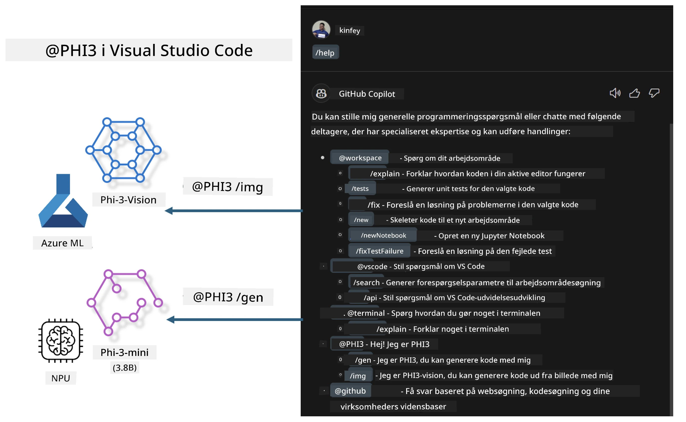

# **Byg din egen Visual Studio Code GitHub Copilot Chat med Microsoft Phi-3-familien**

Har du brugt workspace-agenten i GitHub Copilot Chat? Vil du bygge dit eget teams kodeagent? Denne praktiske workshop håber at kombinere den open source-model for at bygge en kodeløsning på virksomhedsniveau.

## **Grundlag**

### **Hvorfor vælge Microsoft Phi-3**

Phi-3 er en familieserie, der inkluderer phi-3-mini, phi-3-small og phi-3-medium baseret på forskellige træningsparametre til tekstgenerering, dialogfuldførelse og kodegenerering. Der findes også phi-3-vision baseret på Vision. Den er velegnet til virksomheder eller forskellige teams til at skabe offline generative AI-løsninger.

Anbefales at læse dette link [https://github.com/microsoft/PhiCookBook/blob/main/md/01.Introduction/01/01.PhiFamily.md](https://github.com/microsoft/PhiCookBook/blob/main/md/01.Introduction/01/01.PhiFamily.md)

### **Microsoft GitHub Copilot Chat**

GitHub Copilot Chat-udvidelsen giver dig en chatgrænseflade, der lader dig interagere med GitHub Copilot og modtage svar på kodningsrelaterede spørgsmål direkte i VS Code, uden at du behøver at navigere i dokumentation eller søge på onlinefora.

Copilot Chat kan bruge syntaksfremhævning, indrykning og andre formateringsegenskaber for at skabe klarhed i det genererede svar. Afhængigt af spørgsmålets type kan resultatet indeholde links til kontekster, som Copilot har brugt til at generere svaret, såsom kildekodefiler eller dokumentation, eller knapper til at få adgang til VS Code-funktionalitet.

- Copilot Chat integreres i din udviklerflow og giver dig assistance, hvor du har brug for det:

- Start en inline chat direkte fra editoren eller terminalen for hjælp, mens du koder

- Brug Chat-visningen til altid at have en AI-assistent ved siden af til at hjælpe dig

- Start Quick Chat for hurtigt at stille et spørgsmål og vende tilbage til det, du laver

Du kan bruge GitHub Copilot Chat i forskellige scenarier, såsom:

- Besvare kodningsspørgsmål om, hvordan man bedst løser et problem

- Forklare andres kode og foreslå forbedringer

- Foreslå kodefejlrettelser

- Generere enhedstestcases

- Generere kodedokumentation

Anbefales at læse dette link [https://code.visualstudio.com/docs/copilot/copilot-chat](https://code.visualstudio.com/docs/copilot/copilot-chat?WT.mc_id=aiml-137032-kinfeylo)

###  **Microsoft GitHub Copilot Chat @workspace**

Ved at referere til **@workspace** i Copilot Chat kan du stille spørgsmål om hele din kodebase. Baseret på spørgsmålet finder Copilot intelligent relevante filer og symboler, som den henviser til i sit svar som links og kodeeksempler.

For at besvare dit spørgsmål søger **@workspace** gennem de samme kilder, som en udvikler ville bruge, når de navigerer i en kodebase i VS Code:

- Alle filer i arbejdsområdet, undtagen filer, der er ignoreret af en .gitignore-fil

- Mappestrukturen med indlejrede mapper og filnavne

- GitHubs kodeindeks, hvis arbejdsområdet er et GitHub-repositorium og indekseret af kode-søgning

- Symboler og definitioner i arbejdsområdet

- Aktuelt markeret tekst eller synlig tekst i den aktive editor

Bemærk: .gitignore ignoreres, hvis du har en fil åben eller har tekst markeret i en ignoreret fil.

Anbefales at læse dette link [[https://code.visualstudio.com/docs/copilot/copilot-chat](https://code.visualstudio.com/docs/copilot/workspace-context?WT.mc_id=aiml-137032-kinfeylo)]

## **Lær mere om denne workshop**

GitHub Copilot har i høj grad forbedret programmeringseffektiviteten i virksomheder, og alle virksomheder håber at tilpasse relevante funktioner i GitHub Copilot. Mange virksomheder har tilpassede udvidelser, der ligner GitHub Copilot baseret på deres egne forretningsscenarier og open source-modeller. For virksomheder er tilpassede udvidelser nemmere at kontrollere, men det påvirker også brugeroplevelsen. GitHub Copilot har trods alt stærkere funktioner til at håndtere generelle scenarier og faglighed. Hvis oplevelsen kan holdes konsistent, vil det være bedre at tilpasse virksomhedens egen udvidelse. GitHub Copilot Chat giver relevante API'er for virksomheder til at udvide chatoplevelsen. At bevare en ensartet oplevelse og samtidig have tilpassede funktioner giver en bedre brugeroplevelse.

Denne workshop bruger hovedsageligt Phi-3-modellen kombineret med lokal NPU og Azure-hybrid til at bygge en brugerdefineret agent i GitHub Copilot Chat ***@PHI3*** for at hjælpe virksomhedens udviklere med at fuldføre kodegenerering ***(@PHI3 /gen)*** og generere kode baseret på billeder ***(@PHI3 /img)***.

### ***Bemærk:***

Denne workshop er i øjeblikket implementeret på AIPC på Intel CPU og Apple Silicon. Vi vil fortsætte med at opdatere Qualcomm-versionen af NPU.

## **Workshop**

| Navn | Beskrivelse | AIPC | Apple |
| ------------ | ----------- | -------- |-------- |
| Lab0 - Installationer(✅) | Konfigurer og installér relaterede miljøer og installationsværktøjer | [Gå](./HOL/AIPC/01.Installations.md) |[Gå](./HOL/Apple/01.Installations.md) |
| Lab1 - Kør Prompt flow med Phi-3-mini (✅) | Kombineret med AIPC / Apple Silicon, brug lokal NPU til at skabe kodegenerering via Phi-3-mini | [Gå](./HOL/AIPC/02.PromptflowWithNPU.md) |  [Gå](./HOL/Apple/02.PromptflowWithMLX.md) |
| Lab2 - Deploy Phi-3-vision på Azure Machine Learning Service(✅) | Generer kode ved at implementere Model Catalog for Azure Machine Learning Service - Phi-3-vision image | [Gå](./HOL/AIPC/03.DeployPhi3VisionOnAzure.md) |[Gå](./HOL/Apple/03.DeployPhi3VisionOnAzure.md) |
| Lab3 - Opret en @phi-3 agent i GitHub Copilot Chat(✅)  | Opret en brugerdefineret Phi-3 agent i GitHub Copilot Chat til at fuldføre kodegenerering, grafgenereringskode, RAG osv. | [Gå](./HOL/AIPC/04.CreatePhi3AgentInVSCode.md) | [Gå](./HOL/Apple/04.CreatePhi3AgentInVSCode.md) |
| Eksempelkode (✅)  | Download eksempelkode | [Gå](../../../../../../../code/07.Lab/01/AIPC) | [Gå](../../../../../../../code/07.Lab/01/Apple) |

## **Ressourcer**

1. Phi-3 Cookbook [https://github.com/microsoft/Phi-3CookBook](https://github.com/microsoft/Phi-3CookBook)

2. Lær mere om GitHub Copilot [https://learn.microsoft.com/training/paths/copilot/](https://learn.microsoft.com/training/paths/copilot/?WT.mc_id=aiml-137032-kinfeylo)

3. Lær mere om GitHub Copilot Chat [https://learn.microsoft.com/training/paths/accelerate-app-development-using-github-copilot/](https://learn.microsoft.com/training/paths/accelerate-app-development-using-github-copilot/?WT.mc_id=aiml-137032-kinfeylo)

4. Lær mere om GitHub Copilot Chat API [https://code.visualstudio.com/api/extension-guides/chat](https://code.visualstudio.com/api/extension-guides/chat?WT.mc_id=aiml-137032-kinfeylo)

5. Lær mere om Microsoft Foundry [https://learn.microsoft.com/training/paths/create-custom-copilots-ai-studio/](https://learn.microsoft.com/training/paths/create-custom-copilots-ai-studio/?WT.mc_id=aiml-137032-kinfeylo)

6. Lær mere om Microsoft Foundrys Model Catalog [https://learn.microsoft.com/azure/ai-studio/how-to/model-catalog-overview](https://learn.microsoft.com/azure/ai-studio/how-to/model-catalog-overview)

---

<!-- CO-OP TRANSLATOR DISCLAIMER START -->
**Ansvarsfraskrivelse**:
Dette dokument er blevet oversat ved hjælp af AI-oversættelsestjenesten [Co-op Translator](https://github.com/Azure/co-op-translator). Selvom vi bestræber os på nøjagtighed, bedes du være opmærksom på, at automatiserede oversættelser kan indeholde fejl eller unøjagtigheder. Det oprindelige dokument på dets oprindelige sprog bør betragtes som den autoritative kilde. For kritisk information anbefales professionel menneskelig oversættelse. Vi påtager os intet ansvar for misforståelser eller fejltolkninger, der opstår som følge af brugen af denne oversættelse.
<!-- CO-OP TRANSLATOR DISCLAIMER END -->