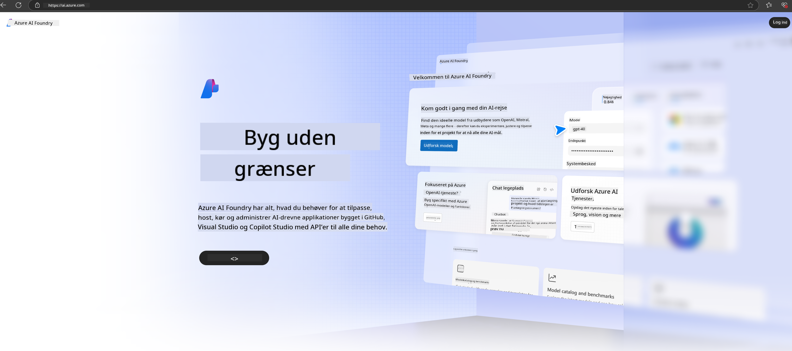

<!--
CO_OP_TRANSLATOR_METADATA:
{
  "original_hash": "3a1e48b628022485aac989c9f733e792",
  "translation_date": "2025-07-17T05:24:35+00:00",
  "source_file": "md/02.QuickStart/AzureAIFoundry_QuickStart.md",
  "language_code": "da"
}
-->
# **Brug af Phi-3 i Azure AI Foundry**

Med udviklingen af Generativ AI håber vi at kunne bruge en samlet platform til at håndtere forskellige LLM og SLM, integration af virksomhedens data, finjustering/RAG-operationer samt evaluering af forskellige forretningsområder efter integration af LLM og SLM, osv., så generativ AI kan implementeres bedre i smarte applikationer. [Azure AI Foundry](https://ai.azure.com) er en generativ AI-applikationsplatform på virksomhedsniveau.

Med Azure AI Foundry kan du evaluere svar fra store sprogmodeller (LLM) og orkestrere prompt-applikationskomponenter med prompt flow for bedre ydeevne. Platformen muliggør skalerbarhed, så proof of concepts nemt kan omdannes til fuld produktion. Kontinuerlig overvågning og forbedring understøtter langsigtet succes.

Vi kan hurtigt implementere Phi-3 modellen på Azure AI Foundry gennem enkle trin og derefter bruge Azure AI Foundry til at udføre Phi-3 relateret Playground/Chat, finjustering, evaluering og andre tilknyttede opgaver.

## **1. Forberedelse**

Hvis du allerede har [Azure Developer CLI](https://learn.microsoft.com/azure/developer/azure-developer-cli/overview?WT.mc_id=aiml-138114-kinfeylo) installeret på din maskine, er det lige så nemt som at køre denne kommando i en ny mappe at bruge denne skabelon.

## Manuel oprettelse

At oprette et Microsoft Azure AI Foundry-projekt og hub er en god måde at organisere og administrere dit AI-arbejde på. Her er en trin-for-trin guide til at komme i gang:

### Oprettelse af et projekt i Azure AI Foundry

1. **Gå til Azure AI Foundry**: Log ind på Azure AI Foundry-portalen.
2. **Opret et projekt**:
   - Hvis du allerede er i et projekt, vælg "Azure AI Foundry" øverst til venstre på siden for at gå til startsiden.
   - Vælg "+ Create project".
   - Indtast et navn til projektet.
   - Hvis du har en hub, vil den blive valgt som standard. Hvis du har adgang til flere hubs, kan du vælge en anden fra dropdown-menuen. Hvis du vil oprette en ny hub, vælg "Create new hub" og angiv et navn.
   - Vælg "Create".

### Oprettelse af en hub i Azure AI Foundry

1. **Gå til Azure AI Foundry**: Log ind med din Azure-konto.
2. **Opret en hub**:
   - Vælg Management center i venstremenuen.
   - Vælg "All resources", klik på pilen ved siden af "+ New project" og vælg "+ New hub".
   - I dialogboksen "Create a new hub" indtast et navn til din hub (f.eks. contoso-hub) og tilpas de øvrige felter efter behov.
   - Vælg "Next", gennemgå oplysningerne, og vælg derefter "Create".

For mere detaljerede instruktioner kan du se den officielle [Microsoft-dokumentation](https://learn.microsoft.com/azure/ai-studio/how-to/create-projects).

Efter vellykket oprettelse kan du få adgang til det studio, du har oprettet, via [ai.azure.com](https://ai.azure.com/)

Der kan være flere projekter i én AI Foundry. Opret et projekt i AI Foundry som forberedelse.

Opret Azure AI Foundry [QuickStarts](https://learn.microsoft.com/azure/ai-studio/quickstarts/get-started-code)

## **2. Implementer en Phi-model i Azure AI Foundry**

Klik på Explore-muligheden for projektet for at gå ind i Model Catalog og vælg Phi-3

Vælg Phi-3-mini-4k-instruct

Klik på 'Deploy' for at implementere Phi-3-mini-4k-instruct modellen

> [!NOTE]
>
> Du kan vælge beregningskraft ved implementering

## **3. Playground Chat Phi i Azure AI Foundry**

Gå til implementeringssiden, vælg Playground, og chat med Phi-3 i Azure AI Foundry

## **4. Implementering af modellen fra Azure AI Foundry**

For at implementere en model fra Azure Model Catalog kan du følge disse trin:

- Log ind på Azure AI Foundry.
- Vælg den model, du vil implementere, fra Azure AI Foundry modelkataloget.
- På modellens Detaljeside vælg Deploy og derefter Serverless API med Azure AI Content Safety.
- Vælg det projekt, hvor du vil implementere dine modeller. For at bruge Serverless API-tilbuddet skal dit workspace høre til regionen East US 2 eller Sweden Central. Du kan tilpasse navnet på implementeringen.
- I implementeringsguiden vælg Pricing and terms for at læse om priser og brugsbetingelser.
- Vælg Deploy. Vent, indtil implementeringen er klar, og du bliver omdirigeret til Deployments-siden.
- Vælg Open in playground for at begynde at interagere med modellen.
- Du kan vende tilbage til Deployments-siden, vælge implementeringen og notere endpointets Target URL og Secret Key, som du kan bruge til at kalde implementeringen og generere svar.
- Du kan altid finde endpointets detaljer, URL og adgangsnøgler ved at gå til Build-fanen og vælge Deployments under Components-sektionen.

> [!NOTE]
> Bemærk, at din konto skal have Azure AI Developer-rolle tilladelser på Resource Group for at kunne udføre disse trin.

## **5. Brug af Phi API i Azure AI Foundry**

Du kan tilgå https://{Your project name}.region.inference.ml.azure.com/swagger.json via Postman GET og kombinere det med Key for at lære om de tilgængelige interfaces

Du kan meget nemt få fat i både forespørgselsparametre og svarparametre.

**Ansvarsfraskrivelse**:  
Dette dokument er blevet oversat ved hjælp af AI-oversættelsestjenesten [Co-op Translator](https://github.com/Azure/co-op-translator). Selvom vi bestræber os på nøjagtighed, bedes du være opmærksom på, at automatiserede oversættelser kan indeholde fejl eller unøjagtigheder. Det oprindelige dokument på dets oprindelige sprog bør betragtes som den autoritative kilde. For kritisk information anbefales professionel menneskelig oversættelse. Vi påtager os intet ansvar for misforståelser eller fejltolkninger, der opstår som følge af brugen af denne oversættelse.