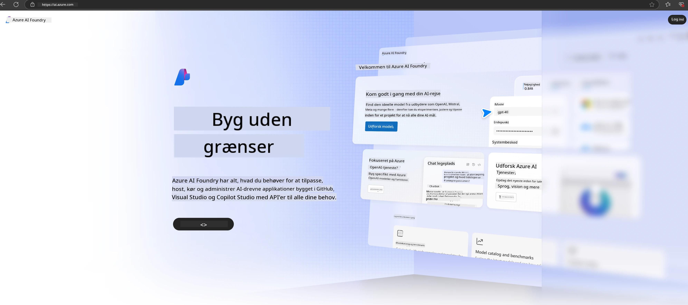

# **Brug af Phi-3 i Microsoft Foundry**

Med udviklingen af Generativ AI håber vi at bruge en samlet platform til at håndtere forskellige LLM og SLM, virksomhedens dataintegration, finjustering/RAG-operationer og evaluering af forskellige virksomhedsområder efter integration af LLM og SLM osv., så generativ AI kan implementeres bedre i smarte applikationer. [Microsoft Foundry](https://ai.azure.com) er en virksomhedsplatform til generative AI-applikationer.

Med Microsoft Foundry kan du evaluere store sprogmodellers (LLM) svar og orkestrere promptapplikationskomponenter med prompt flow for bedre ydeevne. Platformen fremmer skalerbarhed for nemt at omdanne proof of concepts til fuld produktion. Kontinuerlig overvågning og forfining understøtter langsigtet succes.

Vi kan hurtigt implementere Phi-3-modellen på Microsoft Foundry gennem simple trin og derefter bruge Microsoft Foundry til at udføre Phi-3 relateret Playground/Chat, finjustering, evaluering og andet relateret arbejde.

## **1. Forberedelse**

Hvis du allerede har [Azure Developer CLI](https://learn.microsoft.com/azure/developer/azure-developer-cli/overview?WT.mc_id=aiml-138114-kinfeylo) installeret på din maskine, er det så simpelt som at køre denne kommando i en ny mappe for at bruge denne skabelon.

## Manuel Oprettelse

At oprette et Microsoft Foundry-projekt og et hub er en god måde at organisere og administrere dit AI-arbejde på. Her er en trin-for-trin guide til at komme i gang:

### Oprettelse af et projekt i Microsoft Foundry

1. **Gå til Microsoft Foundry**: Log ind på Microsoft Foundry-portalen.
2. **Opret et projekt**:
   - Hvis du er i et projekt, skal du vælge "Microsoft Foundry" øverst til venstre på siden for at gå til startsiden.
   - Vælg "+ Opret projekt".
   - Indtast et navn til projektet.
   - Hvis du har et hub, vælges det som standard. Hvis du har adgang til flere hubs, kan du vælge et andet fra dropdown-menuen. Hvis du vil oprette et nyt hub, vælg "Opret nyt hub" og angiv et navn.
   - Vælg "Opret".

### Oprettelse af et hub i Microsoft Foundry

1. **Gå til Microsoft Foundry**: Log ind med din Azure-konto.
2. **Opret et hub**:
   - Vælg Management center i venstremenuen.
   - Vælg "Alle ressourcer", klik derefter på pilen ned ved siden af "+ Nyt projekt" og vælg "+ Nyt hub".
   - I dialogboksen "Opret et nyt hub" indtast et navn til dit hub (f.eks. contoso-hub) og rediger de andre felter efter ønske.
   - Vælg "Næste", gennemgå oplysningerne, og vælg derefter "Opret".

For mere detaljerede instruktioner kan du henvise til den officielle [Microsoft dokumentation](https://learn.microsoft.com/azure/ai-studio/how-to/create-projects).

Efter vellykket oprettelse kan du få adgang til det studio, du har oprettet, via [ai.azure.com](https://ai.azure.com/)

Der kan være flere projekter på en AI Foundry. Opret et projekt i AI Foundry som forberedelse.

Opret Microsoft Foundry [QuickStarts](https://learn.microsoft.com/azure/ai-studio/quickstarts/get-started-code)

## **2. Implementer en Phi-model i Microsoft Foundry**

Klik på Explore-muligheden i projektet for at gå til Model Catalog og vælg Phi-3

Vælg Phi-3-mini-4k-instruct

Klik 'Deploy' for at implementere Phi-3-mini-4k-instruct-modellen

> [!NOTE]
>
> Du kan vælge computerkraft ved implementering

## **3. Playground Chat Phi i Microsoft Foundry**

Gå til implementeringssiden, vælg Playground, og chat med Phi-3 i Microsoft Foundry

## **4. Implementering af modellen fra Microsoft Foundry**

For at implementere en model fra Azure Model Catalog kan du følge disse trin:

- Log ind på Microsoft Foundry.
- Vælg den model, du vil implementere, fra Microsoft Foundry's modelkatalog.
- På modellens detaljer-side, vælg Deploy og vælg derefter Serverless API med Azure AI Content Safety.
- Vælg det projekt, hvor du ønsker at implementere dine modeller. For at bruge Serverless API-tilbuddet, skal dit arbejdsområde tilhøre regionen East US 2 eller Sweden Central. Du kan tilpasse navnet på implementeringen.
- På implementeringsguiden vælges Priser og vilkår for at lære om priser og brugsbetingelser.
- Vælg Deploy. Vent til implementeringen er klar, og du bliver omdirigeret til siden Implementeringer.
- Vælg Åbn i playground for at begynde at interagere med modellen.
- Du kan vende tilbage til siden Implementeringer, vælge implementeringen og notere slutpunktets Target URL og Secret Key, som du kan bruge til at kalde implementeringen og generere svar.
- Du kan altid finde slutpunktets oplysninger, URL og adgangsnøgler ved at navigere til Build-fanen og vælge Implementeringer fra komponentsektionen.

> [!NOTE]
> Bemærk venligst, at din konto skal have Azure AI Developer-rolle tilladelser på Resource Group for at udføre disse trin.

## **5. Brug af Phi API i Microsoft Foundry**

Du kan tilgå https://{Dit projektnavn}.region.inference.ml.azure.com/swagger.json via Postman GET og kombinere det med nøgle for at lære om de tilgængelige grænseflader

Du kan meget nemt få fat i forespørgselsparametre samt svarparametre.

---

<!-- CO-OP TRANSLATOR DISCLAIMER START -->
**Ansvarsfraskrivelse**:
Dette dokument er oversat ved hjælp af AI-oversættelsestjenesten [Co-op Translator](https://github.com/Azure/co-op-translator). Selvom vi bestræber os på nøjagtighed, skal du være opmærksom på, at automatiserede oversættelser kan indeholde fejl eller unøjagtigheder. Det oprindelige dokument på dets modersmål bør betragtes som den autoritative kilde. For kritisk information anbefales professionel menneskelig oversættelse. Vi påtager os ikke ansvar for eventuelle misforståelser eller fejltolkninger, der opstår som følge af brugen af denne oversættelse.
<!-- CO-OP TRANSLATOR DISCLAIMER END -->