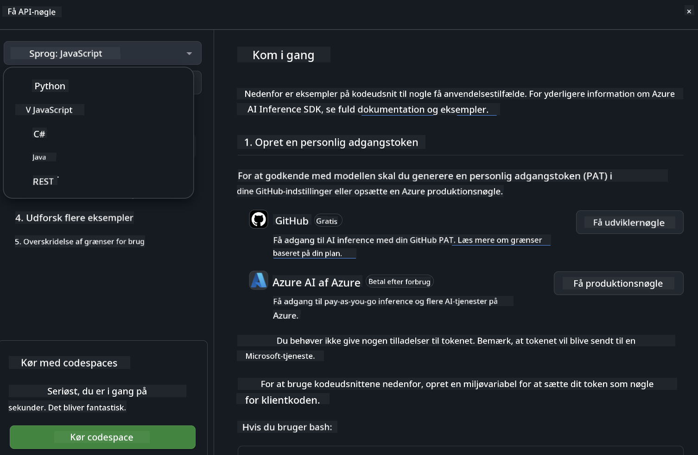
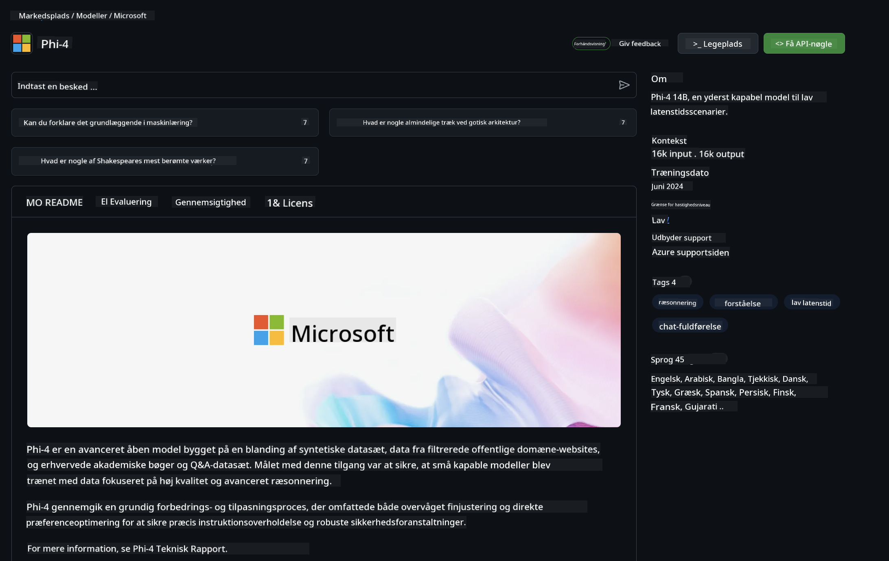

<!--
CO_OP_TRANSLATOR_METADATA:
{
  "original_hash": "5113634b77370af6790f9697d5d7de90",
  "translation_date": "2025-07-17T05:37:48+00:00",
  "source_file": "md/02.QuickStart/GitHubModel_QuickStart.md",
  "language_code": "da"
}
-->
## GitHub Models - Begrænset offentlig beta

Velkommen til [GitHub Models](https://github.com/marketplace/models)! Vi har alt klar til dig, så du kan udforske AI-modeller hostet på Azure AI.


For mere information om de modeller, der er tilgængelige på GitHub Models, se [GitHub Model Marketplace](https://github.com/marketplace/models)

## Tilgængelige modeller

Hver model har en dedikeret playground og eksempelkode


### Phi-3 modeller i GitHub Model Catalog

[Phi-3-Medium-128k-Instruct](https://github.com/marketplace/models/azureml/Phi-3-medium-128k-instruct)

[Phi-3-medium-4k-instruct](https://github.com/marketplace/models/azureml/Phi-3-medium-4k-instruct)

[Phi-3-mini-128k-instruct](https://github.com/marketplace/models/azureml/Phi-3-mini-128k-instruct)

[Phi-3-mini-4k-instruct](https://github.com/marketplace/models/azureml/Phi-3-mini-4k-instruct)

[Phi-3-small-128k-instruct](https://github.com/marketplace/models/azureml/Phi-3-small-128k-instruct)

[Phi-3-small-8k-instruct](https://github.com/marketplace/models/azureml/Phi-3-small-8k-instruct)

## Kom godt i gang

Der er nogle grundlæggende eksempler klar til dig at køre. Du kan finde dem i samples-mappen. Hvis du vil springe direkte til dit foretrukne sprog, kan du finde eksemplerne i følgende sprog:

- Python
- JavaScript
- cURL

Der findes også et dedikeret Codespaces-miljø til at køre samples og modeller.



## Eksempelkode

Nedenfor er eksempler på kode til nogle få brugsscenarier. For yderligere information om Azure AI Inference SDK, se fuld dokumentation og eksempler.

## Opsætning

1. Opret en personlig adgangstoken  
Du behøver ikke give nogen tilladelser til tokenet. Bemærk, at tokenet vil blive sendt til en Microsoft-tjeneste.

For at bruge kodeeksemplerne nedenfor, opret en miljøvariabel, der sætter dit token som nøgle for klientkoden.

Hvis du bruger bash:  
```
export GITHUB_TOKEN="<your-github-token-goes-here>"
```  
Hvis du bruger powershell:  

```
$Env:GITHUB_TOKEN="<your-github-token-goes-here>"
```  

Hvis du bruger Windows kommandoprompt:  

```
set GITHUB_TOKEN=<your-github-token-goes-here>
```  

## Python-eksempel

### Installer afhængigheder  
Installer Azure AI Inference SDK med pip (kræver: Python >=3.8):

```
pip install azure-ai-inference
```  
### Kør et grundlæggende kodeeksempel

Dette eksempel viser et grundlæggende kald til chat completion API’en. Det bruger GitHub AI model inference endpoint og dit GitHub-token. Kaldet er synkront.

```
import os
from azure.ai.inference import ChatCompletionsClient
from azure.ai.inference.models import SystemMessage, UserMessage
from azure.core.credentials import AzureKeyCredential

endpoint = "https://models.inference.ai.azure.com"
# Replace Model_Name 
model_name = "Phi-3-small-8k-instruct"
token = os.environ["GITHUB_TOKEN"]

client = ChatCompletionsClient(
    endpoint=endpoint,
    credential=AzureKeyCredential(token),
)

response = client.complete(
    messages=[
        SystemMessage(content="You are a helpful assistant."),
        UserMessage(content="What is the capital of France?"),
    ],
    model=model_name,
    temperature=1.,
    max_tokens=1000,
    top_p=1.
)

print(response.choices[0].message.content)
```

### Kør en samtale med flere runder

Dette eksempel viser en samtale med flere runder med chat completion API’en. Når du bruger modellen til en chatapplikation, skal du håndtere samtalehistorikken og sende de seneste beskeder til modellen.

```
import os
from azure.ai.inference import ChatCompletionsClient
from azure.ai.inference.models import AssistantMessage, SystemMessage, UserMessage
from azure.core.credentials import AzureKeyCredential

token = os.environ["GITHUB_TOKEN"]
endpoint = "https://models.inference.ai.azure.com"
# Replace Model_Name
model_name = "Phi-3-small-8k-instruct"

client = ChatCompletionsClient(
    endpoint=endpoint,
    credential=AzureKeyCredential(token),
)

messages = [
    SystemMessage(content="You are a helpful assistant."),
    UserMessage(content="What is the capital of France?"),
    AssistantMessage(content="The capital of France is Paris."),
    UserMessage(content="What about Spain?"),
]

response = client.complete(messages=messages, model=model_name)

print(response.choices[0].message.content)
```

### Stream outputtet

For en bedre brugeroplevelse vil du gerne streame modellens svar, så det første token vises tidligt, og du undgår at vente på lange svar.

```
import os
from azure.ai.inference import ChatCompletionsClient
from azure.ai.inference.models import SystemMessage, UserMessage
from azure.core.credentials import AzureKeyCredential

token = os.environ["GITHUB_TOKEN"]
endpoint = "https://models.inference.ai.azure.com"
# Replace Model_Name
model_name = "Phi-3-small-8k-instruct"

client = ChatCompletionsClient(
    endpoint=endpoint,
    credential=AzureKeyCredential(token),
)

response = client.complete(
    stream=True,
    messages=[
        SystemMessage(content="You are a helpful assistant."),
        UserMessage(content="Give me 5 good reasons why I should exercise every day."),
    ],
    model=model_name,
)

for update in response:
    if update.choices:
        print(update.choices[0].delta.content or "", end="")

client.close()
```  
## JavaScript

### Installer afhængigheder

Installer Node.js.

Kopier følgende tekstlinjer og gem dem som en fil package.json i din mappe.

```
{
  "type": "module",
  "dependencies": {
    "@azure-rest/ai-inference": "latest",
    "@azure/core-auth": "latest",
    "@azure/core-sse": "latest"
  }
}
```

Bemærk: @azure/core-sse er kun nødvendigt, når du streamer chat completion-svar.

Åbn et terminalvindue i denne mappe og kør npm install.

For hvert af kodeeksemplerne nedenfor, kopier indholdet til en fil sample.js og kør med node sample.js.

### Kør et grundlæggende kodeeksempel

Dette eksempel viser et grundlæggende kald til chat completion API’en. Det bruger GitHub AI model inference endpoint og dit GitHub-token. Kaldet er synkront.

```
import ModelClient from "@azure-rest/ai-inference";
import { AzureKeyCredential } from "@azure/core-auth";

const token = process.env["GITHUB_TOKEN"];
const endpoint = "https://models.inference.ai.azure.com";
// Update your modelname
const modelName = "Phi-3-small-8k-instruct";

export async function main() {

  const client = new ModelClient(endpoint, new AzureKeyCredential(token));

  const response = await client.path("/chat/completions").post({
    body: {
      messages: [
        { role:"system", content: "You are a helpful assistant." },
        { role:"user", content: "What is the capital of France?" }
      ],
      model: modelName,
      temperature: 1.,
      max_tokens: 1000,
      top_p: 1.
    }
  });

  if (response.status !== "200") {
    throw response.body.error;
  }
  console.log(response.body.choices[0].message.content);
}

main().catch((err) => {
  console.error("The sample encountered an error:", err);
});
```

### Kør en samtale med flere runder

Dette eksempel viser en samtale med flere runder med chat completion API’en. Når du bruger modellen til en chatapplikation, skal du håndtere samtalehistorikken og sende de seneste beskeder til modellen.

```
import ModelClient from "@azure-rest/ai-inference";
import { AzureKeyCredential } from "@azure/core-auth";

const token = process.env["GITHUB_TOKEN"];
const endpoint = "https://models.inference.ai.azure.com";
// Update your modelname
const modelName = "Phi-3-small-8k-instruct";

export async function main() {

  const client = new ModelClient(endpoint, new AzureKeyCredential(token));

  const response = await client.path("/chat/completions").post({
    body: {
      messages: [
        { role: "system", content: "You are a helpful assistant." },
        { role: "user", content: "What is the capital of France?" },
        { role: "assistant", content: "The capital of France is Paris." },
        { role: "user", content: "What about Spain?" },
      ],
      model: modelName,
    }
  });

  if (response.status !== "200") {
    throw response.body.error;
  }

  for (const choice of response.body.choices) {
    console.log(choice.message.content);
  }
}

main().catch((err) => {
  console.error("The sample encountered an error:", err);
});
```

### Stream outputtet  
For en bedre brugeroplevelse vil du gerne streame modellens svar, så det første token vises tidligt, og du undgår at vente på lange svar.

```
import ModelClient from "@azure-rest/ai-inference";
import { AzureKeyCredential } from "@azure/core-auth";
import { createSseStream } from "@azure/core-sse";

const token = process.env["GITHUB_TOKEN"];
const endpoint = "https://models.inference.ai.azure.com";
// Update your modelname
const modelName = "Phi-3-small-8k-instruct";

export async function main() {

  const client = new ModelClient(endpoint, new AzureKeyCredential(token));

  const response = await client.path("/chat/completions").post({
    body: {
      messages: [
        { role: "system", content: "You are a helpful assistant." },
        { role: "user", content: "Give me 5 good reasons why I should exercise every day." },
      ],
      model: modelName,
      stream: true
    }
  }).asNodeStream();

  const stream = response.body;
  if (!stream) {
    throw new Error("The response stream is undefined");
  }

  if (response.status !== "200") {
    stream.destroy();
    throw new Error(`Failed to get chat completions, http operation failed with ${response.status} code`);
  }

  const sseStream = createSseStream(stream);

  for await (const event of sseStream) {
    if (event.data === "[DONE]") {
      return;
    }
    for (const choice of (JSON.parse(event.data)).choices) {
        process.stdout.write(choice.delta?.content ?? ``);
    }
  }
}

main().catch((err) => {
  console.error("The sample encountered an error:", err);
});
```

## REST

### Kør et grundlæggende kodeeksempel

Indsæt følgende i en shell:

```
curl -X POST "https://models.inference.ai.azure.com/chat/completions" \
    -H "Content-Type: application/json" \
    -H "Authorization: Bearer $GITHUB_TOKEN" \
    -d '{
        "messages": [
            {
                "role": "system",
                "content": "You are a helpful assistant."
            },
            {
                "role": "user",
                "content": "What is the capital of France?"
            }
        ],
        "model": "Phi-3-small-8k-instruct"
    }'
```  
### Kør en samtale med flere runder

Kald chat completion API’en og send samtalehistorikken:

```
curl -X POST "https://models.inference.ai.azure.com/chat/completions" \
    -H "Content-Type: application/json" \
    -H "Authorization: Bearer $GITHUB_TOKEN" \
    -d '{
        "messages": [
            {
                "role": "system",
                "content": "You are a helpful assistant."
            },
            {
                "role": "user",
                "content": "What is the capital of France?"
            },
            {
                "role": "assistant",
                "content": "The capital of France is Paris."
            },
            {
                "role": "user",
                "content": "What about Spain?"
            }
        ],
        "model": "Phi-3-small-8k-instruct"
    }'
```  
### Stream outputtet

Dette er et eksempel på at kalde endpointet og streame svaret.

```
curl -X POST "https://models.inference.ai.azure.com/chat/completions" \
    -H "Content-Type: application/json" \
    -H "Authorization: Bearer $GITHUB_TOKEN" \
    -d '{
        "messages": [
            {
                "role": "system",
                "content": "You are a helpful assistant."
            },
            {
                "role": "user",
                "content": "Give me 5 good reasons why I should exercise every day."
            }
        ],
        "stream": true,
        "model": "Phi-3-small-8k-instruct"
    }'
```

## GRATIS brug og grænser for GitHub Models



[Rate limits for playground og gratis API-brug](https://docs.github.com/en/github-models/prototyping-with-ai-models#rate-limits) er designet til at hjælpe dig med at eksperimentere med modeller og prototype din AI-applikation. For brug ud over disse grænser, og for at skalere din applikation, skal du tildele ressourcer fra en Azure-konto og autentificere derfra i stedet for med dit GitHub personlige adgangstoken. Du behøver ikke ændre noget andet i din kode. Brug dette link for at finde ud af, hvordan du går ud over gratisgrænserne i Azure AI.

### Oplysninger

Husk, at når du interagerer med en model, eksperimenterer du med AI, så fejl i indhold kan forekomme.

Funktionen er underlagt forskellige begrænsninger (herunder anmodninger pr. minut, anmodninger pr. dag, tokens pr. anmodning og samtidige anmodninger) og er ikke designet til produktionsbrug.

GitHub Models bruger Azure AI Content Safety. Disse filtre kan ikke slås fra som en del af GitHub Models-oplevelsen. Hvis du vælger at bruge modeller gennem en betalt tjeneste, skal du konfigurere dine indholdsfiltre, så de opfylder dine krav.

Denne tjeneste er underlagt GitHubs Pre-release Terms.

**Ansvarsfraskrivelse**:  
Dette dokument er blevet oversat ved hjælp af AI-oversættelsestjenesten [Co-op Translator](https://github.com/Azure/co-op-translator). Selvom vi bestræber os på nøjagtighed, bedes du være opmærksom på, at automatiserede oversættelser kan indeholde fejl eller unøjagtigheder. Det oprindelige dokument på dets oprindelige sprog bør betragtes som den autoritative kilde. For kritisk information anbefales professionel menneskelig oversættelse. Vi påtager os intet ansvar for misforståelser eller fejltolkninger, der opstår som følge af brugen af denne oversættelse.