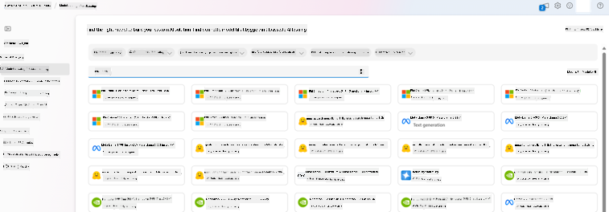
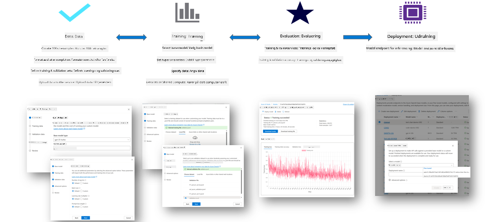
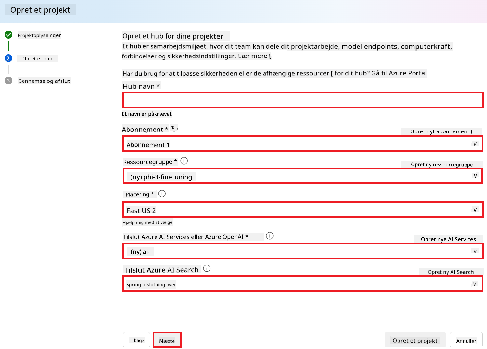
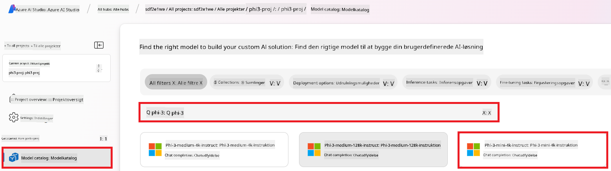
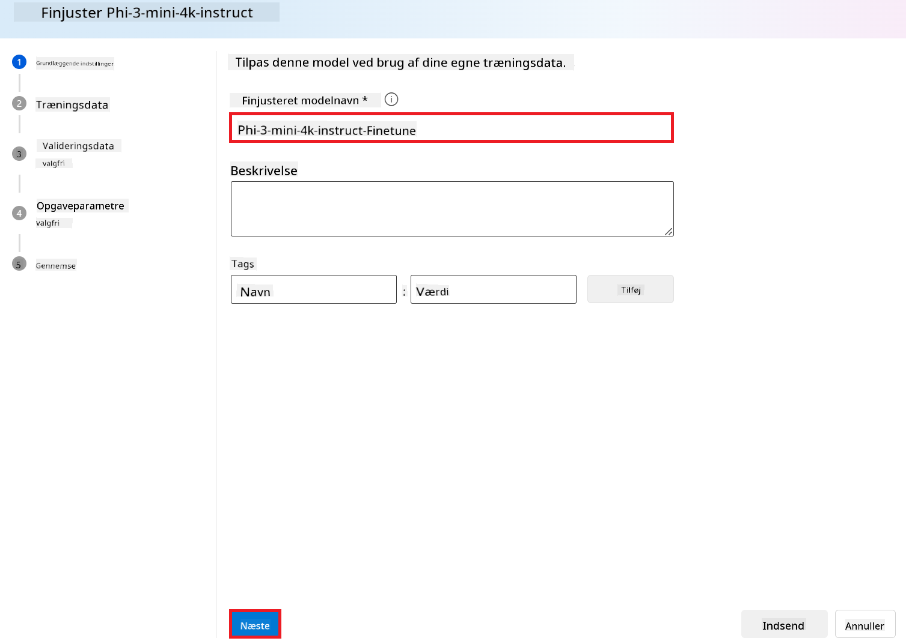
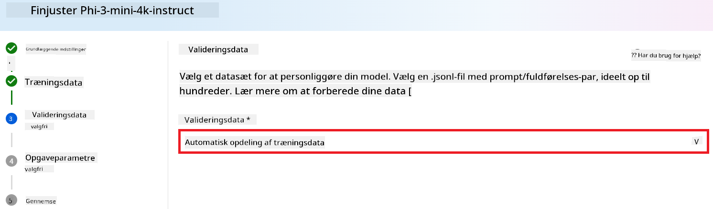
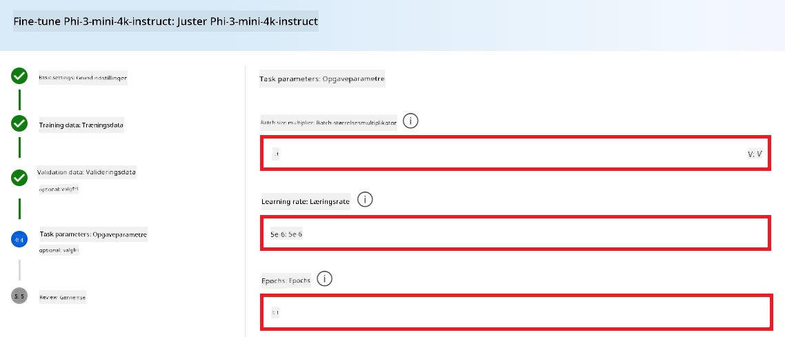
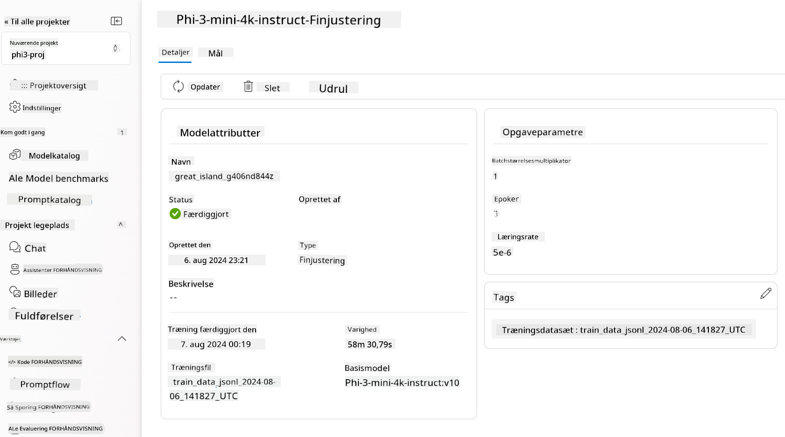

<!--
CO_OP_TRANSLATOR_METADATA:
{
  "original_hash": "c1559c5af6caccf6f623fd43a6b3a9a3",
  "translation_date": "2025-05-09T20:32:25+00:00",
  "source_file": "md/03.FineTuning/FineTuning_AIFoundry.md",
  "language_code": "da"
}
-->
# Finjustering af Phi-3 med Azure AI Foundry

Lad os undersøge, hvordan man finjusterer Microsofts Phi-3 Mini sprogmodel ved hjælp af Azure AI Foundry. Finjustering gør det muligt at tilpasse Phi-3 Mini til specifikke opgaver, hvilket gør den endnu mere kraftfuld og kontekstbevidst.

## Overvejelser

- **Funktioner:** Hvilke modeller kan finjusteres? Hvad kan basismodellen finjusteres til at gøre?
- **Omkostninger:** Hvad er prismodellen for finjustering?
- **Tilpasning:** Hvor meget kan jeg ændre basismodellen – og på hvilke måder?
- **Bekvemmelighed:** Hvordan foregår finjusteringen i praksis – skal jeg skrive specialkode? Skal jeg medbringe egen compute?
- **Sikkerhed:** Finjusterede modeller kan have sikkerhedsrisici – er der nogen sikkerhedsforanstaltninger til at beskytte mod utilsigtet skade?



## Forberedelse til finjustering

### Forudsætninger

> [!NOTE]
> For Phi-3 familie modeller er pay-as-you-go finjustering kun tilgængelig med hubs oprettet i **East US 2** regionerne.

- Et Azure abonnement. Hvis du ikke har et Azure abonnement, opret en [betalt Azure-konto](https://azure.microsoft.com/pricing/purchase-options/pay-as-you-go) for at komme i gang.

- Et [AI Foundry projekt](https://ai.azure.com?WT.mc_id=aiml-138114-kinfeylo).
- Azure rollebaseret adgangskontrol (Azure RBAC) bruges til at give adgang til operationer i Azure AI Foundry. For at udføre trinene i denne artikel skal din brugerkonto have tildelt __Azure AI Developer-rollen__ på ressourcegruppen.

### Registrering af abonnementets udbyder

Bekræft, at abonnementet er registreret til `Microsoft.Network` resource provideren.

1. Log ind på [Azure-portalen](https://portal.azure.com).
1. Vælg **Subscriptions** i venstremenuen.
1. Vælg det abonnement, du vil bruge.
1. Vælg **AI project settings** > **Resource providers** i venstremenuen.
1. Bekræft, at **Microsoft.Network** er på listen over resource providere. Tilføj det ellers.

### Dataforberedelse

Forbered dine trænings- og valideringsdata til finjustering af din model. Dine trænings- og valideringsdatasæt består af input- og outputeksempler på, hvordan du ønsker modellen skal præstere.

Sørg for, at alle dine træningseksempler følger det forventede format til inferens. For effektiv finjustering skal datasættet være balanceret og varieret.

Det indebærer at opretholde databalancen, inkludere forskellige scenarier og løbende forfine træningsdata for at matche virkelige forventninger, hvilket i sidste ende fører til mere præcise og balancerede modelrespons.

Forskellige modeltyper kræver forskellige formater af træningsdata.

### Chat Completion

De trænings- og valideringsdata, du bruger, **skal** være formateret som et JSON Lines (JSONL) dokument. For `Phi-3-mini-128k-instruct` skal finjusteringsdatasættet være i det konversationsformat, som Chat completions API bruger.

### Eksempel på filformat

```json
    {"messages": [{"role": "system", "content": "You are an Xbox customer support agent whose primary goal is to help users with issues they are experiencing with their Xbox devices. You are friendly and concise. You only provide factual answers to queries, and do not provide answers that are not related to Xbox."}, {"role": "user", "content": "Is Xbox better than PlayStation?"}, {"role": "assistant", "content": "I apologize, but I cannot provide personal opinions. My primary job is to assist you with any issues related to your Xbox device. Do you have any Xbox-related issues that need addressing?"}]}
    {"messages": [{"role": "system", "content": "You are an Xbox customer support agent whose primary goal is to help users with issues they are experiencing with their Xbox devices. You are friendly and concise. You only provide factual answers to queries, and do not provide answers that are not related to Xbox."}, {"role": "user", "content": "Can I play PC games on my Xbox?"}, {"role": "assistant", "content": "While Xbox consoles don't natively support PC games, they can play an array of Xbox games, many of which are also available on PC. Can I assist you with finding games compatible with your Xbox device?"}]}
    {"messages": [{"role": "system", "content": "You are an Xbox customer support agent whose primary goal is to help users with issues they are experiencing with their Xbox devices. You are friendly and concise. You only provide factual answers to queries, and do not provide answers that are not related to Xbox."}, {"role": "user", "content": "I'm having trouble connecting my Xbox to the Wi-Fi."}, {"role": "assistant", "content": "No worries, let's go through the network settings on your Xbox. Can you please tell me what happens when you try to connect it to the Wi-Fi?"}]}
```

Den understøttede filtype er JSON Lines. Filer uploades til standard datalager og bliver tilgængelige i dit projekt.

## Finjustering af Phi-3 med Azure AI Foundry

Azure AI Foundry giver dig mulighed for at skræddersy store sprogmodeller til dine egne datasæt ved hjælp af en proces kaldet finjustering. Finjustering giver stor værdi ved at muliggøre tilpasning og optimering til specifikke opgaver og anvendelser. Det fører til forbedret ydeevne, omkostningseffektivitet, reduceret ventetid og skræddersyede output.



### Opret et nyt projekt

1. Log ind på [Azure AI Foundry](https://ai.azure.com).

1. Vælg **+New project** for at oprette et nyt projekt i Azure AI Foundry.

    

1. Udfør følgende opgaver:

    - Projektets **Hub name**. Det skal være et unikt navn.
    - Vælg den **Hub**, du vil bruge (opret en ny, hvis nødvendigt).

    

1. Udfør følgende for at oprette en ny hub:

    - Indtast **Hub name**. Det skal være unikt.
    - Vælg dit Azure **Subscription**.
    - Vælg den **Resource group**, du vil bruge (opret en ny, hvis nødvendigt).
    - Vælg den **Location**, du ønsker at bruge.
    - Vælg **Connect Azure AI Services** (opret en ny, hvis nødvendigt).
    - Vælg **Connect Azure AI Search** og vælg **Skip connecting**.

    

1. Vælg **Next**.
1. Vælg **Create a project**.

### Dataforberedelse

Inden finjustering, saml eller opret et datasæt relevant for din opgave, såsom chat-instruktioner, spørgsmål-svar par eller anden relevant tekstdata. Rens og forbehandl dataene ved at fjerne støj, håndtere manglende værdier og tokenisere teksten.

### Finjuster Phi-3 modeller i Azure AI Foundry

> [!NOTE]
> Finjustering af Phi-3 modeller understøttes i øjeblikket kun i projekter placeret i East US 2.

1. Vælg **Model catalog** i venstre sidepanel.

1. Skriv *phi-3* i **søgefeltet** og vælg den phi-3 model, du vil bruge.

    

1. Vælg **Fine-tune**.

    

1. Indtast navnet på den **Fine-tuned model**.

    

1. Vælg **Next**.

1. Udfør følgende:

    - Vælg **task type** til **Chat completion**.
    - Vælg de **Training data**, du vil bruge. Du kan uploade det via Azure AI Foundry's data eller fra dit lokale miljø.

    

1. Vælg **Next**.

1. Upload de **Validation data**, du vil bruge, eller vælg **Automatic split of training data**.

    

1. Vælg **Next**.

1. Udfør følgende:

    - Vælg den ønskede **Batch size multiplier**.
    - Vælg den ønskede **Learning rate**.
    - Vælg det ønskede antal **Epochs**.

    

1. Vælg **Submit** for at starte finjusteringsprocessen.

    

1. Når din model er finjusteret, vil status blive vist som **Completed**, som vist på billedet nedenfor. Nu kan du implementere modellen og bruge den i din egen applikation, i playground eller i prompt flow. For mere information, se [How to deploy Phi-3 family of small language models with Azure AI Foundry](https://learn.microsoft.com/azure/ai-studio/how-to/deploy-models-phi-3?tabs=phi-3-5&pivots=programming-language-python).

    

> [!NOTE]
> For mere detaljeret information om finjustering af Phi-3, besøg venligst [Fine-tune Phi-3 models in Azure AI Foundry](https://learn.microsoft.com/azure/ai-studio/how-to/fine-tune-phi-3?tabs=phi-3-mini).

## Ryd op i dine finjusterede modeller

Du kan slette en finjusteret model fra listen over finjusterede modeller i [Azure AI Foundry](https://ai.azure.com) eller fra modelsiden. Vælg den finjusterede model, du vil slette, på finjusteringssiden, og vælg derefter Slet-knappen for at fjerne modellen.

> [!NOTE]
> Du kan ikke slette en brugerdefineret model, hvis den har en eksisterende implementering. Du skal først slette din modelimplementering, før du kan slette den brugerdefinerede model.

## Omkostninger og kvoter

### Omkostnings- og kvoteovervejelser for Phi-3 modeller finjusteret som en service

Phi-modeller finjusteret som en service tilbydes af Microsoft og er integreret med Azure AI Foundry til brug. Du kan finde prisen ved [implementering](https://learn.microsoft.com/azure/ai-studio/how-to/deploy-models-phi-3?tabs=phi-3-5&pivots=programming-language-python) eller finjustering af modellerne under fanen Pricing and terms i implementeringsguiden.

## Indholdsfiltrering

Modeller implementeret som en pay-as-you-go service er beskyttet af Azure AI Content Safety. Når de implementeres til realtidsendpoints, kan du vælge at fravælge denne funktion. Med Azure AI Content Safety aktiveret, bliver både prompt og completion gennemgået af en række klassifikationsmodeller, der har til formål at opdage og forhindre output af skadeligt indhold. Systemet opdager og reagerer på specifikke kategorier af potentielt skadeligt indhold i både input prompts og output completions. Læs mere om [Azure AI Content Safety](https://learn.microsoft.com/azure/ai-studio/concepts/content-filtering).

**Finjusteringskonfiguration**

Hyperparametre: Definer hyperparametre som læringsrate, batch-størrelse og antal trænings-epochs.

**Lossfunktion**

Vælg en passende lossfunktion til din opgave (f.eks. cross-entropy).

**Optimeringsmetode**

Vælg en optimizer (f.eks. Adam) til gradientopdateringer under træning.

**Finjusteringsproces**

- Indlæs fortrænet model: Indlæs Phi-3 Mini checkpoint.
- Tilføj brugerdefinerede lag: Tilføj opgavespecifikke lag (f.eks. klassifikationshoved til chat-instruktioner).

**Træn modellen**  
Finjuster modellen med dit forberedte datasæt. Overvåg træningsforløbet og juster hyperparametre efter behov.

**Evaluering og validering**

Valideringssæt: Del dine data op i trænings- og valideringssæt.

**Evaluer ydeevne**

Brug metrikker som nøjagtighed, F1-score eller perplexity til at vurdere modellens ydeevne.

## Gem den finjusterede model

**Checkpoint**  
Gem det finjusterede model-checkpoint til fremtidig brug.

## Implementering

- Implementer som webservice: Implementer din finjusterede model som en webservice i Azure AI Foundry.
- Test endpoint: Send testforespørgsler til det implementerede endpoint for at verificere funktionaliteten.

## Iterer og forbedr

Iterer: Hvis ydeevnen ikke er tilfredsstillende, juster hyperparametre, tilføj mere data eller finjuster i flere epochs.

## Overvåg og forfin

Overvåg løbende modellens adfærd og forfin efter behov.

## Tilpas og udvid

Brugertilpassede opgaver: Phi-3 Mini kan finjusteres til mange forskellige opgaver ud over chat-instruktioner. Udforsk andre anvendelser!  
Eksperimenter: Prøv forskellige arkitekturer, lagkombinationer og teknikker for at forbedre ydeevnen.

> [!NOTE]
> Finjustering er en iterativ proces. Eksperimenter, lær og tilpas din model for at opnå de bedste resultater til din specifikke opgave!

**Ansvarsfraskrivelse**:  
Dette dokument er blevet oversat ved hjælp af AI-oversættelsestjenesten [Co-op Translator](https://github.com/Azure/co-op-translator). Selvom vi bestræber os på nøjagtighed, bedes du være opmærksom på, at automatiserede oversættelser kan indeholde fejl eller unøjagtigheder. Det oprindelige dokument på dets oprindelige sprog bør betragtes som den autoritative kilde. For kritisk information anbefales professionel menneskelig oversættelse. Vi påtager os intet ansvar for eventuelle misforståelser eller fejltolkninger, der opstår som følge af brugen af denne oversættelse.