# Finjustering af Phi-3 med Microsoft Foundry

Lad os udforske, hvordan man finjusterer Microsofts sprogmodel Phi-3 Mini ved hjælp af Microsoft Foundry. Finjustering giver dig mulighed for at tilpasse Phi-3 Mini til specifikke opgaver, hvilket gør den endnu mere kraftfuld og kontekstbevidst.

## Overvejelser

- **Funktioner:** Hvilke modeller kan finjusteres? Hvad kan basismodellen finjusteres til at gøre?
- **Omkostninger:** Hvad er prismodellen for finjustering?
- **Tilpasningsmuligheder:** Hvor meget kan jeg ændre på basismodellen – og på hvilke måder?
- **Bekvemmelighed:** Hvordan foregår finjusteringen egentlig – skal jeg skrive tilpasset kode? Skal jeg medbringe min egen compute?
- **Sikkerhed:** Finjusterede modeller er kendt for at have sikkerhedsrisici – er der nogle sikkerhedsforanstaltninger på plads for at beskytte mod utilsigtet skade?

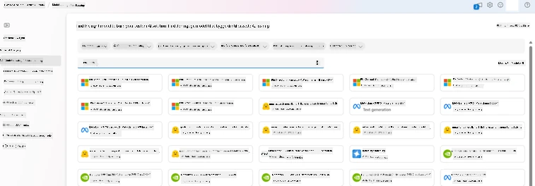

## Forberedelse til finjustering

### Forudsætninger

> [!NOTE]
> For Phi-3 familie modeller er pay-as-you-go modellen for finjustering kun tilgængelig med hubs oprettet i **East US 2** regionerne.

- Et Azure-abonnement. Hvis du ikke har et Azure-abonnement, skal du oprette en [betalt Azure-konto](https://azure.microsoft.com/pricing/purchase-options/pay-as-you-go) for at komme i gang.

- Et [AI Foundry-projekt](https://ai.azure.com?WT.mc_id=aiml-138114-kinfeylo).
- Azure rollebaserede adgangskontroller (Azure RBAC) bruges til at give adgang til operationer i Microsoft Foundry. For at udføre trinene i denne artikel skal din brugerkonto have tildelt __Azure AI Developer-rollen__ på ressourcegruppen.

### Registrering af abonnementsudbyder

Bekræft, at abonnementet er registreret til ressourceudbyderen `Microsoft.Network`.

1. Log ind på [Azure-portalen](https://portal.azure.com).
1. Vælg **Abonnementer** i venstremenuen.
1. Vælg det abonnement, du vil bruge.
1. Vælg **AI-projektindstillinger** > **Ressourceudbydere** i venstremenuen.
1. Bekræft, at **Microsoft.Network** er på listen over ressourceudbydere. Tilføj det ellers.

### Dataklargøring

Forbered dine trænings- og valideringsdata til finjusteringen af din model. Dine trænings- og valideringsdatasæt består af input- og outputeksempler på, hvordan du ønsker modellen skal opføre sig.

Sørg for, at alle dine træningseksempler følger det forventede format for inferens. For effektiv finjustering af modeller skal dataset være balanceret og varieret.

Dette indebærer at opretholde databalancen, inkludere forskellige scenarier og løbende forfine træningsdataene for at afspejle virkelighedens forventninger, hvilket i sidste ende fører til mere nøjagtige og afbalancerede modelrespons.

Forskellige modeltyper kræver forskellige formater til træningsdata.

### Chat Completion

De trænings- og valideringsdata, du bruger, **skal** være formateret som et JSON Lines (JSONL) dokument. For `Phi-3-mini-128k-instruct` skal finjusteringsdatasættet være formateret i det konverserende format, der bruges af Chat completion API'en.

### Eksempel på filformat

```json
    {"messages": [{"role": "system", "content": "You are an Xbox customer support agent whose primary goal is to help users with issues they are experiencing with their Xbox devices. You are friendly and concise. You only provide factual answers to queries, and do not provide answers that are not related to Xbox."}, {"role": "user", "content": "Is Xbox better than PlayStation?"}, {"role": "assistant", "content": "I apologize, but I cannot provide personal opinions. My primary job is to assist you with any issues related to your Xbox device. Do you have any Xbox-related issues that need addressing?"}]}
    {"messages": [{"role": "system", "content": "You are an Xbox customer support agent whose primary goal is to help users with issues they are experiencing with their Xbox devices. You are friendly and concise. You only provide factual answers to queries, and do not provide answers that are not related to Xbox."}, {"role": "user", "content": "Can I play PC games on my Xbox?"}, {"role": "assistant", "content": "While Xbox consoles don't natively support PC games, they can play an array of Xbox games, many of which are also available on PC. Can I assist you with finding games compatible with your Xbox device?"}]}
    {"messages": [{"role": "system", "content": "You are an Xbox customer support agent whose primary goal is to help users with issues they are experiencing with their Xbox devices. You are friendly and concise. You only provide factual answers to queries, and do not provide answers that are not related to Xbox."}, {"role": "user", "content": "I'm having trouble connecting my Xbox to the Wi-Fi."}, {"role": "assistant", "content": "No worries, let's go through the network settings on your Xbox. Can you please tell me what happens when you try to connect it to the Wi-Fi?"}]}
```

Den understøttede filtype er JSON Lines. Filer uploades til standarddatastore og gøres tilgængelige i dit projekt.

## Finjustering af Phi-3 med Microsoft Foundry

Microsoft Foundry gør det muligt at tilpasse store sprogmodeller til dine personlige datasæt ved hjælp af en proces kaldet finjustering. Finjustering giver stor værdi ved at muliggøre tilpasning og optimering til specifikke opgaver og anvendelser. Det fører til forbedret ydeevne, omkostningseffektivitet, reduceret latenstid og skræddersyede output.

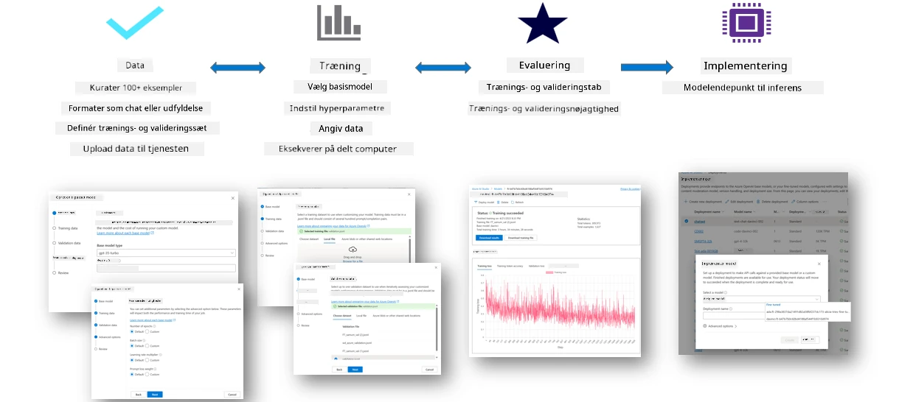

### Opret et nyt projekt

1. Log ind på [Microsoft Foundry](https://ai.azure.com).

1. Vælg **+Nyt projekt** for at oprette et nyt projekt i Microsoft Foundry.

    

1. Udfør følgende opgaver:

    - Projekts **Hub-navn**. Det skal være en unik værdi.
    - Vælg den **Hub**, der skal bruges (opret evt. en ny).

    

1. Udfør følgende opgaver for at oprette en ny hub:

    - Indtast **Hub-navn**. Det skal være en unik værdi.
    - Vælg dit Azure-**Abonnement**.
    - Vælg den **Ressourcegruppe**, der skal bruges (opret evt. en ny).
    - Vælg den **Placering**, du ønsker at bruge.
    - Vælg **Tilslut Azure AI Services** til brug (opret evt. en ny).
    - Vælg **Tilslut Azure AI Search** for at **springe tilslutning over**.

    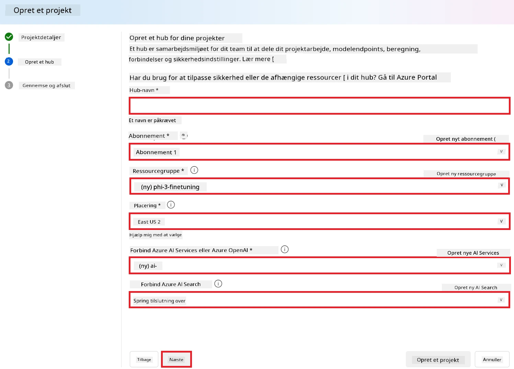

1. Vælg **Næste**.
1. Vælg **Opret et projekt**.

### Dataklargøring

Inden finjustering skal du samle eller oprette et datasæt relevant for din opgave, såsom chatinstruktioner, spørgsmål-svar-par eller andre relevante tekstdata. Rens og forbehandle disse data ved at fjerne støj, håndtere manglende værdier og tokenisere teksten.

### Finjuster Phi-3 modeller i Microsoft Foundry

> [!NOTE]
> Finjustering af Phi-3 modeller understøttes i øjeblikket kun i projekter placeret i East US 2.

1. Vælg **Modelkatalog** i venstre sidepanel.

1. Skriv *phi-3* i **søgefeltet** og vælg den phi-3 model, du gerne vil bruge.

    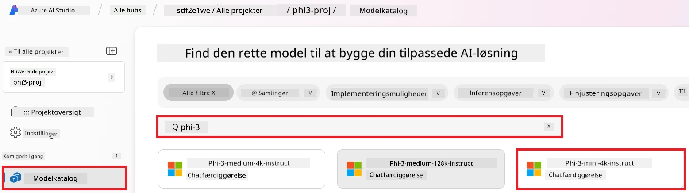

1. Vælg **Finjuster**.

    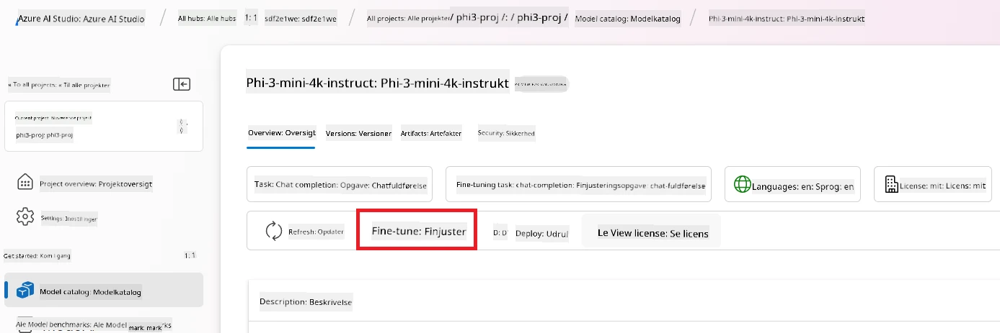

1. Indtast **navnet på den finjusterede model**.

    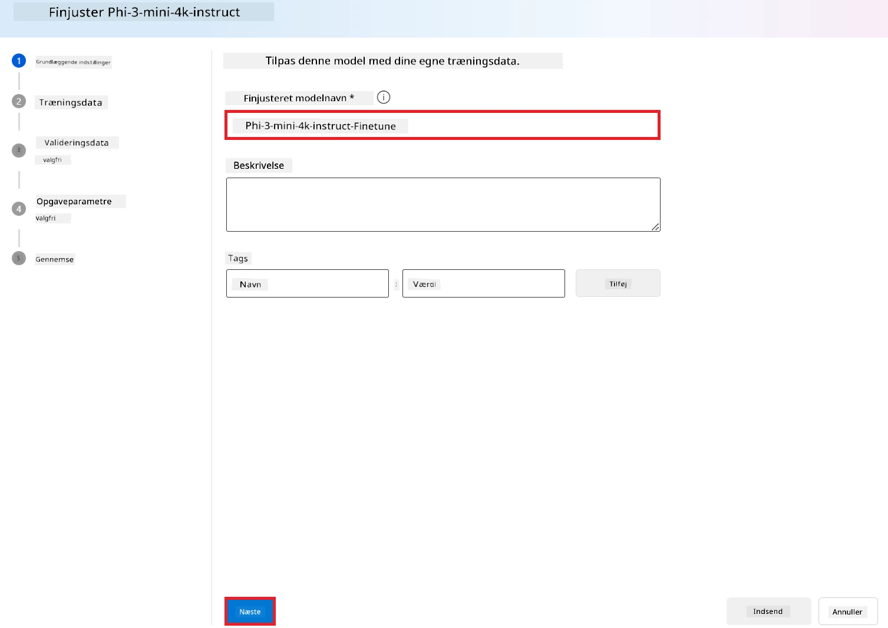

1. Vælg **Næste**.

1. Udfør følgende opgaver:

    - Vælg **opgavetype** til **Chat completion**.
    - Vælg det **træningsdata**, du ønsker at bruge. Du kan uploade det via Microsoft Foundrys data eller fra dit lokale miljø.

    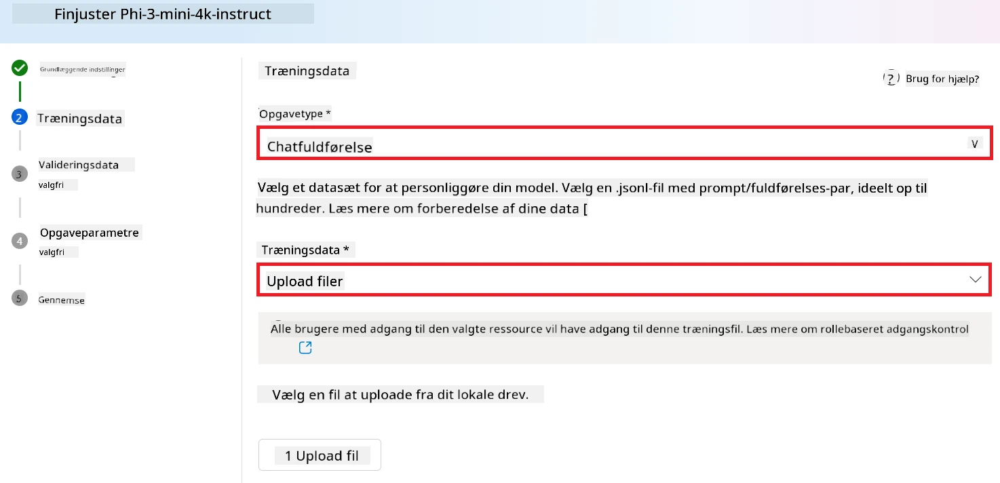

1. Vælg **Næste**.

1. Upload den **valideringsdata**, du ønsker at bruge, eller vælg **Automatisk opdeling af træningsdata**.

    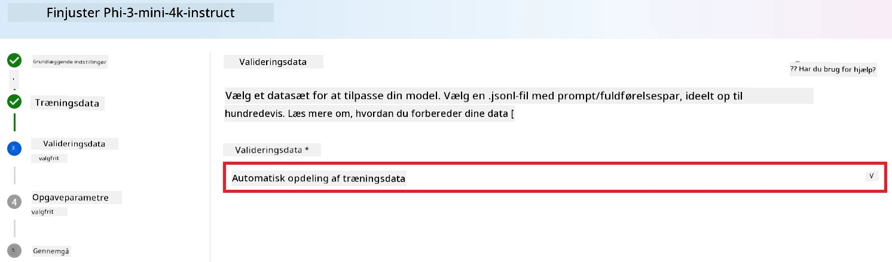

1. Vælg **Næste**.

1. Udfør følgende opgaver:

    - Vælg den ønskede **Batch size multiplier**.
    - Vælg den ønskede **Learning rate**.
    - Vælg de ønskede **Epochs**.

    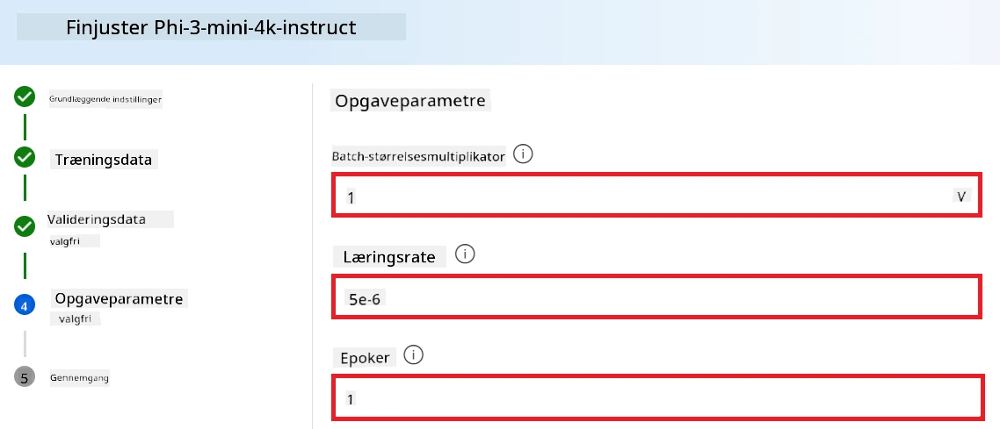

1. Vælg **Send** for at starte finjusteringsprocessen.

    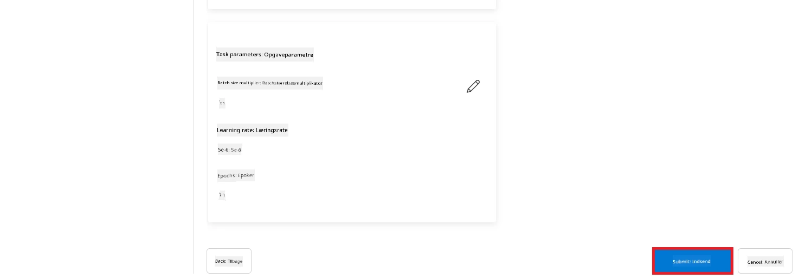

1. Når din model er finjusteret, vises status som **Fuldført**, som vist nedenfor. Nu kan du implementere modellen og bruge den i din egen applikation, i playground eller i prompt flow. For mere information, se [Sådan implementerer du Phi-3-familien af små sprogmodeller med Microsoft Foundry](https://learn.microsoft.com/azure/ai-studio/how-to/deploy-models-phi-3?tabs=phi-3-5&pivots=programming-language-python).

    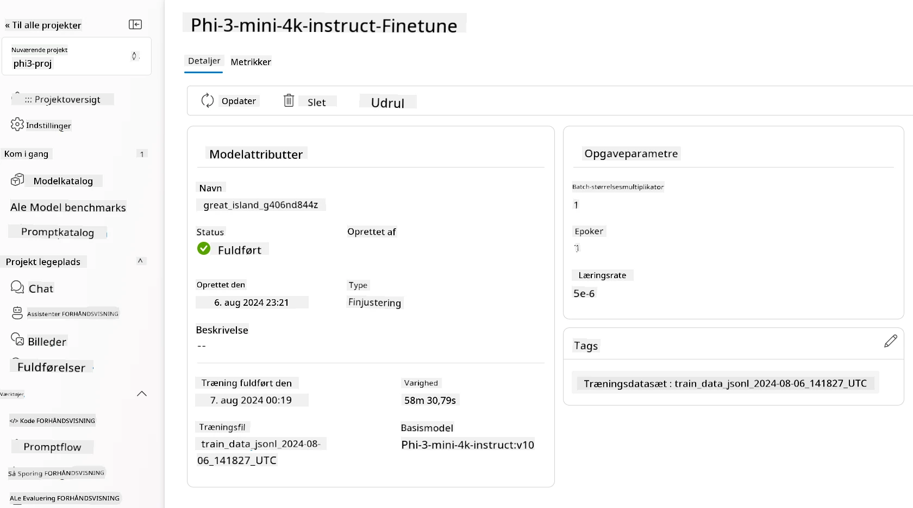

> [!NOTE]
> For mere detaljeret information om finjustering af Phi-3, besøg venligst [Finjuster Phi-3 modeller i Microsoft Foundry](https://learn.microsoft.com/azure/ai-studio/how-to/fine-tune-phi-3?tabs=phi-3-mini).

## Ryd op i dine finjusterede modeller

Du kan slette en finjusteret model fra listen over finjusterede modeller i [Microsoft Foundry](https://ai.azure.com) eller fra model-detaljesiden. Vælg den finjusterede model, du vil slette, fra finjusteringssiden, og vælg derefter Slet-knappen for at slette den finjusterede model.

> [!NOTE]
> Du kan ikke slette en brugerdefineret model, hvis den har en eksisterende implementering. Du skal først slette din modelimplementering, før du kan slette din brugerdefinerede model.

## Omkostninger og kvoter

### Omkostnings- og kvotebetragtninger for Phi-3 modeller finjusteret som service

Phi-modeller finjusteret som service tilbydes af Microsoft og er integreret med Microsoft Foundry til brug. Du kan finde prisen ved [implementering](https://learn.microsoft.com/azure/ai-studio/how-to/deploy-models-phi-3?tabs=phi-3-5&pivots=programming-language-python) eller finjustering af modellerne under fanen Priser og vilkår i implementerings-guiden.

## Indholdsfiltrering

Modeller implementeret som service med pay-as-you-go beskyttes af Azure AI Content Safety. Når de er implementeret til realtid endpoints, kan du fravælge denne funktionalitet. Med Azure AI content safety aktiveret passerer både prompt og completion igennem en samling af klassifikationsmodeller, der har til formål at opdage og forhindre output af skadeligt indhold. Systemet til indholdsfiltrering opdager og handler på specifikke kategorier af potentielt skadeligt indhold i både input-prompter og output-completions. Læs mere om [Azure AI Content Safety](https://learn.microsoft.com/azure/ai-studio/concepts/content-filtering).

**Finjusteringskonfiguration**

Hyperparametre: Definer hyperparametre såsom læringsrate, batchstørrelse og antal træningsepoker.

**Loss-funktion**

Vælg en passende loss-funktion til din opgave (f.eks. krydsentropi).

**Optimizer**

Vælg en optimizer (f.eks. Adam) til gradientopdateringer under træning.

**Finjusteringsproces**

- Indlæs forudtrænet model: Indlæs Phi-3 Mini checkpoint.
- Tilføj brugerdefinerede lag: Tilføj opgavespecifikke lag (f.eks. klassifikationshoved til chatinstruktioner).

**Træn modellen**

Finjuster modellen ved brug af dit forberedte datasæt. Overvåg træningsprogression og juster hyperparametre efter behov.

**Evaluering og validering**

Valideringssæt: Opdel dine data i trænings- og valideringssæt.

**Evaluer ydeevne**

Brug metrikker som nøjagtighed, F1-score eller perplexity til at vurdere modellens ydeevne.

## Gem finjusteret model

**Checkpoint**

Gem checkpoint for den finjusterede model til fremtidig brug.

## Implementering

- Implementer som en webservice: Implementer din finjusterede model som webservice i Microsoft Foundry.
- Test endpoint: Send testforespørgsler til det implementerede endpoint for at verificere funktionaliteten.

## Iterér og forbedr

Iterer: Hvis ydeevnen ikke er tilfredsstillende, iterer ved at justere hyperparametre, tilføje flere data eller finjustere i flere epoker.

## Overvåg og forfin

Overvåg løbende modellens adfærd og forfin efter behov.

## Tilpas og udvid

Brugerdefinerede opgaver: Phi-3 Mini kan finjusteres til forskellige opgaver udover chatinstruktioner. Udforsk andre anvendelsestilfælde!
Eksperimentér: Prøv forskellige arkitekturer, lagkombinationer og teknikker for at forbedre ydeevnen.

> [!NOTE]
> Finjustering er en iterativ proces. Eksperimentér, lær og tilpas din model for at opnå de bedste resultater for din specifikke opgave!

---

<!-- CO-OP TRANSLATOR DISCLAIMER START -->
**Ansvarsfraskrivelse**:  
Dette dokument er blevet oversat ved hjælp af AI-oversættelsestjenesten [Co-op Translator](https://github.com/Azure/co-op-translator). Selvom vi bestræber os på nøjagtighed, bedes du være opmærksom på, at automatiserede oversættelser kan indeholde fejl eller unøjagtigheder. Det oprindelige dokument på dets modersmål betragtes som den autoritative kilde. For kritisk information anbefales professionel menneskelig oversættelse. Vi påtager os intet ansvar for eventuelle misforståelser eller fejltolkninger, der opstår som følge af brugen af denne oversættelse.
<!-- CO-OP TRANSLATOR DISCLAIMER END -->