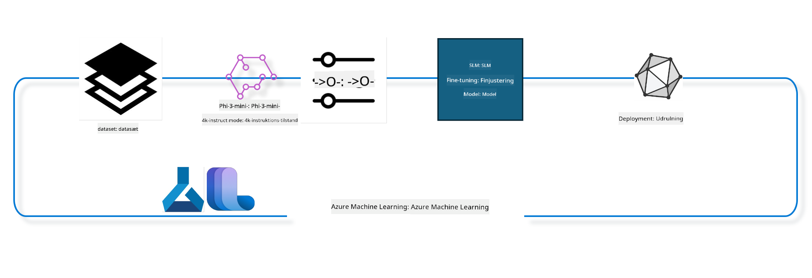

<!--
CO_OP_TRANSLATOR_METADATA:
{
  "original_hash": "944949f040e61b2ea25b3460f7394fd4",
  "translation_date": "2025-07-17T07:28:27+00:00",
  "source_file": "md/03.FineTuning/FineTuning_MLSDK.md",
  "language_code": "da"
}
-->
## Hvordan man bruger chat-completion komponenter fra Azure ML systemregisteret til at finjustere en model

I dette eksempel vil vi foretage finjustering af Phi-3-mini-4k-instruct modellen for at fuldføre en samtale mellem 2 personer ved hjælp af ultrachat_200k datasættet.



Eksemplet vil vise dig, hvordan du udfører finjustering ved hjælp af Azure ML SDK og Python, og derefter implementerer den finjusterede model til en online endpoint for realtidsinference.

### Træningsdata

Vi vil bruge ultrachat_200k datasættet. Dette er en kraftigt filtreret version af UltraChat datasættet og blev brugt til at træne Zephyr-7B-β, en topmoderne 7b chatmodel.

### Model

Vi vil bruge Phi-3-mini-4k-instruct modellen for at vise, hvordan brugeren kan finjustere en model til chat-completion opgaven. Hvis du har åbnet denne notebook fra et specifikt modelkort, husk at erstatte det specifikke modelnavn.

### Opgaver

- Vælg en model til finjustering.
- Vælg og undersøg træningsdata.
- Konfigurer finjusteringsjobbet.
- Kør finjusteringsjobbet.
- Gennemgå trænings- og evalueringsmålinger.
- Registrer den finjusterede model.
- Implementer den finjusterede model til realtidsinference.
- Ryd op i ressourcer.

## 1. Opsæt forudsætninger

- Installer afhængigheder
- Forbind til AzureML Workspace. Læs mere under set up SDK authentication. Erstat <WORKSPACE_NAME>, <RESOURCE_GROUP> og <SUBSCRIPTION_ID> nedenfor.
- Forbind til azureml systemregisteret
- Sæt et valgfrit eksperimentnavn
- Tjek eller opret compute.

> [!NOTE]
> Krav: En enkelt GPU-node kan have flere GPU-kort. For eksempel har en node af Standard_NC24rs_v3 4 NVIDIA V100 GPU’er, mens Standard_NC12s_v3 har 2 NVIDIA V100 GPU’er. Se dokumentationen for denne information. Antallet af GPU-kort pr. node sættes i parameteren gpus_per_node nedenfor. At sætte denne værdi korrekt sikrer udnyttelse af alle GPU’er i noden. De anbefalede GPU compute SKUs kan findes her og her.

### Python biblioteker

Installer afhængigheder ved at køre nedenstående celle. Dette er ikke et valgfrit trin, hvis du kører i et nyt miljø.

```bash
pip install azure-ai-ml
pip install azure-identity
pip install datasets==2.9.0
pip install mlflow
pip install azureml-mlflow
```

### Interaktion med Azure ML

1. Dette Python-script bruges til at interagere med Azure Machine Learning (Azure ML) tjenesten. Her er en gennemgang af, hvad det gør:

    - Det importerer nødvendige moduler fra azure.ai.ml, azure.identity og azure.ai.ml.entities pakkerne. Det importerer også time modulet.

    - Det forsøger at autentificere ved hjælp af DefaultAzureCredential(), som giver en forenklet autentificeringsoplevelse for hurtigt at komme i gang med at udvikle applikationer, der kører i Azure skyen. Hvis dette fejler, falder det tilbage til InteractiveBrowserCredential(), som giver en interaktiv login prompt.

    - Det forsøger derefter at oprette en MLClient instans ved hjælp af from_config metoden, som læser konfigurationen fra standard konfigurationsfilen (config.json). Hvis dette fejler, opretter det en MLClient instans ved manuelt at angive subscription_id, resource_group_name og workspace_name.

    - Det opretter en anden MLClient instans, denne gang for Azure ML registeret med navnet "azureml". Dette register er hvor modeller, finjusteringspipelines og miljøer gemmes.

    - Det sætter experiment_name til "chat_completion_Phi-3-mini-4k-instruct".

    - Det genererer et unikt tidsstempel ved at konvertere den aktuelle tid (i sekunder siden epoken, som et flydende tal) til et heltal og derefter til en streng. Dette tidsstempel kan bruges til at skabe unikke navne og versioner.

    ```python
    # Import necessary modules from Azure ML and Azure Identity
    from azure.ai.ml import MLClient
    from azure.identity import (
        DefaultAzureCredential,
        InteractiveBrowserCredential,
    )
    from azure.ai.ml.entities import AmlCompute
    import time  # Import time module
    
    # Try to authenticate using DefaultAzureCredential
    try:
        credential = DefaultAzureCredential()
        credential.get_token("https://management.azure.com/.default")
    except Exception as ex:  # If DefaultAzureCredential fails, use InteractiveBrowserCredential
        credential = InteractiveBrowserCredential()
    
    # Try to create an MLClient instance using the default config file
    try:
        workspace_ml_client = MLClient.from_config(credential=credential)
    except:  # If that fails, create an MLClient instance by manually providing the details
        workspace_ml_client = MLClient(
            credential,
            subscription_id="<SUBSCRIPTION_ID>",
            resource_group_name="<RESOURCE_GROUP>",
            workspace_name="<WORKSPACE_NAME>",
        )
    
    # Create another MLClient instance for the Azure ML registry named "azureml"
    # This registry is where models, fine-tuning pipelines, and environments are stored
    registry_ml_client = MLClient(credential, registry_name="azureml")
    
    # Set the experiment name
    experiment_name = "chat_completion_Phi-3-mini-4k-instruct"
    
    # Generate a unique timestamp that can be used for names and versions that need to be unique
    timestamp = str(int(time.time()))
    ```

## 2. Vælg en grundmodel til finjustering

1. Phi-3-mini-4k-instruct er en 3,8 milliarder parametre stor, letvægts, topmoderne open model bygget på datasæt brugt til Phi-2. Modellen tilhører Phi-3 model familien, og Mini-versionen findes i to varianter 4K og 128K, som er kontekstlængden (i tokens), den kan understøtte. Vi skal finjustere modellen til vores specifikke formål for at kunne bruge den. Du kan browse disse modeller i Model Catalog i AzureML Studio ved at filtrere på chat-completion opgaven. I dette eksempel bruger vi Phi-3-mini-4k-instruct modellen. Hvis du har åbnet denne notebook for en anden model, skal du erstatte modelnavnet og versionen tilsvarende.

    > [!NOTE]
    > model id egenskaben for modellen. Denne vil blive brugt som input til finjusteringsjobbet. Den findes også som Asset ID feltet på model-detaljesiden i AzureML Studio Model Catalog.

2. Dette Python-script interagerer med Azure Machine Learning (Azure ML) tjenesten. Her er en gennemgang af, hvad det gør:

    - Det sætter model_name til "Phi-3-mini-4k-instruct".

    - Det bruger get metoden på models egenskaben af registry_ml_client objektet til at hente den seneste version af modellen med det angivne navn fra Azure ML registeret. get metoden kaldes med to argumenter: navnet på modellen og et label, der angiver, at den seneste version af modellen skal hentes.

    - Det printer en besked til konsollen, der angiver navnet, versionen og id’et på den model, der skal bruges til finjustering. format metoden på strengen bruges til at indsætte navn, version og id på modellen i beskeden. Navn, version og id på modellen tilgås som egenskaber på foundation_model objektet.

    ```python
    # Set the model name
    model_name = "Phi-3-mini-4k-instruct"
    
    # Get the latest version of the model from the Azure ML registry
    foundation_model = registry_ml_client.models.get(model_name, label="latest")
    
    # Print the model name, version, and id
    # This information is useful for tracking and debugging
    print(
        "\n\nUsing model name: {0}, version: {1}, id: {2} for fine tuning".format(
            foundation_model.name, foundation_model.version, foundation_model.id
        )
    )
    ```

## 3. Opret en compute, der skal bruges til jobbet

Finjusteringsjobbet fungerer KUN med GPU compute. Størrelsen på computen afhænger af, hvor stor modellen er, og i de fleste tilfælde kan det være svært at identificere den rette compute til jobbet. I denne celle guider vi brugeren til at vælge den rette compute til jobbet.

> [!NOTE]
> De computere, der er listet nedenfor, fungerer med den mest optimerede konfiguration. Enhver ændring i konfigurationen kan føre til Cuda Out Of Memory fejl. I sådanne tilfælde prøv at opgradere computen til en større størrelse.

> [!NOTE]
> Når du vælger compute_cluster_size nedenfor, skal du sikre dig, at computen er tilgængelig i din resource group. Hvis en bestemt compute ikke er tilgængelig, kan du anmode om adgang til compute ressourcerne.

### Tjek af model for finjusteringssupport

1. Dette Python-script interagerer med en Azure Machine Learning (Azure ML) model. Her er en gennemgang af, hvad det gør:

    - Det importerer ast modulet, som giver funktioner til at behandle træer af Python abstrakt syntaks grammatik.

    - Det tjekker, om foundation_model objektet (som repræsenterer en model i Azure ML) har et tag med navnet finetune_compute_allow_list. Tags i Azure ML er nøgle-værdi par, som du kan oprette og bruge til at filtrere og sortere modeller.

    - Hvis finetune_compute_allow_list tagget er til stede, bruger det ast.literal_eval funktionen til sikkert at parse taggets værdi (en streng) til en Python liste. Denne liste tildeles derefter variablen computes_allow_list. Det printer derefter en besked, der angiver, at en compute skal oprettes fra listen.

    - Hvis finetune_compute_allow_list tagget ikke er til stede, sættes computes_allow_list til None og der printes en besked, der angiver, at finetune_compute_allow_list tagget ikke er en del af modellens tags.

    - Samlet set tjekker dette script for et specifikt tag i modellens metadata, konverterer taggets værdi til en liste, hvis det findes, og giver feedback til brugeren.

    ```python
    # Import the ast module, which provides functions to process trees of the Python abstract syntax grammar
    import ast
    
    # Check if the 'finetune_compute_allow_list' tag is present in the model's tags
    if "finetune_compute_allow_list" in foundation_model.tags:
        # If the tag is present, use ast.literal_eval to safely parse the tag's value (a string) into a Python list
        computes_allow_list = ast.literal_eval(
            foundation_model.tags["finetune_compute_allow_list"]
        )  # convert string to python list
        # Print a message indicating that a compute should be created from the list
        print(f"Please create a compute from the above list - {computes_allow_list}")
    else:
        # If the tag is not present, set computes_allow_list to None
        computes_allow_list = None
        # Print a message indicating that the 'finetune_compute_allow_list' tag is not part of the model's tags
        print("`finetune_compute_allow_list` is not part of model tags")
    ```

### Tjek af Compute Instance

1. Dette Python-script interagerer med Azure Machine Learning (Azure ML) tjenesten og udfører flere tjek på en compute instans. Her er en gennemgang af, hvad det gør:

    - Det forsøger at hente compute instansen med navnet gemt i compute_cluster fra Azure ML workspace. Hvis compute instansens provisioning status er "failed", kaster det en ValueError.

    - Det tjekker, om computes_allow_list ikke er None. Hvis den ikke er det, konverterer den alle compute størrelser i listen til små bogstaver og tjekker, om størrelsen på den aktuelle compute instans er i listen. Hvis ikke, kaster den en ValueError.

    - Hvis computes_allow_list er None, tjekker den, om størrelsen på compute instansen er i en liste over ikke-understøttede GPU VM størrelser. Hvis det er tilfældet, kaster den en ValueError.

    - Den henter en liste over alle tilgængelige compute størrelser i workspace. Den itererer derefter over denne liste, og for hver compute størrelse tjekker den, om navnet matcher størrelsen på den aktuelle compute instans. Hvis det gør, henter den antallet af GPU’er for den compute størrelse og sætter gpu_count_found til True.

    - Hvis gpu_count_found er True, printer den antallet af GPU’er i compute instansen. Hvis gpu_count_found er False, kaster den en ValueError.

    - Samlet set udfører dette script flere tjek på en compute instans i et Azure ML workspace, herunder tjek af provisioning status, størrelse mod en tilladelsesliste eller en benægtelsesliste, og antallet af GPU’er den har.

    ```python
    # Print the exception message
    print(e)
    # Raise a ValueError if the compute size is not available in the workspace
    raise ValueError(
        f"WARNING! Compute size {compute_cluster_size} not available in workspace"
    )
    
    # Retrieve the compute instance from the Azure ML workspace
    compute = workspace_ml_client.compute.get(compute_cluster)
    # Check if the provisioning state of the compute instance is "failed"
    if compute.provisioning_state.lower() == "failed":
        # Raise a ValueError if the provisioning state is "failed"
        raise ValueError(
            f"Provisioning failed, Compute '{compute_cluster}' is in failed state. "
            f"please try creating a different compute"
        )
    
    # Check if computes_allow_list is not None
    if computes_allow_list is not None:
        # Convert all compute sizes in computes_allow_list to lowercase
        computes_allow_list_lower_case = [x.lower() for x in computes_allow_list]
        # Check if the size of the compute instance is in computes_allow_list_lower_case
        if compute.size.lower() not in computes_allow_list_lower_case:
            # Raise a ValueError if the size of the compute instance is not in computes_allow_list_lower_case
            raise ValueError(
                f"VM size {compute.size} is not in the allow-listed computes for finetuning"
            )
    else:
        # Define a list of unsupported GPU VM sizes
        unsupported_gpu_vm_list = [
            "standard_nc6",
            "standard_nc12",
            "standard_nc24",
            "standard_nc24r",
        ]
        # Check if the size of the compute instance is in unsupported_gpu_vm_list
        if compute.size.lower() in unsupported_gpu_vm_list:
            # Raise a ValueError if the size of the compute instance is in unsupported_gpu_vm_list
            raise ValueError(
                f"VM size {compute.size} is currently not supported for finetuning"
            )
    
    # Initialize a flag to check if the number of GPUs in the compute instance has been found
    gpu_count_found = False
    # Retrieve a list of all available compute sizes in the workspace
    workspace_compute_sku_list = workspace_ml_client.compute.list_sizes()
    available_sku_sizes = []
    # Iterate over the list of available compute sizes
    for compute_sku in workspace_compute_sku_list:
        available_sku_sizes.append(compute_sku.name)
        # Check if the name of the compute size matches the size of the compute instance
        if compute_sku.name.lower() == compute.size.lower():
            # If it does, retrieve the number of GPUs for that compute size and set gpu_count_found to True
            gpus_per_node = compute_sku.gpus
            gpu_count_found = True
    # If gpu_count_found is True, print the number of GPUs in the compute instance
    if gpu_count_found:
        print(f"Number of GPU's in compute {compute.size}: {gpus_per_node}")
    else:
        # If gpu_count_found is False, raise a ValueError
        raise ValueError(
            f"Number of GPU's in compute {compute.size} not found. Available skus are: {available_sku_sizes}."
            f"This should not happen. Please check the selected compute cluster: {compute_cluster} and try again."
        )
    ```

## 4. Vælg datasættet til finjustering af modellen

1. Vi bruger ultrachat_200k datasættet. Datasættet har fire splits, egnet til Supervised fine-tuning (sft).
Generation ranking (gen). Antallet af eksempler pr. split vises som følger:

    ```bash
    train_sft test_sft  train_gen  test_gen
    207865  23110  256032  28304
    ```

1. De næste par celler viser grundlæggende dataforberedelse til finjustering:

### Visualiser nogle datarækker

Vi ønsker, at dette eksempel skal køre hurtigt, så gem train_sft, test_sft filer, der indeholder 5% af de allerede beskårne rækker. Det betyder, at den finjusterede model vil have lavere nøjagtighed, og derfor bør den ikke bruges i virkelige scenarier.
download-dataset.py bruges til at downloade ultrachat_200k datasættet og transformere datasættet til et format, som finjusteringspipeline komponenten kan bruge. Da datasættet også er stort, har vi her kun en del af datasættet.

1. Kørsel af nedenstående script downloader kun 5% af dataene. Dette kan øges ved at ændre dataset_split_pc parameteren til ønsket procentdel.

    > [!NOTE]
    > Nogle sprogmodeller har forskellige sprogkoder, og derfor bør kolonnenavnene i datasættet afspejle dette.

1. Her er et eksempel på, hvordan dataene skal se ud
chat-completion datasættet er gemt i parquet format, hvor hver post bruger følgende skema:

    - Dette er et JSON (JavaScript Object Notation) dokument, som er et populært dataudvekslingsformat. Det er ikke eksekverbar kode, men en måde at gemme og transportere data på. Her er en gennemgang af strukturen:

    - "prompt": Denne nøgle indeholder en strengværdi, der repræsenterer en opgave eller et spørgsmål stillet til en AI-assistent.

    - "messages": Denne nøgle indeholder et array af objekter. Hvert objekt repræsenterer en besked i en samtale mellem en bruger og en AI-assistent. Hvert beskedobjekt har to nøgler:

    - "content": Denne nøgle indeholder en strengværdi, der repræsenterer indholdet af beskeden.
    - "role": Denne nøgle indeholder en strengværdi, der repræsenterer rollen for den enhed, der sendte beskeden. Det kan være enten "user" eller "assistant".
    - "prompt_id": Denne nøgle indeholder en strengværdi, der repræsenterer en unik identifikator for prompten.

1. I dette specifikke JSON dokument repræsenteres en samtale, hvor en bruger beder en AI-assistent om at skabe en hovedperson til en dystopisk historie. Assistenten svarer, og brugeren beder derefter om flere detaljer. Assistenten accepterer at give flere detaljer. Hele samtalen er knyttet til en specifik prompt id.

    ```python
    {
        // The task or question posed to an AI assistant
        "prompt": "Create a fully-developed protagonist who is challenged to survive within a dystopian society under the rule of a tyrant. ...",
        
        // An array of objects, each representing a message in a conversation between a user and an AI assistant
        "messages":[
            {
                // The content of the user's message
                "content": "Create a fully-developed protagonist who is challenged to survive within a dystopian society under the rule of a tyrant. ...",
                // The role of the entity that sent the message
                "role": "user"
            },
            {
                // The content of the assistant's message
                "content": "Name: Ava\n\n Ava was just 16 years old when the world as she knew it came crashing down. The government had collapsed, leaving behind a chaotic and lawless society. ...",
                // The role of the entity that sent the message
                "role": "assistant"
            },
            {
                // The content of the user's message
                "content": "Wow, Ava's story is so intense and inspiring! Can you provide me with more details.  ...",
                // The role of the entity that sent the message
                "role": "user"
            }, 
            {
                // The content of the assistant's message
                "content": "Certainly! ....",
                // The role of the entity that sent the message
                "role": "assistant"
            }
        ],
        
        // A unique identifier for the prompt
        "prompt_id": "d938b65dfe31f05f80eb8572964c6673eddbd68eff3db6bd234d7f1e3b86c2af"
    }
    ```

### Download data

1. Dette Python-script bruges til at downloade et datasæt ved hjælp af et hjælpe-script kaldet download-dataset.py. Her er en gennemgang af, hvad det gør:

    - Det importerer os modulet, som giver en platformuafhængig måde at bruge operativsystemafhængig funktionalitet på.

    - Det bruger os.system funktionen til at køre download-dataset.py scriptet i shell med specifikke kommandolinjeargumenter. Argumenterne angiver datasættet, der skal downloades (HuggingFaceH4/ultrachat_200k), mappen det skal downloades til (ultrachat_200k_dataset), og procentdelen af datasættet, der skal splittes (5). os.system funktionen returnerer exit status for den kommando, den kørte; denne status gemmes i exit_status variablen.

    - Det tjekker, om exit_status ikke er 0. I Unix-lignende operativsystemer indikerer en exit status på 0 normalt, at en kommando er lykkedes, mens ethvert andet tal indikerer en fejl. Hvis exit_status ikke er 0, kaster det en Exception med en besked, der angiver, at der var en fejl ved download af datasættet.

    - Samlet set kører dette script en kommando for at downloade et datasæt ved hjælp af et hjælpe-script, og det kaster en undtagelse, hvis kommandoen fejler.

    ```python
    # Import the os module, which provides a way of using operating system dependent functionality
    import os
    
    # Use the os.system function to run the download-dataset.py script in the shell with specific command-line arguments
    # The arguments specify the dataset to download (HuggingFaceH4/ultrachat_200k), the directory to download it to (ultrachat_200k_dataset), and the percentage of the dataset to split (5)
    # The os.system function returns the exit status of the command it executed; this status is stored in the exit_status variable
    exit_status = os.system(
        "python ./download-dataset.py --dataset HuggingFaceH4/ultrachat_200k --download_dir ultrachat_200k_dataset --dataset_split_pc 5"
    )
    
    # Check if exit_status is not 0
    # In Unix-like operating systems, an exit status of 0 usually indicates that a command has succeeded, while any other number indicates an error
    # If exit_status is not 0, raise an Exception with a message indicating that there was an error downloading the dataset
    if exit_status != 0:
        raise Exception("Error downloading dataset")
    ```

### Indlæsning af data i en DataFrame

1. Dette Python-script indlæser en JSON Lines fil i en pandas DataFrame og viser de første 5 rækker. Her er en gennemgang af, hvad det gør:

    - Det importerer pandas biblioteket, som er et kraftfuldt bibliotek til datamanipulation og analyse.

    - Det sætter den maksimale kolonnebredde for pandas’ visningsindstillinger til 0. Det betyder, at hele teksten i hver kolonne vises uden afkortning, når DataFrame printes.

    - Det bruger pd.read_json funktionen til at indlæse train_sft.jsonl filen fra ultrachat_200k_dataset mappen til en DataFrame. Argumentet lines=True angiver, at filen er i JSON Lines format, hvor hver linje er et separat JSON objekt.
- Den bruger head-metoden til at vise de første 5 rækker i DataFrame. Hvis DataFrame har færre end 5 rækker, vises alle.

- Kort sagt indlæser dette script en JSON Lines-fil i en DataFrame og viser de første 5 rækker med fuld kolonne tekst.

```python
    # Import the pandas library, which is a powerful data manipulation and analysis library
    import pandas as pd
    
    # Set the maximum column width for pandas' display options to 0
    # This means that the full text of each column will be displayed without truncation when the DataFrame is printed
    pd.set_option("display.max_colwidth", 0)
    
    # Use the pd.read_json function to load the train_sft.jsonl file from the ultrachat_200k_dataset directory into a DataFrame
    # The lines=True argument indicates that the file is in JSON Lines format, where each line is a separate JSON object
    df = pd.read_json("./ultrachat_200k_dataset/train_sft.jsonl", lines=True)
    
    # Use the head method to display the first 5 rows of the DataFrame
    # If the DataFrame has less than 5 rows, it will display all of them
    df.head()
    ```

## 5. Indsend finjusteringsjobbet med modellen og data som input

Opret jobbet, der bruger chat-completion pipeline-komponenten. Lær mere om alle de parametre, der understøttes til finjustering.

### Definer finjusteringsparametre

1. Finjusteringsparametre kan opdeles i 2 kategorier - træningsparametre og optimeringsparametre

1. Træningsparametre definerer træningsaspekter såsom -

    - Den optimizer og scheduler, der skal bruges
    - Den metrik, der skal optimeres under finjusteringen
    - Antal træningssteps, batch-størrelse osv.
    - Optimeringsparametre hjælper med at optimere GPU-hukommelsen og effektivt udnytte compute-ressourcerne.

1. Nedenfor er nogle af parametrene, der hører til denne kategori. Optimeringsparametrene varierer for hver model og pakkes med modellen for at håndtere disse variationer.

    - Aktiver deepspeed og LoRA
    - Aktiver mixed precision træning
    - Aktiver multi-node træning


> [!NOTE]
> Supervised finetuning kan resultere i tab af alignment eller katastrofalt glem. Vi anbefaler at tjekke for dette problem og køre en alignment-fase efter finjusteringen.

### Finjusteringsparametre

1. Dette Python-script opsætter parametre til finjustering af en maskinlæringsmodel. Her er en oversigt over, hvad det gør:

    - Det sætter standard træningsparametre som antal trænings-epoker, batch-størrelser til træning og evaluering, læringsrate og type af læringsrate-scheduler.

    - Det sætter standard optimeringsparametre som om Layer-wise Relevance Propagation (LoRa) og DeepSpeed skal anvendes, samt DeepSpeed-stadiet.

    - Det kombinerer trænings- og optimeringsparametrene i en enkelt ordbog kaldet finetune_parameters.

    - Det tjekker, om foundation_model har model-specifikke standardparametre. Hvis ja, udskriver det en advarselsbesked og opdaterer finetune_parameters med disse model-specifikke standarder. Funktionen ast.literal_eval bruges til at konvertere model-specifikke standarder fra en streng til en Python-ordbog.

    - Det udskriver det endelige sæt af finjusteringsparametre, der vil blive brugt til kørslen.

    - Kort sagt opsætter og viser dette script parametrene til finjustering af en maskinlæringsmodel med mulighed for at overskrive standardparametre med model-specifikke.

```python
    # Set up default training parameters such as the number of training epochs, batch sizes for training and evaluation, learning rate, and learning rate scheduler type
    training_parameters = dict(
        num_train_epochs=3,
        per_device_train_batch_size=1,
        per_device_eval_batch_size=1,
        learning_rate=5e-6,
        lr_scheduler_type="cosine",
    )
    
    # Set up default optimization parameters such as whether to apply Layer-wise Relevance Propagation (LoRa) and DeepSpeed, and the DeepSpeed stage
    optimization_parameters = dict(
        apply_lora="true",
        apply_deepspeed="true",
        deepspeed_stage=2,
    )
    
    # Combine the training and optimization parameters into a single dictionary called finetune_parameters
    finetune_parameters = {**training_parameters, **optimization_parameters}
    
    # Check if the foundation_model has any model-specific default parameters
    # If it does, print a warning message and update the finetune_parameters dictionary with these model-specific defaults
    # The ast.literal_eval function is used to convert the model-specific defaults from a string to a Python dictionary
    if "model_specific_defaults" in foundation_model.tags:
        print("Warning! Model specific defaults exist. The defaults could be overridden.")
        finetune_parameters.update(
            ast.literal_eval(  # convert string to python dict
                foundation_model.tags["model_specific_defaults"]
            )
        )
    
    # Print the final set of fine-tuning parameters that will be used for the run
    print(
        f"The following finetune parameters are going to be set for the run: {finetune_parameters}"
    )
    ```

### Træningspipeline

1. Dette Python-script definerer en funktion til at generere et visningsnavn for en maskinlærings træningspipeline og kalder derefter denne funktion for at generere og udskrive visningsnavnet. Her er en oversigt over, hvad det gør:

1. Funktionen get_pipeline_display_name defineres. Denne funktion genererer et visningsnavn baseret på forskellige parametre relateret til træningspipelinens opsætning.

1. Inde i funktionen beregnes den samlede batch-størrelse ved at multiplicere batch-størrelsen pr. enhed, antallet af gradient-akkumuleringssteps, antallet af GPU'er pr. node og antallet af noder, der bruges til finjustering.

1. Den henter forskellige andre parametre såsom typen af læringsrate-scheduler, om DeepSpeed anvendes, DeepSpeed-stadiet, om Layer-wise Relevance Propagation (LoRa) anvendes, grænsen for antal model-checkpoints, der skal gemmes, og maksimal sekvenslængde.

1. Den konstruerer en streng, der inkluderer alle disse parametre adskilt af bindestreger. Hvis DeepSpeed eller LoRa anvendes, indeholder strengen henholdsvis "ds" efterfulgt af DeepSpeed-stadiet eller "lora". Hvis ikke, indeholder den "nods" eller "nolora".

1. Funktionen returnerer denne streng, som fungerer som visningsnavnet for træningspipelinjen.

1. Efter funktionen er defineret, kaldes den for at generere visningsnavnet, som derefter udskrives.

1. Kort sagt genererer dette script et visningsnavn for en maskinlærings træningspipeline baseret på forskellige parametre og udskriver dette navn.

```python
    # Define a function to generate a display name for the training pipeline
    def get_pipeline_display_name():
        # Calculate the total batch size by multiplying the per-device batch size, the number of gradient accumulation steps, the number of GPUs per node, and the number of nodes used for fine-tuning
        batch_size = (
            int(finetune_parameters.get("per_device_train_batch_size", 1))
            * int(finetune_parameters.get("gradient_accumulation_steps", 1))
            * int(gpus_per_node)
            * int(finetune_parameters.get("num_nodes_finetune", 1))
        )
        # Retrieve the learning rate scheduler type
        scheduler = finetune_parameters.get("lr_scheduler_type", "linear")
        # Retrieve whether DeepSpeed is applied
        deepspeed = finetune_parameters.get("apply_deepspeed", "false")
        # Retrieve the DeepSpeed stage
        ds_stage = finetune_parameters.get("deepspeed_stage", "2")
        # If DeepSpeed is applied, include "ds" followed by the DeepSpeed stage in the display name; if not, include "nods"
        if deepspeed == "true":
            ds_string = f"ds{ds_stage}"
        else:
            ds_string = "nods"
        # Retrieve whether Layer-wise Relevance Propagation (LoRa) is applied
        lora = finetune_parameters.get("apply_lora", "false")
        # If LoRa is applied, include "lora" in the display name; if not, include "nolora"
        if lora == "true":
            lora_string = "lora"
        else:
            lora_string = "nolora"
        # Retrieve the limit on the number of model checkpoints to keep
        save_limit = finetune_parameters.get("save_total_limit", -1)
        # Retrieve the maximum sequence length
        seq_len = finetune_parameters.get("max_seq_length", -1)
        # Construct the display name by concatenating all these parameters, separated by hyphens
        return (
            model_name
            + "-"
            + "ultrachat"
            + "-"
            + f"bs{batch_size}"
            + "-"
            + f"{scheduler}"
            + "-"
            + ds_string
            + "-"
            + lora_string
            + f"-save_limit{save_limit}"
            + f"-seqlen{seq_len}"
        )
    
    # Call the function to generate the display name
    pipeline_display_name = get_pipeline_display_name()
    # Print the display name
    print(f"Display name used for the run: {pipeline_display_name}")
    ```

### Konfigurering af pipeline

Dette Python-script definerer og konfigurerer en maskinlæringspipeline ved hjælp af Azure Machine Learning SDK. Her er en oversigt over, hvad det gør:

1. Det importerer nødvendige moduler fra Azure AI ML SDK.

1. Det henter en pipeline-komponent med navnet "chat_completion_pipeline" fra registret.

1. Det definerer et pipeline-job ved hjælp af `@pipeline` dekoratoren og funktionen `create_pipeline`. Navnet på pipelinen sættes til `pipeline_display_name`.

1. Inde i `create_pipeline` funktionen initialiseres den hentede pipeline-komponent med forskellige parametre, herunder modelsti, compute-klynger til forskellige stadier, datasæt-opdelinger til træning og test, antal GPU'er til finjustering og andre finjusteringsparametre.

1. Outputtet fra finjusteringsjobbet mappes til outputtet af pipeline-jobbet. Dette gøres, så den finjusterede model nemt kan registreres, hvilket er nødvendigt for at deployere modellen til en online- eller batch-endpoint.

1. En instans af pipelinen oprettes ved at kalde `create_pipeline` funktionen.

1. `force_rerun` indstillingen for pipelinen sættes til `True`, hvilket betyder, at cachede resultater fra tidligere jobs ikke vil blive brugt.

1. `continue_on_step_failure` indstillingen sættes til `False`, hvilket betyder, at pipelinen stopper, hvis et trin fejler.

1. Kort sagt definerer og konfigurerer dette script en maskinlæringspipeline til en chat completion-opgave ved hjælp af Azure Machine Learning SDK.

```python
    # Import necessary modules from the Azure AI ML SDK
    from azure.ai.ml.dsl import pipeline
    from azure.ai.ml import Input
    
    # Fetch the pipeline component named "chat_completion_pipeline" from the registry
    pipeline_component_func = registry_ml_client.components.get(
        name="chat_completion_pipeline", label="latest"
    )
    
    # Define the pipeline job using the @pipeline decorator and the function create_pipeline
    # The name of the pipeline is set to pipeline_display_name
    @pipeline(name=pipeline_display_name)
    def create_pipeline():
        # Initialize the fetched pipeline component with various parameters
        # These include the model path, compute clusters for different stages, dataset splits for training and testing, the number of GPUs to use for fine-tuning, and other fine-tuning parameters
        chat_completion_pipeline = pipeline_component_func(
            mlflow_model_path=foundation_model.id,
            compute_model_import=compute_cluster,
            compute_preprocess=compute_cluster,
            compute_finetune=compute_cluster,
            compute_model_evaluation=compute_cluster,
            # Map the dataset splits to parameters
            train_file_path=Input(
                type="uri_file", path="./ultrachat_200k_dataset/train_sft.jsonl"
            ),
            test_file_path=Input(
                type="uri_file", path="./ultrachat_200k_dataset/test_sft.jsonl"
            ),
            # Training settings
            number_of_gpu_to_use_finetuning=gpus_per_node,  # Set to the number of GPUs available in the compute
            **finetune_parameters
        )
        return {
            # Map the output of the fine tuning job to the output of pipeline job
            # This is done so that we can easily register the fine tuned model
            # Registering the model is required to deploy the model to an online or batch endpoint
            "trained_model": chat_completion_pipeline.outputs.mlflow_model_folder
        }
    
    # Create an instance of the pipeline by calling the create_pipeline function
    pipeline_object = create_pipeline()
    
    # Don't use cached results from previous jobs
    pipeline_object.settings.force_rerun = True
    
    # Set continue on step failure to False
    # This means that the pipeline will stop if any step fails
    pipeline_object.settings.continue_on_step_failure = False
    ```

### Indsend jobbet

1. Dette Python-script indsender et maskinlærings pipeline-job til en Azure Machine Learning workspace og venter derefter på, at jobbet bliver færdigt. Her er en oversigt over, hvad det gør:

    - Det kalder create_or_update metoden på jobs-objektet i workspace_ml_client for at indsende pipeline-jobbet. Pipelinjen, der skal køres, specificeres af pipeline_object, og eksperimentet, som jobbet kører under, specificeres af experiment_name.

    - Det kalder derefter stream metoden på jobs-objektet i workspace_ml_client for at vente på, at pipeline-jobbet bliver færdigt. Jobbet, der skal ventes på, specificeres af name-attributten på pipeline_job objektet.

    - Kort sagt indsender dette script et maskinlærings pipeline-job til en Azure Machine Learning workspace og venter på, at jobbet bliver færdigt.

```python
    # Submit the pipeline job to the Azure Machine Learning workspace
    # The pipeline to be run is specified by pipeline_object
    # The experiment under which the job is run is specified by experiment_name
    pipeline_job = workspace_ml_client.jobs.create_or_update(
        pipeline_object, experiment_name=experiment_name
    )
    
    # Wait for the pipeline job to complete
    # The job to wait for is specified by the name attribute of the pipeline_job object
    workspace_ml_client.jobs.stream(pipeline_job.name)
    ```

## 6. Registrer den finjusterede model i workspace

Vi vil registrere modellen fra outputtet af finjusteringsjobbet. Dette vil spore slægtskabet mellem den finjusterede model og finjusteringsjobbet. Finjusteringsjobbet sporer yderligere slægtskabet til foundation-modellen, data og træningskode.

### Registrering af ML-modellen

1. Dette Python-script registrerer en maskinlæringsmodel, der blev trænet i en Azure Machine Learning pipeline. Her er en oversigt over, hvad det gør:

    - Det importerer nødvendige moduler fra Azure AI ML SDK.

    - Det tjekker, om trained_model outputtet er tilgængeligt fra pipeline-jobbet ved at kalde get metoden på jobs-objektet i workspace_ml_client og tilgå dets outputs-attribut.

    - Det konstruerer en sti til den trænede model ved at formatere en streng med navnet på pipeline-jobbet og navnet på outputtet ("trained_model").

    - Det definerer et navn til den finjusterede model ved at tilføje "-ultrachat-200k" til det oprindelige modelnavn og erstatte eventuelle skråstreger med bindestreger.

    - Det forbereder registreringen af modellen ved at oprette et Model-objekt med forskellige parametre, herunder stien til modellen, typen af modellen (MLflow model), navnet og versionen af modellen samt en beskrivelse af modellen.

    - Det registrerer modellen ved at kalde create_or_update metoden på models-objektet i workspace_ml_client med Model-objektet som argument.

    - Det udskriver den registrerede model.

1. Kort sagt registrerer dette script en maskinlæringsmodel, der blev trænet i en Azure Machine Learning pipeline.

```python
    # Import necessary modules from the Azure AI ML SDK
    from azure.ai.ml.entities import Model
    from azure.ai.ml.constants import AssetTypes
    
    # Check if the `trained_model` output is available from the pipeline job
    print("pipeline job outputs: ", workspace_ml_client.jobs.get(pipeline_job.name).outputs)
    
    # Construct a path to the trained model by formatting a string with the name of the pipeline job and the name of the output ("trained_model")
    model_path_from_job = "azureml://jobs/{0}/outputs/{1}".format(
        pipeline_job.name, "trained_model"
    )
    
    # Define a name for the fine-tuned model by appending "-ultrachat-200k" to the original model name and replacing any slashes with hyphens
    finetuned_model_name = model_name + "-ultrachat-200k"
    finetuned_model_name = finetuned_model_name.replace("/", "-")
    
    print("path to register model: ", model_path_from_job)
    
    # Prepare to register the model by creating a Model object with various parameters
    # These include the path to the model, the type of the model (MLflow model), the name and version of the model, and a description of the model
    prepare_to_register_model = Model(
        path=model_path_from_job,
        type=AssetTypes.MLFLOW_MODEL,
        name=finetuned_model_name,
        version=timestamp,  # Use timestamp as version to avoid version conflict
        description=model_name + " fine tuned model for ultrachat 200k chat-completion",
    )
    
    print("prepare to register model: \n", prepare_to_register_model)
    
    # Register the model by calling the create_or_update method of the models object in the workspace_ml_client with the Model object as the argument
    registered_model = workspace_ml_client.models.create_or_update(
        prepare_to_register_model
    )
    
    # Print the registered model
    print("registered model: \n", registered_model)
    ```

## 7. Deploy den finjusterede model til en online endpoint

Online endpoints giver en holdbar REST API, som kan bruges til integration med applikationer, der skal bruge modellen.

### Administrer Endpoint

1. Dette Python-script opretter en managed online endpoint i Azure Machine Learning for en registreret model. Her er en oversigt over, hvad det gør:

    - Det importerer nødvendige moduler fra Azure AI ML SDK.

    - Det definerer et unikt navn til den online endpoint ved at tilføje et tidsstempel til strengen "ultrachat-completion-".

    - Det forbereder oprettelsen af den online endpoint ved at oprette et ManagedOnlineEndpoint-objekt med forskellige parametre, herunder endpoint-navn, en beskrivelse af endpointen og autentificeringsmetoden ("key").

    - Det opretter den online endpoint ved at kalde begin_create_or_update metoden på workspace_ml_client med ManagedOnlineEndpoint-objektet som argument. Derefter venter det på, at oprettelsesoperationen bliver færdig ved at kalde wait metoden.

1. Kort sagt opretter dette script en managed online endpoint i Azure Machine Learning for en registreret model.

```python
    # Import necessary modules from the Azure AI ML SDK
    from azure.ai.ml.entities import (
        ManagedOnlineEndpoint,
        ManagedOnlineDeployment,
        ProbeSettings,
        OnlineRequestSettings,
    )
    
    # Define a unique name for the online endpoint by appending a timestamp to the string "ultrachat-completion-"
    online_endpoint_name = "ultrachat-completion-" + timestamp
    
    # Prepare to create the online endpoint by creating a ManagedOnlineEndpoint object with various parameters
    # These include the name of the endpoint, a description of the endpoint, and the authentication mode ("key")
    endpoint = ManagedOnlineEndpoint(
        name=online_endpoint_name,
        description="Online endpoint for "
        + registered_model.name
        + ", fine tuned model for ultrachat-200k-chat-completion",
        auth_mode="key",
    )
    
    # Create the online endpoint by calling the begin_create_or_update method of the workspace_ml_client with the ManagedOnlineEndpoint object as the argument
    # Then wait for the creation operation to complete by calling the wait method
    workspace_ml_client.begin_create_or_update(endpoint).wait()
    ```

> [!NOTE]
> Du kan finde listen over SKU'er, der understøttes til deployment her - [Managed online endpoints SKU list](https://learn.microsoft.com/azure/machine-learning/reference-managed-online-endpoints-vm-sku-list)

### Deploy ML-model

1. Dette Python-script deployerer en registreret maskinlæringsmodel til en managed online endpoint i Azure Machine Learning. Her er en oversigt over, hvad det gør:

    - Det importerer ast-modulet, som giver funktioner til at behandle træer af Python abstrakt syntaksgrammatik.

    - Det sætter instanstypen til deployment til "Standard_NC6s_v3".

    - Det tjekker, om tagget inference_compute_allow_list findes i foundation_model. Hvis det gør, konverterer det taggets værdi fra en streng til en Python-liste og tildeler den til inference_computes_allow_list. Hvis ikke, sættes inference_computes_allow_list til None.

    - Det tjekker, om den specificerede instanstype er i tilladelseslisten. Hvis ikke, udskrives en besked, der beder brugeren vælge en instanstype fra tilladelseslisten.

    - Det forbereder oprettelsen af deployment ved at oprette et ManagedOnlineDeployment-objekt med forskellige parametre, herunder navnet på deployment, endpoint-navnet, model-ID, instanstype og antal, liveness probe-indstillinger og request-indstillinger.

    - Det opretter deployment ved at kalde begin_create_or_update metoden på workspace_ml_client med ManagedOnlineDeployment-objektet som argument. Derefter venter det på, at oprettelsesoperationen bliver færdig ved at kalde wait metoden.

    - Det sætter trafikken på endpointen til at dirigere 100% af trafikken til "demo" deployment.

    - Det opdaterer endpointen ved at kalde begin_create_or_update metoden på workspace_ml_client med endpoint-objektet som argument. Derefter venter det på, at opdateringsoperationen bliver færdig ved at kalde result metoden.

1. Kort sagt deployerer dette script en registreret maskinlæringsmodel til en managed online endpoint i Azure Machine Learning.

```python
    # Import the ast module, which provides functions to process trees of the Python abstract syntax grammar
    import ast
    
    # Set the instance type for the deployment
    instance_type = "Standard_NC6s_v3"
    
    # Check if the `inference_compute_allow_list` tag is present in the foundation model
    if "inference_compute_allow_list" in foundation_model.tags:
        # If it is, convert the tag value from a string to a Python list and assign it to `inference_computes_allow_list`
        inference_computes_allow_list = ast.literal_eval(
            foundation_model.tags["inference_compute_allow_list"]
        )
        print(f"Please create a compute from the above list - {computes_allow_list}")
    else:
        # If it's not, set `inference_computes_allow_list` to `None`
        inference_computes_allow_list = None
        print("`inference_compute_allow_list` is not part of model tags")
    
    # Check if the specified instance type is in the allow list
    if (
        inference_computes_allow_list is not None
        and instance_type not in inference_computes_allow_list
    ):
        print(
            f"`instance_type` is not in the allow listed compute. Please select a value from {inference_computes_allow_list}"
        )
    
    # Prepare to create the deployment by creating a `ManagedOnlineDeployment` object with various parameters
    demo_deployment = ManagedOnlineDeployment(
        name="demo",
        endpoint_name=online_endpoint_name,
        model=registered_model.id,
        instance_type=instance_type,
        instance_count=1,
        liveness_probe=ProbeSettings(initial_delay=600),
        request_settings=OnlineRequestSettings(request_timeout_ms=90000),
    )
    
    # Create the deployment by calling the `begin_create_or_update` method of the `workspace_ml_client` with the `ManagedOnlineDeployment` object as the argument
    # Then wait for the creation operation to complete by calling the `wait` method
    workspace_ml_client.online_deployments.begin_create_or_update(demo_deployment).wait()
    
    # Set the traffic of the endpoint to direct 100% of the traffic to the "demo" deployment
    endpoint.traffic = {"demo": 100}
    
    # Update the endpoint by calling the `begin_create_or_update` method of the `workspace_ml_client` with the `endpoint` object as the argument
    # Then wait for the update operation to complete by calling the `result` method
    workspace_ml_client.begin_create_or_update(endpoint).result()
    ```

## 8. Test endpointen med eksempeldata

Vi henter noget eksempeldata fra testdatasættet og sender det til online endpointen for inferens. Vi viser derefter de scorede labels sammen med de korrekte labels.

### Læsning af resultater

1. Dette Python-script læser en JSON Lines-fil ind i en pandas DataFrame, tager et tilfældigt udsnit og nulstiller indekset. Her er en oversigt over, hvad det gør:

    - Det læser filen ./ultrachat_200k_dataset/test_gen.jsonl ind i en pandas DataFrame. read_json funktionen bruges med argumentet lines=True, fordi filen er i JSON Lines-format, hvor hver linje er et separat JSON-objekt.

    - Det tager et tilfældigt udsnit på 1 række fra DataFrame. sample funktionen bruges med n=1 for at angive antallet af tilfældige rækker, der skal vælges.

    - Det nulstiller DataFrames indeks. reset_index funktionen bruges med drop=True for at fjerne det oprindelige indeks og erstatte det med et nyt indeks med standard heltalsværdier.

    - Det viser de første 2 rækker i DataFrame ved hjælp af head funktionen med argumentet 2. Men da DataFrame kun indeholder én række efter udvælgelsen, vises kun denne ene række.

1. Kort sagt læser dette script en JSON Lines-fil ind i en pandas DataFrame, tager et tilfældigt udsnit på 1 række, nulstiller indekset og viser den første række.

```python
    # Import pandas library
    import pandas as pd
    
    # Read the JSON Lines file './ultrachat_200k_dataset/test_gen.jsonl' into a pandas DataFrame
    # The 'lines=True' argument indicates that the file is in JSON Lines format, where each line is a separate JSON object
    test_df = pd.read_json("./ultrachat_200k_dataset/test_gen.jsonl", lines=True)
    
    # Take a random sample of 1 row from the DataFrame
    # The 'n=1' argument specifies the number of random rows to select
    test_df = test_df.sample(n=1)
    
    # Reset the index of the DataFrame
    # The 'drop=True' argument indicates that the original index should be dropped and replaced with a new index of default integer values
    # The 'inplace=True' argument indicates that the DataFrame should be modified in place (without creating a new object)
    test_df.reset_index(drop=True, inplace=True)
    
    # Display the first 2 rows of the DataFrame
    # However, since the DataFrame only contains one row after the sampling, this will only display that one row
    test_df.head(2)
    ```

### Opret JSON-objekt

1. Dette Python-script opretter et JSON-objekt med specifikke parametre og gemmer det i en fil. Her er en oversigt over, hvad det gør:

    - Det importerer json-modulet, som giver funktioner til at arbejde med JSON-data.

    - Det opretter en ordbog parameters med nøgler og værdier, der repræsenterer parametre for en maskinlæringsmodel. Nøglerne er "temperature", "top_p", "do_sample" og "max_new_tokens", og deres tilsvarende værdier er 0.6, 0.9, True og 200.

    - Det opretter en anden ordbog test_json med to nøgler: "input_data" og "params". Værdien af "input_data" er en anden ordbog med nøglerne "input_string" og "parameters". Værdien af "input_string" er en liste, der indeholder den første besked fra test_df DataFrame. Værdien af "parameters" er den tidligere oprettede parameters-ordbog. Værdien af "params" er en tom ordbog.
- Den åbner en fil med navnet sample_score.json

```python
    # Import the json module, which provides functions to work with JSON data
    import json
    
    # Create a dictionary `parameters` with keys and values that represent parameters for a machine learning model
    # The keys are "temperature", "top_p", "do_sample", and "max_new_tokens", and their corresponding values are 0.6, 0.9, True, and 200 respectively
    parameters = {
        "temperature": 0.6,
        "top_p": 0.9,
        "do_sample": True,
        "max_new_tokens": 200,
    }
    
    # Create another dictionary `test_json` with two keys: "input_data" and "params"
    # The value of "input_data" is another dictionary with keys "input_string" and "parameters"
    # The value of "input_string" is a list containing the first message from the `test_df` DataFrame
    # The value of "parameters" is the `parameters` dictionary created earlier
    # The value of "params" is an empty dictionary
    test_json = {
        "input_data": {
            "input_string": [test_df["messages"][0]],
            "parameters": parameters,
        },
        "params": {},
    }
    
    # Open a file named `sample_score.json` in the `./ultrachat_200k_dataset` directory in write mode
    with open("./ultrachat_200k_dataset/sample_score.json", "w") as f:
        # Write the `test_json` dictionary to the file in JSON format using the `json.dump` function
        json.dump(test_json, f)
    ```

### Kald af endpoint

1. Dette Python-script kalder et online endpoint i Azure Machine Learning for at score en JSON-fil. Her er en gennemgang af, hvad det gør:

    - Det kalder invoke-metoden på online_endpoints-egenskaben af workspace_ml_client-objektet. Denne metode bruges til at sende en forespørgsel til et online endpoint og modtage et svar.

    - Det angiver navnet på endpointet og deployment med argumenterne endpoint_name og deployment_name. I dette tilfælde er endpoint-navnet gemt i variablen online_endpoint_name, og deployment-navnet er "demo".

    - Det angiver stien til JSON-filen, der skal scores, med argumentet request_file. I dette tilfælde er filen ./ultrachat_200k_dataset/sample_score.json.

    - Det gemmer svaret fra endpointet i variablen response.

    - Det udskriver det rå svar.

1. Kort sagt kalder dette script et online endpoint i Azure Machine Learning for at score en JSON-fil og udskriver svaret.

```python
    # Invoke the online endpoint in Azure Machine Learning to score the `sample_score.json` file
    # The `invoke` method of the `online_endpoints` property of the `workspace_ml_client` object is used to send a request to an online endpoint and get a response
    # The `endpoint_name` argument specifies the name of the endpoint, which is stored in the `online_endpoint_name` variable
    # The `deployment_name` argument specifies the name of the deployment, which is "demo"
    # The `request_file` argument specifies the path to the JSON file to be scored, which is `./ultrachat_200k_dataset/sample_score.json`
    response = workspace_ml_client.online_endpoints.invoke(
        endpoint_name=online_endpoint_name,
        deployment_name="demo",
        request_file="./ultrachat_200k_dataset/sample_score.json",
    )
    
    # Print the raw response from the endpoint
    print("raw response: \n", response, "\n")
    ```

## 9. Slet det online endpoint

1. Glem ikke at slette det online endpoint, ellers vil du fortsætte med at blive opkrævet for den compute, som endpointet bruger. Denne linje Python-kode sletter et online endpoint i Azure Machine Learning. Her er en gennemgang af, hvad den gør:

    - Den kalder begin_delete-metoden på online_endpoints-egenskaben af workspace_ml_client-objektet. Denne metode bruges til at starte sletningen af et online endpoint.

    - Den angiver navnet på det endpoint, der skal slettes, med argumentet name. I dette tilfælde er endpoint-navnet gemt i variablen online_endpoint_name.

    - Den kalder wait-metoden for at vente på, at sletteoperationen bliver færdig. Dette er en blokkerende operation, hvilket betyder, at scriptet ikke fortsætter, før sletningen er fuldført.

    - Kort sagt starter denne kode sletningen af et online endpoint i Azure Machine Learning og venter på, at operationen bliver færdig.

```python
    # Delete the online endpoint in Azure Machine Learning
    # The `begin_delete` method of the `online_endpoints` property of the `workspace_ml_client` object is used to start the deletion of an online endpoint
    # The `name` argument specifies the name of the endpoint to be deleted, which is stored in the `online_endpoint_name` variable
    # The `wait` method is called to wait for the deletion operation to complete. This is a blocking operation, meaning that it will prevent the script from continuing until the deletion is finished
    workspace_ml_client.online_endpoints.begin_delete(name=online_endpoint_name).wait()
    ```

**Ansvarsfraskrivelse**:  
Dette dokument er blevet oversat ved hjælp af AI-oversættelsestjenesten [Co-op Translator](https://github.com/Azure/co-op-translator). Selvom vi bestræber os på nøjagtighed, bedes du være opmærksom på, at automatiserede oversættelser kan indeholde fejl eller unøjagtigheder. Det oprindelige dokument på dets oprindelige sprog bør betragtes som den autoritative kilde. For kritisk information anbefales professionel menneskelig oversættelse. Vi påtager os intet ansvar for misforståelser eller fejltolkninger, der opstår som følge af brugen af denne oversættelse.