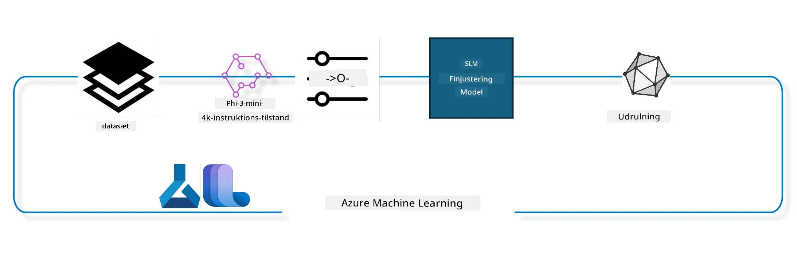

## Sådan bruges chat-completion-komponenter fra Azure ML systemregisteret til at finjustere en model

I dette eksempel vil vi udføre finjustering af Phi-3-mini-4k-instruct modellen for at fuldføre en samtale mellem 2 personer ved hjælp af ultrachat_200k datasættet.



Eksemplet vil vise dig, hvordan du udfører finjustering ved hjælp af Azure ML SDK og Python og derefter implementerer den finjusterede model til et online endepunkt for realtidsinferens.

### Træningsdata

Vi vil bruge ultrachat_200k datasættet. Dette er en kraftigt filtreret version af UltraChat-datasættet og blev brugt til at træne Zephyr-7B-β, en avanceret 7b chatmodel.

### Model

Vi vil bruge Phi-3-mini-4k-instruct modellen til at vise, hvordan brugeren kan finjustere en model til chat-completion-opgaven. Hvis du åbnede denne notesbog fra et specifikt modelkort, husk at erstatte det specifikke modelnavn.

### Opgaver

- Vælg en model til finjustering.
- Vælg og undersøg træningsdata.
- Konfigurer finjusteringsjobbet.
- Kør finjusteringsjobbet.
- Gennemgå trænings- og evalueringsmålinger.
- Registrer den finjusterede model.
- Implementer den finjusterede model til realtidsinferens.
- Ryd op i ressourcer.

## 1. Opsæt forudsætninger

- Installer afhængigheder
- Opret forbindelse til AzureML Workspace. Læs mere ved opsætning af SDK-autentificering. Erstat <WORKSPACE_NAME>, <RESOURCE_GROUP> og <SUBSCRIPTION_ID> nedenfor.
- Opret forbindelse til azureml systemregister
- Angiv et valgfrit eksperimentnavn
- Tjek eller opret compute.

> [!NOTE]
> Krav: en enkelt GPU-node kan have flere GPU-kort. For eksempel har en node af typen Standard_NC24rs_v3 4 NVIDIA V100 GPU'er, mens Standard_NC12s_v3 har 2 NVIDIA V100 GPU'er. Se dokumentationen for denne information. Antallet af GPU-kort pr. node sættes i parametret gpus_per_node nedenfor. At sætte denne værdi korrekt sikrer udnyttelse af alle GPU'er i noden. De anbefalede GPU compute SKUs kan findes her og her.

### Python-biblioteker

Installer afhængigheder ved at køre cellen nedenfor. Dette er ikke et valgfrit trin, hvis du kører i et nyt miljø.

```bash
pip install azure-ai-ml
pip install azure-identity
pip install datasets==2.9.0
pip install mlflow
pip install azureml-mlflow
```

### Interaktion med Azure ML

1. Dette Python-script bruges til at interagere med Azure Machine Learning (Azure ML) tjenesten. Her er en gennemgang af, hvad det gør:

    - Det importerer nødvendige moduler fra pakkerne azure.ai.ml, azure.identity og azure.ai.ml.entities. Det importerer også modulet time.

    - Det forsøger at autentificere ved hjælp af DefaultAzureCredential(), som tilbyder en forenklet autentificeringsoplevelse for hurtigt at starte udvikling af applikationer, der kører i Azure cloud. Hvis dette fejler, falder det tilbage til InteractiveBrowserCredential(), som giver en interaktiv login-prompt.

    - Det forsøger derefter at oprette en MLClient-instans ved hjælp af from_config metoden, som læser konfigurationen fra standard konfigurationsfilen (config.json). Hvis dette fejler, opretter det en MLClient-instans ved manuelt at angive subscription_id, resource_group_name og workspace_name.

    - Det opretter en anden MLClient-instans, denne gang for Azure ML-registret med navnet "azureml". Dette register er det sted, hvor modeller, finjusteringspipelines og miljøer gemmes.

    - Det sætter experiment_name til "chat_completion_Phi-3-mini-4k-instruct".

    - Det genererer et unikt tidsstempel ved at konvertere den aktuelle tid (i sekunder siden epoken, som flydende tal) til et heltal og derefter til en streng. Dette tidsstempel kan bruges til at skabe unikke navne og versioner.

    ```python
    # Importer nødvendige moduler fra Azure ML og Azure Identity
    from azure.ai.ml import MLClient
    from azure.identity import (
        DefaultAzureCredential,
        InteractiveBrowserCredential,
    )
    from azure.ai.ml.entities import AmlCompute
    import time  # Importer tid-modulet
    
    # Prøv at godkende ved hjælp af DefaultAzureCredential
    try:
        credential = DefaultAzureCredential()
        credential.get_token("https://management.azure.com/.default")
    except Exception as ex:  # Hvis DefaultAzureCredential fejler, brug InteractiveBrowserCredential
        credential = InteractiveBrowserCredential()
    
    # Prøv at oprette en MLClient-instance ved hjælp af standard konfigurationsfil
    try:
        workspace_ml_client = MLClient.from_config(credential=credential)
    except:  # Hvis det fejler, opret en MLClient-instance ved manuelt at angive detaljerne
        workspace_ml_client = MLClient(
            credential,
            subscription_id="<SUBSCRIPTION_ID>",
            resource_group_name="<RESOURCE_GROUP>",
            workspace_name="<WORKSPACE_NAME>",
        )
    
    # Opret en anden MLClient-instance til Azure ML-registreringsdatabasen med navnet "azureml"
    # Denne registreringsdatabase er hvor modeller, finjusterings-pipelines og miljøer gemmes
    registry_ml_client = MLClient(credential, registry_name="azureml")
    
    # Indstil eksperimentnavnet
    experiment_name = "chat_completion_Phi-3-mini-4k-instruct"
    
    # Generer et unikt tidsstempel, der kan bruges til navne og versioner, som skal være unikke
    timestamp = str(int(time.time()))
    ```

## 2. Vælg en grundmodel til finjustering

1. Phi-3-mini-4k-instruct er en 3,8 milliarder parametre, letvægts, avanceret open model bygget på datasæt, der blev brugt til Phi-2. Modellen tilhører Phi-3 modelserien, og Mini-versionen findes i to varianter 4K og 128K, som er kontekstlængden (i tokens), den kan understøtte. Vi skal finjustere modellen til vores specifikke formål for at kunne bruge den. Du kan gennemse disse modeller i Modelkataloget i AzureML Studio ved at filtrere efter chat-completion opgaven. I dette eksempel bruger vi Phi-3-mini-4k-instruct modellen. Hvis du har åbnet denne notesbog for en anden model, skal du erstatte modelnavnet og versionen tilsvarende.

> [!NOTE]
> model id-egenskaben for modellen. Denne vil blive givet som input til finjusteringsjobbet. Den findes også som Asset ID-feltet på modelsiden i AzureML Studio Modelkataloget.

2. Dette Python-script interagerer med Azure Machine Learning (Azure ML) tjenesten. Her er en gennemgang af, hvad det gør:

    - Det sætter model_name til "Phi-3-mini-4k-instruct".

    - Det bruger get-metoden på models-egenskaben af registry_ml_client objektet til at hente den seneste version af modellen med det angivne navn fra Azure ML-registret. Get-metoden kaldes med to argumenter: modelnavnet og et label, som angiver, at den seneste version skal hentes.

    - Det udskriver en besked til konsollen, der viser navnet, versionen og id’et på den model, der vil blive brugt til finjustering. Format-metoden i strengen bruges til at indsætte modelnavnet, versionen og id’et i beskeden. Navnet, versionen og id’et på modellen tilgås som egenskaber på foundation_model objektet.

    ```python
    # Indstil modelnavnet
    model_name = "Phi-3-mini-4k-instruct"
    
    # Hent den seneste version af modellen fra Azure ML-registret
    foundation_model = registry_ml_client.models.get(model_name, label="latest")
    
    # Udskriv modelnavn, version og id
    # Disse oplysninger er nyttige til sporing og fejlfinding
    print(
        "\n\nUsing model name: {0}, version: {1}, id: {2} for fine tuning".format(
            foundation_model.name, foundation_model.version, foundation_model.id
        )
    )
    ```

## 3. Opret compute til jobbet

Finjusteringsjobbet fungerer KUN med GPU compute. Størrelsen på computen afhænger af modelstørrelsen, og i de fleste tilfælde kan det være vanskeligt at finde den rigtige compute til jobbet. I denne celle guider vi brugeren til at vælge den rigtige compute til jobbet.

> [!NOTE]
> De nedenfor nævnte computes fungerer med den mest optimerede konfiguration. Ændringer af konfigurationen kan føre til Cuda Out Of Memory fejl. I sådanne tilfælde kan man forsøge at opgradere computen til en større størrelse.

> [!NOTE]
> Når du vælger compute_cluster_size nedenfor, skal du sikre, at computen er tilgængelig i din resourcegruppe. Hvis en bestemt compute ikke er tilgængelig, kan du anmode om adgang til compute-ressourcerne.

### Kontrol af model for støtte til finjustering

1. Dette Python-script interagerer med en Azure Machine Learning (Azure ML) model. Her er en gennemgang af, hvad det gør:

    - Det importerer modulet ast, som giver funktioner til at behandle træer af Python’s abstrakte syntaksgrammatik.

    - Det tjekker, om foundation_model objektet (som repræsenterer en model i Azure ML) har et tag ved navn finetune_compute_allow_list. Tags i Azure ML er nøgle-værdi-par, som du kan oprette og bruge til at filtrere og sortere modeller.

    - Hvis finetune_compute_allow_list tagget er til stede, bruger det ast.literal_eval funktionen til sikkert at parse taggets værdi (en streng) til en Python-liste. Denne liste tildeles herefter variablen computes_allow_list. Det udskriver derefter en besked, der angiver, at der bør oprettes compute fra listen.

    - Hvis finetune_compute_allow_list tagget ikke er til stede, sættes computes_allow_list til None og udskriver en besked, der angiver, at finetune_compute_allow_list tagget ikke er en del af modellens tags.

    - Kort sagt tjekker dette script for et specifikt tag i modellens metadata, konverterer taggets værdi til en liste, hvis den findes, og giver feedback til brugeren.

    ```python
    # Importer ast-modulet, som leverer funktioner til at behandle træer af Pythons abstrakte syntaksgrammatik
    import ast
    
    # Tjek om 'finetune_compute_allow_list' tagget er til stede i modellens tags
    if "finetune_compute_allow_list" in foundation_model.tags:
        # Hvis tagget er til stede, brug ast.literal_eval til sikkert at fortolke taggets værdi (en streng) til en Python-liste
        computes_allow_list = ast.literal_eval(
            foundation_model.tags["finetune_compute_allow_list"]
        )  # konverter streng til python-liste
        # Udskriv en besked der angiver, at en compute skal oprettes fra listen
        print(f"Please create a compute from the above list - {computes_allow_list}")
    else:
        # Hvis tagget ikke er til stede, sæt computes_allow_list til None
        computes_allow_list = None
        # Udskriv en besked der angiver, at 'finetune_compute_allow_list' tagget ikke er en del af modellens tags
        print("`finetune_compute_allow_list` is not part of model tags")
    ```

### Kontrol af Compute Instance

1. Dette Python-script interagerer med Azure Machine Learning (Azure ML) tjenesten og udfører flere kontrolchecks på et compute-instans. Her er en gennemgang af, hvad det gør:

    - Det forsøger at hente compute-instansen med navnet gemt i compute_cluster fra Azure ML workspace. Hvis compute-instansens provisioning-tilstand er "failed", kaster det en ValueError.

    - Det tjekker, om computes_allow_list ikke er None. Hvis den ikke er det, konverterer det alle compute-størrelser i listen til små bogstaver og tjekker, om størrelsen af den aktuelle compute-instans er på listen. Hvis ikke, kaster det en ValueError.

    - Hvis computes_allow_list er None, tjekker det om størrelsen af compute-instansen er på en liste over ikke understøttede GPU VM-størrelser. Hvis det er tilfældet, kaster det en ValueError.

    - Det henter en liste over alle tilgængelige compute-størrelser i workspace. Den itererer derefter over denne liste, og for hver compute-størrelse tjekkes det, om dens navn matcher størrelsen af den aktuelle compute-instans. Hvis det gør, henter den antallet af GPU'er for den compute-størrelse og sætter gpu_count_found til True.

    - Hvis gpu_count_found er True, udskriver den antallet af GPU'er i compute-instansen. Hvis gpu_count_found er False, kaster den en ValueError.

    - Kort sagt udfører scriptet flere checks på et compute-instans i et Azure ML workspace, herunder tjek af provisioning-tilstand, størrelse ift. en tilladelsesliste eller benægtelsesliste og antallet af GPU'er.

    ```python
    # Udskriv undtagelsesbeskeden
    print(e)
    # Kald en ValueError, hvis compute-størrelsen ikke er tilgængelig i workspace
    raise ValueError(
        f"WARNING! Compute size {compute_cluster_size} not available in workspace"
    )
    
    # Hent compute-instansen fra Azure ML workspace
    compute = workspace_ml_client.compute.get(compute_cluster)
    # Tjek om provisioningstilstanden for compute-instansen er "failed"
    if compute.provisioning_state.lower() == "failed":
        # Kald en ValueError, hvis provisioningstilstanden er "failed"
        raise ValueError(
            f"Provisioning failed, Compute '{compute_cluster}' is in failed state. "
            f"please try creating a different compute"
        )
    
    # Tjek om computes_allow_list ikke er None
    if computes_allow_list is not None:
        # Konverter alle compute-størrelser i computes_allow_list til små bogstaver
        computes_allow_list_lower_case = [x.lower() for x in computes_allow_list]
        # Tjek om størrelsen på compute-instansen findes i computes_allow_list_lower_case
        if compute.size.lower() not in computes_allow_list_lower_case:
            # Kald en ValueError, hvis størrelsen på compute-instansen ikke findes i computes_allow_list_lower_case
            raise ValueError(
                f"VM size {compute.size} is not in the allow-listed computes for finetuning"
            )
    else:
        # Definer en liste over ikke-understøttede GPU VM-størrelser
        unsupported_gpu_vm_list = [
            "standard_nc6",
            "standard_nc12",
            "standard_nc24",
            "standard_nc24r",
        ]
        # Tjek om størrelsen på compute-instansen findes i unsupported_gpu_vm_list
        if compute.size.lower() in unsupported_gpu_vm_list:
            # Kald en ValueError, hvis størrelsen på compute-instansen findes i unsupported_gpu_vm_list
            raise ValueError(
                f"VM size {compute.size} is currently not supported for finetuning"
            )
    
    # Initialiser et flag til at tjekke, om antallet af GPU'er i compute-instansen er fundet
    gpu_count_found = False
    # Hent en liste over alle tilgængelige compute-størrelser i workspace
    workspace_compute_sku_list = workspace_ml_client.compute.list_sizes()
    available_sku_sizes = []
    # Iterer over listen af tilgængelige compute-størrelser
    for compute_sku in workspace_compute_sku_list:
        available_sku_sizes.append(compute_sku.name)
        # Tjek om navnet på compute-størrelsen matcher størrelsen på compute-instansen
        if compute_sku.name.lower() == compute.size.lower():
            # Hvis det gør, hent antallet af GPU'er for den compute-størrelse og sæt gpu_count_found til True
            gpus_per_node = compute_sku.gpus
            gpu_count_found = True
    # Hvis gpu_count_found er True, udskriv antallet af GPU'er i compute-instansen
    if gpu_count_found:
        print(f"Number of GPU's in compute {compute.size}: {gpus_per_node}")
    else:
        # Hvis gpu_count_found er False, kald en ValueError
        raise ValueError(
            f"Number of GPU's in compute {compute.size} not found. Available skus are: {available_sku_sizes}."
            f"This should not happen. Please check the selected compute cluster: {compute_cluster} and try again."
        )
    ```

## 4. Vælg datasættet til finjustering af modellen

1. Vi bruger datasættet ultrachat_200k. Datasættet har fire delmængder, egnede til supervised fine-tuning (sft).
Genereringsrangering (gen). Antal eksempler pr. delmængde vises som følger:

    ```bash
    train_sft test_sft  train_gen  test_gen
    207865  23110  256032  28304
    ```

1. De næste par celler viser grundlæggende datapreparation til finjustering:

### Visualiser nogle datarækker

Vi ønsker, at dette eksempel skal køre hurtigt, så vi gemmer train_sft, test_sft filer, som indeholder 5% af allerede trimmede rækker. Det betyder, at den finjusterede model vil have lavere nøjagtighed, og derfor bør den ikke anvendes i virkelige scenarier.
download-dataset.py bruges til at hente ultrachat_200k datasættet og transformere datasættet til et format, der kan bruges i finjusterings-pipeline komponenter. Da datasættet er stort, har vi her kun en del af datasættet.

1. Kørsel af nedenstående script downloader kun 5% af dataene. Dette kan øges ved at ændre parameteren dataset_split_pc til ønsket procentdel.

> [!NOTE]
> Nogle sprogmodeller har forskellige sprogkoder, og derfor bør kolonnenavnene i datasættet afspejle det samme.

1. Her er et eksempel på, hvordan dataene skal se ud
Chat-completion datasættet gemmes i parquet-format med hver post brugende følgende skema:

    - Dette er et JSON (JavaScript Object Notation) dokument, som er et populært dataudvekslingsformat. Det er ikke eksekverbar kode, men en måde at gemme og transportere data på. Her er en gennemgang af dets struktur:

    - "prompt": Denne nøgle indeholder en strengværdi, som repræsenterer en opgave eller et spørgsmål, der stilles til en AI-assistent.

    - "messages": Denne nøgle indeholder et array af objekter. Hvert objekt repræsenterer en besked i en samtale mellem en bruger og en AI-assistent. Hvert beskedobjekt har to nøgler:

    - "content": Denne nøgle indeholder en strengværdi, der repræsenterer indholdet af beskeden.
    - "role": Denne nøgle indeholder en strengværdi, som repræsenterer rollen af den enhed, der sendte beskeden. Det kan være enten "user" eller "assistant".
    - "prompt_id": Denne nøgle indeholder en strengværdi, der repræsenterer en unik identifikator for prompten.

1. I dette specifikke JSON-dokument repræsenteres en samtale, hvor en bruger beder en AI-assistent om at skabe en hovedperson til en dystopisk historie. Assistenten svarer, og brugeren beder derefter om flere detaljer. Assistenten er enig i at give flere detaljer. Hele samtalen er tilknyttet en specifik prompt-id.

    ```python
    {
        // The task or question posed to an AI assistant
        "prompt": "Create a fully-developed protagonist who is challenged to survive within a dystopian society under the rule of a tyrant. ...",
        
        // An array of objects, each representing a message in a conversation between a user and an AI assistant
        "messages":[
            {
                // The content of the user's message
                "content": "Create a fully-developed protagonist who is challenged to survive within a dystopian society under the rule of a tyrant. ...",
                // The role of the entity that sent the message
                "role": "user"
            },
            {
                // The content of the assistant's message
                "content": "Name: Ava\n\n Ava was just 16 years old when the world as she knew it came crashing down. The government had collapsed, leaving behind a chaotic and lawless society. ...",
                // The role of the entity that sent the message
                "role": "assistant"
            },
            {
                // The content of the user's message
                "content": "Wow, Ava's story is so intense and inspiring! Can you provide me with more details.  ...",
                // The role of the entity that sent the message
                "role": "user"
            }, 
            {
                // The content of the assistant's message
                "content": "Certainly! ....",
                // The role of the entity that sent the message
                "role": "assistant"
            }
        ],
        
        // A unique identifier for the prompt
        "prompt_id": "d938b65dfe31f05f80eb8572964c6673eddbd68eff3db6bd234d7f1e3b86c2af"
    }
    ```

### Download data

1. Dette Python-script bruges til at downloade et datasæt ved hjælp af et hjælpe-script kaldet download-dataset.py. Her er en gennemgang af, hvad det gør:

    - Det importerer os modulet, som giver en platformuafhængig måde at bruge operativsystemsafhængig funktionalitet på.

    - Det bruger os.system funktionen til at køre download-dataset.py scriptet i shell med bestemte kommandolinjeargumenter. Argumenterne specificerer datasættet, der skal downloades (HuggingFaceH4/ultrachat_200k), mappen det downloades til (ultrachat_200k_dataset) og procentdelen af datasættet til split (5). os.system funktionen returnerer exit-status for den kommando, den kørte; denne status gemmes i exit_status variablen.

    - Det tjekker, om exit_status ikke er 0. I Unix-lignende styresystemer angiver en exit-status på 0 normalt, at en kommando er lykkedes, mens ethvert andet nummer angiver en fejl. Hvis exit_status ikke er 0, kaster det en Exception med en besked om, at der var en fejl ved download af datasættet.

    - Kort sagt kører dette script en kommando for at downloade et datasæt ved hjælp af et hjælpe-script, og det kaster en undtagelse, hvis kommandoen fejler.

    ```python
    # Importer os-modulet, som giver en måde at bruge operativsystemafhængig funktionalitet på
    import os
    
    # Brug os.system-funktionen til at køre scriptet download-dataset.py i shellen med specifikke kommandolinjeargumenter
    # Argumenterne angiver datasættet, der skal downloades (HuggingFaceH4/ultrachat_200k), mappen det skal downloades til (ultrachat_200k_dataset), og procentdelen af datasættet til opdeling (5)
    # os.system-funktionen returnerer afslutningsstatus for den kommando, den eksekverede; denne status gemmes i variablen exit_status
    exit_status = os.system(
        "python ./download-dataset.py --dataset HuggingFaceH4/ultrachat_200k --download_dir ultrachat_200k_dataset --dataset_split_pc 5"
    )
    
    # Tjek om exit_status ikke er 0
    # I Unix-lignende operativsystemer angiver en afslutningsstatus på 0 normalt, at en kommando er lykkedes, mens et hvilket som helst andet tal angiver en fejl
    # Hvis exit_status ikke er 0, kast en Exception med en besked om, at der var en fejl ved download af datasættet
    if exit_status != 0:
        raise Exception("Error downloading dataset")
    ```

### Indlæsning af data i en DataFrame
1. Dette Python-script indlæser en JSON Lines-fil i en pandas DataFrame og viser de første 5 rækker. Her er en gennemgang af, hvad det gør:

    - Det importerer pandas-biblioteket, som er et kraftfuldt bibliotek til datamanipulation og analyse.

    - Det sætter den maksimale kolonnebredde for pandas' visningsindstillinger til 0. Det betyder, at hele teksten i hver kolonne vises uden afkortning, når DataFrame printes.

    - Det bruger pd.read_json-funktionen til at indlæse filen train_sft.jsonl fra mappen ultrachat_200k_dataset til en DataFrame. Argumentet lines=True angiver, at filen er i JSON Lines-format, hvor hver linje er et separat JSON-objekt.

    - Det bruger head-metoden til at vise de første 5 rækker i DataFrame. Hvis DataFrame indeholder færre end 5 rækker, vises alle.

    - Samlet set indlæser dette script en JSON Lines-fil i en DataFrame og viser de første 5 rækker med fuld kolonnemtekst.
    
    ```python
    # Importer pandas biblioteket, som er et kraftfuldt bibliotek til datamanipulation og analyse
    import pandas as pd
    
    # Indstil den maksimale kolonnebredde for pandas' visningsindstillinger til 0
    # Dette betyder, at hele teksten i hver kolonne vil blive vist uden afkortning, når DataFrame udskrives
    pd.set_option("display.max_colwidth", 0)
    
    # Brug pd.read_json funktionen til at indlæse filen train_sft.jsonl fra ultrachat_200k_dataset mappen til en DataFrame
    # Argumentet lines=True angiver, at filen er i JSON Lines format, hvor hver linje er et separat JSON-objekt
    df = pd.read_json("./ultrachat_200k_dataset/train_sft.jsonl", lines=True)
    
    # Brug head metoden til at vise de første 5 rækker i DataFrame
    # Hvis DataFrame har færre end 5 rækker, vises alle dem
    df.head()
    ```

## 5. Indsend finjusteringsjobbet ved at bruge modellen og data som input

Opret jobbet, der bruger chat-completion pipeline-komponenten. Lær mere om alle de parametre, der understøttes til finjustering.

### Definér finjusteringsparametre

1. Finjusteringsparametre kan grupperes i 2 kategorier – træningsparametre, optimeringsparametre

1. Træningsparametre definerer træningsaspekter såsom –

    - Den optimizer, scheduler der bruges
    - Den metrik der optimerer finjusteringen
    - Antal træningsskridt og batch-størrelse osv.
    - Optimeringsparametre hjælper med at optimere GPU-hukommelse og effektivt bruge compute-ressourcer.

1. Nedenfor er nogle få af de parametre, som hører til denne kategori. Optimeringsparametrene varierer for hver model og pakkes med modellen for at håndtere disse variationer.

    - Aktiver deepspeed og LoRA
    - Aktiver mixed precision training
    - Aktiver multi-node træning

> [!NOTE]
> Supervised finjustering kan resultere i tab af alignment eller katastrofal glemsel. Vi anbefaler at tjekke for dette problem og køre en alignment-stage, efter du har finjusteret.

### Finjusteringsparametre

1. Dette Python-script sætter parametre op til finjustering af en maskinlæringsmodel. Her er en gennemgang af, hvad det gør:

    - Det sætter standard træningsparametre såsom antal træningsepochs, batch-størrelser til træning og evaluering, læringsrate og læringsrate scheduler-type.

    - Det sætter standard optimeringsparametre såsom om Layer-wise Relevance Propagation (LoRa) og DeepSpeed skal anvendes, og DeepSpeed-stadiet.

    - Det kombinerer trænings- og optimeringsparametre i et enkelt dictionary kaldet finetune_parameters.

    - Det tjekker, om foundation_model har nogle model-specifikke standardparametre. Hvis det har, udskriver det en advarselsbesked og opdaterer finetune_parameters dictionary med disse model-specifikke standarder. Funktionen ast.literal_eval bruges til at konvertere model-specifikke standarder fra en streng til et Python-dictionary.

    - Det udskriver det endelige sæt af finjusteringsparametre, som skal bruges til kørslen.

    - Samlet set sætter dette script parametre op og viser dem til finjustering af en maskinlæringsmodel med mulighed for at overskrive standardparametre med model-specifikke.

    ```python
    # Opsæt standard træningsparametre såsom antal trænings-epoker, batch-størrelser til træning og evaluering, læringsrate og type læringsrateplanlægger
    training_parameters = dict(
        num_train_epochs=3,
        per_device_train_batch_size=1,
        per_device_eval_batch_size=1,
        learning_rate=5e-6,
        lr_scheduler_type="cosine",
    )
    
    # Opsæt standard optimeringsparametre såsom om Layer-wise Relevance Propagation (LoRa) og DeepSpeed skal anvendes, og DeepSpeed stadie
    optimization_parameters = dict(
        apply_lora="true",
        apply_deepspeed="true",
        deepspeed_stage=2,
    )
    
    # Kombiner trænings- og optimeringsparametre i en enkelt ordbog kaldet finetune_parameters
    finetune_parameters = {**training_parameters, **optimization_parameters}
    
    # Tjek om foundation_model har nogle modelspecifikke standardparametre
    # Hvis den har, udskriv en advarselsbesked og opdater finetune_parameters ordbogen med disse modelspecifikke standarder
    # Funktionen ast.literal_eval bruges til at konvertere modelspecifikke standarder fra en streng til en Python ordbog
    if "model_specific_defaults" in foundation_model.tags:
        print("Warning! Model specific defaults exist. The defaults could be overridden.")
        finetune_parameters.update(
            ast.literal_eval(  # konverter streng til python dict
                foundation_model.tags["model_specific_defaults"]
            )
        )
    
    # Udskriv det endelige sæt finjusteringsparametre, som vil blive brugt til kørslen
    print(
        f"The following finetune parameters are going to be set for the run: {finetune_parameters}"
    )
    ```

### Træningspipeline

1. Dette Python-script definerer en funktion til at generere et visningsnavn for en maskinlærings træningspipeline og kalder derefter denne funktion til at generere og printe visningsnavnet. Her er en gennemgang af, hvad det gør:

1. Funktionen get_pipeline_display_name defineres. Denne funktion genererer et visningsnavn baseret på forskellige parametre relateret til træningspipeline.

1. Inde i funktionen beregner den den samlede batch-størrelse ved at multiplicere batch-størrelsen pr. enhed, antallet af gradientakkumulationsskridt, antallet af GPU'er pr. node og antallet af noder, der bruges til finjustering.

1. Den henter forskellige andre parametre såsom typen af læringsrate scheduler, om DeepSpeed anvendes, DeepSpeed-stadiet, om Layer-wise Relevance Propagation (LoRa) anvendes, grænsen for antal model-checkpoints der skal beholdes, og maksimal sekvenslængde.

1. Den konstruerer en streng, som inkluderer alle disse parametre, adskilt af bindestreger. Hvis DeepSpeed eller LoRa anvendes, inkluderer strengen "ds" efterfulgt af DeepSpeed-stadiet eller "lora". Hvis ikke, indeholder den henholdsvis "nods" eller "nolora".

1. Funktionen returnerer denne streng, som tjener som visningsnavn for træningspipeline.

1. Efter funktionen er defineret, kaldes den for at generere visningsnavnet, som derefter printes.

1. Samlet set genererer dette script et visningsnavn til en maskinlærings træningspipeline baseret på forskellige parametre og printer derefter visningsnavnet.

    ```python
    # Definer en funktion til at generere et visningsnavn for træningspipeline
    def get_pipeline_display_name():
        # Beregn den samlede batchstørrelse ved at multiplicere batchstørrelsen per enhed, antallet af gradientakkumuleringsskridt, antallet af GPU'er per node, og antallet af noder brugt til finjustering
        batch_size = (
            int(finetune_parameters.get("per_device_train_batch_size", 1))
            * int(finetune_parameters.get("gradient_accumulation_steps", 1))
            * int(gpus_per_node)
            * int(finetune_parameters.get("num_nodes_finetune", 1))
        )
        # Hent typen af læringsrateplanlægger
        scheduler = finetune_parameters.get("lr_scheduler_type", "linear")
        # Hent om DeepSpeed anvendes
        deepspeed = finetune_parameters.get("apply_deepspeed", "false")
        # Hent DeepSpeed-stadiet
        ds_stage = finetune_parameters.get("deepspeed_stage", "2")
        # Hvis DeepSpeed anvendes, inkluder "ds" efterfulgt af DeepSpeed-stadiet i visningsnavnet; hvis ikke, inkluder "nods"
        if deepspeed == "true":
            ds_string = f"ds{ds_stage}"
        else:
            ds_string = "nods"
        # Hent om Layer-wise Relevance Propagation (LoRa) anvendes
        lora = finetune_parameters.get("apply_lora", "false")
        # Hvis LoRa anvendes, inkluder "lora" i visningsnavnet; hvis ikke, inkluder "nolora"
        if lora == "true":
            lora_string = "lora"
        else:
            lora_string = "nolora"
        # Hent grænsen for antallet af model-checkpoints der skal beholdes
        save_limit = finetune_parameters.get("save_total_limit", -1)
        # Hent den maksimale sekvenslængde
        seq_len = finetune_parameters.get("max_seq_length", -1)
        # Konstruer visningsnavnet ved at sammenkæde alle disse parametre, adskilt af bindestreger
        return (
            model_name
            + "-"
            + "ultrachat"
            + "-"
            + f"bs{batch_size}"
            + "-"
            + f"{scheduler}"
            + "-"
            + ds_string
            + "-"
            + lora_string
            + f"-save_limit{save_limit}"
            + f"-seqlen{seq_len}"
        )
    
    # Kald funktionen for at generere visningsnavnet
    pipeline_display_name = get_pipeline_display_name()
    # Udskriv visningsnavnet
    print(f"Display name used for the run: {pipeline_display_name}")
    ```

### Konfigurering af pipeline

Dette Python-script definerer og konfigurerer en maskinlæringspipeline ved hjælp af Azure Machine Learning SDK. Her er en gennemgang af, hvad det gør:

1. Det importerer nødvendige moduler fra Azure AI ML SDK.

1. Det henter en pipeline-komponent kaldet "chat_completion_pipeline" fra registret.

1. Det definerer et pipelinejob ved hjælp af `@pipeline`-dekorationen og funktionen `create_pipeline`. Navnet på pipelinen sættes til `pipeline_display_name`.

1. Inde i `create_pipeline`-funktionen initialiserer den den hentede pipeline-komponent med forskellige parametre, inklusive modelsti, compute-klynger til forskellige stadier, datasæt-splits til træning og test, antal GPU'er til finjustering og andre finjusteringsparametre.

1. Den kortlægger outputtet af finjusteringsjobbet til outputtet af pipelinejobbet. Dette gøres for nemt at kunne registrere den finjusterede model, hvilket kræves for at implementere modellen til et online- eller batch-endpoint.

1. Den opretter en instans af pipelinen ved at kalde funktionen `create_pipeline`.

1. Den sætter pipelineindstillingen `force_rerun` til `True`, hvilket betyder, at cachede resultater fra tidligere job ikke bruges.

1. Den sætter pipelineindstillingen `continue_on_step_failure` til `False`, hvilket betyder, at pipelinen stopper, hvis et trin fejler.

1. Samlet set definerer og konfigurerer dette script en maskinlæringspipeline til en chat completion-opgave ved hjælp af Azure Machine Learning SDK.

    ```python
    # Importer nødvendige moduler fra Azure AI ML SDK
    from azure.ai.ml.dsl import pipeline
    from azure.ai.ml import Input
    
    # Hent pipeline-komponenten med navnet "chat_completion_pipeline" fra registret
    pipeline_component_func = registry_ml_client.components.get(
        name="chat_completion_pipeline", label="latest"
    )
    
    # Definer pipeline-jobbet ved hjælp af @pipeline dekoratøren og funktionen create_pipeline
    # Navnet på pipelinen er sat til pipeline_display_name
    @pipeline(name=pipeline_display_name)
    def create_pipeline():
        # Initialiser den hentede pipeline-komponent med forskellige parametre
        # Disse inkluderer modelstien, compute klynger til forskellige stadier, datasæt-opdelinger til træning og test, antallet af GPU'er der skal bruges til finjustering, og andre finjusteringsparametre
        chat_completion_pipeline = pipeline_component_func(
            mlflow_model_path=foundation_model.id,
            compute_model_import=compute_cluster,
            compute_preprocess=compute_cluster,
            compute_finetune=compute_cluster,
            compute_model_evaluation=compute_cluster,
            # Map datasæt-opdelingerne til parametre
            train_file_path=Input(
                type="uri_file", path="./ultrachat_200k_dataset/train_sft.jsonl"
            ),
            test_file_path=Input(
                type="uri_file", path="./ultrachat_200k_dataset/test_sft.jsonl"
            ),
            # Træningsindstillinger
            number_of_gpu_to_use_finetuning=gpus_per_node,  # Sæt til antallet af GPU'er tilgængelige i compute
            **finetune_parameters
        )
        return {
            # Map outputtet fra finjusteringsjobbet til outputtet af pipeline-jobbet
            # Dette gøres for at vi nemt kan registrere den finjusterede model
            # Registrering af modellen er påkrævet for at implementere modellen til en online eller batch endpoint
            "trained_model": chat_completion_pipeline.outputs.mlflow_model_folder
        }
    
    # Opret en instans af pipelinen ved at kalde funktionen create_pipeline
    pipeline_object = create_pipeline()
    
    # Brug ikke cachede resultater fra tidligere job
    pipeline_object.settings.force_rerun = True
    
    # Sæt fortsæt ved trinfejl til False
    # Dette betyder, at pipelinen stopper, hvis noget trin fejler
    pipeline_object.settings.continue_on_step_failure = False
    ```

### Indsend jobbet

1. Dette Python-script indsender en maskinlæringspipeline-job til et Azure Machine Learning workspace og venter derefter på, at jobbet fuldføres. Her er en gennemgang af, hvad det gør:

    - Det kalder create_or_update-metoden på jobs-objektet i workspace_ml_client for at indsende pipeline-jobbet. Pipelinjen, der skal køres, specificeres af pipeline_object, og eksperimentet, som jobbet skal køre under, specificeres af experiment_name.

    - Det kalder derefter stream-metoden på jobs-objektet i workspace_ml_client for at vente på, at pipeline-jobbet fuldføres. Det job, der skal ventes på, specificeres af name-attributten på pipeline_job-objektet.

    - Samlet set indsender dette script en maskinlæringspipeline-job til et Azure Machine Learning workspace og venter derefter på, at jobbet fuldføres.

    ```python
    # Indsend pipeline-jobbet til Azure Machine Learning-arbejdsområdet
    # Pipelinjen, der skal køres, er angivet af pipeline_object
    # Eksperimentet, som jobbet køres under, er angivet af experiment_name
    pipeline_job = workspace_ml_client.jobs.create_or_update(
        pipeline_object, experiment_name=experiment_name
    )
    
    # Vent på, at pipeline-jobbet fuldføres
    # Jobbet, der skal ventes på, er angivet af navneattributten på pipeline_job-objektet
    workspace_ml_client.jobs.stream(pipeline_job.name)
    ```

## 6. Registrer den finjusterede model i workspace

Vi vil registrere modellen fra outputtet af finjusteringsjobbet. Dette vil spore herkomsten mellem den finjusterede model og finjusteringsjobbet. Finjusteringsjobbet sporer videre herkomsten til den grundlæggende model, data og træningskode.

### Registrering af ML-model

1. Dette Python-script registrerer en maskinlæringsmodel, som blev trænet i en Azure Machine Learning-pipeline. Her er en gennemgang af, hvad det gør:

    - Det importerer nødvendige moduler fra Azure AI ML SDK.

    - Det tjekker, om outputtet trained_model er tilgængeligt fra pipeline-jobbet ved at kalde get-metoden på jobs-objektet i workspace_ml_client og få adgang til dets outputs-attribut.

    - Det konstruerer en sti til den trænede model ved at formatere en streng med navnet på pipeline-jobbet og navnet på outputtet ("trained_model").

    - Det definerer et navn for den finjusterede model ved at tilføje "-ultrachat-200k" til det oprindelige modelnavn og erstatte eventuelle skråstreger med bindestreger.

    - Det forbereder registreringen af modellen ved at oprette et Model-objekt med forskellige parametre, inklusive stien til modellen, typen af model (MLflow-model), navn og version af modellen og en beskrivelse af modellen.

    - Det registrerer modellen ved at kalde create_or_update-metoden på models-objektet i workspace_ml_client med Model-objektet som argument.

    - Det printer den registrerede model.

1. Samlet set registrerer dette script en maskinlæringsmodel, der blev trænet i en Azure Machine Learning-pipeline.
    
    ```python
    # Importer nødvendige moduler fra Azure AI ML SDK
    from azure.ai.ml.entities import Model
    from azure.ai.ml.constants import AssetTypes
    
    # Tjek om outputtet `trained_model` er tilgængeligt fra pipeline-jobbet
    print("pipeline job outputs: ", workspace_ml_client.jobs.get(pipeline_job.name).outputs)
    
    # Konstruer en sti til den trænede model ved at formatere en streng med navnet på pipeline-jobbet og navnet på outputtet ("trained_model")
    model_path_from_job = "azureml://jobs/{0}/outputs/{1}".format(
        pipeline_job.name, "trained_model"
    )
    
    # Definer et navn til den finjusterede model ved at tilføje "-ultrachat-200k" til det oprindelige modelnavn og erstatte eventuelle skråstreger med bindestreger
    finetuned_model_name = model_name + "-ultrachat-200k"
    finetuned_model_name = finetuned_model_name.replace("/", "-")
    
    print("path to register model: ", model_path_from_job)
    
    # Forbered registreringen af modellen ved at oprette et Model-objekt med forskellige parametre
    # Disse inkluderer stien til modellen, typen af modellen (MLflow-model), navnet og versionen af modellen samt en beskrivelse af modellen
    prepare_to_register_model = Model(
        path=model_path_from_job,
        type=AssetTypes.MLFLOW_MODEL,
        name=finetuned_model_name,
        version=timestamp,  # Brug tidsstempel som version for at undgå versionskonflikt
        description=model_name + " fine tuned model for ultrachat 200k chat-completion",
    )
    
    print("prepare to register model: \n", prepare_to_register_model)
    
    # Registrer modellen ved at kalde create_or_update metoden for models-objektet i workspace_ml_client med Model-objektet som argument
    registered_model = workspace_ml_client.models.create_or_update(
        prepare_to_register_model
    )
    
    # Udskriv den registrerede model
    print("registered model: \n", registered_model)
    ```

## 7. Deployér den finjusterede model til et online endpoint

Online endpoints giver en holdbar REST API, som kan bruges til integration med applikationer, der skal bruge modellen.

### Administrer Endpoint

1. Dette Python-script opretter et styret online endpoint i Azure Machine Learning til en registreret model. Her er en gennemgang af, hvad det gør:

    - Det importerer nødvendige moduler fra Azure AI ML SDK.

    - Det definerer et unikt navn til det online endpoint ved at tilføje et tidsstempel til strengen "ultrachat-completion-".

    - Det forbereder oprettelsen af online endpointet ved at oprette et ManagedOnlineEndpoint-objekt med forskellige parametre, inklusive endpointets navn, en beskrivelse af endpointet og autentificeringsmetoden ("key").

    - Det opretter det online endpoint ved at kalde begin_create_or_update-metoden på workspace_ml_client med ManagedOnlineEndpoint-objektet som argument. Derefter venter det på, at oprettelsesoperationen fuldføres ved at kalde wait-metoden.

1. Samlet set opretter dette script et styret online endpoint i Azure Machine Learning til en registreret model.

    ```python
    # Importer nødvendige moduler fra Azure AI ML SDK
    from azure.ai.ml.entities import (
        ManagedOnlineEndpoint,
        ManagedOnlineDeployment,
        ProbeSettings,
        OnlineRequestSettings,
    )
    
    # Definer et unikt navn til den online endepunkt ved at tilføje et tidsstempel til strengen "ultrachat-completion-"
    online_endpoint_name = "ultrachat-completion-" + timestamp
    
    # Forbered oprettelsen af den online endepunkt ved at oprette et ManagedOnlineEndpoint-objekt med forskellige parametre
    # Disse inkluderer navnet på endepunktet, en beskrivelse af endepunktet og autentificeringsmetoden ("key")
    endpoint = ManagedOnlineEndpoint(
        name=online_endpoint_name,
        description="Online endpoint for "
        + registered_model.name
        + ", fine tuned model for ultrachat-200k-chat-completion",
        auth_mode="key",
    )
    
    # Opret den online endepunkt ved at kalde begin_create_or_update-metoden på workspace_ml_client med ManagedOnlineEndpoint-objektet som argument
    # Vent derefter på, at oprettelsesoperationen er fuldført ved at kalde wait-metoden
    workspace_ml_client.begin_create_or_update(endpoint).wait()
    ```

> [!NOTE]
> Du kan finde listen over SKU'er, der understøttes til implementering her – [Managed online endpoints SKU list](https://learn.microsoft.com/azure/machine-learning/reference-managed-online-endpoints-vm-sku-list)

### Deployering af ML-model

1. Dette Python-script deployerer en registreret maskinlæringsmodel til et styret online endpoint i Azure Machine Learning. Her er en gennemgang af, hvad det gør:

    - Det importerer ast-modulet, som giver funktioner til at behandle Python abstract syntax-træer.

    - Det sætter instanstypen til implementeringen til "Standard_NC6s_v3".

    - Det tjekker, om tagget inference_compute_allow_list findes i foundation model. Hvis det gør, konverterer det taggets værdi fra en streng til en Python-liste og tildeler den til inference_computes_allow_list. Hvis ikke, sættes inference_computes_allow_list til None.

    - Det tjekker, om den angivne instanstype er i tilladelseslisten. Hvis ikke, printer det en besked, der beder brugeren vælge en instanstype fra tilladelseslisten.

    - Det forbereder oprettelsen af implementeringen ved at oprette et ManagedOnlineDeployment-objekt med forskellige parametre, inklusive navnet på implementeringen, navnet på endpointet, ID'et på modellen, instanstypen og antal, liveness probe-indstillinger samt anmodningsindstillinger.

    - Det opretter implementeringen ved at kalde begin_create_or_update-metoden på workspace_ml_client med ManagedOnlineDeployment-objektet som argument og venter derefter på, at oprettelsesoperationen fuldføres ved at kalde wait-metoden.

    - Det sætter trafikken på endpointet til at dirigere 100 % af trafikken til "demo"-implementeringen.

    - Det opdaterer endpointet ved at kalde begin_create_or_update-metoden på workspace_ml_client med endpoint-objektet som argument og venter på, at opdateringsoperationen fuldføres ved at kalde result-metoden.

1. Samlet set deployerer dette script en registreret maskinlæringsmodel til et styret online endpoint i Azure Machine Learning.

    ```python
    # Importer ast-modulet, som giver funktioner til at behandle træer af Pythons abstrakte syntaksgrammatik
    import ast
    
    # Indstil instanstypen til implementeringen
    instance_type = "Standard_NC6s_v3"
    
    # Kontroller, om `inference_compute_allow_list`-tagget er til stede i grundmodellen
    if "inference_compute_allow_list" in foundation_model.tags:
        # Hvis det er, konverter taggets værdi fra en streng til en Python-liste og tildel den til `inference_computes_allow_list`
        inference_computes_allow_list = ast.literal_eval(
            foundation_model.tags["inference_compute_allow_list"]
        )
        print(f"Please create a compute from the above list - {computes_allow_list}")
    else:
        # Hvis det ikke er, sæt `inference_computes_allow_list` til `None`
        inference_computes_allow_list = None
        print("`inference_compute_allow_list` is not part of model tags")
    
    # Kontroller, om den specificerede instanstype er på tilladelseslisten
    if (
        inference_computes_allow_list is not None
        and instance_type not in inference_computes_allow_list
    ):
        print(
            f"`instance_type` is not in the allow listed compute. Please select a value from {inference_computes_allow_list}"
        )
    
    # Forbered oprettelsen af implementeringen ved at oprette et `ManagedOnlineDeployment`-objekt med forskellige parametre
    demo_deployment = ManagedOnlineDeployment(
        name="demo",
        endpoint_name=online_endpoint_name,
        model=registered_model.id,
        instance_type=instance_type,
        instance_count=1,
        liveness_probe=ProbeSettings(initial_delay=600),
        request_settings=OnlineRequestSettings(request_timeout_ms=90000),
    )
    
    # Opret implementeringen ved at kalde `begin_create_or_update`-metoden på `workspace_ml_client` med `ManagedOnlineDeployment`-objektet som argument
    # Vent derefter på, at oprettelsesoperationen afsluttes ved at kalde `wait`-metoden
    workspace_ml_client.online_deployments.begin_create_or_update(demo_deployment).wait()
    
    # Indstil trafikken til endepunktet til at dirigere 100 % af trafikken til "demo"-implementeringen
    endpoint.traffic = {"demo": 100}
    
    # Opdater endepunktet ved at kalde `begin_create_or_update`-metoden på `workspace_ml_client` med `endpoint`-objektet som argument
    # Vent derefter på, at opdateringsoperationen afsluttes ved at kalde `result`-metoden
    workspace_ml_client.begin_create_or_update(endpoint).result()
    ```

## 8. Test endpointet med eksempeldata

Vi henter noget eksempeldata fra testdatasættet og sender til online endpoint for inferens. Vi viser derefter de scorede labels sammen med de faktiske labels.

### Læse resultaterne

1. Dette Python-script læser en JSON Lines-fil i en pandas DataFrame, tager en tilfældig prøve og nulstiller indekset. Her er en gennemgang af, hvad det gør:

    - Det læser filen ./ultrachat_200k_dataset/test_gen.jsonl ind i en pandas DataFrame. Funktionen read_json bruges med argumentet lines=True, fordi filen er i JSON Lines-format, hvor hver linje er et separat JSON-objekt.

    - Det tager en tilfældig prøve på 1 række fra DataFrame. Funktionen sample bruges med argumentet n=1 for at specificere antallet af tilfældige rækker, der skal vælges.

    - Det nulstiller DataFrame-indekset. Funktionen reset_index bruges med argumentet drop=True for at fjerne det originale indeks og erstatte det med et nyt indeks med standard heltalsværdier.

    - Det viser de første 2 rækker i DataFrame ved hjælp af head-funktionen med argumentet 2. Men da DataFrame kun indeholder én række efter prøvetagningen, vil det kun vise denne ene række.

1. Samlet set læser dette script en JSON Lines-fil ind i en pandas DataFrame, tager en tilfældig prøve på 1 række, nulstiller indekset og viser den første række.
    
    ```python
    # Importer pandas biblioteket
    import pandas as pd
    
    # Læs JSON Lines filen './ultrachat_200k_dataset/test_gen.jsonl' ind i en pandas DataFrame
    # Argumentet 'lines=True' angiver, at filen er i JSON Lines format, hvor hver linje er et separat JSON-objekt
    test_df = pd.read_json("./ultrachat_200k_dataset/test_gen.jsonl", lines=True)
    
    # Tag et tilfældigt prøveudtag af 1 række fra DataFrame
    # Argumentet 'n=1' angiver antallet af tilfældige rækker, der skal vælges
    test_df = test_df.sample(n=1)
    
    # Nulstil indekset for DataFrame
    # Argumentet 'drop=True' angiver, at det oprindelige indeks skal fjernes og erstattes med et nyt indeks af standard heltal
    # Argumentet 'inplace=True' angiver, at DataFrame skal ændres på stedet (uden at oprette et nyt objekt)
    test_df.reset_index(drop=True, inplace=True)
    
    # Vis de første 2 rækker af DataFrame
    # Men da DataFrame kun indeholder en række efter prøveudtagningen, vil dette kun vise den ene række
    test_df.head(2)
    ```

### Opret JSON-objekt
1. Dette Python-script opretter et JSON-objekt med specifikke parametre og gemmer det i en fil. Her er en oversigt over, hvad det gør:

    - Det importerer json-modulet, som leverer funktioner til at arbejde med JSON-data.

    - Det opretter en ordbog parameters med nøgler og værdier, der repræsenterer parametre for en maskinlæringsmodel. Nøglerne er "temperature", "top_p", "do_sample" og "max_new_tokens", og deres tilsvarende værdier er 0.6, 0.9, True og 200 henholdsvis.

    - Det opretter en anden ordbog test_json med to nøgler: "input_data" og "params". Værdien af "input_data" er en anden ordbog med nøglerne "input_string" og "parameters". Værdien af "input_string" er en liste, der indeholder den første besked fra DataFrame test_df. Værdien af "parameters" er den tidligere oprettede parameters-ordbog. Værdien af "params" er en tom ordbog.

    - Det åbner en fil med navnet sample_score.json
    
    ```python
    # Importer json-modulet, som tilbyder funktioner til at arbejde med JSON-data
    import json
    
    # Opret en ordbog `parameters` med nøgler og værdier, der repræsenterer parametre for en maskinlæringsmodel
    # Nøglerne er "temperature", "top_p", "do_sample" og "max_new_tokens", og deres tilsvarende værdier er 0.6, 0.9, True og 200 henholdsvis
    parameters = {
        "temperature": 0.6,
        "top_p": 0.9,
        "do_sample": True,
        "max_new_tokens": 200,
    }
    
    # Opret en anden ordbog `test_json` med to nøgler: "input_data" og "params"
    # Værdien af "input_data" er en anden ordbog med nøglerne "input_string" og "parameters"
    # Værdien af "input_string" er en liste, der indeholder den første besked fra `test_df` DataFrame
    # Værdien af "parameters" er den tidligere oprettede ordbog `parameters`
    # Værdien af "params" er en tom ordbog
    test_json = {
        "input_data": {
            "input_string": [test_df["messages"][0]],
            "parameters": parameters,
        },
        "params": {},
    }
    
    # Åbn en fil med navnet `sample_score.json` i `./ultrachat_200k_dataset` mappen i skrive-tilstand
    with open("./ultrachat_200k_dataset/sample_score.json", "w") as f:
        # Skriv ordbogen `test_json` til filen i JSON-format ved hjælp af `json.dump` funktionen
        json.dump(test_json, f)
    ```

### Kald af endpoint

1. Dette Python-script kalder et online endpoint i Azure Machine Learning for at score en JSON-fil. Her er en oversigt over, hvad det gør:

    - Det kalder invoke-metoden af online_endpoints-egenskaben i workspace_ml_client-objektet. Denne metode bruges til at sende en forespørgsel til et online endpoint og få et svar.

    - Det angiver navnet på endpointet og deployment med argumenterne endpoint_name og deployment_name. I dette tilfælde er endpointnavnet gemt i variablen online_endpoint_name, og deploymentnavnet er "demo".

    - Det angiver stien til JSON-filen, der skal scores, med argumentet request_file. I dette tilfælde er filen ./ultrachat_200k_dataset/sample_score.json.

    - Det gemmer svaret fra endpointet i variablen response.

    - Det udskriver det rå svar.

1. Sammenfattende kalder dette script et online endpoint i Azure Machine Learning for at score en JSON-fil og udskriver svaret.

    ```python
    # Kald den online endpoint i Azure Machine Learning for at score `sample_score.json` filen
    # `invoke` metoden af `online_endpoints` ejendommen i `workspace_ml_client` objektet bruges til at sende en forespørgsel til en online endpoint og få et svar
    # `endpoint_name` argumentet specificerer navnet på endpointen, som er gemt i `online_endpoint_name` variablen
    # `deployment_name` argumentet specificerer navnet på deploymenten, som er "demo"
    # `request_file` argumentet specificerer stien til JSON-filen, der skal scores, som er `./ultrachat_200k_dataset/sample_score.json`
    response = workspace_ml_client.online_endpoints.invoke(
        endpoint_name=online_endpoint_name,
        deployment_name="demo",
        request_file="./ultrachat_200k_dataset/sample_score.json",
    )
    
    # Udskriv det rå svar fra endpointen
    print("raw response: \n", response, "\n")
    ```

## 9. Slet det online endpoint

1. Glem ikke at slette det online endpoint, ellers vil du efterlade måleren til fakturering kørende for den compute, der anvendes af endpointet. Denne linje Python-kode sletter et online endpoint i Azure Machine Learning. Her er en oversigt over, hvad det gør:

    - Det kalder begin_delete-metoden af online_endpoints-egenskaben i workspace_ml_client-objektet. Denne metode bruges til at starte sletningen af et online endpoint.

    - Det angiver navnet på det endpoint, der skal slettes, med argumentet name. I dette tilfælde er endpointnavnet gemt i variablen online_endpoint_name.

    - Det kalder wait-metoden for at vente på, at sletteoperationen er fuldført. Dette er en blokkerende operation, hvilket betyder, at den forhindrer scriptet i at fortsætte, indtil sletningen er færdig.

    - Sammenfattende starter denne kode linje sletningen af et online endpoint i Azure Machine Learning og venter på, at operationen fuldføres.

    ```python
    # Slet online-endpointet i Azure Machine Learning
    # Metoden `begin_delete` for `online_endpoints`-egenskaben i `workspace_ml_client`-objektet bruges til at starte sletningen af et online-endpoint
    # Argumentet `name` angiver navnet på det endpoint, der skal slettes, som er gemt i variablen `online_endpoint_name`
    # Metoden `wait` kaldes for at vente på, at sletteoperationen er fuldført. Dette er en blokerende operation, hvilket betyder, at scriptet ikke fortsætter, før sletningen er færdig
    workspace_ml_client.online_endpoints.begin_delete(name=online_endpoint_name).wait()
    ```

---

<!-- CO-OP TRANSLATOR DISCLAIMER START -->
**Ansvarsfraskrivelse**:
Dette dokument er oversat ved hjælp af AI-oversættelsestjenesten [Co-op Translator](https://github.com/Azure/co-op-translator). Selvom vi bestræber os på nøjagtighed, skal du være opmærksom på, at automatiserede oversættelser kan indeholde fejl eller unøjagtigheder. Det oprindelige dokument på dets modersmål bør betragtes som den autoritative kilde. For kritisk information anbefales professionel menneskelig oversættelse. Vi påtager os intet ansvar for misforståelser eller fejltolkninger, der opstår som følge af brugen af denne oversættelse.
<!-- CO-OP TRANSLATOR DISCLAIMER END -->