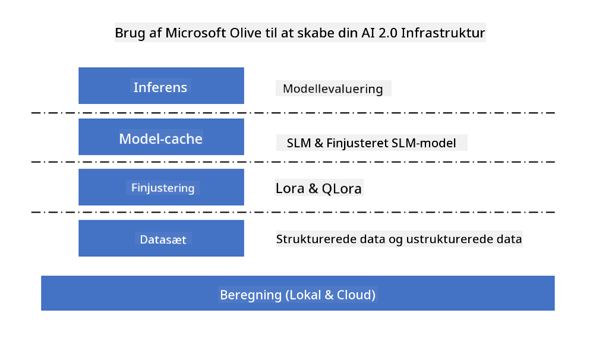

<!--
CO_OP_TRANSLATOR_METADATA:
{
  "original_hash": "5764be88ad2eb4f341e742eb8f14fab1",
  "translation_date": "2025-07-17T06:46:09+00:00",
  "source_file": "md/03.FineTuning/FineTuning_MicrosoftOlive.md",
  "language_code": "da"
}
-->
# **Finjustering af Phi-3 med Microsoft Olive**

[Olive](https://github.com/microsoft/OLive?WT.mc_id=aiml-138114-kinfeylo) er et brugervenligt hardware-bevidst værktøj til modeloptimering, der samler branchens førende teknikker inden for modelkomprimering, optimering og kompilering.

Det er designet til at gøre processen med at optimere maskinlæringsmodeller mere effektiv og sikre, at de udnytter specifikke hardwarearkitekturer bedst muligt.

Uanset om du arbejder med cloud-baserede applikationer eller edge-enheder, gør Olive det nemt og effektivt at optimere dine modeller.

## Nøglefunktioner:
- Olive samler og automatiserer optimeringsteknikker til ønskede hardwaremål.
- Ingen enkelt optimeringsteknik passer til alle scenarier, så Olive tillader udvidelser ved at lade eksperter integrere deres egne optimeringsinnovationer.

## Reducer udviklingsindsatsen:
- Udviklere skal ofte lære og bruge flere hardware-leverandørspecifikke værktøjskæder for at forberede og optimere trænede modeller til implementering.
- Olive forenkler denne proces ved at automatisere optimeringsteknikker til den ønskede hardware.

## Klar-til-brug end-to-end optimeringsløsning:

Ved at sammensætte og finjustere integrerede teknikker tilbyder Olive en samlet løsning til end-to-end optimering.
Den tager hensyn til begrænsninger som nøjagtighed og latenstid under optimeringen af modeller.

## Brug af Microsoft Olive til finjustering

Microsoft Olive er et meget brugervenligt open source værktøj til modeloptimering, som kan dække både finjustering og reference inden for generativ kunstig intelligens. Det kræver kun enkel konfiguration, og i kombination med open source små sprogmodeller og tilhørende runtime-miljøer (AzureML / lokal GPU, CPU, DirectML) kan du gennem automatisk optimering fuldføre finjustering eller reference af modellen og finde den bedste model til implementering i skyen eller på edge-enheder. Det giver virksomheder mulighed for at bygge deres egne branchespecifikke modeller både lokalt og i skyen.



## Phi-3 Finjustering med Microsoft Olive


## Phi-3 Olive Eksempelkode og eksempel
I dette eksempel vil du bruge Olive til at:

- Finjustere en LoRA-adapter til at klassificere sætninger som Sad, Joy, Fear, Surprise.
- Flette adaptervægtningerne ind i basismodellen.
- Optimere og kvantisere modellen til int4.

[Eksempelkode](../../code/03.Finetuning/olive-ort-example/README.md)

### Opsætning af Microsoft Olive

Installation af Microsoft Olive er meget enkel og kan også installeres til CPU, GPU, DirectML og Azure ML

```bash
pip install olive-ai
```

Hvis du ønsker at køre en ONNX-model med CPU, kan du bruge

```bash
pip install olive-ai[cpu]
```

Hvis du vil køre en ONNX-model med GPU, kan du bruge

```python
pip install olive-ai[gpu]
```

Hvis du vil bruge Azure ML, brug

```python
pip install git+https://github.com/microsoft/Olive#egg=olive-ai[azureml]
```

**Bemærk**
OS-krav: Ubuntu 20.04 / 22.04

### **Microsoft Olives Config.json**

Efter installation kan du konfigurere forskellige model-specifikke indstillinger via Config-filen, herunder data, beregning, træning, implementering og modelgenerering.

**1. Data**

På Microsoft Olive kan træning på lokale data og cloud-data understøttes og konfigureres i indstillingerne.

*Indstillinger for lokale data*

Du kan nemt opsætte det datasæt, der skal trænes til finjustering, normalt i json-format, og tilpasse det med dataskabelonen. Dette skal justeres efter modellens krav (for eksempel tilpasses det format, som Microsoft Phi-3-mini kræver. Hvis du har andre modeller, henvises der til de nødvendige finjusteringsformater for disse modeller).

```json

    "data_configs": [
        {
            "name": "dataset_default_train",
            "type": "HuggingfaceContainer",
            "load_dataset_config": {
                "params": {
                    "data_name": "json", 
                    "data_files":"dataset/dataset-classification.json",
                    "split": "train"
                }
            },
            "pre_process_data_config": {
                "params": {
                    "dataset_type": "corpus",
                    "text_cols": [
                            "phrase",
                            "tone"
                    ],
                    "text_template": "### Text: {phrase}\n### The tone is:\n{tone}",
                    "corpus_strategy": "join",
                    "source_max_len": 2048,
                    "pad_to_max_len": false,
                    "use_attention_mask": false
                }
            }
        }
    ],
```

**Indstillinger for cloud-datakilder**

Ved at forbinde Azure AI Studio/Azure Machine Learning Service’s datastore til data i skyen, kan du vælge at importere forskellige datakilder til Azure AI Studio/Azure Machine Learning Service via Microsoft Fabric og Azure Data som støtte til finjustering.

```json

    "data_configs": [
        {
            "name": "dataset_default_train",
            "type": "HuggingfaceContainer",
            "load_dataset_config": {
                "params": {
                    "data_name": "json", 
                    "data_files": {
                        "type": "azureml_datastore",
                        "config": {
                            "azureml_client": {
                                "subscription_id": "Your Azure Subscrition ID",
                                "resource_group": "Your Azure Resource Group",
                                "workspace_name": "Your Azure ML Workspaces name"
                            },
                            "datastore_name": "workspaceblobstore",
                            "relative_path": "Your train_data.json Azure ML Location"
                        }
                    },
                    "split": "train"
                }
            },
            "pre_process_data_config": {
                "params": {
                    "dataset_type": "corpus",
                    "text_cols": [
                            "Question",
                            "Best Answer"
                    ],
                    "text_template": "<|user|>\n{Question}<|end|>\n<|assistant|>\n{Best Answer}\n<|end|>",
                    "corpus_strategy": "join",
                    "source_max_len": 2048,
                    "pad_to_max_len": false,
                    "use_attention_mask": false
                }
            }
        }
    ],
    
```

**2. Beregningskonfiguration**

Hvis du ønsker lokal kørsel, kan du bruge lokale dataressourcer direkte. Hvis du vil bruge ressourcer fra Azure AI Studio / Azure Machine Learning Service, skal du konfigurere relevante Azure-parametre, navn på beregningsressourcer osv.

```json

    "systems": {
        "aml": {
            "type": "AzureML",
            "config": {
                "accelerators": ["gpu"],
                "hf_token": true,
                "aml_compute": "Your Azure AI Studio / Azure Machine Learning Service Compute Name",
                "aml_docker_config": {
                    "base_image": "Your Azure AI Studio / Azure Machine Learning Service docker",
                    "conda_file_path": "conda.yaml"
                }
            }
        },
        "azure_arc": {
            "type": "AzureML",
            "config": {
                "accelerators": ["gpu"],
                "aml_compute": "Your Azure AI Studio / Azure Machine Learning Service Compute Name",
                "aml_docker_config": {
                    "base_image": "Your Azure AI Studio / Azure Machine Learning Service docker",
                    "conda_file_path": "conda.yaml"
                }
            }
        }
    },
```

***Bemærk***

Da det kører via en container på Azure AI Studio/Azure Machine Learning Service, skal det nødvendige miljø konfigureres. Dette gøres i conda.yaml-miljøet.

```yaml

name: project_environment
channels:
  - defaults
dependencies:
  - python=3.8.13
  - pip=22.3.1
  - pip:
      - einops
      - accelerate
      - azure-keyvault-secrets
      - azure-identity
      - bitsandbytes
      - datasets
      - huggingface_hub
      - peft
      - scipy
      - sentencepiece
      - torch>=2.2.0
      - transformers
      - git+https://github.com/microsoft/Olive@jiapli/mlflow_loading_fix#egg=olive-ai[gpu]
      - --extra-index-url https://aiinfra.pkgs.visualstudio.com/PublicPackages/_packaging/ORT-Nightly/pypi/simple/ 
      - ort-nightly-gpu==1.18.0.dev20240307004
      - --extra-index-url https://aiinfra.pkgs.visualstudio.com/PublicPackages/_packaging/onnxruntime-genai/pypi/simple/
      - onnxruntime-genai-cuda

    

```

**3. Vælg din SLM**

Du kan bruge modellen direkte fra Hugging Face, eller du kan kombinere den med Model Catalog i Azure AI Studio / Azure Machine Learning for at vælge den model, du vil bruge. I kodeeksemplet nedenfor bruger vi Microsoft Phi-3-mini som eksempel.

Hvis du har modellen lokalt, kan du bruge denne metode

```json

    "input_model":{
        "type": "PyTorchModel",
        "config": {
            "hf_config": {
                "model_name": "model-cache/microsoft/phi-3-mini",
                "task": "text-generation",
                "model_loading_args": {
                    "trust_remote_code": true
                }
            }
        }
    },
```

Hvis du vil bruge en model fra Azure AI Studio / Azure Machine Learning Service, kan du bruge denne metode

```json

    "input_model":{
        "type": "PyTorchModel",
        "config": {
            "model_path": {
                "type": "azureml_registry_model",
                "config": {
                    "name": "microsoft/Phi-3-mini-4k-instruct",
                    "registry_name": "azureml-msr",
                    "version": "11"
                }
            },
             "model_file_format": "PyTorch.MLflow",
             "hf_config": {
                "model_name": "microsoft/Phi-3-mini-4k-instruct",
                "task": "text-generation",
                "from_pretrained_args": {
                    "trust_remote_code": true
                }
            }
        }
    },
```

**Bemærk:**
Vi skal integrere med Azure AI Studio / Azure Machine Learning Service, så ved opsætning af modellen henvises til versionsnummer og relevante navngivninger.

Alle modeller på Azure skal sættes til PyTorch.MLflow

Du skal have en Hugging Face-konto og binde nøglen til Key-værdien i Azure AI Studio / Azure Machine Learning

**4. Algoritme**

Microsoft Olive indkapsler Lora og QLora finjusteringsalgoritmer meget godt. Alt du skal konfigurere, er nogle relevante parametre. Her tager jeg QLora som eksempel.

```json
        "lora": {
            "type": "LoRA",
            "config": {
                "target_modules": [
                    "o_proj",
                    "qkv_proj"
                ],
                "double_quant": true,
                "lora_r": 64,
                "lora_alpha": 64,
                "lora_dropout": 0.1,
                "train_data_config": "dataset_default_train",
                "eval_dataset_size": 0.3,
                "training_args": {
                    "seed": 0,
                    "data_seed": 42,
                    "per_device_train_batch_size": 1,
                    "per_device_eval_batch_size": 1,
                    "gradient_accumulation_steps": 4,
                    "gradient_checkpointing": false,
                    "learning_rate": 0.0001,
                    "num_train_epochs": 3,
                    "max_steps": 10,
                    "logging_steps": 10,
                    "evaluation_strategy": "steps",
                    "eval_steps": 187,
                    "group_by_length": true,
                    "adam_beta2": 0.999,
                    "max_grad_norm": 0.3
                }
            }
        },
```

Hvis du ønsker kvantiseringskonvertering, understøtter Microsoft Olive hovedgren allerede onnxruntime-genai metoden. Du kan sætte det efter behov:

1. flet adaptervægtninger ind i basismodellen  
2. Konverter modellen til onnx-model med den ønskede præcision via ModelBuilder

for eksempel konvertering til kvantiseret INT4

```json

        "merge_adapter_weights": {
            "type": "MergeAdapterWeights"
        },
        "builder": {
            "type": "ModelBuilder",
            "config": {
                "precision": "int4"
            }
        }
```

**Bemærk**  
- Hvis du bruger QLoRA, understøttes kvantiseringskonvertering med ONNXRuntime-genai ikke på nuværende tidspunkt.

- Det skal her påpeges, at du kan konfigurere ovenstående trin efter eget behov. Det er ikke nødvendigt at konfigurere alle trin fuldstændigt. Afhængigt af dine behov kan du direkte bruge algoritmetrinnene uden finjustering. Til sidst skal du konfigurere de relevante engines.

```json

    "engine": {
        "log_severity_level": 0,
        "host": "aml",
        "target": "aml",
        "search_strategy": false,
        "execution_providers": ["CUDAExecutionProvider"],
        "cache_dir": "../model-cache/models/phi3-finetuned/cache",
        "output_dir" : "../model-cache/models/phi3-finetuned"
    }
```

**5. Finjustering færdig**

På kommandolinjen, kør i mappen med olive-config.json

```bash
olive run --config olive-config.json  
```

**Ansvarsfraskrivelse**:  
Dette dokument er blevet oversat ved hjælp af AI-oversættelsestjenesten [Co-op Translator](https://github.com/Azure/co-op-translator). Selvom vi bestræber os på nøjagtighed, bedes du være opmærksom på, at automatiserede oversættelser kan indeholde fejl eller unøjagtigheder. Det oprindelige dokument på dets oprindelige sprog bør betragtes som den autoritative kilde. For kritisk information anbefales professionel menneskelig oversættelse. Vi påtager os intet ansvar for misforståelser eller fejltolkninger, der opstår som følge af brugen af denne oversættelse.