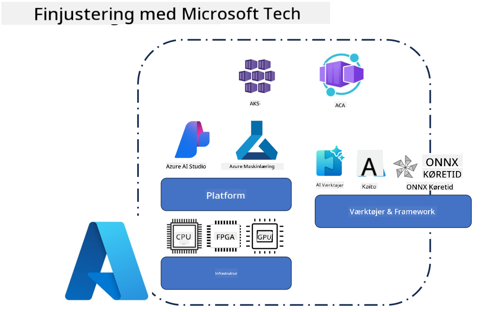
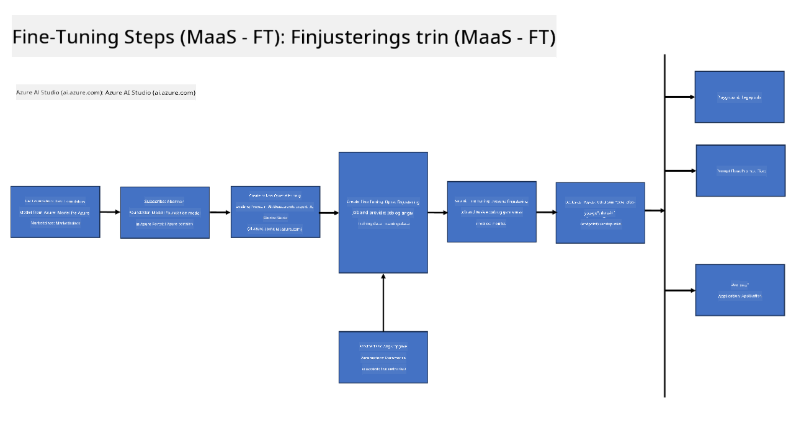
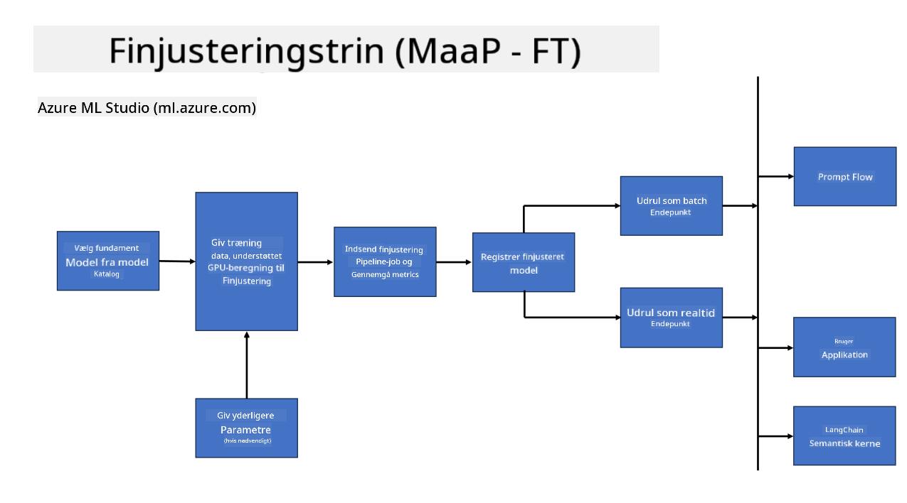

<!--
CO_OP_TRANSLATOR_METADATA:
{
  "original_hash": "cb5648935f63edc17e95ce38f23adc32",
  "translation_date": "2025-05-09T21:55:55+00:00",
  "source_file": "md/03.FineTuning/FineTuning_Scenarios.md",
  "language_code": "da"
}
-->
## Fine Tuning Scenarier

**Platform** Dette inkluderer forskellige teknologier såsom Azure AI Foundry, Azure Machine Learning, AI Tools, Kaito og ONNX Runtime.

**Infrastruktur** Dette inkluderer CPU og FPGA, som er essentielle for finjusteringsprocessen. Lad mig vise dig ikonerne for hver af disse teknologier.

**Værktøjer & Framework** Dette inkluderer ONNX Runtime og ONNX Runtime. Lad mig vise dig ikonerne for hver af disse teknologier.  
[Indsæt ikoner for ONNX Runtime og ONNX Runtime]

Finjusteringsprocessen med Microsoft-teknologier involverer forskellige komponenter og værktøjer. Ved at forstå og anvende disse teknologier kan vi effektivt finjustere vores applikationer og skabe bedre løsninger.

## Model as Service

Finjuster modellen ved hjælp af hosted fine-tuning, uden behov for at oprette og administrere compute.

Serverløs finjustering er tilgængelig for Phi-3-mini og Phi-3-medium modeller, hvilket gør det muligt for udviklere hurtigt og nemt at tilpasse modellerne til cloud- og edge-scenarier uden at skulle arrangere compute. Vi har også annonceret, at Phi-3-small nu er tilgængelig gennem vores Models-as-a-Service tilbud, så udviklere hurtigt og nemt kan komme i gang med AI-udvikling uden at skulle håndtere den underliggende infrastruktur.

## Model as a Platform

Brugere administrerer deres eget compute for at finjustere deres modeller.

[Fine Tuning Sample](https://github.com/Azure/azureml-examples/blob/main/sdk/python/foundation-models/system/finetune/chat-completion/chat-completion.ipynb)

## Fine Tuning Scenarier

| | | | | | | |
|-|-|-|-|-|-|-|
|Scenario|LoRA|QLoRA|PEFT|DeepSpeed|ZeRO|DORA|
|Tilpasning af præ-trænede LLMs til specifikke opgaver eller domæner|Ja|Ja|Ja|Ja|Ja|Ja|
|Finjustering til NLP-opgaver såsom tekstklassificering, navngiven entitetsgenkendelse og maskinoversættelse|Ja|Ja|Ja|Ja|Ja|Ja|
|Finjustering til QA-opgaver|Ja|Ja|Ja|Ja|Ja|Ja|
|Finjustering til at generere menneskelignende svar i chatbots|Ja|Ja|Ja|Ja|Ja|Ja|
|Finjustering til at generere musik, kunst eller andre former for kreativitet|Ja|Ja|Ja|Ja|Ja|Ja|
|Reducerer beregnings- og omkostningsniveauer|Ja|Ja|Nej|Ja|Ja|Nej|
|Reducerer hukommelsesforbrug|Nej|Ja|Nej|Ja|Ja|Ja|
|Brug af færre parametre for effektiv finjustering|Nej|Ja|Ja|Nej|Nej|Ja|
|Hukommelseseffektiv form for data-parallelisme, der giver adgang til den samlede GPU-hukommelse på alle tilgængelige GPU-enheder|Nej|Nej|Nej|Ja|Ja|Ja|

## Fine Tuning Performance Eksempler

**Ansvarsfraskrivelse**:  
Dette dokument er oversat ved hjælp af AI-oversættelsestjenesten [Co-op Translator](https://github.com/Azure/co-op-translator). Selvom vi bestræber os på nøjagtighed, bedes du være opmærksom på, at automatiserede oversættelser kan indeholde fejl eller unøjagtigheder. Det oprindelige dokument på dets oprindelige sprog bør betragtes som den autoritative kilde. For kritisk information anbefales professionel menneskelig oversættelse. Vi påtager os intet ansvar for misforståelser eller fejltolkninger, der måtte opstå som følge af brugen af denne oversættelse.