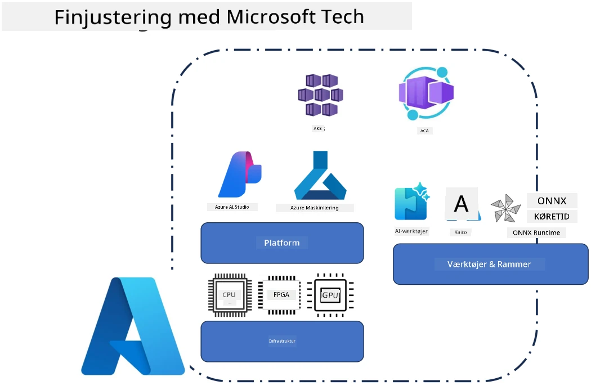
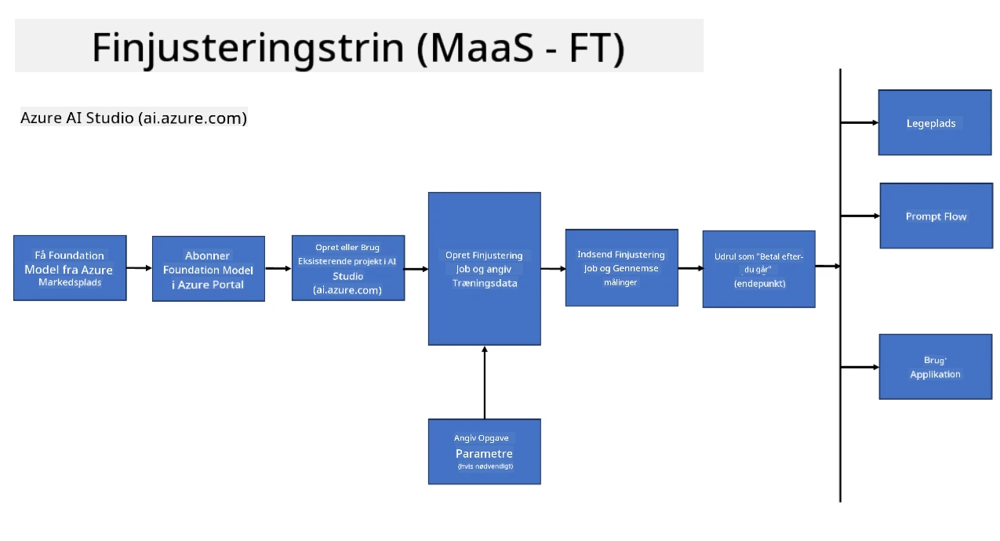
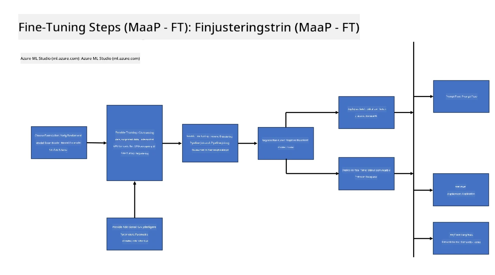
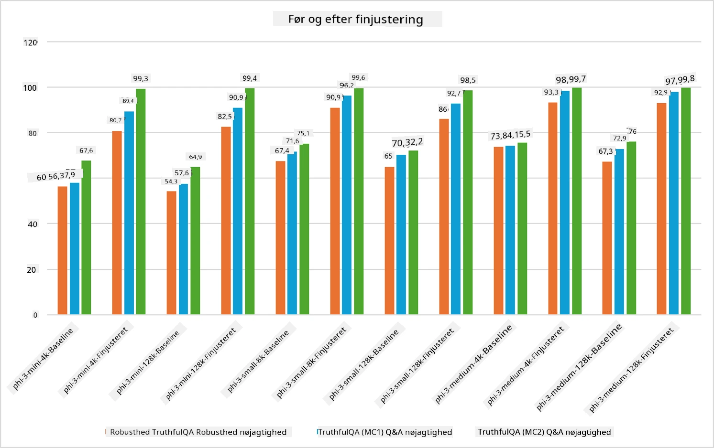

## Fine Tuning Scenarier

Dette afsnit giver en oversigt over fine-tuning scenarier i Microsoft Foundry og Azure miljøer, herunder deploymentsmodeller, infrastrukturlag og almindeligt anvendte optimeringsteknikker.

**Platform**  
Dette inkluderer managed services som Microsoft Foundry (tidligere Microsoft Foundry) og Azure Machine Learning, som leverer modelstyring, orkestrering, eksperimentsporing og deployments-workflows.

**Infrastruktur**  
Fine-tuning kræver skalerbare compute-ressourcer. I Azure miljøer inkluderer dette typisk GPU-baserede virtuelle maskiner og CPU-ressourcer til lette arbejdsbelastninger, sammen med skalerbar lagring til datasets og checkpoints.

**Værktøjer & Framework**  
Fine-tuning workflows benytter ofte frameworks og optimeringsbiblioteker som Hugging Face Transformers, DeepSpeed og PEFT (Parameter-Efficient Fine-Tuning).

Fine-tuning processen med Microsoft teknologier spænder over platformtjenester, compute-infrastruktur og træningsframeworks. Ved at forstå hvordan disse komponenter arbejder sammen, kan udviklere effektivt tilpasse fundamentale modeller til specifikke opgaver og produktionsscenarier.

## Model som Tjeneste

Finjuster modellen ved hjælp af hosted fine-tuning, uden behov for at oprette og administrere compute.

Serverløs fine-tuning er nu tilgængelig for Phi-3, Phi-3.5 og Phi-4 modelfamilier, hvilket gør det muligt for udviklere hurtigt og nemt at tilpasse modellerne til cloud- og edge-scenarier uden selv at skulle sørge for compute.

## Model som Platform

Brugere styrer deres eget compute for at finjustere deres modeller.

[Fine Tuning Eksempel](https://github.com/Azure/azureml-examples/blob/main/sdk/python/foundation-models/system/finetune/chat-completion/chat-completion.ipynb)

## Sammenligning af Fine-Tuning Teknikker

|Scenario|LoRA|QLoRA|PEFT|DeepSpeed|ZeRO|DoRA|
|---|---|---|---|---|---|---|
|Tilpasning af for-trænede LLM'er til specifikke opgaver eller domæner|Ja|Ja|Ja|Ja|Ja|Ja|
|Finjustering for NLP-opgaver såsom tekstklassificering, navngiven entitetsgenkendelse og maskinoversættelse|Ja|Ja|Ja|Ja|Ja|Ja|
|Finjustering for QA-opgaver|Ja|Ja|Ja|Ja|Ja|Ja|
|Finjustering for generering af menneskelignende svar i chatbots|Ja|Ja|Ja|Ja|Ja|Ja|
|Finjustering for generering af musik, kunst eller andre kreative former|Ja|Ja|Ja|Ja|Ja|Ja|
|Reducerer beregningsmæssige og økonomiske omkostninger|Ja|Ja|Ja|Ja|Ja|Ja|
|Reducerer hukommelsesforbrug|Ja|Ja|Ja|Ja|Ja|Ja|
|Brug af færre parametre for effektiv finjustering|Ja|Ja|Ja|Nej|Nej|Ja|
|Hukommelseseffektiv form for dataparallelisme, der giver adgang til den samlede GPU-hukommelse på alle tilgængelige GPU-enheder|Nej|Nej|Nej|Ja|Ja|Nej|

> [!NOTE]
> LoRA, QLoRA, PEFT og DoRA er parameter-effektive finjusteringsmetoder, hvorimod DeepSpeed og ZeRO fokuserer på distribueret træning og hukommelsesoptimering.

## Eksempler på Fine Tuning Ydeevne

---

<!-- CO-OP TRANSLATOR DISCLAIMER START -->
**Ansvarsfraskrivelse**:
Dette dokument er blevet oversat ved hjælp af AI-oversættelsestjenesten [Co-op Translator](https://github.com/Azure/co-op-translator). Selvom vi bestræber os på nøjagtighed, skal du være opmærksom på, at automatiserede oversættelser kan indeholde fejl eller unøjagtigheder. Det oprindelige dokument på dets oprindelige sprog bør betragtes som den autoritative kilde. For kritiske oplysninger anbefales professionel menneskelig oversættelse. Vi påtager os intet ansvar for misforståelser eller fejltolkninger, der opstår som følge af brugen af denne oversættelse.
<!-- CO-OP TRANSLATOR DISCLAIMER END -->