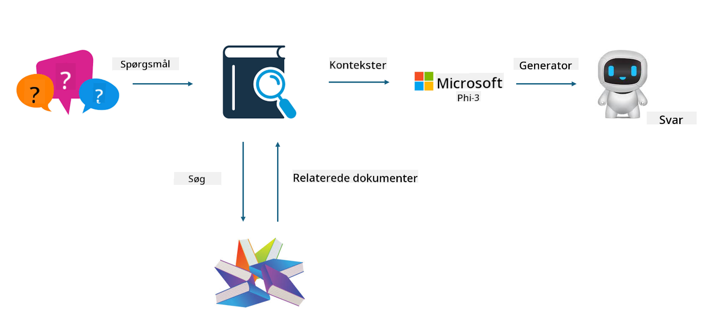

<!--
CO_OP_TRANSLATOR_METADATA:
{
  "original_hash": "e4e010400c2918557b36bb932a14004c",
  "translation_date": "2025-05-09T22:15:58+00:00",
  "source_file": "md/03.FineTuning/FineTuning_vs_RAG.md",
  "language_code": "da"
}
-->
## Finetuning vs RAG

## Retrieval Augmented Generation

RAG er datahentning + tekstgenerering. Den strukturerede og ustrukturerede data i virksomheden gemmes i vektordatabasen. Når der søges efter relevant indhold, findes den relevante opsummering og indhold for at danne en kontekst, og LLM/SLM’s tekstfuldførelsesfunktion kombineres for at generere indhold.

## RAG Process

## Fine-tuning
Fine-tuning bygger på forbedring af en bestemt model. Det behøver ikke at starte med modelalgoritmen, men data skal løbende akkumuleres. Hvis du ønsker mere præcis terminologi og sprogbrug i brancheapplikationer, er fine-tuning det bedre valg. Men hvis dine data ændrer sig ofte, kan fine-tuning blive kompliceret.

## How to choose
Hvis vores svar kræver inddragelse af ekstern data, er RAG det bedste valg.

Hvis du har brug for at levere stabil og præcis brancheviden, vil fine-tuning være et godt valg. RAG prioriterer at hente relevant indhold, men rammer ikke altid de specialiserede nuancer.

Fine-tuning kræver et datasæt af høj kvalitet, og hvis det kun er et lille datoområde, vil det ikke gøre den store forskel. RAG er mere fleksibelt.  
Fine-tuning er en sort boks, en metafysik, og det er svært at forstå den interne mekanisme. Men RAG kan gøre det lettere at finde datakilden, hvilket effektivt kan justere hallucinationer eller fejl i indhold og give bedre gennemsigtighed.

**Ansvarsfraskrivelse**:  
Dette dokument er blevet oversat ved hjælp af AI-oversættelsestjenesten [Co-op Translator](https://github.com/Azure/co-op-translator). Selvom vi bestræber os på nøjagtighed, bedes du være opmærksom på, at automatiske oversættelser kan indeholde fejl eller unøjagtigheder. Det originale dokument på dets oprindelige sprog bør betragtes som den autoritative kilde. For kritisk information anbefales professionel menneskelig oversættelse. Vi påtager os intet ansvar for misforståelser eller fejltolkninger, der opstår som følge af brugen af denne oversættelse.