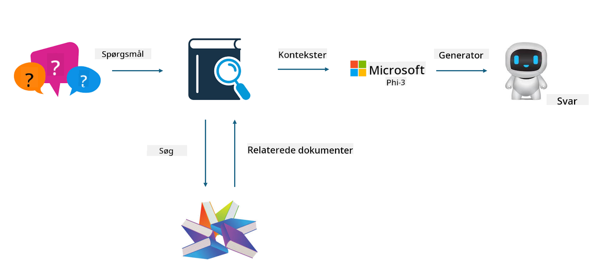

<!--
CO_OP_TRANSLATOR_METADATA:
{
  "original_hash": "e4e010400c2918557b36bb932a14004c",
  "translation_date": "2025-07-17T09:29:44+00:00",
  "source_file": "md/03.FineTuning/FineTuning_vs_RAG.md",
  "language_code": "da"
}
-->
## Finetuning vs RAG

## Retrieval Augmented Generation

RAG er datahentning + tekstgenerering. Den strukturerede og ustrukturerede data i virksomheden gemmes i vektordatabasen. Når der søges efter relevant indhold, findes den relevante opsummering og indhold for at danne en kontekst, og LLM/SLM’s tekstfuldførelsesfunktion kombineres for at generere indhold.

## RAG-processen

## Finetuning
Finetuning bygger på forbedring af en bestemt model. Det behøver ikke at starte med modelalgoritmen, men data skal løbende akkumuleres. Hvis du ønsker mere præcis terminologi og sproglig udtryk i brancheapplikationer, er finetuning det bedste valg. Men hvis dine data ændrer sig ofte, kan finetuning blive kompliceret.

## Hvordan man vælger
Hvis vores svar kræver inddragelse af ekstern data, er RAG det bedste valg.

Hvis du har brug for at levere stabil og præcis brancheviden, vil finetuning være et godt valg. RAG prioriterer at trække relevant indhold, men rammer måske ikke altid de specialiserede nuancer.

Finetuning kræver et datasæt af høj kvalitet, og hvis det kun er et lille datagrundlag, vil det ikke gøre den store forskel. RAG er mere fleksibel.  
Finetuning er en sort boks, en metafysik, og det er svært at forstå den interne mekanisme. Men RAG gør det lettere at finde datakilden, hvilket effektivt kan justere hallucinationer eller indholdsfejl og give bedre gennemsigtighed.

**Ansvarsfraskrivelse**:  
Dette dokument er blevet oversat ved hjælp af AI-oversættelsestjenesten [Co-op Translator](https://github.com/Azure/co-op-translator). Selvom vi bestræber os på nøjagtighed, bedes du være opmærksom på, at automatiserede oversættelser kan indeholde fejl eller unøjagtigheder. Det oprindelige dokument på dets oprindelige sprog bør betragtes som den autoritative kilde. For kritisk information anbefales professionel menneskelig oversættelse. Vi påtager os intet ansvar for misforståelser eller fejltolkninger, der opstår som følge af brugen af denne oversættelse.