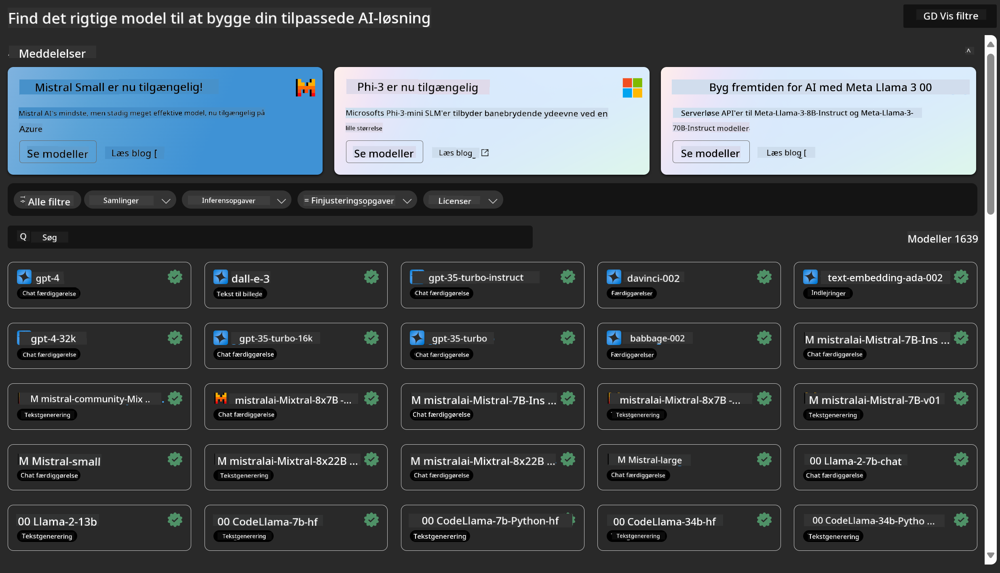
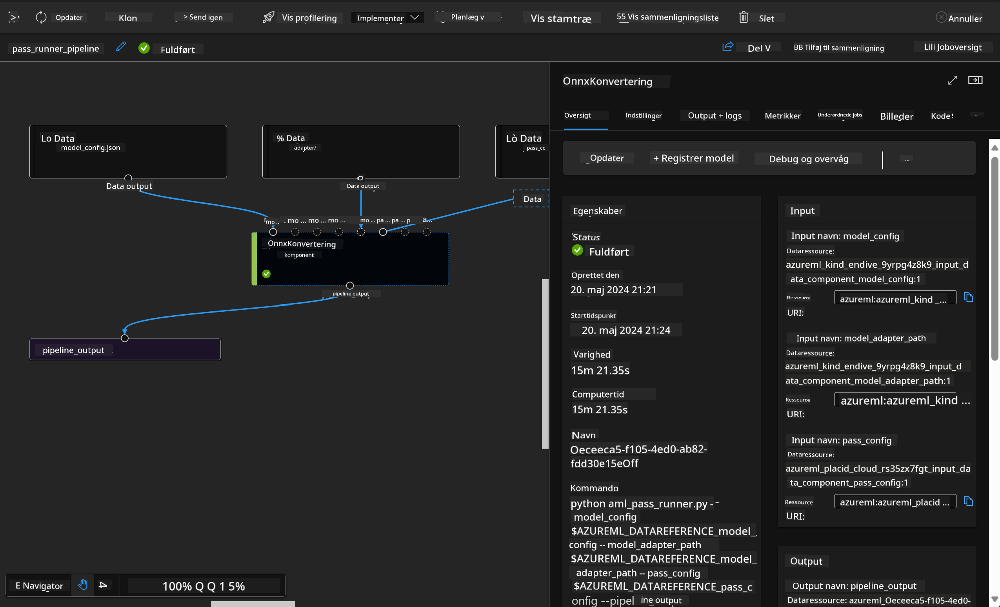

<!--
CO_OP_TRANSLATOR_METADATA:
{
  "original_hash": "7fe541373802e33568e94e13226d463c",
  "translation_date": "2025-05-09T22:20:56+00:00",
  "source_file": "md/03.FineTuning/Introduce_AzureML.md",
  "language_code": "da"
}
-->
# **Introducer Azure Machine Learning Service**

[Azure Machine Learning](https://ml.azure.com?WT.mc_id=aiml-138114-kinfeylo) er en cloudtjeneste til at fremskynde og styre hele livscyklussen for maskinlæringsprojekter (ML).

ML-professionelle, dataforskere og ingeniører kan bruge den i deres daglige arbejdsprocesser til at:

- Træne og implementere modeller.  
- Styre maskinlæringsoperationer (MLOps).  
- Du kan oprette en model i Azure Machine Learning eller bruge en model bygget på en open source-platform som PyTorch, TensorFlow eller scikit-learn.  
- MLOps-værktøjer hjælper dig med at overvåge, genoptræne og genudrulle modeller.

## Hvem er Azure Machine Learning til?

**Dataforskere og ML-ingeniører**

De kan bruge værktøjer til at fremskynde og automatisere deres daglige arbejdsprocesser.  
Azure ML tilbyder funktioner til retfærdighed, forklarlighed, sporing og revisionsmuligheder.

**Applikationsudviklere:**  
De kan nemt integrere modeller i applikationer eller tjenester.

**Platformudviklere**

De har adgang til et robust sæt værktøjer understøttet af holdbare Azure Resource Manager APIs.  
Disse værktøjer muliggør opbygning af avancerede ML-værktøjer.

**Virksomheder**

Ved at arbejde i Microsoft Azure-clouden drager virksomheder fordel af velkendt sikkerhed og rollebaseret adgangskontrol.  
Opsæt projekter for at kontrollere adgang til beskyttede data og specifikke operationer.

## Produktivitet for hele teamet  
ML-projekter kræver ofte et team med forskellige kompetencer til at opbygge og vedligeholde.

Azure ML giver værktøjer, der gør det muligt at:  
- Samarbejde med dit team via delte notebooks, computerressourcer, serverløs computing, data og miljøer.  
- Udvikle modeller med fokus på retfærdighed, forklarlighed, sporing og revisionsmuligheder for at opfylde krav til sporbarhed og revision.  
- Implementere ML-modeller hurtigt og nemt i stor skala samt effektivt styre og administrere dem med MLOps.  
- Køre maskinlæringsopgaver hvor som helst med indbygget styring, sikkerhed og overholdelse.

## Platformværktøjer med krydskompatibilitet

Alle i et ML-team kan bruge deres foretrukne værktøjer til at udføre arbejdet.  
Uanset om du kører hurtige eksperimenter, tuner hyperparametre, bygger pipelines eller styrer inferenser, kan du bruge velkendte grænseflader som:  
- Azure Machine Learning Studio  
- Python SDK (v2)  
- Azure CLI (v2)  
- Azure Resource Manager REST APIs

Mens du forfiner modeller og samarbejder gennem hele udviklingscyklussen, kan du dele og finde aktiver, ressourcer og målinger i Azure Machine Learning studio UI.

## **LLM/SLM i Azure ML**

Azure ML har tilføjet mange funktioner relateret til LLM/SLM, der kombinerer LLMOps og SLMOps for at skabe en virksomhedsomspændende generativ AI-teknologiplatform.

### **Model Catalog**

Virksomhedsbrugere kan implementere forskellige modeller til forskellige forretningsscenarier via Model Catalog og tilbyde tjenester som Model as Service for virksomhedens udviklere eller brugere.

Model Catalog i Azure Machine Learning studio er centrum for at opdage og bruge et bredt udvalg af modeller, som gør det muligt at bygge generative AI-applikationer. Modelkataloget indeholder hundredvis af modeller fra leverandører som Azure OpenAI service, Mistral, Meta, Cohere, Nvidia, Hugging Face samt modeller trænet af Microsoft. Modeller fra andre end Microsoft er Non-Microsoft Products, som defineret i Microsofts Product Terms, og er underlagt de vilkår, der følger med modellen.

### **Job Pipeline**

Kernen i en maskinlæringspipeline er at opdele en komplet maskinlæringsopgave i en flertrinsarbejdsgang. Hvert trin er en håndterbar komponent, der kan udvikles, optimeres, konfigureres og automatiseres individuelt. Trinene forbindes via veldefinerede grænseflader. Azure Machine Learning pipeline service orkestrerer automatisk alle afhængigheder mellem pipeline-trin.

Ved finjustering af SLM / LLM kan vi styre vores data, træning og genereringsprocesser gennem Pipeline.

### **Prompt flow**

Fordele ved at bruge Azure Machine Learning prompt flow  
Azure Machine Learning prompt flow tilbyder en række fordele, der hjælper brugere med at gå fra idéudvikling til eksperimentering og til sidst produktion af LLM-baserede applikationer:

**Prompt engineering agilitet**

Interaktiv forfatteroplevelse: Azure Machine Learning prompt flow giver en visuel repræsentation af flowets struktur, så brugere nemt kan forstå og navigere i deres projekter. Det tilbyder også en notebook-lignende kodningsoplevelse for effektiv flowudvikling og fejlfinding.  
Varianter til prompt-tuning: Brugere kan oprette og sammenligne flere prompt-varianter, hvilket fremmer en iterativ forbedringsproces.

Evaluering: Indbyggede evalueringsflows gør det muligt for brugere at vurdere kvaliteten og effektiviteten af deres prompts og flows.

Omfattende ressourcer: Azure Machine Learning prompt flow indeholder et bibliotek med indbyggede værktøjer, eksempler og skabeloner, som fungerer som udgangspunkt for udvikling, inspirerer til kreativitet og fremskynder processen.

**Virksomhedsklarhed for LLM-baserede applikationer**

Samarbejde: Azure Machine Learning prompt flow understøtter teamsamarbejde, så flere brugere kan arbejde sammen på prompt engineering-projekter, dele viden og opretholde versionskontrol.

Alt-i-en platform: Azure Machine Learning prompt flow effektiviserer hele prompt engineering-processen, fra udvikling og evaluering til implementering og overvågning. Brugere kan nemt implementere deres flows som Azure Machine Learning endpoints og overvåge deres ydeevne i realtid, hvilket sikrer optimal drift og løbende forbedring.

Azure Machine Learning Enterprise Readiness Solutions: Prompt flow drager fordel af Azure Machine Learnings robuste løsninger til virksomhedsklarhed, som giver en sikker, skalerbar og pålidelig base for udvikling, eksperimentering og implementering af flows.

Med Azure Machine Learning prompt flow kan brugere frigøre deres prompt engineering-agilitet, samarbejde effektivt og udnytte virksomhedsklare løsninger til succesfuld udvikling og implementering af LLM-baserede applikationer.

Ved at kombinere beregningskraft, data og forskellige komponenter i Azure ML kan virksomhedens udviklere nemt bygge deres egne kunstige intelligens-applikationer.

**Ansvarsfraskrivelse**:  
Dette dokument er blevet oversat ved hjælp af AI-oversættelsestjenesten [Co-op Translator](https://github.com/Azure/co-op-translator). Selvom vi bestræber os på nøjagtighed, skal du være opmærksom på, at automatiserede oversættelser kan indeholde fejl eller unøjagtigheder. Det oprindelige dokument på dets oprindelige sprog bør betragtes som den autoritative kilde. For kritisk information anbefales professionel menneskelig oversættelse. Vi påtager os intet ansvar for misforståelser eller fejltolkninger, der måtte opstå som følge af brugen af denne oversættelse.