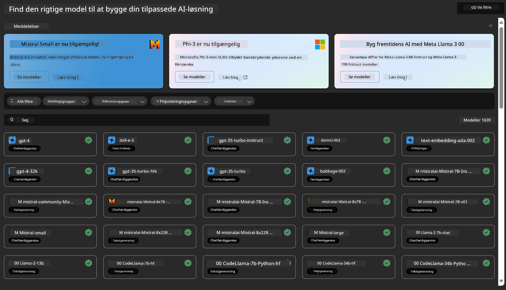
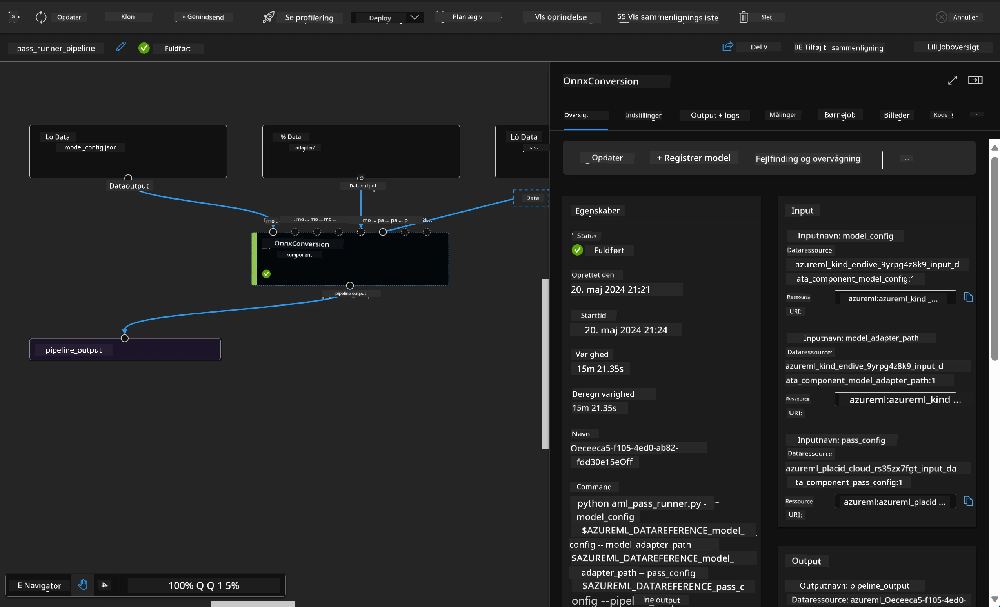

<!--
CO_OP_TRANSLATOR_METADATA:
{
  "original_hash": "7fe541373802e33568e94e13226d463c",
  "translation_date": "2025-07-17T09:43:15+00:00",
  "source_file": "md/03.FineTuning/Introduce_AzureML.md",
  "language_code": "da"
}
-->
# **Introduktion til Azure Machine Learning Service**

[Azure Machine Learning](https://ml.azure.com?WT.mc_id=aiml-138114-kinfeylo) er en cloudtjeneste til at accelerere og styre hele livscyklussen for maskinlæringsprojekter (ML).

ML-professionelle, dataforskere og ingeniører kan bruge den i deres daglige arbejdsgange til at:

- Træne og implementere modeller.  
- Administrere maskinlæringsoperationer (MLOps).  
- Du kan oprette en model i Azure Machine Learning eller bruge en model bygget på en open source-platform som PyTorch, TensorFlow eller scikit-learn.  
- MLOps-værktøjer hjælper dig med at overvåge, genoplære og genimplementere modeller.

## Hvem er Azure Machine Learning til?

**Dataforskere og ML-ingeniører**

De kan bruge værktøjer til at accelerere og automatisere deres daglige arbejdsgange.  
Azure ML tilbyder funktioner til retfærdighed, forklarbarhed, sporing og revisionsmuligheder.

**Applikationsudviklere:**  
De kan integrere modeller i applikationer eller tjenester problemfrit.

**Platformudviklere**

De har adgang til et robust sæt værktøjer understøttet af holdbare Azure Resource Manager-API’er.  
Disse værktøjer muliggør opbygning af avancerede ML-værktøjer.

**Virksomheder**

Ved at arbejde i Microsoft Azure-clouden drager virksomheder fordel af velkendt sikkerhed og rollebaseret adgangskontrol.  
Opsæt projekter for at styre adgang til beskyttede data og specifikke operationer.

## Produktivitet for hele teamet  
ML-projekter kræver ofte et team med forskellige kompetencer til at bygge og vedligeholde.

Azure ML tilbyder værktøjer, der gør det muligt at:  
- Samarbejde med dit team via delte notebooks, compute-ressourcer, serverløs compute, data og miljøer.  
- Udvikle modeller med fokus på retfærdighed, forklarbarhed, sporing og revisionsmuligheder for at opfylde krav til sporbarhed og compliance.  
- Implementere ML-modeller hurtigt og nemt i stor skala samt effektivt styre og administrere dem med MLOps.  
- Køre maskinlæringsarbejdsbelastninger hvor som helst med indbygget styring, sikkerhed og overholdelse af regler.

## Platformværktøjer med krydskompatibilitet

Alle i et ML-team kan bruge deres foretrukne værktøjer til at løse opgaverne.  
Uanset om du kører hurtige eksperimenter, hyperparameter-tuning, bygger pipelines eller håndterer inferenser, kan du bruge velkendte grænseflader som:  
- Azure Machine Learning Studio  
- Python SDK (v2)  
- Azure CLI (v2)  
- Azure Resource Manager REST API’er

Når du finjusterer modeller og samarbejder gennem hele udviklingscyklussen, kan du dele og finde aktiver, ressourcer og målinger i Azure Machine Learning studio UI.

## **LLM/SLM i Azure ML**

Azure ML har tilføjet mange funktioner relateret til LLM/SLM, som kombinerer LLMOps og SLMOps for at skabe en virksomhedsomspændende platform for generativ kunstig intelligens.

### **Modelkatalog**

Virksomhedsbrugere kan implementere forskellige modeller til forskellige forretningsscenarier via Modelkataloget og tilbyde tjenester som Model as Service, så virksomhedens udviklere eller brugere kan få adgang.

Modelkataloget i Azure Machine Learning studio er centrum for at opdage og bruge et bredt udvalg af modeller, der gør det muligt at bygge generative AI-applikationer. Modelkataloget indeholder hundredvis af modeller fra leverandører som Azure OpenAI service, Mistral, Meta, Cohere, Nvidia, Hugging Face, inklusive modeller trænet af Microsoft. Modeller fra andre leverandører end Microsoft er Non-Microsoft Products, som defineret i Microsofts Product Terms, og er underlagt de vilkår, der følger med modellen.

### **Job Pipeline**

Kernen i en maskinlæringspipeline er at opdele en komplet maskinlæringsopgave i en flertrins arbejdsgang. Hvert trin er en håndterbar komponent, der kan udvikles, optimeres, konfigureres og automatiseres individuelt. Trinene forbindes via veldefinerede grænseflader. Azure Machine Learning pipeline-tjenesten orkestrerer automatisk alle afhængigheder mellem pipeline-trin.

Ved finjustering af SLM / LLM kan vi styre vores data, træning og genereringsprocesser gennem Pipeline.

### **Prompt flow**

Fordele ved at bruge Azure Machine Learning prompt flow  
Azure Machine Learning prompt flow tilbyder en række fordele, der hjælper brugere med at gå fra idé til eksperimentering og til sidst til produktionsklare LLM-baserede applikationer:

**Agil prompt engineering**

Interaktiv forfatteroplevelse: Azure Machine Learning prompt flow giver en visuel repræsentation af flowets struktur, så brugere nemt kan forstå og navigere i deres projekter. Det tilbyder også en notebook-lignende kodningsoplevelse for effektiv udvikling og fejlfinding af flows.  
Varianter til prompt-tuning: Brugere kan oprette og sammenligne flere prompt-varianter, hvilket muliggør en iterativ forfiningsproces.

Evaluering: Indbyggede evalueringsflows gør det muligt for brugere at vurdere kvaliteten og effektiviteten af deres prompts og flows.

Omfattende ressourcer: Azure Machine Learning prompt flow inkluderer et bibliotek med indbyggede værktøjer, eksempler og skabeloner, som fungerer som udgangspunkt for udvikling, inspirerer til kreativitet og fremskynder processen.

**Virksomhedsklarhed for LLM-baserede applikationer**

Samarbejde: Azure Machine Learning prompt flow understøtter teamsamarbejde, så flere brugere kan arbejde sammen om prompt engineering-projekter, dele viden og opretholde versionskontrol.

Alt-i-en platform: Azure Machine Learning prompt flow strømliner hele prompt engineering-processen fra udvikling og evaluering til implementering og overvågning. Brugere kan nemt implementere deres flows som Azure Machine Learning endpoints og overvåge deres ydeevne i realtid, hvilket sikrer optimal drift og løbende forbedringer.

Azure Machine Learning Enterprise Readiness Solutions: Prompt flow udnytter Azure Machine Learnings robuste løsninger til virksomhedsklarhed og tilbyder et sikkert, skalerbart og pålideligt fundament for udvikling, eksperimentering og implementering af flows.

Med Azure Machine Learning prompt flow kan brugere frigøre deres agilitet inden for prompt engineering, samarbejde effektivt og udnytte virksomhedsklare løsninger til succesfuld udvikling og implementering af LLM-baserede applikationer.

Ved at kombinere regnekraft, data og forskellige komponenter i Azure ML kan virksomhedens udviklere nemt bygge deres egne kunstige intelligens-applikationer.

**Ansvarsfraskrivelse**:  
Dette dokument er blevet oversat ved hjælp af AI-oversættelsestjenesten [Co-op Translator](https://github.com/Azure/co-op-translator). Selvom vi bestræber os på nøjagtighed, bedes du være opmærksom på, at automatiserede oversættelser kan indeholde fejl eller unøjagtigheder. Det oprindelige dokument på dets oprindelige sprog bør betragtes som den autoritative kilde. For kritisk information anbefales professionel menneskelig oversættelse. Vi påtager os intet ansvar for misforståelser eller fejltolkninger, der opstår som følge af brugen af denne oversættelse.