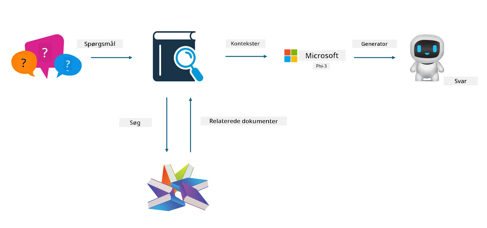
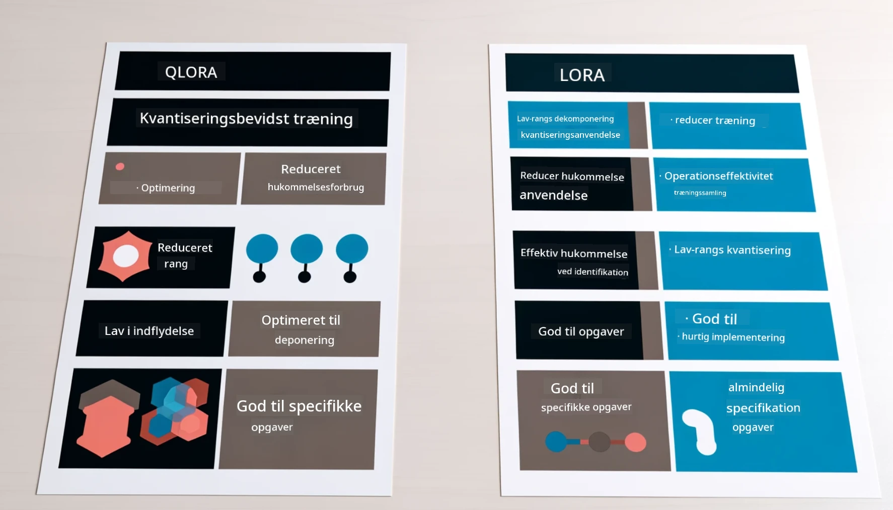

# **Lad Phi-3 blive en brancheekspert**

For at implementere Phi-3 modellen i en branche, skal du tilføje branche-specifikke forretningsdata til Phi-3 modellen. Vi har to forskellige muligheder: den første er RAG (Retrieval Augmented Generation) og den anden er Fine Tuning.

## **RAG vs Fine-Tuning**

### **Retrieval Augmented Generation**

RAG er datahentning + tekstgenerering. Den strukturerede og ustrukturerede data fra virksomheden gemmes i en vektordatabase. Når der søges efter relevant indhold, findes relevante resuméer og indhold for at danne en kontekst, og LLM/SLM’s tekstfuldførelsesfunktion kombineres for at generere indhold.

### **Fine-tuning**

Fine-tuning bygger på forbedring af en bestemt model. Det kræver ikke, at man starter med modelalgoritmen, men data skal løbende akkumuleres. Hvis du ønsker mere præcis terminologi og sproglig udtryk i brancheapplikationer, er fine-tuning det bedste valg. Men hvis dine data ændrer sig ofte, kan fine-tuning blive kompliceret.

### **Hvordan vælger man**

1. Hvis vores svar kræver inddragelse af eksterne data, er RAG det bedste valg

2. Hvis du har brug for at levere stabil og præcis brancheviden, er fine-tuning et godt valg. RAG prioriterer at hente relevant indhold, men rammer ikke altid de specialiserede nuancer.

3. Fine-tuning kræver et datasæt af høj kvalitet, og hvis det kun er et lille datagrundlag, vil det ikke gøre den store forskel. RAG er mere fleksibel.

4. Fine-tuning er en sort boks, en slags metafysik, og det er svært at forstå den interne mekanisme. Men RAG gør det lettere at finde datakilden, hvilket effektivt kan justere hallucinationer eller fejl i indholdet og give bedre gennemsigtighed.

### **Scenarier**

1. Vertikale brancher, der kræver specifikt fagligt ordforråd og udtryk, ***Fine-tuning*** er det bedste valg

2. QA-systemer, der involverer syntese af forskellige videnspunkter, ***RAG*** er det bedste valg

3. Kombinationen af automatiserede forretningsprocesser ***RAG + Fine-tuning*** er det bedste valg

## **Sådan bruger du RAG**

En vektordatabase er en samling af data, der er lagret i matematisk form. Vektordatabaser gør det lettere for maskinlæringsmodeller at huske tidligere input, hvilket muliggør brug af maskinlæring til at understøtte anvendelsestilfælde som søgning, anbefalinger og tekstgenerering. Data kan identificeres baseret på lighedsmål frem for eksakte matches, hvilket gør det muligt for computermodeller at forstå konteksten af dataene.

Vektordatabasen er nøglen til at realisere RAG. Vi kan konvertere data til vektorlagring gennem vektormodeller som text-embedding-3, jina-ai-embedding osv.

Lær mere om at oprette RAG-applikationer [https://github.com/microsoft/Phi-3CookBook](https://github.com/microsoft/Phi-3CookBook?WT.mc_id=aiml-138114-kinfeylo)

## **Sådan bruger du Fine-tuning**

De mest anvendte algoritmer i Fine-tuning er Lora og QLora. Hvordan vælger man?
- [Lær mere med denne eksempel-notebook](../../../../code/04.Finetuning/Phi_3_Inference_Finetuning.ipynb)
- [Eksempel på Python FineTuning Sample](../../../../code/04.Finetuning/FineTrainingScript.py)

### **Lora og QLora**

LoRA (Low-Rank Adaptation) og QLoRA (Quantized Low-Rank Adaptation) er begge teknikker, der bruges til at finjustere store sprogmodeller (LLMs) ved hjælp af Parameter Efficient Fine Tuning (PEFT). PEFT-teknikker er designet til at træne modeller mere effektivt end traditionelle metoder.  
LoRA er en selvstændig finjusteringsteknik, der reducerer hukommelsesforbruget ved at anvende en lav-rangs-tilnærmelse på vægtopdateringsmatricen. Den tilbyder hurtige træningstider og bevarer ydeevnen tæt på traditionelle finjusteringsmetoder.

QLoRA er en udvidet version af LoRA, der inkorporerer kvantiseringsteknikker for yderligere at reducere hukommelsesforbruget. QLoRA kvantificerer præcisionen af vægtparametrene i den fortrænede LLM til 4-bit præcision, hvilket er mere hukommelseseffektivt end LoRA. Dog er QLoRA-træning cirka 30 % langsommere end LoRA-træning på grund af de ekstra kvantiserings- og dekvantiseringsprocesser.

QLoRA bruger LoRA som et supplement til at rette fejl, der opstår under kvantiseringsprocessen. QLoRA muliggør finjustering af massive modeller med milliarder af parametre på relativt små, let tilgængelige GPU’er. For eksempel kan QLoRA finjustere en 70B parameter-model, der normalt kræver 36 GPU’er, med kun 2.

**Ansvarsfraskrivelse**:  
Dette dokument er blevet oversat ved hjælp af AI-oversættelsestjenesten [Co-op Translator](https://github.com/Azure/co-op-translator). Selvom vi bestræber os på nøjagtighed, bedes du være opmærksom på, at automatiserede oversættelser kan indeholde fejl eller unøjagtigheder. Det oprindelige dokument på dets oprindelige sprog bør betragtes som den autoritative kilde. For kritisk information anbefales professionel menneskelig oversættelse. Vi påtager os intet ansvar for misforståelser eller fejltolkninger, der opstår som følge af brugen af denne oversættelse.