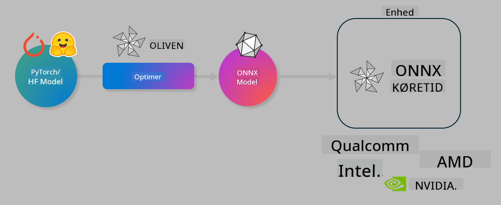

<!--
CO_OP_TRANSLATOR_METADATA:
{
  "original_hash": "6bbe47de3b974df7eea29dfeccf6032b",
  "translation_date": "2025-05-09T22:37:39+00:00",
  "source_file": "md/03.FineTuning/olive-lab/readme.md",
  "language_code": "da"
}
-->
# Lab. Optimer AI-modeller til inferens på enhed

## Introduktion

> [!IMPORTANT]
> Dette lab kræver et **Nvidia A10 eller A100 GPU** med tilhørende drivere og CUDA toolkit (version 12+) installeret.

> [!NOTE]
> Dette er et **35-minutters** lab, der giver dig en praktisk introduktion til kernebegreberne i at optimere modeller til inferens på enhed ved hjælp af OLIVE.

## Læringsmål

Ved afslutningen af dette lab vil du kunne bruge OLIVE til at:

- Kvantisere en AI-model ved hjælp af AWQ kvantiseringsmetode.
- Finjustere en AI-model til en specifik opgave.
- Generere LoRA-adaptere (finjusteret model) for effektiv inferens på enhed med ONNX Runtime.

### Hvad er Olive

Olive (*O*NNX *live*) er et værktøjssæt til modeloptimering med tilhørende CLI, der gør det muligt at levere modeller til ONNX runtime +++https://onnxruntime.ai+++ med både kvalitet og ydeevne.



Input til Olive er typisk en PyTorch- eller Hugging Face-model, og output er en optimeret ONNX-model, som køres på en enhed (deploymentsmål), der kører ONNX runtime. Olive optimerer modellen til deploymentsmålets AI-accelerator (NPU, GPU, CPU) leveret af hardwareproducenter som Qualcomm, AMD, Nvidia eller Intel.

Olive udfører et *workflow*, som er en ordnet sekvens af individuelle modeloptimeringsopgaver kaldet *passes* – eksempelvis modelkomprimering, grafoptagelse, kvantisering, grafoptimering. Hver pass har et sæt parametre, der kan justeres for at opnå de bedste metrikker, fx nøjagtighed og latenstid, som vurderes af den respektive evaluator. Olive anvender en søgestrategi, der bruger en søgealgoritme til automatisk at finjustere hver pass én ad gangen eller flere passes samlet.

#### Fordele ved Olive

- **Reducer frustration og tid** ved manuel forsøg-og-fejl med forskellige teknikker til grafoptimering, komprimering og kvantisering. Definer dine kvalitets- og ydelseskrav, og lad Olive automatisk finde den bedste model til dig.
- **40+ indbyggede modeloptimeringskomponenter** med banebrydende teknikker inden for kvantisering, komprimering, grafoptimering og finjustering.
- **Brugervenlig CLI** til almindelige modeloptimeringsopgaver. For eksempel olive quantize, olive auto-opt, olive finetune.
- Indbygget modelpakning og deployment.
- Understøtter generering af modeller til **Multi LoRA serving**.
- Byg workflows med YAML/JSON til at orkestrere modeloptimering og deploymentopgaver.
- Integration med **Hugging Face** og **Azure AI**.
- Indbygget **caching**-mekanisme til at **spare omkostninger**.

## Lab instruktioner
> [!NOTE]
> Sørg for, at du har provisioneret dit Azure AI Hub og projekt og sat dit A100 compute op som i Lab 1.

### Trin 0: Forbind til dit Azure AI Compute

Du forbinder til Azure AI compute ved hjælp af fjernfunktionaliteten i **VS Code**.

1. Åbn din **VS Code** desktop-applikation:
1. Åbn **command palette** med **Shift+Ctrl+P**
1. Søg i command palette efter **AzureML - remote: Connect to compute instance in New Window**.
1. Følg instruktionerne på skærmen for at forbinde til Compute. Det indebærer at vælge dit Azure Subscription, Resource Group, Projekt og Compute-navn, som du satte op i Lab 1.
1. Når du er forbundet til din Azure ML Compute-node, vises dette nederst til venstre i Visual Code `><Azure ML: Compute Name`

### Trin 1: Klon dette repo

I VS Code kan du åbne en ny terminal med **Ctrl+J** og klone dette repo:

I terminalen vil du se prompten

```
azureuser@computername:~/cloudfiles/code$ 
```
Klon løsningen

```bash
cd ~/localfiles
git clone https://github.com/microsoft/phi-3cookbook.git
```

### Trin 2: Åbn mappe i VS Code

For at åbne VS Code i den relevante mappe, kør følgende kommando i terminalen, som åbner et nyt vindue:

```bash
code phi-3cookbook/code/04.Finetuning/Olive-lab
```

Alternativt kan du åbne mappen ved at vælge **File** > **Open Folder**.

### Trin 3: Afhængigheder

Åbn et terminalvindue i VS Code på din Azure AI Compute-instans (tip: **Ctrl+J**) og kør følgende kommandoer for at installere afhængighederne:

```bash
conda create -n olive-ai python=3.11 -y
conda activate olive-ai
pip install -r requirements.txt
az extension remove -n azure-cli-ml
az extension add -n ml
```

> [!NOTE]
> Det tager ca. 5 minutter at installere alle afhængigheder.

I dette lab downloader og uploader du modeller til Azure AI Model kataloget. For at få adgang til modelkataloget skal du logge ind på Azure med:

```bash
az login
```

> [!NOTE]
> Ved login bliver du bedt om at vælge dit abonnement. Sørg for at sætte abonnementet til det, der er angivet til dette lab.

### Trin 4: Udfør Olive kommandoer

Åbn et terminalvindue i VS Code på din Azure AI Compute-instans (tip: **Ctrl+J**) og sørg for, at `olive-ai` conda-miljøet er aktiveret:

```bash
conda activate olive-ai
```

Kør derefter følgende Olive-kommandoer i kommandolinjen.

1. **Undersøg dataene:** I dette eksempel finjusterer du Phi-3.5-Mini modellen, så den er specialiseret i at besvare rejserelaterede spørgsmål. Koden nedenfor viser de første få poster i datasættet, som er i JSON lines-format:

    ```bash
    head data/data_sample_travel.jsonl
    ```
1. **Kvantisér modellen:** Før træning kvantiserer du modellen med følgende kommando, som bruger en teknik kaldet Active Aware Quantization (AWQ) +++https://arxiv.org/abs/2306.00978+++. AWQ kvantiserer vægtene i en model ved at tage højde for aktiveringerne, der produceres under inferens. Det betyder, at kvantiseringsprocessen tager højde for den faktiske datadistribution i aktiveringerne, hvilket bevarer modellens nøjagtighed bedre end traditionelle vægtkvantiseringsmetoder.

    ```bash
    olive quantize \
       --model_name_or_path microsoft/Phi-3.5-mini-instruct \
       --trust_remote_code \
       --algorithm awq \
       --output_path models/phi/awq \
       --log_level 1
    ```

    Det tager **~8 minutter** at fuldføre AWQ kvantiseringen, som vil **reducere modellens størrelse fra ~7,5GB til ~2,5GB**.

    I dette lab viser vi, hvordan du indlæser modeller fra Hugging Face (fx `microsoft/Phi-3.5-mini-instruct`). However, Olive also allows you to input models from the Azure AI catalog by updating the `model_name_or_path` argument to an Azure AI asset ID (for example:  `azureml://registries/azureml/models/Phi-3.5-mini-instruct/versions/4`). 

1. **Train the model:** Next, the `olive finetune` kommandoen finjusterer den kvantiserede model. Kvantisering før finjustering giver bedre nøjagtighed, da finjusteringen genskaber noget af det tab, der sker ved kvantiseringen.

    ```bash
    olive finetune \
        --method lora \
        --model_name_or_path models/phi/awq \
        --data_files "data/data_sample_travel.jsonl" \
        --data_name "json" \
        --text_template "<|user|>\n{prompt}<|end|>\n<|assistant|>\n{response}<|end|>" \
        --max_steps 100 \
        --output_path ./models/phi/ft \
        --log_level 1
    ```

    Det tager **~6 minutter** at fuldføre finjusteringen (med 100 trin).

1. **Optimer:** Når modellen er trænet, optimerer du den nu med Olives `auto-opt` command, which will capture the ONNX graph and automatically perform a number of optimizations to improve the model performance for CPU by compressing the model and doing fusions. It should be noted, that you can also optimize for other devices such as NPU or GPU by just updating the `--device` and `--provider` argumenter – men i dette lab bruger vi CPU.

    ```bash
    olive auto-opt \
       --model_name_or_path models/phi/ft/model \
       --adapter_path models/phi/ft/adapter \
       --device cpu \
       --provider CPUExecutionProvider \
       --use_ort_genai \
       --output_path models/phi/onnx-ao \
       --log_level 1
    ```

    Det tager **~5 minutter** at fuldføre optimeringen.

### Trin 5: Hurtig test af modelinferens

For at teste inferens af modellen, opret en Python-fil i din mappe kaldet **app.py** og kopier følgende kode ind:

```python
import onnxruntime_genai as og
import numpy as np

print("loading model and adapters...", end="", flush=True)
model = og.Model("models/phi/onnx-ao/model")
adapters = og.Adapters(model)
adapters.load("models/phi/onnx-ao/model/adapter_weights.onnx_adapter", "travel")
print("DONE!")

tokenizer = og.Tokenizer(model)
tokenizer_stream = tokenizer.create_stream()

params = og.GeneratorParams(model)
params.set_search_options(max_length=100, past_present_share_buffer=False)
user_input = "what is the best thing to see in chicago"
params.input_ids = tokenizer.encode(f"<|user|>\n{user_input}<|end|>\n<|assistant|>\n")

generator = og.Generator(model, params)

generator.set_active_adapter(adapters, "travel")

print(f"{user_input}")

while not generator.is_done():
    generator.compute_logits()
    generator.generate_next_token()

    new_token = generator.get_next_tokens()[0]
    print(tokenizer_stream.decode(new_token), end='', flush=True)

print("\n")
```

Kør koden med:

```bash
python app.py
```

### Trin 6: Upload model til Azure AI

Upload af modellen til et Azure AI model repository gør modellen delbar med andre i dit udviklingsteam og håndterer også versionskontrol af modellen. For at uploade modellen, kør følgende kommando:

> [!NOTE]
> Opdater `{}`` placeholders with the name of your resource group and Azure AI Project Name. 

To find your resource group ` med navnet på din resourceGroup og Azure AI projekt, og kør kommandoen

```
az ml workspace show
```

Eller gå til +++ai.azure.com+++ og vælg **management center** > **project** > **overview**

Opdater `{}` pladsholderne med navnet på din resource group og Azure AI projekt.

```bash
az ml model create \
    --name ft-for-travel \
    --version 1 \
    --path ./models/phi/onnx-ao \
    --resource-group {RESOURCE_GROUP_NAME} \
    --workspace-name {PROJECT_NAME}
```

Du kan herefter se din uploadede model og deploye din model på https://ml.azure.com/model/list

**Ansvarsfraskrivelse**:  
Dette dokument er oversat ved hjælp af AI-oversættelsestjenesten [Co-op Translator](https://github.com/Azure/co-op-translator). Selvom vi bestræber os på nøjagtighed, bedes du være opmærksom på, at automatiserede oversættelser kan indeholde fejl eller unøjagtigheder. Det oprindelige dokument på dets modersmål bør betragtes som den autoritative kilde. For kritisk information anbefales professionel menneskelig oversættelse. Vi påtager os intet ansvar for misforståelser eller fejltolkninger, der opstår som følge af brugen af denne oversættelse.