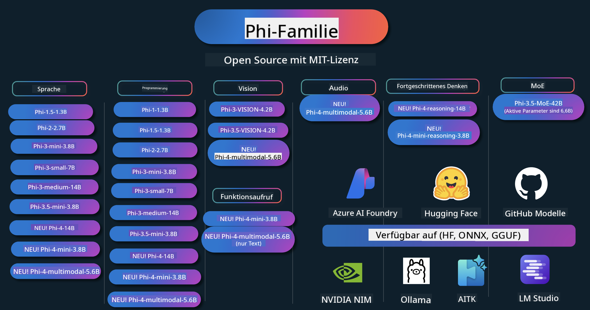

<!--
CO_OP_TRANSLATOR_METADATA:
{
  "original_hash": "5c07bb4c3c89a36c9be332a065a9a33c",
  "translation_date": "2025-07-16T14:50:52+00:00",
  "source_file": "README.md",
  "language_code": "de"
}
-->
# Phi Cookbook: Praktische Beispiele mit den Phi-Modellen von Microsoft

  

  
  
  

  
  

Phi ist eine Reihe von Open-Source-KI-Modellen, die von Microsoft entwickelt wurden.

Phi ist derzeit das leistungsstärkste und kosteneffizienteste kleine Sprachmodell (SLM) mit sehr guten Ergebnissen in den Bereichen Mehrsprachigkeit, logisches Denken, Text-/Chat-Generierung, Programmierung, Bilder, Audio und weiteren Anwendungsfällen.

Du kannst Phi in der Cloud oder auf Edge-Geräten einsetzen und mit begrenzter Rechenleistung einfach generative KI-Anwendungen erstellen.

Folge diesen Schritten, um mit diesen Ressourcen zu starten:  
1. **Forke das Repository**: Klicke auf   
2. **Klon das Repository**: `git clone https://github.com/microsoft/PhiCookBook.git`  
3. [**Tritt der Microsoft AI Discord Community bei und tausche dich mit Experten und anderen Entwicklern aus**](https://discord.com/invite/ByRwuEEgH4?WT.mc_id=aiml-137032-kinfeylo)

### 🌐 Mehrsprachige Unterstützung

#### Unterstützt durch GitHub Action (Automatisiert & immer aktuell)

[Französisch](../fr/README.md) | [Spanisch](../es/README.md) | [Deutsch](./README.md) | [Russisch](../ru/README.md) | [Arabisch](../ar/README.md) | [Persisch (Farsi)](../fa/README.md) | [Urdu](../ur/README.md) | [Chinesisch (vereinfacht)](../zh/README.md) | [Chinesisch (traditionell, Macau)](../mo/README.md) | [Chinesisch (traditionell, Hongkong)](../hk/README.md) | [Chinesisch (traditionell, Taiwan)](../tw/README.md) | [Japanisch](../ja/README.md) | [Koreanisch](../ko/README.md) | [Hindi](../hi/README.md)  
[Bengalisch](../bn/README.md) | [Marathi](../mr/README.md) | [Nepalesisch](../ne/README.md) | [Punjabi (Gurmukhi)](../pa/README.md) | [Portugiesisch (Portugal)](../pt/README.md) | [Portugiesisch (Brasilien)](../br/README.md) | [Italienisch](../it/README.md) | [Polnisch](../pl/README.md) | [Türkisch](../tr/README.md) | [Griechisch](../el/README.md) | [Thailändisch](../th/README.md) | [Schwedisch](../sv/README.md) | [Dänisch](../da/README.md) | [Norwegisch](../no/README.md) | [Finnisch](../fi/README.md) | [Niederländisch](../nl/README.md) | [Hebräisch](../he/README.md) | [Vietnamesisch](../vi/README.md) | [Indonesisch](../id/README.md) | [Malaiisch](../ms/README.md) | [Tagalog (Filipino)](../tl/README.md) | [Suaheli](../sw/README.md) | [Ungarisch](../hu/README.md) | [Tschechisch](../cs/README.md) | [Slowakisch](../sk/README.md) | [Rumänisch](../ro/README.md) | [Bulgarisch](../bg/README.md) | [Serbisch (Kyrillisch)](../sr/README.md) | [Kroatisch](../hr/README.md) | [Slowenisch](../sl/README.md)

## Inhaltsverzeichnis

- Einführung  
  - [Willkommen in der Phi-Familie](./md/01.Introduction/01/01.PhiFamily.md)  
  - [Einrichten deiner Umgebung](./md/01.Introduction/01/01.EnvironmentSetup.md)  
  - [Grundlagen der Schlüsseltechnologien verstehen](./md/01.Introduction/01/01.Understandingtech.md)  
  - [KI-Sicherheit für Phi-Modelle](./md/01.Introduction/01/01.AISafety.md)  
  - [Phi Hardware-Unterstützung](./md/01.Introduction/01/01.Hardwaresupport.md)  
  - [Phi-Modelle & Verfügbarkeit auf verschiedenen Plattformen](./md/01.Introduction/01/01.Edgeandcloud.md)  
  - [Verwendung von Guidance-ai und Phi](./md/01.Introduction/01/01.Guidance.md)  
  - [GitHub Marketplace Modelle](https://github.com/marketplace/models)  
  - [Azure AI Model Catalog](https://ai.azure.com)

- Inferenz von Phi in verschiedenen Umgebungen  
    -  [Hugging Face](./md/01.Introduction/02/01.HF.md)  
    -  [GitHub Modelle](./md/01.Introduction/02/02.GitHubModel.md)  
    -  [Azure AI Foundry Model Catalog](./md/01.Introduction/02/03.AzureAIFoundry.md)  
    -  [Ollama](./md/01.Introduction/02/04.Ollama.md)  
    -  [AI Toolkit VSCode (AITK)](./md/01.Introduction/02/05.AITK.md)  
    -  [NVIDIA NIM](./md/01.Introduction/02/06.NVIDIA.md)  
    -  [Foundry Local](./md/01.Introduction/02/07.FoundryLocal.md)

- Inferenz der Phi-Familie  
    - [Inference Phi auf iOS](./md/01.Introduction/03/iOS_Inference.md)  
    - [Inference Phi auf Android](./md/01.Introduction/03/Android_Inference.md)  
    - [Inference Phi auf Jetson](./md/01.Introduction/03/Jetson_Inference.md)  
    - [Inference Phi auf AI PC](./md/01.Introduction/03/AIPC_Inference.md)  
    - [Inference Phi mit Apple MLX Framework](./md/01.Introduction/03/MLX_Inference.md)  
    - [Inference Phi auf lokalem Server](./md/01.Introduction/03/Local_Server_Inference.md)  
    - [Inference Phi auf Remote-Server mit AI Toolkit](./md/01.Introduction/03/Remote_Interence.md)  
    - [Inference Phi mit Rust](./md/01.Introduction/03/Rust_Inference.md)  
    - [Inference Phi – Vision lokal](./md/01.Introduction/03/Vision_Inference.md)  
    - [Inference Phi mit Kaito AKS, Azure Containers (offizielle Unterstützung)](./md/01.Introduction/03/Kaito_Inference.md)  
-  [Quantisierung der Phi-Familie](./md/01.Introduction/04/QuantifyingPhi.md)  
    - [Quantisierung von Phi-3.5 / 4 mit llama.cpp](./md/01.Introduction/04/UsingLlamacppQuantifyingPhi.md)  
    - [Quantisierung von Phi-3.5 / 4 mit Generative AI Extensions für onnxruntime](./md/01.Introduction/04/UsingORTGenAIQuantifyingPhi.md)  
    - [Quantisierung von Phi-3.5 / 4 mit Intel OpenVINO](./md/01.Introduction/04/UsingIntelOpenVINOQuantifyingPhi.md)  
    - [Quantisierung von Phi-3.5 / 4 mit Apple MLX Framework](./md/01.Introduction/04/UsingAppleMLXQuantifyingPhi.md)

- Evaluation von Phi  
    - [Verantwortungsvolle KI](./md/01.Introduction/05/ResponsibleAI.md)  
    - [Azure AI Foundry für Evaluation](./md/01.Introduction/05/AIFoundry.md)  
    - [Evaluation mit Promptflow](./md/01.Introduction/05/Promptflow.md)

- RAG mit Azure AI Search  
    - [Wie man Phi-4-mini und Phi-4-multimodal (RAG) mit Azure AI Search verwendet](https://github.com/microsoft/PhiCookBook/blob/main/code/06.E2E/E2E_Phi-4-RAG-Azure-AI-Search.ipynb)

- Beispiele zur Entwicklung von Phi-Anwendungen  
  - Text- & Chat-Anwendungen  
    - Phi-4 Beispiele 🆕  
      - [📓] [Chat mit Phi-4-mini ONNX Modell](./md/02.Application/01.TextAndChat/Phi4/ChatWithPhi4ONNX/README.md)  
      - [Chat mit lokalem Phi-4 ONNX Modell .NET](../../md/04.HOL/dotnet/src/LabsPhi4-Chat-01OnnxRuntime)  
      - [Chat .NET Konsolen-App mit Phi-4 ONNX unter Verwendung von Semantic Kernel](../../md/04.HOL/dotnet/src/LabsPhi4-Chat-02SK)  
    - Phi-3 / 3.5 Beispiele  
      - [Lokaler Chatbot im Browser mit Phi3, ONNX Runtime Web und WebGPU](https://github.com/microsoft/onnxruntime-inference-examples/tree/main/js/chat)  
      - [OpenVino Chat](./md/02.Application/01.TextAndChat/Phi3/E2E_OpenVino_Chat.md)  
      - [Multi-Modell – Interaktives Phi-3-mini und OpenAI Whisper](./md/02.Application/01.TextAndChat/Phi3/E2E_Phi-3-mini_with_whisper.md)  
      - [MLFlow – Wrapper erstellen und Phi-3 mit MLFlow nutzen](./md//02.Application/01.TextAndChat/Phi3/E2E_Phi-3-MLflow.md)  
      - [Modelloptimierung – Wie man das Phi-3-mini Modell für ONNX Runtime Web mit Olive optimiert](https://github.com/microsoft/Olive/tree/main/examples/phi3)  
      - [WinUI3 App mit Phi-3 mini-4k-instruct-onnx](https://github.com/microsoft/Phi3-Chat-WinUI3-Sample/)  
      - [WinUI3 Multi-Modell KI-gestützte Notizen-App Beispiel](https://github.com/microsoft/ai-powered-notes-winui3-sample)
- [Feinabstimmung und Integration benutzerdefinierter Phi-3-Modelle mit Prompt flow](./md/02.Application/01.TextAndChat/Phi3/E2E_Phi-3-FineTuning_PromptFlow_Integration.md)
- [Feinabstimmung und Integration benutzerdefinierter Phi-3-Modelle mit Prompt flow in Azure AI Foundry](./md/02.Application/01.TextAndChat/Phi3/E2E_Phi-3-FineTuning_PromptFlow_Integration_AIFoundry.md)
- [Bewertung des feinabgestimmten Phi-3 / Phi-3.5 Modells in Azure AI Foundry mit Fokus auf Microsofts Responsible AI Prinzipien](./md/02.Application/01.TextAndChat/Phi3/E2E_Phi-3-Evaluation_AIFoundry.md)
- [📓] [Phi-3.5-mini-instruct Sprachvorhersage-Beispiel (Chinesisch/Englisch)](../../md/02.Application/01.TextAndChat/Phi3/phi3-instruct-demo.ipynb)
- [Phi-3.5-Instruct WebGPU RAG Chatbot](./md/02.Application/01.TextAndChat/Phi3/WebGPUWithPhi35Readme.md)
- [Verwendung von Windows GPU zur Erstellung einer Prompt flow Lösung mit Phi-3.5-Instruct ONNX](./md/02.Application/01.TextAndChat/Phi3/UsingPromptFlowWithONNX.md)
- [Verwendung von Microsoft Phi-3.5 tflite zur Erstellung einer Android-App](./md/02.Application/01.TextAndChat/Phi3/UsingPhi35TFLiteCreateAndroidApp.md)
- [Q&A .NET Beispiel mit lokalem ONNX Phi-3 Modell unter Verwendung von Microsoft.ML.OnnxRuntime](../../md/04.HOL/dotnet/src/LabsPhi301)
- [Konsolen-Chat .NET App mit Semantic Kernel und Phi-3](../../md/04.HOL/dotnet/src/LabsPhi302)

- Azure AI Inference SDK Codebasierte Beispiele  
  - Phi-4 Beispiele 🆕  
    - [📓] [Generiere Projektcode mit Phi-4-multimodal](./md/02.Application/02.Code/Phi4/GenProjectCode/README.md)  
  - Phi-3 / 3.5 Beispiele  
    - [Erstelle deinen eigenen Visual Studio Code GitHub Copilot Chat mit Microsoft Phi-3 Familie](./md/02.Application/02.Code/Phi3/VSCodeExt/README.md)  
    - [Erstelle deinen eigenen Visual Studio Code Chat Copilot Agent mit Phi-3.5 durch GitHub Modelle](/md/02.Application/02.Code/Phi3/CreateVSCodeChatAgentWithGitHubModels.md)  

- Erweiterte Reasoning-Beispiele  
  - Phi-4 Beispiele 🆕  
    - [📓] [Phi-4-mini-reasoning oder Phi-4-reasoning Beispiele](./md/02.Application/03.AdvancedReasoning/Phi4/AdvancedResoningPhi4mini/README.md)  
    - [📓] [Feinabstimmung von Phi-4-mini-reasoning mit Microsoft Olive](../../md/02.Application/03.AdvancedReasoning/Phi4/AdvancedResoningPhi4mini/olive_ft_phi_4_reasoning_with_medicaldata.ipynb)  
    - [📓] [Feinabstimmung von Phi-4-mini-reasoning mit Apple MLX](../../md/02.Application/03.AdvancedReasoning/Phi4/AdvancedResoningPhi4mini/mlx_ft_phi_4_reasoning_with_medicaldata.ipynb)  
    - [📓] [Phi-4-mini-reasoning mit GitHub Modellen](../../md/02.Application/02.Code/Phi4r/github_models_inference.ipynb)  
    - [📓] [Phi-4-mini-reasoning mit Azure AI Foundry Modellen](../../md/02.Application/02.Code/Phi4r/azure_models_inference.ipynb)  
- Demos  
    - [Phi-4-mini Demos gehostet auf Hugging Face Spaces](https://huggingface.co/spaces/microsoft/phi-4-mini?WT.mc_id=aiml-137032-kinfeylo)  
    - [Phi-4-multimodal Demos gehostet auf Hugging Face Spaces](https://huggingface.co/spaces/microsoft/phi-4-multimodal?WT.mc_id=aiml-137032-kinfeylo)  
- Vision Beispiele  
  - Phi-4 Beispiele 🆕  
    - [📓] [Verwende Phi-4-multimodal zum Lesen von Bildern und Generieren von Code](./md/02.Application/04.Vision/Phi4/CreateFrontend/README.md)  
  - Phi-3 / 3.5 Beispiele  
    - [📓][Phi-3-vision Bild-Text-zu-Text](../../md/02.Application/04.Vision/Phi3/E2E_Phi-3-vision-image-text-to-text-online-endpoint.ipynb)  
    - [Phi-3-vision-ONNX](https://onnxruntime.ai/docs/genai/tutorials/phi3-v.html)  
    - [📓][Phi-3-vision CLIP Einbettung](../../md/02.Application/04.Vision/Phi3/E2E_Phi-3-vision-image-text-to-text-online-endpoint.ipynb)  
    - [DEMO: Phi-3 Recycling](https://github.com/jennifermarsman/PhiRecycling/)  
    - [Phi-3-vision - Visueller Sprachassistent - mit Phi3-Vision und OpenVINO](https://docs.openvino.ai/nightly/notebooks/phi-3-vision-with-output.html)  
    - [Phi-3 Vision Nvidia NIM](./md/02.Application/04.Vision/Phi3/E2E_Nvidia_NIM_Vision.md)  
    - [Phi-3 Vision OpenVino](./md/02.Application/04.Vision/Phi3/E2E_OpenVino_Phi3Vision.md)  
    - [📓][Phi-3.5 Vision Multi-Frame oder Multi-Image Beispiel](../../md/02.Application/04.Vision/Phi3/phi3-vision-demo.ipynb)  
    - [Phi-3 Vision Lokales ONNX Modell mit Microsoft.ML.OnnxRuntime .NET](../../md/04.HOL/dotnet/src/LabsPhi303)  
    - [Menübasierte Phi-3 Vision Lokales ONNX Modell mit Microsoft.ML.OnnxRuntime .NET](../../md/04.HOL/dotnet/src/LabsPhi304)  

- Mathe Beispiele  
  - Phi-4-Mini-Flash-Reasoning-Instruct Beispiele 🆕 [Mathe Demo mit Phi-4-Mini-Flash-Reasoning-Instruct](../../md/02.Application/09.Math/MathDemo.ipynb)  

- Audio Beispiele  
  - Phi-4 Beispiele 🆕  
    - [📓] [Extrahieren von Audio-Transkripten mit Phi-4-multimodal](./md/02.Application/05.Audio/Phi4/Transciption/README.md)  
    - [📓] [Phi-4-multimodal Audio Beispiel](../../md/02.Application/05.Audio/Phi4/Siri/demo.ipynb)  
    - [📓] [Phi-4-multimodal Sprachübersetzungsbeispiel](../../md/02.Application/05.Audio/Phi4/Translate/demo.ipynb)  
    - [.NET Konsolenanwendung mit Phi-4-multimodal Audio zur Analyse einer Audiodatei und Generierung eines Transkripts](../../md/04.HOL/dotnet/src/LabsPhi4-MultiModal-02Audio)  

- MOE Beispiele  
  - Phi-3 / 3.5 Beispiele  
    - [📓] [Phi-3.5 Mixture of Experts Modelle (MoEs) Social Media Beispiel](../../md/02.Application/06.MoE/Phi3/phi3_moe_demo.ipynb)  
    - [📓] [Erstellung einer Retrieval-Augmented Generation (RAG) Pipeline mit NVIDIA NIM Phi-3 MOE, Azure AI Search und LlamaIndex](../../md/02.Application/06.MoE/Phi3/azure-ai-search-nvidia-rag.ipynb)  
- Function Calling Beispiele  
  - Phi-4 Beispiele 🆕  
    - [📓] [Verwendung von Function Calling mit Phi-4-mini](./md/02.Application/07.FunctionCalling/Phi4/FunctionCallingBasic/README.md)  
    - [📓] [Verwendung von Function Calling zur Erstellung von Multi-Agenten mit Phi-4-mini](../../md/02.Application/07.FunctionCalling/Phi4/Multiagents/Phi_4_mini_multiagent.ipynb)  
    - [📓] [Verwendung von Function Calling mit Ollama](../../md/02.Application/07.FunctionCalling/Phi4/Ollama/ollama_functioncalling.ipynb)  
    - [📓] [Verwendung von Function Calling mit ONNX](../../md/02.Application/07.FunctionCalling/Phi4/ONNX/onnx_parallel_functioncalling.ipynb)  
- Multimodale Mischbeispiele  
  - Phi-4 Beispiele 🆕  
    - [📓] [Verwendung von Phi-4-multimodal als Technologie-Journalist](../../md/02.Application/08.Multimodel/Phi4/TechJournalist/phi_4_mm_audio_text_publish_news.ipynb)  
    - [.NET Konsolenanwendung mit Phi-4-multimodal zur Analyse von Bildern](../../md/04.HOL/dotnet/src/LabsPhi4-MultiModal-01Images)  

- Feinabstimmung Phi Beispiele  
  - [Feinabstimmungsszenarien](./md/03.FineTuning/FineTuning_Scenarios.md)  
  - [Feinabstimmung vs RAG](./md/03.FineTuning/FineTuning_vs_RAG.md)  
  - [Feinabstimmung: Lass Phi-3 zum Branchenexperten werden](./md/03.FineTuning/LetPhi3gotoIndustriy.md)  
  - [Feinabstimmung von Phi-3 mit AI Toolkit für VS Code](./md/03.FineTuning/Finetuning_VSCodeaitoolkit.md)  
  - [Feinabstimmung von Phi-3 mit Azure Machine Learning Service](./md/03.FineTuning/Introduce_AzureML.md)  
  - [Feinabstimmung von Phi-3 mit Lora](./md/03.FineTuning/FineTuning_Lora.md)  
  - [Feinabstimmung von Phi-3 mit QLora](./md/03.FineTuning/FineTuning_Qlora.md)  
  - [Feinabstimmung von Phi-3 mit Azure AI Foundry](./md/03.FineTuning/FineTuning_AIFoundry.md)  
  - [Feinabstimmung von Phi-3 mit Azure ML CLI/SDK](./md/03.FineTuning/FineTuning_MLSDK.md)  
  - [Feinabstimmung mit Microsoft Olive](./md/03.FineTuning/FineTuning_MicrosoftOlive.md)  
  - [Feinabstimmung mit Microsoft Olive Hands-On Lab](./md/03.FineTuning/olive-lab/readme.md)  
  - [Feinabstimmung von Phi-3-vision mit Weights and Bias](./md/03.FineTuning/FineTuning_Phi-3-visionWandB.md)  
  - [Feinabstimmung von Phi-3 mit Apple MLX Framework](./md/03.FineTuning/FineTuning_MLX.md)  
  - [Feinabstimmung von Phi-3-vision (offizielle Unterstützung)](./md/03.FineTuning/FineTuning_Vision.md)  
  - [Feinabstimmung von Phi-3 mit Kaito AKS, Azure Containers (offizielle Unterstützung)](./md/03.FineTuning/FineTuning_Kaito.md)  
  - [Feinabstimmung von Phi-3 und 3.5 Vision](https://github.com/2U1/Phi3-Vision-Finetune)  

- Hands-on Lab  
  - [Erkundung modernster Modelle: LLMs, SLMs, lokale Entwicklung und mehr](https://github.com/microsoft/aitour-exploring-cutting-edge-models)  
  - [NLP-Potenzial freisetzen: Feinabstimmung mit Microsoft Olive](https://github.com/azure/Ignite_FineTuning_workshop)  

- Wissenschaftliche Forschungsarbeiten und Veröffentlichungen  
  - [Textbooks Are All You Need II: phi-1.5 technischer Bericht](https://arxiv.org/abs/2309.05463)  
  - [Phi-3 Technischer Bericht: Ein leistungsstarkes Sprachmodell lokal auf deinem Telefon](https://arxiv.org/abs/2404.14219)  
  - [Phi-4 Technischer Bericht](https://arxiv.org/abs/2412.08905)  
  - [Phi-4-Mini Technischer Bericht: Kompakte, aber leistungsstarke multimodale Sprachmodelle durch Mixture-of-LoRAs](https://arxiv.org/abs/2503.01743)  
  - [Optimierung kleiner Sprachmodelle für In-Vehicle Function-Calling](https://arxiv.org/abs/2501.02342)  
  - [(WhyPHI) Feinabstimmung von PHI-3 für Multiple-Choice-Fragen: Methodik, Ergebnisse und Herausforderungen](https://arxiv.org/abs/2501.01588)
- [Phi-4-reasoning Technischer Bericht](https://www.microsoft.com/en-us/research/wp-content/uploads/2025/04/phi_4_reasoning.pdf)  
- [Phi-4-mini-reasoning Technischer Bericht](https://huggingface.co/microsoft/Phi-4-mini-reasoning/blob/main/Phi-4-Mini-Reasoning.pdf)

## Verwendung der Phi-Modelle

### Phi auf Azure AI Foundry

Sie können lernen, wie man Microsoft Phi verwendet und wie man End-to-End-Lösungen auf verschiedenen Hardwaregeräten erstellt. Um Phi selbst auszuprobieren, beginnen Sie damit, mit den Modellen zu experimentieren und Phi für Ihre Szenarien mithilfe des [Azure AI Foundry Azure AI Model Catalog](https://aka.ms/phi3-azure-ai) anzupassen. Weitere Informationen finden Sie unter Erste Schritte mit [Azure AI Foundry](/md/02.QuickStart/AzureAIFoundry_QuickStart.md).

**Playground**  
Jedes Modell verfügt über einen eigenen Playground, um das Modell zu testen: [Azure AI Playground](https://aka.ms/try-phi3).

### Phi auf GitHub Models

Sie können lernen, wie man Microsoft Phi verwendet und wie man End-to-End-Lösungen auf verschiedenen Hardwaregeräten erstellt. Um Phi selbst zu erleben, beginnen Sie damit, mit dem Modell zu experimentieren und Phi für Ihre Szenarien mithilfe des [GitHub Model Catalog](https://github.com/marketplace/models?WT.mc_id=aiml-137032-kinfeylo) anzupassen. Weitere Informationen finden Sie unter Erste Schritte mit [GitHub Model Catalog](/md/02.QuickStart/GitHubModel_QuickStart.md).

**Playground**  
Jedes Modell verfügt über einen eigenen [Playground zum Testen des Modells](/md/02.QuickStart/GitHubModel_QuickStart.md).

### Phi auf Hugging Face

Sie finden das Modell auch auf [Hugging Face](https://huggingface.co/microsoft).

**Playground**  
[Hugging Chat Playground](https://huggingface.co/chat/models/microsoft/Phi-3-mini-4k-instruct)

## Responsible AI

Microsoft verpflichtet sich, unseren Kunden zu helfen, unsere KI-Produkte verantwortungsvoll zu nutzen, unsere Erkenntnisse zu teilen und vertrauensbasierte Partnerschaften durch Tools wie Transparency Notes und Impact Assessments aufzubauen. Viele dieser Ressourcen finden Sie unter [https://aka.ms/RAI](https://aka.ms/RAI).  
Der Ansatz von Microsoft für verantwortungsvolle KI basiert auf unseren KI-Prinzipien Fairness, Zuverlässigkeit und Sicherheit, Datenschutz und Sicherheit, Inklusivität, Transparenz und Verantwortlichkeit.

Groß angelegte Modelle für natürliche Sprache, Bilder und Sprache – wie die in diesem Beispiel verwendeten – können sich potenziell unfair, unzuverlässig oder anstößig verhalten und dadurch Schaden verursachen. Bitte konsultieren Sie die [Azure OpenAI service Transparency note](https://learn.microsoft.com/legal/cognitive-services/openai/transparency-note?tabs=text), um über Risiken und Einschränkungen informiert zu sein.

Der empfohlene Ansatz zur Minderung dieser Risiken besteht darin, ein Sicherheitssystem in Ihre Architektur zu integrieren, das schädliches Verhalten erkennen und verhindern kann. [Azure AI Content Safety](https://learn.microsoft.com/azure/ai-services/content-safety/overview) bietet eine unabhängige Schutzschicht, die schädliche nutzergenerierte und KI-generierte Inhalte in Anwendungen und Diensten erkennen kann. Azure AI Content Safety umfasst Text- und Bild-APIs, mit denen Sie schädliches Material erkennen können. Innerhalb von Azure AI Foundry ermöglicht der Content Safety Service das Anzeigen, Erkunden und Ausprobieren von Beispielcode zur Erkennung schädlicher Inhalte in verschiedenen Modalitäten. Die folgende [Quickstart-Dokumentation](https://learn.microsoft.com/azure/ai-services/content-safety/quickstart-text?tabs=visual-studio%2Clinux&pivots=programming-language-rest) führt Sie durch die Anfragen an den Dienst.

Ein weiterer wichtiger Aspekt ist die Gesamtleistung der Anwendung. Bei multimodalen und multimodellbasierten Anwendungen verstehen wir unter Leistung, dass das System so funktioniert, wie Sie und Ihre Nutzer es erwarten, einschließlich der Vermeidung schädlicher Ausgaben. Es ist wichtig, die Leistung Ihrer gesamten Anwendung mit [Performance and Quality und Risk and Safety Evaluators](https://learn.microsoft.com/azure/ai-studio/concepts/evaluation-metrics-built-in) zu bewerten. Sie haben auch die Möglichkeit, mit [benutzerdefinierten Evaluatoren](https://learn.microsoft.com/azure/ai-studio/how-to/develop/evaluate-sdk#custom-evaluators) zu erstellen und zu bewerten.

Sie können Ihre KI-Anwendung in Ihrer Entwicklungsumgebung mit dem [Azure AI Evaluation SDK](https://microsoft.github.io/promptflow/index.html) evaluieren. Anhand eines Testdatensatzes oder eines Ziels werden die Generierungen Ihrer generativen KI-Anwendung quantitativ mit integrierten oder benutzerdefinierten Evaluatoren gemessen. Um mit dem Azure AI Evaluation SDK zu starten und Ihr System zu bewerten, können Sie der [Quickstart-Anleitung](https://learn.microsoft.com/azure/ai-studio/how-to/develop/flow-evaluate-sdk) folgen. Nach der Ausführung eines Evaluationslaufs können Sie die Ergebnisse in [Azure AI Foundry visualisieren](https://learn.microsoft.com/azure/ai-studio/how-to/evaluate-flow-results).

## Marken

Dieses Projekt kann Marken oder Logos von Projekten, Produkten oder Dienstleistungen enthalten. Die autorisierte Nutzung von Microsoft-Marken oder -Logos unterliegt den [Microsoft Trademark & Brand Guidelines](https://www.microsoft.com/legal/intellectualproperty/trademarks/usage/general) und muss diesen entsprechen.  
Die Verwendung von Microsoft-Marken oder -Logos in modifizierten Versionen dieses Projekts darf nicht zu Verwechslungen führen oder eine Microsoft-Unterstützung suggerieren. Die Nutzung von Marken oder Logos Dritter unterliegt den jeweiligen Richtlinien dieser Dritten.

**Haftungsausschluss**:  
Dieses Dokument wurde mit dem KI-Übersetzungsdienst [Co-op Translator](https://github.com/Azure/co-op-translator) übersetzt. Obwohl wir uns um Genauigkeit bemühen, beachten Sie bitte, dass automatisierte Übersetzungen Fehler oder Ungenauigkeiten enthalten können. Das Originaldokument in seiner Ursprungssprache ist als maßgebliche Quelle zu betrachten. Für wichtige Informationen wird eine professionelle menschliche Übersetzung empfohlen. Wir übernehmen keine Haftung für Missverständnisse oder Fehlinterpretationen, die aus der Nutzung dieser Übersetzung entstehen.