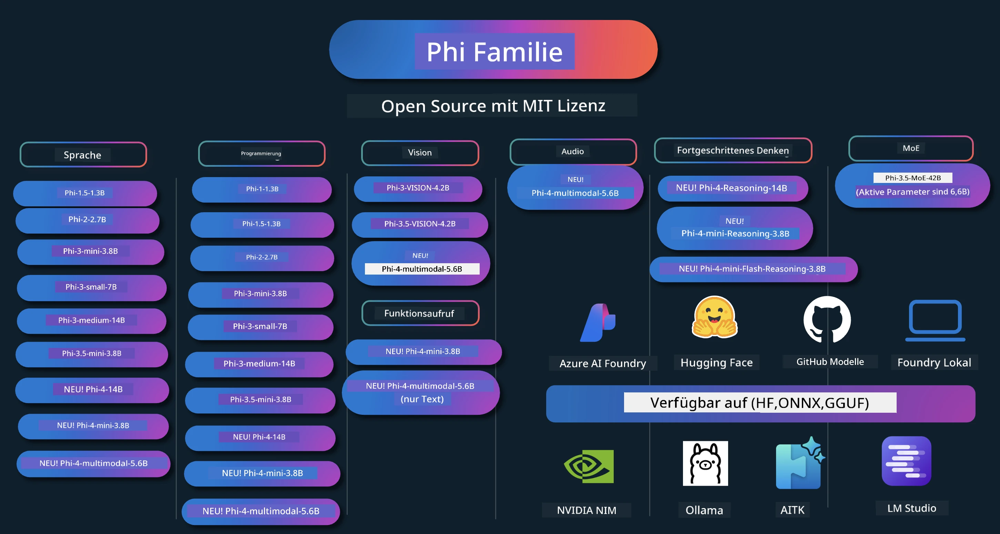

# Phi Cookbook: Praktische Beispiele mit den Phi-Modellen von Microsoft

[](https://codespaces.new/microsoft/phicookbook)
[](https://vscode.dev/redirect?url=vscode://ms-vscode-remote.remote-containers/cloneInVolume?url=https://github.com/microsoft/phicookbook)

[](https://GitHub.com/microsoft/phicookbook/graphs/contributors/?WT.mc_id=aiml-137032-kinfeylo)
[](https://GitHub.com/microsoft/phicookbook/issues/?WT.mc_id=aiml-137032-kinfeylo)
[](https://GitHub.com/microsoft/phicookbook/pulls/?WT.mc_id=aiml-137032-kinfeylo)
[](http://makeapullrequest.com?WT.mc_id=aiml-137032-kinfeylo)

[](https://GitHub.com/microsoft/phicookbook/watchers/?WT.mc_id=aiml-137032-kinfeylo)
[](https://GitHub.com/microsoft/phicookbook/network/?WT.mc_id=aiml-137032-kinfeylo)
[](https://GitHub.com/microsoft/phicookbook/stargazers/?WT.mc_id=aiml-137032-kinfeylo)

[](https://discord.com/invite/ByRwuEEgH4)

Phi ist eine Reihe von Open-Source-KI-Modellen, die von Microsoft entwickelt werden.

Phi ist derzeit das leistungsstärkste und kosteneffizienteste kleine Sprachmodell (SLM) mit sehr guten Benchmarks in mehrsprachigen Anwendungen, beim logischen Denken, Text-/Chatgenerierung, Programmierung, Bildern, Audio und weiteren Szenarien.

Sie können Phi in der Cloud oder auf Edge-Geräten bereitstellen und leicht generative KI-Anwendungen mit begrenzter Rechenleistung erstellen.

Befolgen Sie diese Schritte, um mit der Nutzung dieser Ressourcen zu beginnen:
1. **Forken Sie das Repository**: Klicken Sie auf [](https://GitHub.com/microsoft/phicookbook/network/?WT.mc_id=aiml-137032-kinfeylo)
2. **Klonen Sie das Repository**: `git clone https://github.com/microsoft/PhiCookBook.git`
3. [**Treten Sie der Microsoft AI Discord Community bei und treffen Sie Experten und andere Entwickler**](https://discord.com/invite/ByRwuEEgH4?WT.mc_id=aiml-137032-kinfeylo)



### 🌐 Mehrsprachige Unterstützung

#### Unterstützt über GitHub Action (Automatisiert & immer aktuell)

<!-- CO-OP TRANSLATOR LANGUAGES TABLE START -->
[Arabisch](../ar/README.md) | [Bengalisch](../bn/README.md) | [Bulgarisch](../bg/README.md) | [Birmanisch (Myanmar)](../my/README.md) | [Chinesisch (vereinfacht)](../zh-CN/README.md) | [Chinesisch (traditionell, Hongkong)](../zh-HK/README.md) | [Chinesisch (traditionell, Macau)](../zh-MO/README.md) | [Chinesisch (traditionell, Taiwan)](../zh-TW/README.md) | [Kroatisch](../hr/README.md) | [Tschechisch](../cs/README.md) | [Dänisch](../da/README.md) | [Niederländisch](../nl/README.md) | [Estnisch](../et/README.md) | [Finnisch](../fi/README.md) | [Französisch](../fr/README.md) | [Deutsch](./README.md) | [Griechisch](../el/README.md) | [Hebräisch](../he/README.md) | [Hindi](../hi/README.md) | [Ungarisch](../hu/README.md) | [Indonesisch](../id/README.md) | [Italienisch](../it/README.md) | [Japanisch](../ja/README.md) | [Kannada](../kn/README.md) | [Koreanisch](../ko/README.md) | [Litauisch](../lt/README.md) | [Malaiisch](../ms/README.md) | [Malayalam](../ml/README.md) | [Marathi](../mr/README.md) | [Nepalesisch](../ne/README.md) | [Nigerianisches Pidgin](../pcm/README.md) | [Norwegisch](../no/README.md) | [Persisch (Farsi)](../fa/README.md) | [Polnisch](../pl/README.md) | [Portugiesisch (Brasilien)](../pt-BR/README.md) | [Portugiesisch (Portugal)](../pt-PT/README.md) | [Punjabi (Gurmukhi)](../pa/README.md) | [Rumänisch](../ro/README.md) | [Russisch](../ru/README.md) | [Serbisch (Kyrillisch)](../sr/README.md) | [Slowakisch](../sk/README.md) | [Slowenisch](../sl/README.md) | [Spanisch](../es/README.md) | [Swahili](../sw/README.md) | [Schwedisch](../sv/README.md) | [Tagalog (Filipino)](../tl/README.md) | [Tamil](../ta/README.md) | [Telugu](../te/README.md) | [Thailändisch](../th/README.md) | [Türkisch](../tr/README.md) | [Ukrainisch](../uk/README.md) | [Urdu](../ur/README.md) | [Vietnamesisch](../vi/README.md)

> **Lieber lokal klonen?**

> Dieses Repository enthält Übersetzungen in über 50 Sprachen, was die Downloadgröße erheblich erhöht. Um ohne Übersetzungen zu klonen, verwenden Sie Sparse Checkout:
> ```bash
> git clone --filter=blob:none --sparse https://github.com/microsoft/PhiCookBook.git
> cd PhiCookBook
> git sparse-checkout set --no-cone '/*' '!translations' '!translated_images'
> ```
> So erhalten Sie alles, was Sie für den Kurs brauchen, mit einem viel schnelleren Download.
<!-- CO-OP TRANSLATOR LANGUAGES TABLE END -->

## Inhaltsverzeichnis

- Einführung
  - [Willkommen in der Phi-Familie](./md/01.Introduction/01/01.PhiFamily.md)
  - [Einrichten Ihrer Umgebung](./md/01.Introduction/01/01.EnvironmentSetup.md)
  - [Wichtige Technologien verstehen](./md/01.Introduction/01/01.Understandingtech.md)
  - [KI-Sicherheit für Phi-Modelle](./md/01.Introduction/01/01.AISafety.md)
  - [Phi Hardware-Unterstützung](./md/01.Introduction/01/01.Hardwaresupport.md)
  - [Phi-Modelle & Verfügbarkeit auf verschiedenen Plattformen](./md/01.Introduction/01/01.Edgeandcloud.md)
  - [Verwendung von Guidance-ai und Phi](./md/01.Introduction/01/01.Guidance.md)
  - [GitHub Marketplace Modelle](https://github.com/marketplace/models)
  - [Azure AI Model Catalog](https://ai.azure.com)

- Inferenz von Phi in verschiedenen Umgebungen
    -  [Hugging Face](./md/01.Introduction/02/01.HF.md)
    -  [GitHub Modelle](./md/01.Introduction/02/02.GitHubModel.md)
    -  [Azure AI Foundry Model Catalog](./md/01.Introduction/02/03.AzureAIFoundry.md)
    -  [Ollama](./md/01.Introduction/02/04.Ollama.md)
    -  [AI Toolkit VSCode (AITK)](./md/01.Introduction/02/05.AITK.md)
    -  [NVIDIA NIM](./md/01.Introduction/02/06.NVIDIA.md)
    -  [Foundry Local](./md/01.Introduction/02/07.FoundryLocal.md)

- Inferenz der Phi-Familie
    - [Inference Phi in iOS](./md/01.Introduction/03/iOS_Inference.md)
    - [Inference Phi in Android](./md/01.Introduction/03/Android_Inference.md)
    - [Inference Phi in Jetson](./md/01.Introduction/03/Jetson_Inference.md)
    - [Inference Phi in AI PC](./md/01.Introduction/03/AIPC_Inference.md)
    - [Inference Phi mit Apple MLX Framework](./md/01.Introduction/03/MLX_Inference.md)
    - [Inference Phi auf lokalem Server](./md/01.Introduction/03/Local_Server_Inference.md)
    - [Inference Phi auf Remote-Server mit AI Toolkit](./md/01.Introduction/03/Remote_Interence.md)
    - [Inference Phi mit Rust](./md/01.Introduction/03/Rust_Inference.md)
    - [Inference Phi–Vision lokal](./md/01.Introduction/03/Vision_Inference.md)
    - [Inference Phi mit Kaito AKS, Azure Containers (offizielle Unterstützung)](./md/01.Introduction/03/Kaito_Inference.md)
-  [Quantisierung der Phi-Familie](./md/01.Introduction/04/QuantifyingPhi.md)
    - [Quantisierung Phi-3.5 / 4 mit llama.cpp](./md/01.Introduction/04/UsingLlamacppQuantifyingPhi.md)
    - [Quantisierung Phi-3.5 / 4 mit Generative AI-Erweiterungen für onnxruntime](./md/01.Introduction/04/UsingORTGenAIQuantifyingPhi.md)
    - [Quantisierung Phi-3.5 / 4 mit Intel OpenVINO](./md/01.Introduction/04/UsingIntelOpenVINOQuantifyingPhi.md)
    - [Quantisierung Phi-3.5 / 4 mit Apple MLX Framework](./md/01.Introduction/04/UsingAppleMLXQuantifyingPhi.md)

-  Evaluierung von Phi
    - [Verantwortungsvolle KI](./md/01.Introduction/05/ResponsibleAI.md)
    - [Azure AI Foundry für Evaluierung](./md/01.Introduction/05/AIFoundry.md)
    - [Verwendung von Promptflow für Evaluierung](./md/01.Introduction/05/Promptflow.md)
 
- RAG mit Azure AI Search
    - [Wie man Phi-4-mini und Phi-4-multimodal (RAG) mit Azure AI Search nutzt](https://github.com/microsoft/PhiCookBook/blob/main/code/06.E2E/E2E_Phi-4-RAG-Azure-AI-Search.ipynb)

- Beispiele zur Entwicklung von Phi-Anwendungen
  - Text- & Chat-Anwendungen
    - Phi-4 Beispiele 🆕
      - [📓] [Chat mit Phi-4-mini ONNX Modell](./md/02.Application/01.TextAndChat/Phi4/ChatWithPhi4ONNX/README.md)
      - [Chat mit Phi-4 lokalem ONNX-Modell .NET](../../md/04.HOL/dotnet/src/LabsPhi4-Chat-01OnnxRuntime)
      - [Chat .NET Konsolenanwendung mit Phi-4 ONNX unter Verwendung von Semantic Kernel](../../md/04.HOL/dotnet/src/LabsPhi4-Chat-02SK)
    - Phi-3 / 3.5 Beispiele
      - [Lokaler Chatbot im Browser mit Phi3, ONNX Runtime Web und WebGPU](https://github.com/microsoft/onnxruntime-inference-examples/tree/main/js/chat)
      - [OpenVino Chat](./md/02.Application/01.TextAndChat/Phi3/E2E_OpenVino_Chat.md)
      - [Multi Model - Interaktives Phi-3-mini und OpenAI Whisper](./md/02.Application/01.TextAndChat/Phi3/E2E_Phi-3-mini_with_whisper.md)
      - [MLFlow - Erstellen eines Wrappers und Verwendung von Phi-3 mit MLFlow](./md//02.Application/01.TextAndChat/Phi3/E2E_Phi-3-MLflow.md)
      - [Modelloptimierung - Wie man das Phi-3-min Modell für ONNX Runtime Web mit Olive optimiert](https://github.com/microsoft/Olive/tree/main/examples/phi3)
      - [WinUI3-App mit Phi-3 mini-4k-instruct-onnx](https://github.com/microsoft/Phi3-Chat-WinUI3-Sample/)
      -[WinUI3 Multi Model KI-gesteuerte Notizen-App Beispiel](https://github.com/microsoft/ai-powered-notes-winui3-sample)
      - [Feinabstimmung und Integration benutzerdefinierter Phi-3-Modelle mit Prompt Flow](./md/02.Application/01.TextAndChat/Phi3/E2E_Phi-3-FineTuning_PromptFlow_Integration.md)
      - [Feinabstimmung und Integration benutzerdefinierter Phi-3-Modelle mit Prompt Flow in Azure AI Foundry](./md/02.Application/01.TextAndChat/Phi3/E2E_Phi-3-FineTuning_PromptFlow_Integration_AIFoundry.md)
      - [Bewertung des feinabgestimmten Phi-3 / Phi-3.5 Modells in Azure AI Foundry mit Fokus auf Microsofts Responsible AI Prinzipien](./md/02.Application/01.TextAndChat/Phi3/E2E_Phi-3-Evaluation_AIFoundry.md)
      - [📓] [Phi-3.5-mini-instruct Sprachvorhersage-Beispiel (Chinesisch/Englisch)](./md/02.Application/01.TextAndChat/Phi3/phi3-instruct-demo.ipynb)
      - [Phi-3.5-Instruct WebGPU RAG Chatbot](./md/02.Application/01.TextAndChat/Phi3/WebGPUWithPhi35Readme.md)
      - [Verwendung der Windows-GPU zur Erstellung einer Prompt Flow-Lösung mit Phi-3.5-Instruct ONNX](./md/02.Application/01.TextAndChat/Phi3/UsingPromptFlowWithONNX.md)
      - [Verwendung von Microsoft Phi-3.5 tflite zur Erstellung einer Android-App](./md/02.Application/01.TextAndChat/Phi3/UsingPhi35TFLiteCreateAndroidApp.md)
      - [Q&A .NET-Beispiel mit lokalem ONNX Phi-3 Modell unter Verwendung von Microsoft.ML.OnnxRuntime](../../md/04.HOL/dotnet/src/LabsPhi301)
      - [Konsolen-Chat-.NET-App mit Semantic Kernel und Phi-3](../../md/04.HOL/dotnet/src/LabsPhi302)

  - Azure AI Inference SDK codebasierte Beispiele
    - Phi-4 Beispiele 🆕
      - [📓] [Projektcode mit Phi-4-multimodal generieren](./md/02.Application/02.Code/Phi4/GenProjectCode/README.md)
    - Phi-3 / 3.5 Beispiele
      - [Erstellen Sie Ihren eigenen Visual Studio Code GitHub Copilot Chat mit der Microsoft Phi-3 Familie](./md/02.Application/02.Code/Phi3/VSCodeExt/README.md)
      - [Erstellen Sie Ihren eigenen Visual Studio Code Chat Copilot Agent mit Phi-3.5 durch GitHub-Modelle](/md/02.Application/02.Code/Phi3/CreateVSCodeChatAgentWithGitHubModels.md)

  - Fortgeschrittene Reasoning-Beispiele
    - Phi-4 Beispiele 🆕
      - [📓] [Phi-4-mini-reasoning oder Phi-4-reasoning Beispiele](./md/02.Application/03.AdvancedReasoning/Phi4/AdvancedResoningPhi4mini/README.md)
      - [📓] [Feinabstimmung von Phi-4-mini-reasoning mit Microsoft Olive](./md/02.Application/03.AdvancedReasoning/Phi4/AdvancedResoningPhi4mini/olive_ft_phi_4_reasoning_with_medicaldata.ipynb)
      - [📓] [Feinabstimmung von Phi-4-mini-reasoning mit Apple MLX](./md/02.Application/03.AdvancedReasoning/Phi4/AdvancedResoningPhi4mini/mlx_ft_phi_4_reasoning_with_medicaldata.ipynb)
      - [📓] [Phi-4-mini-reasoning mit GitHub-Modellen](./md/02.Application/02.Code/Phi4r/github_models_inference.ipynb)
      - [📓] [Phi-4-mini-reasoning mit Azure AI Foundry-Modellen](./md/02.Application/02.Code/Phi4r/azure_models_inference.ipynb)
  - Demos
      - [Phi-4-mini-Demos gehostet auf Hugging Face Spaces](https://huggingface.co/spaces/microsoft/phi-4-mini?WT.mc_id=aiml-137032-kinfeylo)
      - [Phi-4-multimodale Demos gehostet auf Hugging Face Spaces](https://huggingface.co/spaces/microsoft/phi-4-multimodal?WT.mc_id=aiml-137032-kinfeylo)
  - Vision-Beispiele
    - Phi-4 Beispiele 🆕
      - [📓] [Verwendung von Phi-4-multimodal zum Lesen von Bildern und Generieren von Code](./md/02.Application/04.Vision/Phi4/CreateFrontend/README.md)
    - Phi-3 / 3.5 Beispiele
      -  [📓][Phi-3-vision Bild-zu-Text Text-zu-Text](./md/02.Application/04.Vision/Phi3/E2E_Phi-3-vision-image-text-to-text-online-endpoint.ipynb)
      - [Phi-3-vision-ONNX](https://onnxruntime.ai/docs/genai/tutorials/phi3-v.html)
      - [📓][Phi-3-vision CLIP Einbettung](./md/02.Application/04.Vision/Phi3/E2E_Phi-3-vision-image-text-to-text-online-endpoint.ipynb)
      - [DEMO: Phi-3 Recycling](https://github.com/jennifermarsman/PhiRecycling/)
      - [Phi-3-vision - Visueller Sprachassistent - mit Phi3-Vision und OpenVINO](https://docs.openvino.ai/nightly/notebooks/phi-3-vision-with-output.html)
      - [Phi-3 Vision Nvidia NIM](./md/02.Application/04.Vision/Phi3/E2E_Nvidia_NIM_Vision.md)
      - [Phi-3 Vision OpenVino](./md/02.Application/04.Vision/Phi3/E2E_OpenVino_Phi3Vision.md)
      - [📓][Phi-3.5 Vision Mehrfachrahmen- oder Mehrfachbild-Beispiel](./md/02.Application/04.Vision/Phi3/phi3-vision-demo.ipynb)
      - [Phi-3 Vision Lokales ONNX-Modell mit Microsoft.ML.OnnxRuntime .NET](../../md/04.HOL/dotnet/src/LabsPhi303)
      - [Menübasiertes Phi-3 Vision lokales ONNX-Modell mit Microsoft.ML.OnnxRuntime .NET](../../md/04.HOL/dotnet/src/LabsPhi304)

  - Mathe-Beispiele
    -  Phi-4-Mini-Flash-Reasoning-Instruct Beispiele 🆕 [Mathe-Demo mit Phi-4-Mini-Flash-Reasoning-Instruct](./md/02.Application/09.Math/MathDemo.ipynb)

  - Audio-Beispiele
    - Phi-4 Beispiele 🆕
      - [📓] [Extrahieren von Audiotranskripten mit Phi-4-multimodal](./md/02.Application/05.Audio/Phi4/Transciption/README.md)
      - [📓] [Phi-4-multimodal Audio-Beispiel](./md/02.Application/05.Audio/Phi4/Siri/demo.ipynb)
      - [📓] [Phi-4-multimodal Sprachübersetzungs-Beispiel](./md/02.Application/05.Audio/Phi4/Translate/demo.ipynb)
      - [.NET Konsolenanwendung mit Phi-4-multimodal Audio zur Analyse einer Audiodatei und Generierung eines Transkripts](../../md/04.HOL/dotnet/src/LabsPhi4-MultiModal-02Audio)

  - MOE Beispiele
    - Phi-3 / 3.5 Beispiele
      - [📓] [Phi-3.5 Mixture of Experts Modelle (MoEs) Social Media Beispiel](./md/02.Application/06.MoE/Phi3/phi3_moe_demo.ipynb)
      - [📓] [Erstellen einer Retrieval-Augmented Generation (RAG) Pipeline mit NVIDIA NIM Phi-3 MOE, Azure AI Search und LlamaIndex](./md/02.Application/06.MoE/Phi3/azure-ai-search-nvidia-rag.ipynb)
      - 
  - Function Calling Beispiele
    - Phi-4 Beispiele 🆕
      -  [📓] [Verwendung von Function Calling mit Phi-4-mini](./md/02.Application/07.FunctionCalling/Phi4/FunctionCallingBasic/README.md)
      -  [📓] [Verwendung von Function Calling zur Erstellung von Multi-Agenten mit Phi-4-mini](./md/02.Application/07.FunctionCalling/Phi4/Multiagents/Phi_4_mini_multiagent.ipynb)
      -  [📓] [Verwendung von Function Calling mit Ollama](./md/02.Application/07.FunctionCalling/Phi4/Ollama/ollama_functioncalling.ipynb)
      -  [📓] [Verwendung von Function Calling mit ONNX](./md/02.Application/07.FunctionCalling/Phi4/ONNX/onnx_parallel_functioncalling.ipynb)
  - Multimodale Mischbeispiele
    - Phi-4 Beispiele 🆕
      -  [📓] [Verwendung von Phi-4-multimodal als Technologiejournalist](./md/02.Application/08.Multimodel/Phi4/TechJournalist/phi_4_mm_audio_text_publish_news.ipynb)
      - [.NET Konsolenanwendung mit Phi-4-multimodal zur Analyse von Bildern](../../md/04.HOL/dotnet/src/LabsPhi4-MultiModal-01Images)

- Feinabstimmung Phi-Beispiele
  - [Feinabstimmungsszenarien](./md/03.FineTuning/FineTuning_Scenarios.md)
  - [Feinabstimmung vs RAG](./md/03.FineTuning/FineTuning_vs_RAG.md)
  - [Feinabstimmung - Lassen Sie Phi-3 zum Industrieexperten werden](./md/03.FineTuning/LetPhi3gotoIndustriy.md)
  - [Feinabstimmung von Phi-3 mit AI Toolkit für VS Code](./md/03.FineTuning/Finetuning_VSCodeaitoolkit.md)
  - [Feinabstimmung von Phi-3 mit Azure Machine Learning Service](./md/03.FineTuning/Introduce_AzureML.md)
  - [Feinabstimmung von Phi-3 mit Lora](./md/03.FineTuning/FineTuning_Lora.md)
  - [Feinabstimmung von Phi-3 mit QLora](./md/03.FineTuning/FineTuning_Qlora.md)
  - [Feinabstimmung von Phi-3 mit Azure AI Foundry](./md/03.FineTuning/FineTuning_AIFoundry.md)
  - [Feinabstimmung von Phi-3 mit Azure ML CLI/SDK](./md/03.FineTuning/FineTuning_MLSDK.md)
  - [Feinabstimmung mit Microsoft Olive](./md/03.FineTuning/FineTuning_MicrosoftOlive.md)
  - [Feinabstimmung mit Microsoft Olive Hands-On Lab](./md/03.FineTuning/olive-lab/readme.md)
  - [Feinabstimmung von Phi-3-vision mit Weights and Bias](./md/03.FineTuning/FineTuning_Phi-3-visionWandB.md)
  - [Feinabstimmung von Phi-3 mit Apple MLX Framework](./md/03.FineTuning/FineTuning_MLX.md)
  - [Feinabstimmung von Phi-3-vision (offizielle Unterstützung)](./md/03.FineTuning/FineTuning_Vision.md)
  - [Feinabstimmung von Phi-3 mit Kaito AKS, Azure Containers (offizielle Unterstützung)](./md/03.FineTuning/FineTuning_Kaito.md)
  - [Feinabstimmung von Phi-3 und 3.5 Vision](https://github.com/2U1/Phi3-Vision-Finetune)

- Hands-on Lab
  - [Erkunden von Spitzentechnologie-Modellen: LLMs, SLMs, lokale Entwicklung und mehr](https://github.com/microsoft/aitour-exploring-cutting-edge-models)
  - [NLP-Potenzial freisetzen: Feinabstimmung mit Microsoft Olive](https://github.com/azure/Ignite_FineTuning_workshop)

- Akademische Forschungsarbeiten und Publikationen
  - [Lehrbücher sind alles, was Sie brauchen II: Phi-1.5 Technischer Bericht](https://arxiv.org/abs/2309.05463)
  - [Phi-3 Technischer Bericht: Ein leistungsfähiges Sprachmodell lokal auf Ihrem Telefon](https://arxiv.org/abs/2404.14219)
  - [Phi-4 Technischer Bericht](https://arxiv.org/abs/2412.08905)
  - [Phi-4-Mini Technischer Bericht: Kompakte, aber leistungsstarke multimodale Sprachmodelle durch Mischung von LoRAs](https://arxiv.org/abs/2503.01743)
  - [Optimierung kleiner Sprachmodelle für In-Vehicle-Funktionsaufrufe](https://arxiv.org/abs/2501.02342)
  - [(WhyPHI) Feinabstimmung von PHI-3 für Multiple-Choice-Fragen: Methodik, Ergebnisse und Herausforderungen](https://arxiv.org/abs/2501.01588)
  - [Phi-4-Reasoning Technischer Bericht](https://www.microsoft.com/en-us/research/wp-content/uploads/2025/04/phi_4_reasoning.pdf)
  - [Phi-4-Mini-Reasoning Technischer Bericht](https://huggingface.co/microsoft/Phi-4-mini-reasoning/blob/main/Phi-4-Mini-Reasoning.pdf)

## Verwendung von Phi-Modellen

### Phi auf Azure AI Foundry

Sie können erfahren, wie Sie Microsoft Phi nutzen und wie Sie E2E-Lösungen auf Ihren verschiedenen Hardwaregeräten erstellen. Um Phi selbst zu erleben, beginnen Sie damit, mit den Modellen zu experimentieren und Phi für Ihre Szenarien anzupassen, indem Sie den [Azure AI Foundry Azure AI Model Catalog](https://aka.ms/phi3-azure-ai) verwenden. Weitere Informationen finden Sie unter Erste Schritte mit [Azure AI Foundry](/md/02.QuickStart/AzureAIFoundry_QuickStart.md).

**Spielplatz**
Jedes Modell hat einen eigenen Spielplatz zum Testen des Modells [Azure AI Playground](https://aka.ms/try-phi3).

### Phi auf GitHub Models

Sie können erfahren, wie Sie Microsoft Phi nutzen und wie Sie E2E-Lösungen auf Ihren verschiedenen Hardwaregeräten erstellen. Um Phi selbst zu erleben, beginnen Sie damit, mit dem Modell zu experimentieren und Phi für Ihre Szenarien anzupassen, indem Sie den [GitHub Model Catalog](https://github.com/marketplace/models?WT.mc_id=aiml-137032-kinfeylo) verwenden. Weitere Informationen finden Sie unter Erste Schritte mit [GitHub Model Catalog](/md/02.QuickStart/GitHubModel_QuickStart.md).

**Spielplatz**
Jedes Modell hat einen eigenen [Spielplatz zum Testen des Modells](/md/02.QuickStart/GitHubModel_QuickStart.md).

### Phi auf Hugging Face

Sie finden das Modell auch auf [Hugging Face](https://huggingface.co/microsoft).

**Spielplatz**
[Hugging Chat Spielplatz](https://huggingface.co/chat/models/microsoft/Phi-3-mini-4k-instruct)

## 🎒 Andere Kurse

Unser Team produziert weitere Kurse! Schauen Sie sich an:

<!-- CO-OP TRANSLATOR OTHER COURSES START -->
### LangChain
[](https://aka.ms/langchain4j-for-beginners)
[](https://aka.ms/langchainjs-for-beginners?WT.mc_id=m365-94501-dwahlin)

---

### Azure / Edge / MCP / Agents
[](https://github.com/microsoft/AZD-for-beginners?WT.mc_id=academic-105485-koreyst)
[](https://github.com/microsoft/edgeai-for-beginners?WT.mc_id=academic-105485-koreyst)
[](https://github.com/microsoft/mcp-for-beginners?WT.mc_id=academic-105485-koreyst)
[](https://github.com/microsoft/ai-agents-for-beginners?WT.mc_id=academic-105485-koreyst)

---

### Generative KI-Serie
[](https://github.com/microsoft/generative-ai-for-beginners?WT.mc_id=academic-105485-koreyst)
[-9333EA?style=for-the-badge&labelColor=E5E7EB&color=9333EA)](https://github.com/microsoft/Generative-AI-for-beginners-dotnet?WT.mc_id=academic-105485-koreyst)
[-C084FC?style=for-the-badge&labelColor=E5E7EB&color=C084FC)](https://github.com/microsoft/generative-ai-for-beginners-java?WT.mc_id=academic-105485-koreyst)
[-E879F9?style=for-the-badge&labelColor=E5E7EB&color=E879F9)](https://github.com/microsoft/generative-ai-with-javascript?WT.mc_id=academic-105485-koreyst)

---

### Kernlernprogramm
[](https://aka.ms/ml-beginners?WT.mc_id=academic-105485-koreyst)
[](https://aka.ms/datascience-beginners?WT.mc_id=academic-105485-koreyst)
[](https://aka.ms/ai-beginners?WT.mc_id=academic-105485-koreyst)
[](https://github.com/microsoft/Security-101?WT.mc_id=academic-96948-sayoung)
[](https://aka.ms/webdev-beginners?WT.mc_id=academic-105485-koreyst)
[](https://aka.ms/iot-beginners?WT.mc_id=academic-105485-koreyst)
[](https://github.com/microsoft/xr-development-for-beginners?WT.mc_id=academic-105485-koreyst)

---

### Copilot-Serie
[](https://aka.ms/GitHubCopilotAI?WT.mc_id=academic-105485-koreyst)
[](https://github.com/microsoft/mastering-github-copilot-for-dotnet-csharp-developers?WT.mc_id=academic-105485-koreyst)
[](https://github.com/microsoft/CopilotAdventures?WT.mc_id=academic-105485-koreyst)
<!-- CO-OP TRANSLATOR OTHER COURSES END -->

## Verantwortungsbewusste KI

Microsoft engagiert sich dafür, unseren Kunden zu helfen, unsere KI-Produkte verantwortungsvoll zu nutzen, unsere Erkenntnisse zu teilen und vertrauensbasierte Partnerschaften durch Werkzeuge wie Transparenznotizen und Auswirkungenseinschätzungen aufzubauen. Viele dieser Ressourcen finden Sie unter [https://aka.ms/RAI](https://aka.ms/RAI).
Der Ansatz von Microsoft für verantwortungsbewusste KI basiert auf unseren KI-Prinzipien der Fairness, Zuverlässigkeit und Sicherheit, Datenschutz und Sicherheit, Inklusivität, Transparenz und Verantwortung.

Große natürliche Sprach-, Bild- und Sprachmodelle – wie jene, die in diesem Beispiel verwendet werden – können sich potenziell unfair, unzuverlässig oder anstößig verhalten und dadurch Schäden verursachen. Bitte konsultieren Sie die [Azure OpenAI-Dienst-Transparenznotiz](https://learn.microsoft.com/legal/cognitive-services/openai/transparency-note?tabs=text), um über Risiken und Einschränkungen informiert zu sein.

Der empfohlene Ansatz zur Minderung dieser Risiken ist es, ein Sicherheitssystem in Ihre Architektur einzubauen, das schädliches Verhalten erkennen und verhindern kann. [Azure AI Content Safety](https://learn.microsoft.com/azure/ai-services/content-safety/overview) bietet eine unabhängige Schutzschicht, die in der Lage ist, schadensbehaftete von Nutzern erzeugte und KI-generierte Inhalte in Anwendungen und Diensten zu erkennen. Azure AI Content Safety umfasst Text- und Bild-APIs, mit denen Sie schädliches Material erkennen können. Innerhalb von Azure AI Foundry erlaubt der Content Safety Service, Beispielcode zur Erkennung schädlicher Inhalte über verschiedene Modalitäten hinweg anzusehen, zu erkunden und auszuprobieren. Die folgende [Schnellstart-Dokumentation](https://learn.microsoft.com/azure/ai-services/content-safety/quickstart-text?tabs=visual-studio%2Clinux&pivots=programming-language-rest) führt Sie durch die Anfragen an den Dienst.

Ein weiterer Punkt, der berücksichtigt werden sollte, ist die Gesamtleistung der Anwendung. Bei multimodalen und multimodellen Anwendungen verstehen wir unter Leistung, dass das System wie von Ihnen und Ihren Nutzern erwartet funktioniert, einschließlich der Vermeidung der Erzeugung schädlicher Ausgaben. Es ist wichtig, die Leistung Ihrer Gesamtanwendung mit [Performance- und Qualitäts- sowie Risiko- und Sicherheitsbewertungen](https://learn.microsoft.com/azure/ai-studio/concepts/evaluation-metrics-built-in) zu bewerten. Sie haben auch die Möglichkeit, mit [benutzerdefinierten Bewertungswerkzeugen](https://learn.microsoft.com/azure/ai-studio/how-to/develop/evaluate-sdk#custom-evaluators) zu erstellen und zu evaluieren.
Sie können Ihre KI-Anwendung in Ihrer Entwicklungsumgebung mit dem [Azure AI Evaluation SDK](https://microsoft.github.io/promptflow/index.html) evaluieren. Anhand eines Testdatensatzes oder eines Ziels werden die Generierungen Ihrer generativen KI-Anwendung mit integrierten Evaluatoren oder benutzerdefinierten Evaluatoren Ihrer Wahl quantitativ gemessen. Um mit dem azure ai evaluation sdk zu beginnen und Ihr System zu bewerten, können Sie der [Schnellstartanleitung](https://learn.microsoft.com/azure/ai-studio/how-to/develop/flow-evaluate-sdk) folgen. Sobald Sie einen Evaluationslauf ausgeführt haben, können Sie die Ergebnisse in [Azure AI Foundry visualisieren](https://learn.microsoft.com/azure/ai-studio/how-to/evaluate-flow-results).

## Marken

Dieses Projekt kann Marken oder Logos für Projekte, Produkte oder Dienstleistungen enthalten. Die autorisierte Verwendung von Microsoft-Marken oder -Logos unterliegt den [Microsoft-Richtlinien für Marken und Markenführung](https://www.microsoft.com/legal/intellectualproperty/trademarks/usage/general) und muss diesen entsprechen. Die Verwendung von Microsoft-Marken oder -Logos in geänderten Versionen dieses Projekts darf keine Verwirrung stiften oder eine Microsoft-Unterstützung nahelegen. Die Verwendung von Marken oder Logos Dritter unterliegt den Richtlinien dieser Dritten.

## Hilfe erhalten

Wenn Sie nicht weiterkommen oder Fragen zum Erstellen von KI-Anwendungen haben, treten Sie bei:

[](https://aka.ms/foundry/discord)

Wenn Sie Produktfeedback oder Fehler beim Erstellen haben, besuchen Sie:

[](https://aka.ms/foundry/forum)

---

<!-- CO-OP TRANSLATOR DISCLAIMER START -->
**Haftungsausschluss**:  
Dieses Dokument wurde mit dem KI-Übersetzungsdienst [Co-op Translator](https://github.com/Azure/co-op-translator) übersetzt. Obwohl wir uns um Genauigkeit bemühen, kann es bei automatischen Übersetzungen zu Fehlern oder Ungenauigkeiten kommen. Das Originaldokument in seiner Ausgangssprache ist als maßgebliche Quelle zu betrachten. Für wichtige Informationen wird eine professionelle menschliche Übersetzung empfohlen. Wir übernehmen keine Haftung für Missverständnisse oder Fehlinterpretationen, die durch die Nutzung dieser Übersetzung entstehen.
<!-- CO-OP TRANSLATOR DISCLAIMER END -->