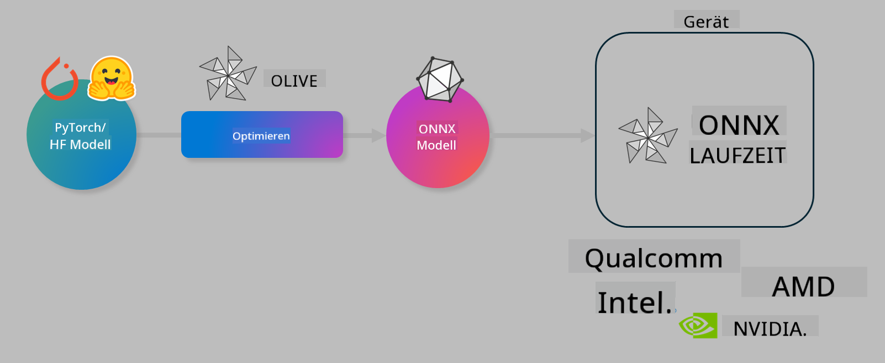

<!--
CO_OP_TRANSLATOR_METADATA:
{
  "original_hash": "6bbe47de3b974df7eea29dfeccf6032b",
  "translation_date": "2025-05-07T10:13:23+00:00",
  "source_file": "code/04.Finetuning/olive-lab/readme.md",
  "language_code": "de"
}
-->
# Lab. KI-Modelle für die Inferenz auf dem Gerät optimieren

## Einführung

> [!IMPORTANT]
> Für dieses Lab wird eine **Nvidia A10 oder A100 GPU** mit den zugehörigen Treibern und dem CUDA Toolkit (Version 12+) benötigt.

> [!NOTE]
> Dies ist ein **35-minütiges** Lab, das Ihnen eine praktische Einführung in die Kernkonzepte der Optimierung von Modellen für die Inferenz auf dem Gerät mit OLIVE gibt.

## Lernziele

Am Ende dieses Labs können Sie OLIVE verwenden, um:

- Ein KI-Modell mit der AWQ-Quantisierungsmethode zu quantisieren.
- Ein KI-Modell für eine bestimmte Aufgabe feinabzustimmen.
- LoRA-Adapter (feinabgestimmtes Modell) für eine effiziente Inferenz auf dem Gerät mit dem ONNX Runtime zu erzeugen.

### Was ist Olive

Olive (*O*NNX *live*) ist ein Toolkit zur Modelloptimierung mit einer begleitenden CLI, mit dem Sie Modelle für den ONNX Runtime +++https://onnxruntime.ai+++ in Qualität und Leistung ausliefern können.



Der Eingang für Olive ist typischerweise ein PyTorch- oder Hugging Face-Modell, und das Ergebnis ist ein optimiertes ONNX-Modell, das auf einem Gerät (Bereitstellungsziel) ausgeführt wird, auf dem der ONNX Runtime läuft. Olive optimiert das Modell für den AI-Beschleuniger (NPU, GPU, CPU) des Bereitstellungsziels, der von einem Hardwareanbieter wie Qualcomm, AMD, Nvidia oder Intel bereitgestellt wird.

Olive führt einen *Workflow* aus, eine geordnete Abfolge einzelner Modelloptimierungsaufgaben, sogenannte *passes* – Beispiele für passes sind: Modellkompression, Graph-Erfassung, Quantisierung, Graph-Optimierung. Jeder pass hat eine Reihe von Parametern, die angepasst werden können, um die besten Metriken wie Genauigkeit und Latenz zu erreichen, die vom jeweiligen Evaluator bewertet werden. Olive verwendet eine Suchstrategie, die einen Suchalgorithmus einsetzt, um jeden pass einzeln oder mehrere passes zusammen automatisch zu optimieren.

#### Vorteile von Olive

- **Weniger Frustration und Zeit** durch manuelles Trial-and-Error mit verschiedenen Techniken für Graph-Optimierung, Kompression und Quantisierung. Definieren Sie Ihre Qualitäts- und Leistungsanforderungen und lassen Sie Olive automatisch das beste Modell für Sie finden.
- **Über 40 integrierte Modelloptimierungskomponenten**, die modernste Techniken in Quantisierung, Kompression, Graph-Optimierung und Feinabstimmung abdecken.
- **Einfach zu bedienende CLI** für gängige Modelloptimierungsaufgaben, z.B. olive quantize, olive auto-opt, olive finetune.
- Modellverpackung und Bereitstellung sind integriert.
- Unterstützt die Erzeugung von Modellen für **Multi LoRA Serving**.
- Workflows können mit YAML/JSON erstellt werden, um Modelloptimierungs- und Bereitstellungsaufgaben zu orchestrieren.
- Integration mit **Hugging Face** und **Azure AI**.
- Eingebauter **Caching**-Mechanismus zur **Kosteneinsparung**.

## Lab-Anleitung
> [!NOTE]
> Bitte stellen Sie sicher, dass Sie Ihr Azure AI Hub und Projekt bereitgestellt und Ihren A100-Compute wie in Lab 1 eingerichtet haben.

### Schritt 0: Verbindung zu Ihrem Azure AI Compute herstellen

Sie verbinden sich mit dem Azure AI Compute über die Remote-Funktion in **VS Code**.

1. Öffnen Sie Ihre **VS Code** Desktop-Anwendung:
1. Öffnen Sie die **Befehlspalette** mit **Shift+Ctrl+P**
1. Suchen Sie in der Befehlspalette nach **AzureML - remote: Connect to compute instance in New Window**.
1. Folgen Sie den Anweisungen auf dem Bildschirm, um die Verbindung zum Compute herzustellen. Dabei wählen Sie Ihr Azure-Abonnement, Ihre Ressourcengruppe, Ihr Projekt und den Compute-Namen, den Sie in Lab 1 eingerichtet haben.
1. Sobald Sie mit Ihrem Azure ML Compute-Knoten verbunden sind, wird dies unten links in Visual Studio Code angezeigt `><Azure ML: Compute Name`

### Schritt 1: Dieses Repository klonen

In VS Code können Sie mit **Ctrl+J** ein neues Terminal öffnen und dieses Repository klonen:

Im Terminal sollten Sie die Eingabeaufforderung sehen

```
azureuser@computername:~/cloudfiles/code$ 
```
Lösen Sie die Lösung aus

```bash
cd ~/localfiles
git clone https://github.com/microsoft/phi-3cookbook.git
```

### Schritt 2: Ordner in VS Code öffnen

Um VS Code im relevanten Ordner zu öffnen, führen Sie folgenden Befehl im Terminal aus, der ein neues Fenster öffnet:

```bash
code phi-3cookbook/code/04.Finetuning/Olive-lab
```

Alternativ können Sie den Ordner über **Datei** > **Ordner öffnen** öffnen.

### Schritt 3: Abhängigkeiten

Öffnen Sie in VS Code auf Ihrer Azure AI Compute-Instanz ein Terminalfenster (Tipp: **Ctrl+J**) und führen Sie die folgenden Befehle aus, um die Abhängigkeiten zu installieren:

```bash
conda create -n olive-ai python=3.11 -y
conda activate olive-ai
pip install -r requirements.txt
az extension remove -n azure-cli-ml
az extension add -n ml
```

> [!NOTE]
> Die Installation aller Abhängigkeiten dauert ca. 5 Minuten.

In diesem Lab laden Sie Modelle in den Azure AI Modellkatalog hoch und laden sie herunter. Um auf den Modellkatalog zugreifen zu können, müssen Sie sich bei Azure anmelden mit:

```bash
az login
```

> [!NOTE]
> Beim Login werden Sie aufgefordert, Ihr Abonnement auszuwählen. Stellen Sie sicher, dass Sie das für dieses Lab vorgesehene Abonnement auswählen.

### Schritt 4: Olive-Befehle ausführen

Öffnen Sie in VS Code auf Ihrer Azure AI Compute-Instanz ein Terminalfenster (Tipp: **Ctrl+J**) und stellen Sie sicher, dass die `olive-ai` Conda-Umgebung aktiviert ist:

```bash
conda activate olive-ai
```

Führen Sie anschließend die folgenden Olive-Befehle in der Befehlszeile aus.

1. **Daten inspizieren:** In diesem Beispiel werden Sie das Phi-3.5-Mini-Modell feinabstimmen, damit es auf reiserelevante Fragen spezialisiert ist. Der folgende Code zeigt die ersten Datensätze des Datensatzes an, der im JSON Lines-Format vorliegt:

    ```bash
    head data/data_sample_travel.jsonl
    ```
1. **Modell quantisieren:** Bevor Sie das Modell trainieren, quantisieren Sie es zunächst mit folgendem Befehl, der eine Technik namens Active Aware Quantization (AWQ) +++https://arxiv.org/abs/2306.00978+++ verwendet. AWQ quantisiert die Gewichte eines Modells unter Berücksichtigung der Aktivierungen, die während der Inferenz erzeugt werden. Das bedeutet, dass der Quantisierungsprozess die tatsächliche Datenverteilung in den Aktivierungen berücksichtigt, was zu einer besseren Genauigkeitserhaltung im Vergleich zu herkömmlichen Gewicht-Quantisierungsmethoden führt.

    ```bash
    olive quantize \
       --model_name_or_path microsoft/Phi-3.5-mini-instruct \
       --trust_remote_code \
       --algorithm awq \
       --output_path models/phi/awq \
       --log_level 1
    ```

    Die AWQ-Quantisierung dauert **ca. 8 Minuten** und reduziert die Modellgröße von etwa 7,5 GB auf ca. 2,5 GB.

    In diesem Lab zeigen wir, wie Sie Modelle von Hugging Face eingeben (z.B. `microsoft/Phi-3.5-mini-instruct`). However, Olive also allows you to input models from the Azure AI catalog by updating the `model_name_or_path` argument to an Azure AI asset ID (for example:  `azureml://registries/azureml/models/Phi-3.5-mini-instruct/versions/4`). 

1. **Train the model:** Next, the `olive finetune`-Befehl feinjustiert das quantisierte Modell. Die Quantisierung *vor* der Feinabstimmung statt danach führt zu besserer Genauigkeit, da der Feinabstimmungsprozess einen Teil der durch die Quantisierung entstandenen Verluste wieder ausgleicht.

    ```bash
    olive finetune \
        --method lora \
        --model_name_or_path models/phi/awq \
        --data_files "data/data_sample_travel.jsonl" \
        --data_name "json" \
        --text_template "<|user|>\n{prompt}<|end|>\n<|assistant|>\n{response}<|end|>" \
        --max_steps 100 \
        --output_path ./models/phi/ft \
        --log_level 1
    ```

    Die Feinabstimmung (mit 100 Schritten) dauert **ca. 6 Minuten**.

1. **Optimieren:** Nach dem Training optimieren Sie das Modell mit Olives `auto-opt` command, which will capture the ONNX graph and automatically perform a number of optimizations to improve the model performance for CPU by compressing the model and doing fusions. It should be noted, that you can also optimize for other devices such as NPU or GPU by just updating the `--device` and `--provider`-Argumenten – für dieses Lab verwenden wir jedoch die CPU.

    ```bash
    olive auto-opt \
       --model_name_or_path models/phi/ft/model \
       --adapter_path models/phi/ft/adapter \
       --device cpu \
       --provider CPUExecutionProvider \
       --use_ort_genai \
       --output_path models/phi/onnx-ao \
       --log_level 1
    ```

    Die Optimierung dauert **ca. 5 Minuten**.

### Schritt 5: Schneller Test der Modellinferenz

Um die Inferenz des Modells zu testen, erstellen Sie eine Python-Datei namens **app.py** in Ihrem Ordner und fügen Sie den folgenden Code ein:

```python
import onnxruntime_genai as og
import numpy as np

print("loading model and adapters...", end="", flush=True)
model = og.Model("models/phi/onnx-ao/model")
adapters = og.Adapters(model)
adapters.load("models/phi/onnx-ao/model/adapter_weights.onnx_adapter", "travel")
print("DONE!")

tokenizer = og.Tokenizer(model)
tokenizer_stream = tokenizer.create_stream()

params = og.GeneratorParams(model)
params.set_search_options(max_length=100, past_present_share_buffer=False)
user_input = "what is the best thing to see in chicago"
params.input_ids = tokenizer.encode(f"<|user|>\n{user_input}<|end|>\n<|assistant|>\n")

generator = og.Generator(model, params)

generator.set_active_adapter(adapters, "travel")

print(f"{user_input}")

while not generator.is_done():
    generator.compute_logits()
    generator.generate_next_token()

    new_token = generator.get_next_tokens()[0]
    print(tokenizer_stream.decode(new_token), end='', flush=True)

print("\n")
```

Führen Sie den Code aus mit:

```bash
python app.py
```

### Schritt 6: Modell in Azure AI hochladen

Das Hochladen des Modells in ein Azure AI Modell-Repository macht das Modell für andere Mitglieder Ihres Entwicklungsteams freigebbar und verwaltet auch die Versionskontrolle des Modells. Um das Modell hochzuladen, führen Sie den folgenden Befehl aus:

> [!NOTE]
> Aktualisieren Sie die `{}` Platzhalter für `resourceGroup` und den Azure AI Projektnamen und führen Sie dann den Befehl aus

```
az ml workspace show
```

Alternativ können Sie zu +++ai.azure.com+++ gehen und dort **Management Center** > **Projekt** > **Übersicht** auswählen.

Ersetzen Sie die `{}` Platzhalter durch den Namen Ihrer Ressourcengruppe und Ihres Azure AI Projektnamens.

```bash
az ml model create \
    --name ft-for-travel \
    --version 1 \
    --path ./models/phi/onnx-ao \
    --resource-group {RESOURCE_GROUP_NAME} \
    --workspace-name {PROJECT_NAME}
```

Sie können Ihr hochgeladenes Modell dann unter https://ml.azure.com/model/list sehen und bereitstellen.

**Haftungsausschluss**:  
Dieses Dokument wurde mit dem KI-Übersetzungsdienst [Co-op Translator](https://github.com/Azure/co-op-translator) übersetzt. Obwohl wir uns um Genauigkeit bemühen, beachten Sie bitte, dass automatisierte Übersetzungen Fehler oder Ungenauigkeiten enthalten können. Das Originaldokument in seiner ursprünglichen Sprache gilt als maßgebliche Quelle. Für wichtige Informationen wird eine professionelle menschliche Übersetzung empfohlen. Wir übernehmen keine Haftung für Missverständnisse oder Fehlinterpretationen, die aus der Verwendung dieser Übersetzung entstehen.