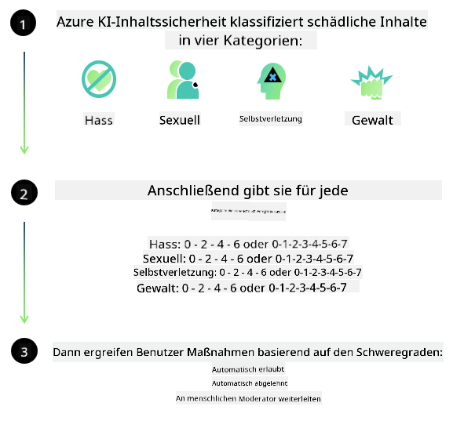

<!--
CO_OP_TRANSLATOR_METADATA:
{
  "original_hash": "839ccc4b3886ef10cfd4e64977f5792d",
  "translation_date": "2026-01-04T06:53:58+00:00",
  "source_file": "md/01.Introduction/01/01.AISafety.md",
  "language_code": "de"
}
-->
# KI-Sicherheit für Phi-Modelle
Die Phi-Familie von Modellen wurde in Übereinstimmung mit dem [Microsoft Responsible AI Standard](https://www.microsoft.com/ai/principles-and-approach#responsible-ai-standard) entwickelt, einem unternehmensweiten Satz von Anforderungen, der auf den folgenden sechs Prinzipien basiert: Verantwortung, Transparenz, Fairness, Zuverlässigkeit und Sicherheit, Datenschutz und Sicherheit sowie Inklusivität, die [Microsofts Responsible AI-Prinzipien](https://www.microsoft.com/ai/responsible-ai) bilden. 

Wie bei den vorherigen Phi-Modellen wurde ein vielschichtiger Sicherheitsbewertungs- und Sicherheits-Post-Training-Ansatz angewandt, wobei zusätzliche Maßnahmen ergriffen wurden, um den mehrsprachigen Fähigkeiten dieser Veröffentlichung Rechnung zu tragen. Unser Ansatz für Sicherheitstraining und -bewertungen, einschließlich Tests in mehreren Sprachen und Risikokategorien, ist im [Phi Safety Post-Training Paper](https://arxiv.org/abs/2407.13833) dargelegt. Während die Phi-Modelle von diesem Ansatz profitieren, sollten Entwickler verantwortungsvolle KI-Best Practices anwenden, einschließlich der Zuordnung, Messung und Minderung von Risiken, die mit ihrem spezifischen Anwendungsfall sowie dem kulturellen und sprachlichen Kontext verbunden sind.

## Best Practices

Wie andere Modelle können auch die Phi-Modelle potenziell in einer Weise agieren, die unfair, unzuverlässig oder anstößig ist.

Einige der einschränkenden Verhaltensweisen von SLM und LLM, auf die Sie achten sollten, umfassen:

- **Quality of Service:** Die Phi-Modelle wurden hauptsächlich auf englischem Text trainiert. Sprachen außer Englisch werden eine schlechtere Leistung erfahren; englische Sprachvarietäten mit geringerer Repräsentation in den Trainingsdaten könnten eine schlechtere Leistung als das standardmäßige amerikanische Englisch zeigen.
- **Representation of Harms & Perpetuation of Stereotypes:** Diese Modelle können Gruppen von Menschen über- oder unterrepräsentieren, die Darstellung einiger Gruppen auslöschen oder erniedrigende bzw. negative Stereotype verstärken. Trotz Sicherheits-Post-Training können diese Einschränkungen weiterhin vorhanden sein, bedingt durch unterschiedliche Repräsentationsniveaus verschiedener Gruppen oder die Häufigkeit von Beispielen negativer Stereotype in den Trainingsdaten, die reale Muster und gesellschaftliche Vorurteile widerspiegeln.
- **Inappropriate or Offensive Content:** Diese Modelle können andere Arten von unangemessenem oder anstößigem Inhalt produzieren, was es unangemessen machen kann, sie ohne zusätzliche, fallbezogene Minderungsmaßnahmen in sensiblen Kontexten einzusetzen.
Information Reliability: Sprachmodelle können unsinnige Inhalte erzeugen oder Inhalte erfinden, die vernünftig klingen mögen, aber ungenau oder veraltet sind.
- **Limited Scope for Code:** Der Großteil der Phi-3-Trainingsdaten basiert auf Python und verwendet gängige Pakete wie "typing, math, random, collections, datetime, itertools". Wenn das Modell Python-Skripte erzeugt, die andere Pakete verwenden oder Skripte in anderen Sprachen enthalten, empfehlen wir dringend, dass Benutzer alle API-Verwendungen manuell überprüfen.

Entwickler sollten verantwortungsvolle KI-Best Practices anwenden und sind dafür verantwortlich sicherzustellen, dass ein spezifischer Anwendungsfall mit den einschlägigen Gesetzen und Vorschriften (z. B. Datenschutz, Handel usw.) übereinstimmt. 

## Erwägungen zur verantwortungsvollen KI

Wie andere Sprachmodelle können die Modelle der Phi-Reihe potenziell in einer Weise agieren, die unfair, unzuverlässig oder anstößig ist. Einige der einschränkenden Verhaltensweisen, auf die geachtet werden sollte, umfassen:

**Quality of Service:** Die Phi-Modelle wurden hauptsächlich auf englischem Text trainiert. Sprachen außer Englisch werden eine schlechtere Leistung erfahren. Englische Sprachvarietäten mit geringerer Repräsentation in den Trainingsdaten könnten eine schlechtere Leistung als das standardmäßige amerikanische Englisch zeigen.

**Representation of Harms & Perpetuation of Stereotypes:** Diese Modelle können Gruppen von Menschen über- oder unterrepräsentieren, die Darstellung einiger Gruppen auslöschen oder erniedrigende bzw. negative Stereotype verstärken. Trotz Sicherheits-Post-Training können diese Einschränkungen weiterhin vorhanden sein, bedingt durch unterschiedliche Repräsentationsniveaus verschiedener Gruppen oder die Häufigkeit von Beispielen negativer Stereotype in den Trainingsdaten, die reale Muster und gesellschaftliche Vorurteile widerspiegeln.

**Inappropriate or Offensive Content:** Diese Modelle können andere Arten von unangemessenem oder anstößigem Inhalt produzieren, was es unangemessen machen kann, sie ohne zusätzliche, fallbezogene Minderungsmaßnahmen in sensiblen Kontexten einzusetzen.
Information Reliability: Sprachmodelle können unsinnige Inhalte erzeugen oder Inhalte erfinden, die vernünftig klingen mögen, aber ungenau oder veraltet sind.

**Limited Scope for Code:** Der Großteil der Phi-3-Trainingsdaten basiert auf Python und verwendet gängige Pakete wie "typing, math, random, collections, datetime, itertools". Wenn das Modell Python-Skripte erzeugt, die andere Pakete verwenden oder Skripte in anderen Sprachen enthalten, empfehlen wir dringend, dass Benutzer alle API-Verwendungen manuell überprüfen.

Entwickler sollten verantwortungsvolle KI-Best Practices anwenden und sind dafür verantwortlich sicherzustellen, dass ein spezifischer Anwendungsfall mit den einschlägigen Gesetzen und Vorschriften (z. B. Datenschutz, Handel usw.) übereinstimmt. Wichtige Bereiche für die Betrachtung umfassen:

**Allocation:** Modelle sind möglicherweise nicht geeignet für Szenarien, die erhebliche Auswirkungen auf den rechtlichen Status oder die Zuteilung von Ressourcen oder Lebenschancen haben könnten (z. B.: Wohnen, Beschäftigung, Kredit usw.), ohne weitere Bewertungen und zusätzliche Entzerrungstechniken.

**High-Risk Scenarios:** Entwickler sollten die Eignung der Modellsutzung in Hochrisikoszenarien bewerten, in denen unfaire, unzuverlässige oder anstößige Ausgaben extrem kostspielig sein oder zu Schaden führen könnten. Dazu gehört die Bereitstellung von Rat in sensiblen oder fachlichen Domänen, in denen Genauigkeit und Zuverlässigkeit kritisch sind (z. B.: rechtliche oder gesundheitliche Beratung). Auf Anwendungsebene sollten zusätzliche Schutzmaßnahmen entsprechend dem Einsatzkontext implementiert werden.

**Misinformation:** Modelle können ungenaue Informationen erzeugen. Entwickler sollten Transparenz-Best Practices befolgen und Endbenutzer darüber informieren, dass sie mit einem KI-System interagieren. Auf Anwendungsebene können Entwickler Feedback-Mechanismen und Pipelines erstellen, um Antworten in anwendungsspezifische, kontextuelle Informationen zu verankern, eine Technik, die als Retrieval Augmented Generation (RAG) bekannt ist.

**Generation of Harmful Content:** Entwickler sollten Ausgaben im jeweiligen Kontext bewerten und verfügbare Sicherheitsklassifizierer oder kundenspezifische Lösungen verwenden, die für ihren Anwendungsfall geeignet sind.

**Misuse:** Andere Formen von Missbrauch wie Betrug, Spam oder Malware-Produktion können möglich sein, und Entwickler sollten sicherstellen, dass ihre Anwendungen nicht gegen geltende Gesetze und Vorschriften verstoßen.

### Feinabstimmung und KI-Inhaltsicherheit

Nach dem Fine-Tuning eines Modells empfehlen wir dringend den Einsatz von [Azure AI Content Safety](https://learn.microsoft.com/azure/ai-services/content-safety/overview)-Maßnahmen, um die von den Modellen erzeugten Inhalte zu überwachen, potenzielle Risiken, Bedrohungen und Qualitätsprobleme zu identifizieren und zu blockieren.

[Azure AI Content Safety](https://learn.microsoft.com/azure/ai-services/content-safety/overview) unterstützt sowohl Text- als auch Bildinhalte. Es kann in der Cloud, in isolierten Containern und auf Edge-/Embedded-Geräten bereitgestellt werden.

## Übersicht über Azure AI Content Safety

Azure AI Content Safety ist keine Lösung, die für alle Fälle passt; sie kann an die spezifischen Richtlinien von Unternehmen angepasst werden. Zusätzlich ermöglichen die mehrsprachigen Modelle, mehrere Sprachen gleichzeitig zu verstehen.

- **Azure AI Content Safety**
- **Microsoft Developer**
- **5 videos**

Der Azure AI Content Safety-Dienst erkennt schädliche von Benutzern generierte und KI-generierte Inhalte in Anwendungen und Diensten. Er umfasst Text- und Bild-APIs, mit denen Sie schädliches oder unangemessenes Material erkennen können.

[AI Content Safety Playlist](https://www.youtube.com/playlist?list=PLlrxD0HtieHjaQ9bJjyp1T7FeCbmVcPkQ)

---

<!-- CO-OP TRANSLATOR DISCLAIMER START -->
Haftungsausschluss:
Dieses Dokument wurde mit dem KI-Übersetzungsdienst Co-op Translator (https://github.com/Azure/co-op-translator) übersetzt. Obwohl wir uns um Genauigkeit bemühen, beachten Sie bitte, dass automatisierte Übersetzungen Fehler oder Ungenauigkeiten enthalten können. Das Originaldokument in seiner Ausgangssprache ist als maßgebliche Quelle zu betrachten. Für kritische Informationen wird eine professionelle menschliche Übersetzung empfohlen. Wir haften nicht für Missverständnisse oder Fehlinterpretationen, die aus der Nutzung dieser Übersetzung entstehen.
<!-- CO-OP TRANSLATOR DISCLAIMER END -->