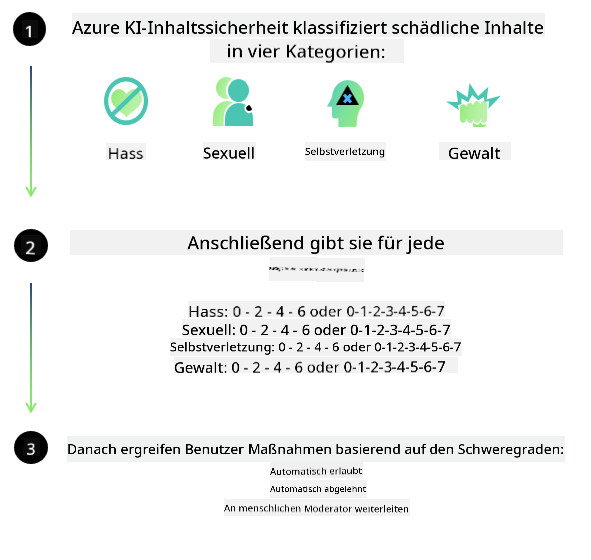
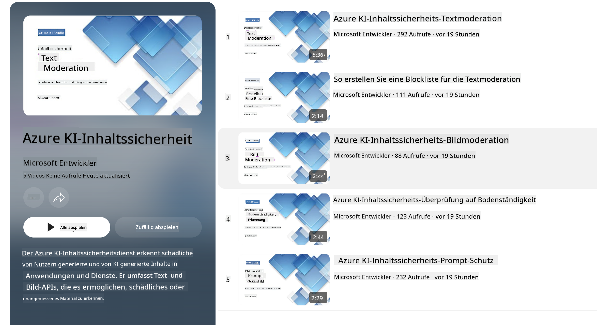

<!--
CO_OP_TRANSLATOR_METADATA:
{
  "original_hash": "c8273672cc57df2be675407a1383aaf0",
  "translation_date": "2025-07-16T17:41:49+00:00",
  "source_file": "md/01.Introduction/01/01.AISafety.md",
  "language_code": "de"
}
-->
# KI-Sicherheit für Phi-Modelle  
Die Phi-Modellfamilie wurde gemäß dem [Microsoft Responsible AI Standard](https://query.prod.cms.rt.microsoft.com/cms/api/am/binary/RE5cmFl) entwickelt, einem unternehmensweiten Anforderungskatalog, der auf den folgenden sechs Prinzipien basiert: Verantwortlichkeit, Transparenz, Fairness, Zuverlässigkeit und Sicherheit, Datenschutz und Sicherheit sowie Inklusivität, die zusammen die [Microsoft Responsible AI-Prinzipien](https://www.microsoft.com/ai/responsible-ai) bilden.

Wie bei den vorherigen Phi-Modellen wurde ein vielschichtiger Sicherheitsbewertungs- und Sicherheits-Post-Training-Ansatz verfolgt, wobei zusätzliche Maßnahmen ergriffen wurden, um den mehrsprachigen Fähigkeiten dieser Version gerecht zu werden. Unser Ansatz für Sicherheitstraining und -bewertungen, einschließlich Tests in mehreren Sprachen und Risikokategorien, ist im [Phi Safety Post-Training Paper](https://arxiv.org/abs/2407.13833) beschrieben. Obwohl die Phi-Modelle von diesem Ansatz profitieren, sollten Entwickler verantwortungsbewusste KI-Best Practices anwenden, einschließlich der Erfassung, Messung und Minderung von Risiken, die mit ihrem spezifischen Anwendungsfall sowie dem kulturellen und sprachlichen Kontext verbunden sind.

## Best Practices

Wie andere Modelle können auch die Phi-Modelle potenziell Verhaltensweisen zeigen, die unfair, unzuverlässig oder anstößig sind.

Einige der einschränkenden Verhaltensweisen von SLM und LLM, auf die Sie achten sollten, sind:

- **Qualität des Dienstes:** Die Phi-Modelle sind hauptsächlich auf englischen Text trainiert. Sprachen außer Englisch werden eine schlechtere Leistung zeigen. Englischsprachige Varianten, die im Trainingsdatensatz weniger vertreten sind, könnten schlechter abschneiden als das standardmäßige amerikanische Englisch.  
- **Darstellung von Schäden & Verstärkung von Stereotypen:** Diese Modelle können Gruppen von Menschen über- oder unterrepräsentieren, die Darstellung einiger Gruppen auslöschen oder erniedrigende bzw. negative Stereotype verstärken. Trotz Sicherheits-Post-Training können diese Einschränkungen weiterhin bestehen, da unterschiedliche Repräsentationsgrade verschiedener Gruppen oder die Häufigkeit negativer Stereotypen in den Trainingsdaten reale Muster und gesellschaftliche Vorurteile widerspiegeln.  
- **Unangemessene oder anstößige Inhalte:** Diese Modelle können andere Arten von unangemessenen oder anstößigen Inhalten erzeugen, was den Einsatz in sensiblen Kontexten ohne zusätzliche, an den Anwendungsfall angepasste Schutzmaßnahmen problematisch machen kann.  
- **Informationszuverlässigkeit:** Sprachmodelle können unsinnige Inhalte generieren oder Inhalte erfinden, die zwar plausibel klingen, aber ungenau oder veraltet sind.  
- **Begrenzter Anwendungsbereich für Code:** Der Großteil der Phi-3-Trainingsdaten basiert auf Python und verwendet gängige Pakete wie „typing, math, random, collections, datetime, itertools“. Wenn das Modell Python-Skripte generiert, die andere Pakete oder Skripte in anderen Sprachen nutzen, empfehlen wir dringend, alle API-Verwendungen manuell zu überprüfen.

Entwickler sollten verantwortungsbewusste KI-Best Practices anwenden und sind dafür verantwortlich, sicherzustellen, dass ein spezifischer Anwendungsfall den geltenden Gesetzen und Vorschriften entspricht (z. B. Datenschutz, Handel usw.).

## Responsible AI Überlegungen

Wie andere Sprachmodelle können auch die Phi-Modelle potenziell Verhaltensweisen zeigen, die unfair, unzuverlässig oder anstößig sind. Einige der einschränkenden Verhaltensweisen, auf die man achten sollte, sind:

**Qualität des Dienstes:** Die Phi-Modelle sind hauptsächlich auf englischen Text trainiert. Sprachen außer Englisch werden eine schlechtere Leistung zeigen. Englischsprachige Varianten, die im Trainingsdatensatz weniger vertreten sind, könnten schlechter abschneiden als das standardmäßige amerikanische Englisch.

**Darstellung von Schäden & Verstärkung von Stereotypen:** Diese Modelle können Gruppen von Menschen über- oder unterrepräsentieren, die Darstellung einiger Gruppen auslöschen oder erniedrigende bzw. negative Stereotype verstärken. Trotz Sicherheits-Post-Training können diese Einschränkungen weiterhin bestehen, da unterschiedliche Repräsentationsgrade verschiedener Gruppen oder die Häufigkeit negativer Stereotypen in den Trainingsdaten reale Muster und gesellschaftliche Vorurteile widerspiegeln.

**Unangemessene oder anstößige Inhalte:** Diese Modelle können andere Arten von unangemessenen oder anstößigen Inhalten erzeugen, was den Einsatz in sensiblen Kontexten ohne zusätzliche, an den Anwendungsfall angepasste Schutzmaßnahmen problematisch machen kann.  
Informationszuverlässigkeit: Sprachmodelle können unsinnige Inhalte generieren oder Inhalte erfinden, die zwar plausibel klingen, aber ungenau oder veraltet sind.

**Begrenzter Anwendungsbereich für Code:** Der Großteil der Phi-3-Trainingsdaten basiert auf Python und verwendet gängige Pakete wie „typing, math, random, collections, datetime, itertools“. Wenn das Modell Python-Skripte generiert, die andere Pakete oder Skripte in anderen Sprachen nutzen, empfehlen wir dringend, alle API-Verwendungen manuell zu überprüfen.

Entwickler sollten verantwortungsbewusste KI-Best Practices anwenden und sind dafür verantwortlich, sicherzustellen, dass ein spezifischer Anwendungsfall den geltenden Gesetzen und Vorschriften entspricht (z. B. Datenschutz, Handel usw.). Wichtige Bereiche zur Berücksichtigung sind:

**Zuweisung:** Modelle sind möglicherweise nicht für Szenarien geeignet, die erhebliche Auswirkungen auf den rechtlichen Status oder die Zuweisung von Ressourcen oder Lebenschancen haben könnten (z. B. Wohnen, Beschäftigung, Kreditvergabe usw.), ohne weitere Bewertungen und zusätzliche Entzerrungstechniken.

**Hochrisikoszenarien:** Entwickler sollten die Eignung der Modelle für Hochrisikoszenarien bewerten, in denen unfaire, unzuverlässige oder anstößige Ausgaben extrem kostspielig sein oder Schaden verursachen könnten. Dies umfasst die Beratung in sensiblen oder fachlichen Bereichen, in denen Genauigkeit und Zuverlässigkeit entscheidend sind (z. B. rechtliche oder gesundheitliche Beratung). Zusätzliche Schutzmaßnahmen sollten auf Anwendungsebene entsprechend dem Einsatzkontext implementiert werden.

**Fehlinformationen:** Modelle können ungenaue Informationen erzeugen. Entwickler sollten Transparenz-Best Practices befolgen und Endnutzer darüber informieren, dass sie mit einem KI-System interagieren. Auf Anwendungsebene können Entwickler Feedback-Mechanismen und Pipelines einbauen, um Antworten auf anwendungsspezifische, kontextuelle Informationen zu stützen, eine Technik, die als Retrieval Augmented Generation (RAG) bekannt ist.

**Erzeugung schädlicher Inhalte:** Entwickler sollten Ausgaben im Kontext bewerten und verfügbare Sicherheitsklassifizierer oder maßgeschneiderte Lösungen verwenden, die für ihren Anwendungsfall geeignet sind.

**Missbrauch:** Andere Formen des Missbrauchs wie Betrug, Spam oder Malware-Erzeugung sind möglich, und Entwickler sollten sicherstellen, dass ihre Anwendungen keine geltenden Gesetze und Vorschriften verletzen.

### Feinabstimmung und KI-Inhaltssicherheit

Nach der Feinabstimmung eines Modells empfehlen wir dringend, [Azure AI Content Safety](https://learn.microsoft.com/azure/ai-services/content-safety/overview) Maßnahmen zu nutzen, um die von den Modellen generierten Inhalte zu überwachen, potenzielle Risiken, Bedrohungen und Qualitätsprobleme zu erkennen und zu blockieren.

[Azure AI Content Safety](https://learn.microsoft.com/azure/ai-services/content-safety/overview) unterstützt sowohl Text- als auch Bildinhalte. Es kann in der Cloud, in isolierten Containern und auf Edge-/Embedded-Geräten eingesetzt werden.

## Überblick über Azure AI Content Safety

Azure AI Content Safety ist keine Lösung für alle Fälle; sie kann an die spezifischen Richtlinien von Unternehmen angepasst werden. Zudem ermöglichen die mehrsprachigen Modelle das gleichzeitige Verstehen mehrerer Sprachen.

- **Azure AI Content Safety**  
- **Microsoft Developer**  
- **5 Videos**

Der Azure AI Content Safety-Dienst erkennt schädliche, von Nutzern oder KI generierte Inhalte in Anwendungen und Diensten. Er umfasst Text- und Bild-APIs, mit denen schädliches oder unangemessenes Material erkannt werden kann.

[AI Content Safety Playlist](https://www.youtube.com/playlist?list=PLlrxD0HtieHjaQ9bJjyp1T7FeCbmVcPkQ)

**Haftungsausschluss**:  
Dieses Dokument wurde mit dem KI-Übersetzungsdienst [Co-op Translator](https://github.com/Azure/co-op-translator) übersetzt. Obwohl wir uns um Genauigkeit bemühen, beachten Sie bitte, dass automatisierte Übersetzungen Fehler oder Ungenauigkeiten enthalten können. Das Originaldokument in seiner Ursprungssprache ist als maßgebliche Quelle zu betrachten. Für wichtige Informationen wird eine professionelle menschliche Übersetzung empfohlen. Wir übernehmen keine Haftung für Missverständnisse oder Fehlinterpretationen, die aus der Nutzung dieser Übersetzung entstehen.