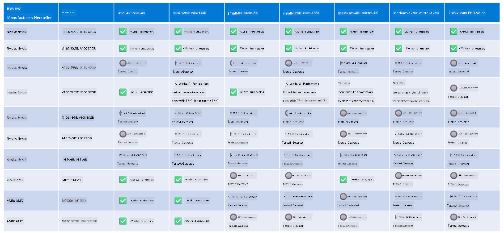

<!--
CO_OP_TRANSLATOR_METADATA:
{
  "original_hash": "8cdc17ce0f10535da30b53d23fe1a795",
  "translation_date": "2025-05-07T10:53:01+00:00",
  "source_file": "md/01.Introduction/01/01.Hardwaresupport.md",
  "language_code": "de"
}
-->
# Phi Hardware-Unterstützung

Microsoft Phi wurde für ONNX Runtime optimiert und unterstützt Windows DirectML. Es funktioniert gut auf verschiedenen Hardwaretypen, einschließlich GPUs, CPUs und sogar mobilen Geräten.

## Gerätehardware  
Insbesondere umfasst die unterstützte Hardware:

- GPU SKU: RTX 4090 (DirectML)  
- GPU SKU: 1 A100 80GB (CUDA)  
- CPU SKU: Standard F64s v2 (64 vCPUs, 128 GiB Speicher)

## Mobile SKU

- Android - Samsung Galaxy S21  
- Apple iPhone 14 oder höher mit A16/A17 Prozessor

## Phi Hardware-Spezifikation

- Minimale Konfiguration erforderlich.  
- Windows: DirectX 12-fähige GPU und mindestens 4 GB Gesamtspeicher

CUDA: NVIDIA GPU mit Compute Capability >= 7.02



## Ausführen von onnxruntime auf mehreren GPUs

Derzeit sind Phi ONNX-Modelle nur für 1 GPU verfügbar. Multi-GPU-Unterstützung für Phi-Modelle ist möglich, aber ORT mit 2 GPUs garantiert nicht, dass es eine höhere Durchsatzrate liefert als 2 Instanzen von ORT. Für die neuesten Updates siehe bitte [ONNX Runtime](https://onnxruntime.ai/).

Auf der [Build 2024 hat das GenAI ONNX Team](https://youtu.be/WLW4SE8M9i8?si=EtG04UwDvcjunyfC) angekündigt, dass sie Multi-Instance statt Multi-GPU für Phi-Modelle aktiviert haben.

Derzeit können Sie damit eine onnxruntime- oder onnxruntime-genai-Instanz mit der CUDA_VISIBLE_DEVICES-Umgebungsvariable wie folgt ausführen.

```Python
CUDA_VISIBLE_DEVICES=0 python infer.py
CUDA_VISIBLE_DEVICES=1 python infer.py
```

Erkunden Sie Phi gerne weiter in [Azure AI Foundry](https://ai.azure.com)

**Haftungsausschluss**:  
Dieses Dokument wurde mithilfe des KI-Übersetzungsdienstes [Co-op Translator](https://github.com/Azure/co-op-translator) übersetzt. Obwohl wir uns um Genauigkeit bemühen, beachten Sie bitte, dass automatisierte Übersetzungen Fehler oder Ungenauigkeiten enthalten können. Das Originaldokument in seiner Originalsprache ist als maßgebliche Quelle zu betrachten. Für wichtige Informationen wird eine professionelle menschliche Übersetzung empfohlen. Wir übernehmen keine Haftung für Missverständnisse oder Fehlinterpretationen, die aus der Verwendung dieser Übersetzung entstehen.