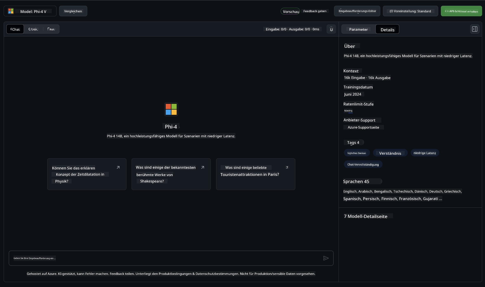
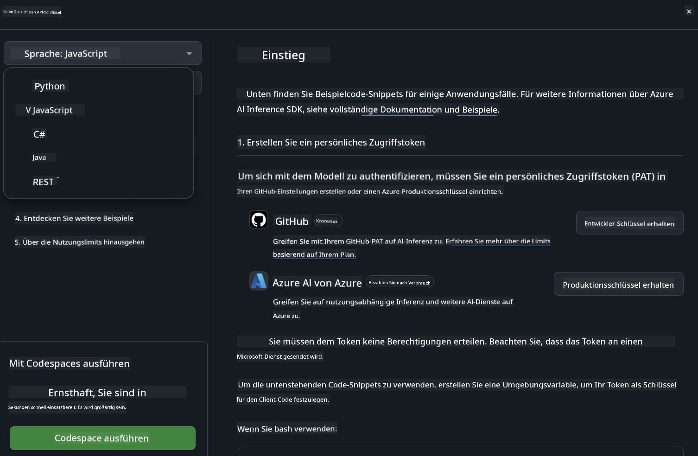
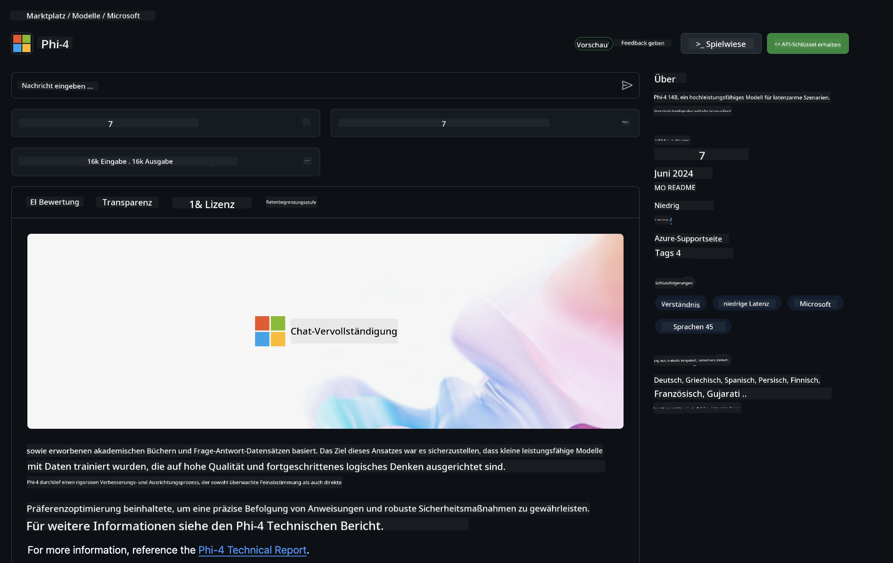

<!--
CO_OP_TRANSLATOR_METADATA:
{
  "original_hash": "fb67a08b9fc911a10ed58081fadef416",
  "translation_date": "2025-05-07T10:37:01+00:00",
  "source_file": "md/01.Introduction/02/02.GitHubModel.md",
  "language_code": "de"
}
-->
## Phi-Familie in GitHub Models

Willkommen bei [GitHub Models](https://github.com/marketplace/models)! Wir haben alles startklar für dich, um die auf Azure AI gehosteten KI-Modelle zu entdecken.


Für weitere Informationen zu den auf GitHub Models verfügbaren Modellen besuche den [GitHub Model Marketplace](https://github.com/marketplace/models)

## Verfügbare Modelle

Jedes Modell verfügt über eine eigene Playground-Umgebung und Beispielcode



### Phi-Familie im GitHub Model Catalog

- [Phi-4](https://github.com/marketplace/models/azureml/Phi-4)

- [Phi-3.5-MoE instruct (128k)](https://github.com/marketplace/models/azureml/Phi-3-5-MoE-instruct)

- [Phi-3.5-vision instruct (128k)](https://github.com/marketplace/models/azureml/Phi-3-5-vision-instruct)

- [Phi-3.5-mini instruct (128k)](https://github.com/marketplace/models/azureml/Phi-3-5-mini-instruct)

- [Phi-3-Medium-128k-Instruct](https://github.com/marketplace/models/azureml/Phi-3-medium-128k-instruct)

- [Phi-3-medium-4k-instruct](https://github.com/marketplace/models/azureml/Phi-3-medium-4k-instruct)

- [Phi-3-mini-128k-instruct](https://github.com/marketplace/models/azureml/Phi-3-mini-128k-instruct)

- [Phi-3-mini-4k-instruct](https://github.com/marketplace/models/azureml/Phi-3-mini-4k-instruct)

- [Phi-3-small-128k-instruct](https://github.com/marketplace/models/azureml/Phi-3-small-128k-instruct)

- [Phi-3-small-8k-instruct](https://github.com/marketplace/models/azureml/Phi-3-small-8k-instruct)

## Erste Schritte

Es gibt einige grundlegende Beispiele, die du sofort ausführen kannst. Du findest sie im Verzeichnis samples. Wenn du direkt zu deiner bevorzugten Programmiersprache springen möchtest, findest du die Beispiele in den folgenden Sprachen:

- Python
- JavaScript
- C#
- Java
- cURL

Es gibt außerdem eine spezielle Codespaces-Umgebung, um die Beispiele und Modelle auszuführen.



## Beispielcode

Nachfolgend findest du Beispielcode-Snippets für einige Anwendungsfälle. Weitere Informationen zum Azure AI Inference SDK findest du in der vollständigen Dokumentation und den Beispielen.

## Einrichtung

1. Erstelle ein persönliches Zugriffstoken  
Du musst dem Token keine Berechtigungen zuweisen. Beachte, dass das Token an einen Microsoft-Dienst gesendet wird.

Um die untenstehenden Codebeispiele zu verwenden, lege eine Umgebungsvariable an, in der dein Token als Schlüssel für den Client-Code gespeichert wird.

Wenn du bash verwendest:  
```
export GITHUB_TOKEN="<your-github-token-goes-here>"
```  
Wenn du PowerShell nutzt:  

```
$Env:GITHUB_TOKEN="<your-github-token-goes-here>"
```  

Wenn du die Windows-Eingabeaufforderung verwendest:  

```
set GITHUB_TOKEN=<your-github-token-goes-here>
```  

## Python-Beispiel

### Abhängigkeiten installieren  
Installiere das Azure AI Inference SDK mit pip (Voraussetzung: Python >=3.8):  

```
pip install azure-ai-inference
```  
### Einfaches Beispiel ausführen

Dieses Beispiel zeigt einen einfachen Aufruf der Chat Completion API. Dabei wird der GitHub AI Model Inference Endpoint und dein GitHub-Token verwendet. Der Aufruf erfolgt synchron.

```python
import os
from azure.ai.inference import ChatCompletionsClient
from azure.ai.inference.models import SystemMessage, UserMessage
from azure.core.credentials import AzureKeyCredential

endpoint = "https://models.inference.ai.azure.com"
model_name = "Phi-4"
token = os.environ["GITHUB_TOKEN"]

client = ChatCompletionsClient(
    endpoint=endpoint,
    credential=AzureKeyCredential(token),
)

response = client.complete(
    messages=[
        UserMessage(content="I have $20,000 in my savings account, where I receive a 4% profit per year and payments twice a year. Can you please tell me how long it will take for me to become a millionaire? Also, can you please explain the math step by step as if you were explaining it to an uneducated person?"),
    ],
    temperature=0.4,
    top_p=1.0,
    max_tokens=2048,
    model=model_name
)

print(response.choices[0].message.content)
```

### Mehrstufige Unterhaltung führen

Dieses Beispiel zeigt eine mehrstufige Unterhaltung mit der Chat Completion API. Wenn du das Modell für eine Chat-Anwendung nutzt, musst du den Verlauf der Unterhaltung verwalten und die neuesten Nachrichten an das Modell senden.

```
import os
from azure.ai.inference import ChatCompletionsClient
from azure.ai.inference.models import AssistantMessage, SystemMessage, UserMessage
from azure.core.credentials import AzureKeyCredential

token = os.environ["GITHUB_TOKEN"]
endpoint = "https://models.inference.ai.azure.com"
# Replace Model_Name
model_name = "Phi-4"

client = ChatCompletionsClient(
    endpoint=endpoint,
    credential=AzureKeyCredential(token),
)

messages = [
    SystemMessage(content="You are a helpful assistant."),
    UserMessage(content="What is the capital of France?"),
    AssistantMessage(content="The capital of France is Paris."),
    UserMessage(content="What about Spain?"),
]

response = client.complete(messages=messages, model=model_name)

print(response.choices[0].message.content)
```

### Ausgabe streamen

Für ein besseres Nutzererlebnis möchtest du die Antwort des Modells streamen, damit das erste Token früh angezeigt wird und du nicht lange auf die Antwort warten musst.

```
import os
from azure.ai.inference import ChatCompletionsClient
from azure.ai.inference.models import SystemMessage, UserMessage
from azure.core.credentials import AzureKeyCredential

token = os.environ["GITHUB_TOKEN"]
endpoint = "https://models.inference.ai.azure.com"
# Replace Model_Name
model_name = "Phi-4"

client = ChatCompletionsClient(
    endpoint=endpoint,
    credential=AzureKeyCredential(token),
)

response = client.complete(
    stream=True,
    messages=[
        SystemMessage(content="You are a helpful assistant."),
        UserMessage(content="Give me 5 good reasons why I should exercise every day."),
    ],
    model=model_name,
)

for update in response:
    if update.choices:
        print(update.choices[0].delta.content or "", end="")

client.close()
```

## Kostenlose Nutzung und Rate Limits für GitHub Models



Die [Rate Limits für den Playground und die kostenlose API-Nutzung](https://docs.github.com/en/github-models/prototyping-with-ai-models#rate-limits) sollen dir helfen, Modelle auszuprobieren und deine KI-Anwendung zu prototypisieren. Für eine Nutzung über diese Limits hinaus und um deine Anwendung zu skalieren, musst du Ressourcen über ein Azure-Konto bereitstellen und dich dort authentifizieren, anstatt dein persönliches GitHub-Zugriffstoken zu verwenden. An deinem Code musst du sonst nichts ändern. Nutze diesen Link, um zu erfahren, wie du die kostenlosen Kontingente in Azure AI überschreiten kannst.

### Hinweise

Beachte, dass du beim Arbeiten mit einem Modell mit KI experimentierst, daher können Fehler im Inhalt vorkommen.

Die Funktion unterliegt verschiedenen Beschränkungen (einschließlich Anfragen pro Minute, Anfragen pro Tag, Token pro Anfrage und gleichzeitigen Anfragen) und ist nicht für den produktiven Einsatz gedacht.

GitHub Models verwendet Azure AI Content Safety. Diese Filter können im Rahmen der GitHub Models-Erfahrung nicht deaktiviert werden. Wenn du Modelle über einen kostenpflichtigen Dienst nutzt, konfiguriere bitte deine Inhaltsfilter entsprechend deinen Anforderungen.

Dieser Dienst unterliegt den Pre-release-Bedingungen von GitHub.

**Haftungsausschluss**:  
Dieses Dokument wurde mit dem KI-Übersetzungsdienst [Co-op Translator](https://github.com/Azure/co-op-translator) übersetzt. Obwohl wir uns um Genauigkeit bemühen, beachten Sie bitte, dass automatisierte Übersetzungen Fehler oder Ungenauigkeiten enthalten können. Das Originaldokument in seiner Ursprungssprache gilt als maßgebliche Quelle. Für wichtige Informationen wird eine professionelle menschliche Übersetzung empfohlen. Wir übernehmen keine Haftung für Missverständnisse oder Fehlinterpretationen, die durch die Verwendung dieser Übersetzung entstehen.