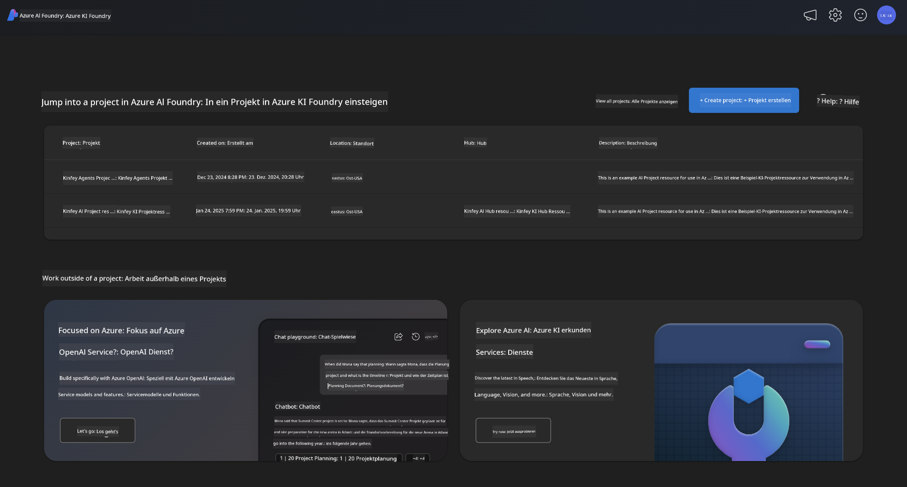
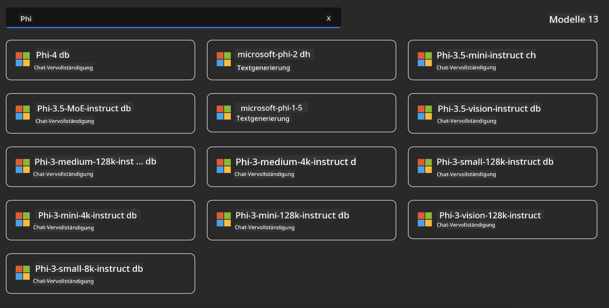

<!--
CO_OP_TRANSLATOR_METADATA:
{
  "original_hash": "3ae21dc5554e888defbe57946ee995ee",
  "translation_date": "2025-07-16T19:06:40+00:00",
  "source_file": "md/01.Introduction/02/03.AzureAIFoundry.md",
  "language_code": "de"
}
-->
## Phi-Familie in Azure AI Foundry

[Azure AI Foundry](https://ai.azure.com) ist eine vertrauenswürdige Plattform, die Entwickler dabei unterstützt, Innovationen voranzutreiben und die Zukunft mit KI sicher, geschützt und verantwortungsvoll zu gestalten.

[Azure AI Foundry](https://ai.azure.com) wurde für Entwickler entwickelt, um:

- Generative KI-Anwendungen auf einer unternehmensgerechten Plattform zu erstellen.
- Mit modernsten KI-Tools und ML-Modellen zu erkunden, zu entwickeln, zu testen und bereitzustellen – stets basierend auf verantwortungsvollen KI-Praktiken.
- Im Team zusammenzuarbeiten und den gesamten Lebenszyklus der Anwendungsentwicklung abzudecken.

Mit Azure AI Foundry können Sie eine Vielzahl von Modellen, Diensten und Funktionen entdecken und KI-Anwendungen entwickeln, die Ihre Ziele optimal unterstützen. Die Azure AI Foundry-Plattform ermöglicht eine einfache Skalierung, um Proof of Concepts in vollwertige Produktionsanwendungen zu verwandeln. Kontinuierliche Überwachung und Optimierung sorgen für langfristigen Erfolg.



Neben der Nutzung des Azure AOAI Service in Azure AI Foundry können Sie auch Modelle von Drittanbietern im Azure AI Foundry Model Catalog verwenden. Dies ist eine gute Wahl, wenn Sie Azure AI Foundry als Ihre KI-Lösungsplattform einsetzen möchten.

Wir können Phi-Familienmodelle schnell über den Model Catalog in Azure AI Foundry bereitstellen

[Microsoft Phi Models in Azure AI Foundry Models](https://ai.azure.com/explore/models/?selectedCollection=phi)



### **Phi-4 in Azure AI Foundry bereitstellen**


### **Phi-4 im Azure AI Foundry Playground testen**


### **Python-Code ausführen, um Azure AI Foundry Phi-4 aufzurufen**

```python

import os  
import base64
from openai import AzureOpenAI  
from azure.identity import DefaultAzureCredential, get_bearer_token_provider  
        
endpoint = os.getenv("ENDPOINT_URL", "Your Azure AOAI Service Endpoint")  
deployment = os.getenv("DEPLOYMENT_NAME", "Phi-4")  
      
token_provider = get_bearer_token_provider(  
    DefaultAzureCredential(),  
    "https://cognitiveservices.azure.com/.default"  
)  
  
client = AzureOpenAI(  
    azure_endpoint=endpoint,  
    azure_ad_token_provider=token_provider,  
    api_version="2024-05-01-preview",  
)  
  

chat_prompt = [
    {
        "role": "system",
        "content": "You are an AI assistant that helps people find information."
    },
    {
        "role": "user",
        "content": "can you introduce yourself"
    }
] 
    
# Include speech result if speech is enabled  
messages = chat_prompt 

completion = client.chat.completions.create(  
    model=deployment,  
    messages=messages,
    max_tokens=800,  
    temperature=0.7,  
    top_p=0.95,  
    frequency_penalty=0,  
    presence_penalty=0,
    stop=None,  
    stream=False  
)  
  
print(completion.to_json())  

```

**Haftungsausschluss**:  
Dieses Dokument wurde mit dem KI-Übersetzungsdienst [Co-op Translator](https://github.com/Azure/co-op-translator) übersetzt. Obwohl wir uns um Genauigkeit bemühen, beachten Sie bitte, dass automatisierte Übersetzungen Fehler oder Ungenauigkeiten enthalten können. Das Originaldokument in seiner Ursprungssprache gilt als maßgebliche Quelle. Für wichtige Informationen wird eine professionelle menschliche Übersetzung empfohlen. Wir übernehmen keine Haftung für Missverständnisse oder Fehlinterpretationen, die aus der Nutzung dieser Übersetzung entstehen.