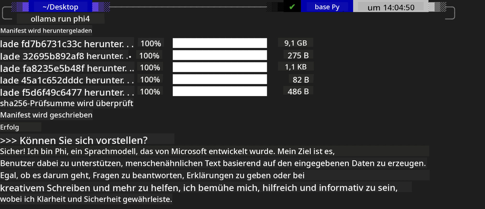

<!--
CO_OP_TRANSLATOR_METADATA:
{
  "original_hash": "0b38834693bb497f96bf53f0d941f9a1",
  "translation_date": "2025-05-07T10:39:34+00:00",
  "source_file": "md/01.Introduction/02/04.Ollama.md",
  "language_code": "de"
}
-->
## Phi-Familie in Ollama


[Ollama](https://ollama.com) ermöglicht es mehr Menschen, Open-Source-LLMs oder SLMs direkt über einfache Skripte bereitzustellen, und bietet zudem die Möglichkeit, APIs zu erstellen, die lokale Copilot-Anwendungsszenarien unterstützen.

## **1. Installation**

Ollama unterstützt die Ausführung unter Windows, macOS und Linux. Du kannst Ollama über diesen Link installieren ([https://ollama.com/download](https://ollama.com/download)). Nach erfolgreicher Installation kannst du direkt über ein Terminal-Fenster mit einem Ollama-Skript Phi-3 aufrufen. Eine Übersicht aller [verfügbaren Bibliotheken in Ollama](https://ollama.com/library) findest du hier. Wenn du dieses Repository in einem Codespace öffnest, ist Ollama bereits installiert.

```bash

ollama run phi4

```

> [!NOTE]
> Das Modell wird beim ersten Ausführen zunächst heruntergeladen. Du kannst natürlich auch direkt das heruntergeladene Phi-4-Modell angeben. Wir verwenden WSL als Beispiel, um den Befehl auszuführen. Sobald das Modell erfolgreich heruntergeladen ist, kannst du direkt im Terminal interagieren.



## **2. Aufruf der phi-4 API von Ollama**

Wenn du die von Ollama bereitgestellte Phi-4 API nutzen möchtest, kannst du den folgenden Befehl im Terminal verwenden, um den Ollama-Server zu starten.

```bash

ollama serve

```

> [!NOTE]
> Wenn du macOS oder Linux verwendest, kann der folgende Fehler auftreten: **"Error: listen tcp 127.0.0.1:11434: bind: address already in use"**. Dieser Fehler kann beim Ausführen des Befehls erscheinen. Du kannst ihn entweder ignorieren, da er meist bedeutet, dass der Server bereits läuft, oder Ollama stoppen und neu starten:

**macOS**

```bash

brew services restart ollama

```

**Linux**

```bash

sudo systemctl stop ollama

```

Ollama unterstützt zwei APIs: generate und chat. Je nach Bedarf kannst du die von Ollama bereitgestellte Modell-API nutzen, indem du Anfragen an den lokal auf Port 11434 laufenden Dienst sendest.

**Chat**

```bash

curl http://127.0.0.1:11434/api/chat -d '{
  "model": "phi3",
  "messages": [
    {
      "role": "system",
      "content": "Your are a python developer."
    },
    {
      "role": "user",
      "content": "Help me generate a bubble algorithm"
    }
  ],
  "stream": false
  
}'

This is the result in Postman


## Additional Resources

Check the list of available models in Ollama in [their library](https://ollama.com/library).

Pull your model from the Ollama server using this command

```bash
ollama pull phi4
```

Run the model using this command

```bash
ollama run phi4
```

***Note:*** Visit this link [https://github.com/ollama/ollama/blob/main/docs/api.md](https://github.com/ollama/ollama/blob/main/docs/api.md) to learn more

## Calling Ollama from Python

You can use `requests` or `urllib3` to make requests to the local server endpoints used above. However, a popular way to use Ollama in Python is via the [openai](https://pypi.org/project/openai/) SDK, since Ollama provides OpenAI-compatible server endpoints as well.

Here is an example for phi3-mini:

```python
import openai

client = openai.OpenAI(
    base_url="http://localhost:11434/v1",
    api_key="nokeyneeded",
)

response = client.chat.completions.create(
    model="phi4",
    temperature=0.7,
    n=1,
    messages=[
        {"role": "system", "content": "You are a helpful assistant."},
        {"role": "user", "content": "Write a haiku about a hungry cat"},
    ],
)

print("Response:")
print(response.choices[0].message.content)
```

## Calling Ollama from JavaScript 

```javascript
// Beispiel: Datei mit Phi-4 zusammenfassen
script({
    model: "ollama:phi4",
    title: "Zusammenfassung mit Phi-4",
    system: ["system"],
})

// Beispiel für Zusammenfassung
const file = def("FILE", env.files)
$`Fasse ${file} in einem einzigen Absatz zusammen.`
```

## Calling Ollama from C#

Create a new C# Console application and add the following NuGet package:

```bash
dotnet add package Microsoft.SemanticKernel --version 1.34.0
```

Then replace this code in the `Program.cs` file

```csharp
using Microsoft.SemanticKernel;
using Microsoft.SemanticKernel.ChatCompletion;

// Chat Completion Service mit lokalem Ollama-Server-Endpunkt hinzufügen
#pragma warning disable SKEXP0001, SKEXP0003, SKEXP0010, SKEXP0011, SKEXP0050, SKEXP0052
builder.AddOpenAIChatCompletion(
    modelId: "phi4",
    endpoint: new Uri("http://localhost:11434/"),
    apiKey: "non required");

// Einfachen Prompt an den Chat-Service senden
string prompt = "Write a joke about kittens";
var response = await kernel.InvokePromptAsync(prompt);
Console.WriteLine(response.GetValue<string>());
```

Run the app with the command:

```bash
dotnet run

**Haftungsausschluss**:  
Dieses Dokument wurde mit dem KI-Übersetzungsdienst [Co-op Translator](https://github.com/Azure/co-op-translator) übersetzt. Obwohl wir uns um Genauigkeit bemühen, beachten Sie bitte, dass automatisierte Übersetzungen Fehler oder Ungenauigkeiten enthalten können. Das Originaldokument in seiner Ursprungssprache ist als maßgebliche Quelle zu betrachten. Für wichtige Informationen wird eine professionelle menschliche Übersetzung empfohlen. Wir übernehmen keine Haftung für Missverständnisse oder Fehlinterpretationen, die durch die Nutzung dieser Übersetzung entstehen.