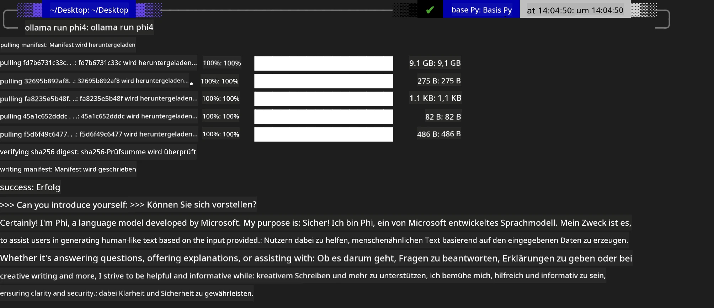
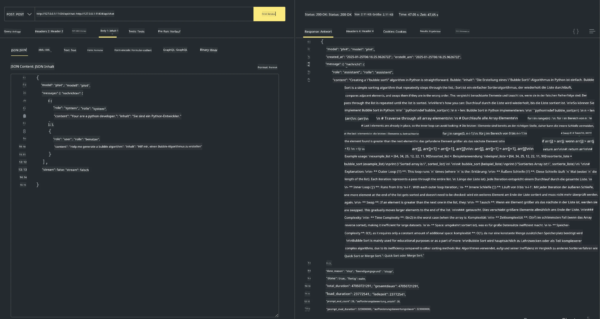

## Phi Family in Ollama


[Ollama](https://ollama.com) ermöglicht mehr Menschen, Open-Source-LLM oder SLM direkt über einfache Skripte bereitzustellen, und kann auch APIs erstellen, um lokale Copilot-Anwendungsszenarien zu unterstützen.

## **1. Installation**

Ollama unterstützt die Ausführung unter Windows, macOS und Linux. Sie können Ollama über diesen Link installieren ([https://ollama.com/download](https://ollama.com/download)). Nach erfolgreicher Installation können Sie das Ollama-Skript direkt verwenden, um Phi-3 über ein Terminalfenster aufzurufen. Sie können alle [verfügbaren Bibliotheken in Ollama](https://ollama.com/library) einsehen. Wenn Sie dieses Repository in einem Codespace öffnen, ist Ollama bereits installiert.

```bash

ollama run phi4

```

> [!NOTE]
> Das Modell wird beim ersten Ausführen zunächst heruntergeladen. Natürlich können Sie auch direkt das heruntergeladene Phi-4-Modell angeben. Wir nehmen WSL als Beispiel, um den Befehl auszuführen. Nachdem das Modell erfolgreich heruntergeladen wurde, können Sie direkt im Terminal interagieren.



## **2. Call the phi-4 API from Ollama**

Wenn Sie die von Ollama erzeugte Phi-4-API aufrufen möchten, können Sie diesen Befehl im Terminal verwenden, um den Ollama-Server zu starten.

```bash

ollama serve

```

> [!NOTE]
> If running MacOS or Linux, please note that you may encounter the following error **"Error: listen tcp 127.0.0.1:11434: bind: address already in use"** You may get this error when calling running the command. You can either ignore that error, since it typically indicates the server is already running, or you can stop the and restart Ollama:

**macOS**

```bash

brew services restart ollama

```

**Linux**

```bash

sudo systemctl stop ollama

```

Ollama unterstützt zwei API-Endpunkte: generate und chat. Sie können die von Ollama bereitgestellten Modell-APIs je nach Bedarf aufrufen, indem Sie Anfragen an den lokalen Dienst senden, der auf Port 11434 ausgeführt wird.

**Chat**

```bash

curl http://127.0.0.1:11434/api/chat -d '{
  "model": "phi3",
  "messages": [
    {
      "role": "system",
      "content": "Your are a python developer."
    },
    {
      "role": "user",
      "content": "Help me generate a bubble algorithm"
    }
  ],
  "stream": false
  
}'
```

Dies ist das Ergebnis in Postman



## Additional Resources

Prüfen Sie die Liste der verfügbaren Modelle in Ollama in [ihrer Bibliothek](https://ollama.com/library).

Ziehen Sie Ihr Modell vom Ollama-Server mit diesem Befehl

```bash
ollama pull phi4
```

Führen Sie das Modell mit diesem Befehl aus

```bash
ollama run phi4
```

***Hinweis:*** Besuchen Sie diesen Link [https://github.com/ollama/ollama/blob/main/docs/api.md](https://github.com/ollama/ollama/blob/main/docs/api.md), um mehr zu erfahren

## Calling Ollama from Python

Sie können `requests` oder `urllib3` verwenden, um Anfragen an die oben verwendeten lokalen Serverendpunkte zu stellen. Eine beliebte Möglichkeit, Ollama in Python zu verwenden, ist jedoch über das [openai](https://pypi.org/project/openai/) SDK, da Ollama auch OpenAI-kompatible Serverendpunkte bereitstellt.

Here is an example for phi3-mini:

```python
import openai

client = openai.OpenAI(
    base_url="http://localhost:11434/v1",
    api_key="nokeyneeded",
)

response = client.chat.completions.create(
    model="phi4",
    temperature=0.7,
    n=1,
    messages=[
        {"role": "system", "content": "You are a helpful assistant."},
        {"role": "user", "content": "Write a haiku about a hungry cat"},
    ],
)

print("Response:")
print(response.choices[0].message.content)
```

## Calling Ollama from JavaScript 

```javascript
// Beispiel für das Zusammenfassen einer Datei mit Phi-4
script({
    model: "ollama:phi4",
    title: "Summarize with Phi-4",
    system: ["system"],
})

// Beispiel für das Zusammenfassen
const file = def("FILE", env.files)
$`Summarize ${file} in a single paragraph.`
```

## Calling Ollama from C#

Erstellen Sie eine neue C#-Konsolenanwendung und fügen Sie das folgende NuGet-Paket hinzu:

```bash
dotnet add package Microsoft.SemanticKernel --version 1.34.0
```

Dann ersetzen Sie diesen Code in der Datei `Program.cs`

```csharp
using Microsoft.SemanticKernel;
using Microsoft.SemanticKernel.ChatCompletion;

// add chat completion service using the local ollama server endpoint
#pragma warning disable SKEXP0001, SKEXP0003, SKEXP0010, SKEXP0011, SKEXP0050, SKEXP0052
builder.AddOpenAIChatCompletion(
    modelId: "phi4",
    endpoint: new Uri("http://localhost:11434/"),
    apiKey: "non required");

// invoke a simple prompt to the chat service
string prompt = "Write a joke about kittens";
var response = await kernel.InvokePromptAsync(prompt);
Console.WriteLine(response.GetValue<string>());
```

Führen Sie die App mit dem Befehl aus:

```bash
dotnet run
```

---

<!-- CO-OP TRANSLATOR DISCLAIMER START -->
Haftungsausschluss:
Dieses Dokument wurde mit dem KI-Übersetzungsdienst [Co-op Translator](https://github.com/Azure/co-op-translator) übersetzt. Obwohl wir um Genauigkeit bemüht sind, beachten Sie bitte, dass automatisierte Übersetzungen Fehler oder Ungenauigkeiten enthalten können. Das Originaldokument in seiner Ausgangssprache gilt als maßgebliche Quelle. Für kritische Informationen wird eine professionelle menschliche Übersetzung empfohlen. Wir übernehmen keine Haftung für Missverständnisse oder Fehlinterpretationen, die sich aus der Verwendung dieser Übersetzung ergeben.
<!-- CO-OP TRANSLATOR DISCLAIMER END -->