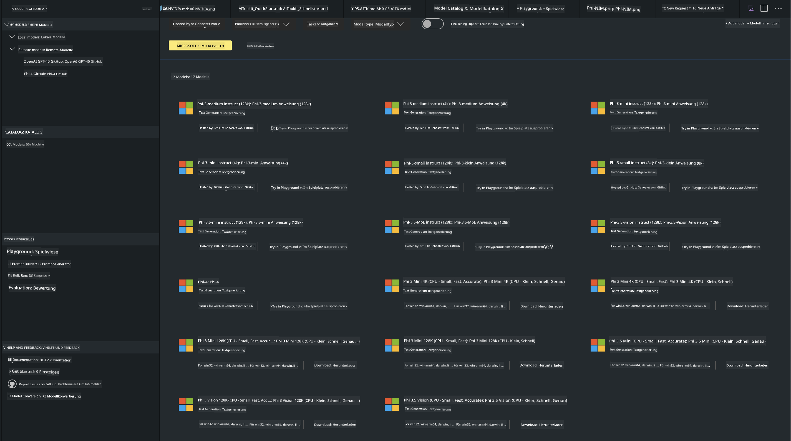
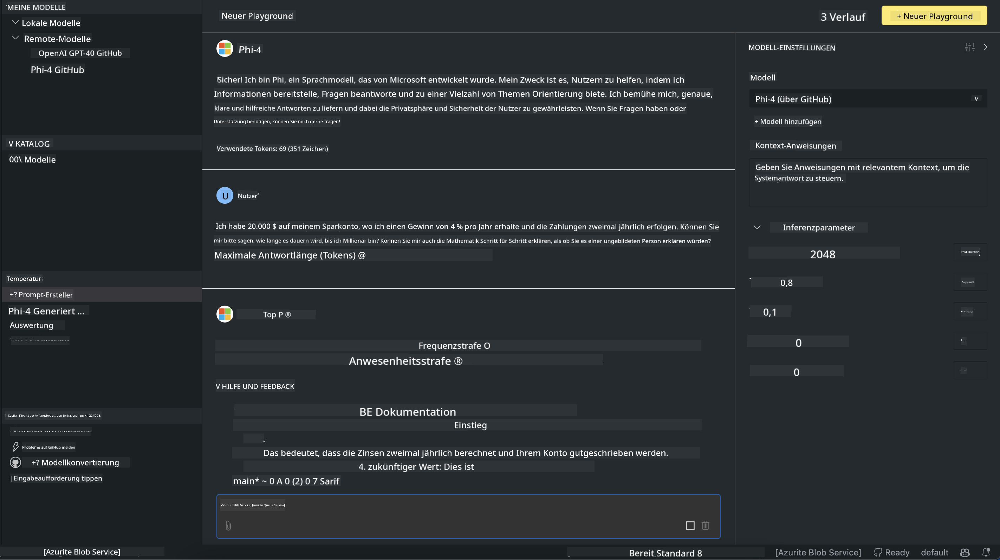

<!--
CO_OP_TRANSLATOR_METADATA:
{
  "original_hash": "4951d458c0b60c02cd1e751b40903877",
  "translation_date": "2025-05-07T10:37:39+00:00",
  "source_file": "md/01.Introduction/02/05.AITK.md",
  "language_code": "de"
}
-->
# Phi Family in AITK

[AI Toolkit for VS Code](https://marketplace.visualstudio.com/items?itemName=ms-windows-ai-studio.windows-ai-studio) erleichtert die Entwicklung generativer KI-Anwendungen, indem es modernste KI-Entwicklungswerkzeuge und Modelle aus dem Azure AI Foundry Catalog sowie anderen Katalogen wie Hugging Face zusammenführt. Sie können den KI-Modellkatalog durchsuchen, der von GitHub Models und Azure AI Foundry Model Catalogs unterstützt wird, die Modelle lokal oder remote herunterladen, feinabstimmen, testen und in Ihrer Anwendung verwenden.

Die AI Toolkit Preview läuft lokal. Lokale Inferenz oder Feinabstimmung hängt vom ausgewählten Modell ab; möglicherweise benötigen Sie eine GPU wie eine NVIDIA CUDA GPU. Sie können GitHub Models auch direkt mit AITK ausführen.

## Erste Schritte

[Erfahren Sie mehr darüber, wie Sie das Windows-Subsystem für Linux installieren](https://learn.microsoft.com/windows/wsl/install?WT.mc_id=aiml-137032-kinfeylo)

und [wie Sie die Standarddistribution ändern](https://learn.microsoft.com/windows/wsl/install#change-the-default-linux-distribution-installed).

[AI Toolkit GitHub Repository](https://github.com/microsoft/vscode-ai-toolkit/)

- Windows, Linux, macOS

- Für die Feinabstimmung unter Windows und Linux benötigen Sie eine Nvidia GPU. Zusätzlich erfordert **Windows** das Windows-Subsystem für Linux mit Ubuntu-Version 18.4 oder höher. [Erfahren Sie mehr über die Installation des Windows-Subsystems für Linux](https://learn.microsoft.com/windows/wsl/install) und [das Ändern der Standarddistribution](https://learn.microsoft.com/windows/wsl/install#change-the-default-linux-distribution-installed).

### AI Toolkit installieren

Das AI Toolkit wird als [Visual Studio Code Extension](https://code.visualstudio.com/docs/setup/additional-components#_vs-code-extensions) ausgeliefert. Daher müssen Sie zunächst [VS Code](https://code.visualstudio.com/docs/setup/windows?WT.mc_id=aiml-137032-kinfeylo) installieren und das AI Toolkit aus dem [VS Marketplace](https://marketplace.visualstudio.com/items?itemName=ms-windows-ai-studio.windows-ai-studio) herunterladen.  
Das [AI Toolkit ist im Visual Studio Marketplace verfügbar](https://marketplace.visualstudio.com/items?itemName=ms-windows-ai-studio.windows-ai-studio) und kann wie jede andere VS Code-Erweiterung installiert werden.

Wenn Sie mit der Installation von VS Code-Erweiterungen nicht vertraut sind, befolgen Sie diese Schritte:

### Anmelden

1. Wählen Sie in der Aktivitätsleiste von VS Code **Extensions** aus  
1. Geben Sie in der Suchleiste "AI Toolkit" ein  
1. Wählen Sie "AI Toolkit for Visual Studio code" aus  
1. Klicken Sie auf **Install**

Nun sind Sie bereit, die Erweiterung zu verwenden!

Sie werden aufgefordert, sich bei GitHub anzumelden. Bitte klicken Sie auf "Allow", um fortzufahren. Sie werden zur GitHub-Anmeldeseite weitergeleitet.

Bitte melden Sie sich an und folgen Sie den Anweisungen. Nach erfolgreichem Abschluss werden Sie zu VS Code zurückgeleitet.

Nach der Installation der Erweiterung erscheint das AI Toolkit-Symbol in Ihrer Aktivitätsleiste.

Lassen Sie uns die verfügbaren Aktionen erkunden!

### Verfügbare Aktionen

Die Hauptseitenleiste des AI Toolkit ist unterteilt in

- **Models**  
- **Resources**  
- **Playground**  
- **Fine-tuning**  
- **Evaluation**

Diese finden Sie im Bereich Resources. Um zu beginnen, wählen Sie **Model Catalog** aus.

### Ein Modell aus dem Katalog herunterladen

Wenn Sie das AI Toolkit über die Seitenleiste von VS Code starten, können Sie aus den folgenden Optionen wählen:



- Finden Sie ein unterstütztes Modell im **Model Catalog** und laden Sie es lokal herunter  
- Testen Sie die Modellinferenz im **Model Playground**  
- Feinabstimmung des Modells lokal oder remote im **Model Fine-tuning**  
- Bereitstellung feinabgestimmter Modelle in der Cloud über die Befehls-Palette des AI Toolkit  
- Evaluation von Modellen

> [!NOTE]
>
> **GPU vs. CPU**
>
> Sie werden feststellen, dass die Modellkarten die Modellgröße, die Plattform und den Beschleunigertyp (CPU, GPU) anzeigen. Für eine optimierte Leistung auf **Windows-Geräten mit mindestens einer GPU** wählen Sie Modellversionen, die nur auf Windows abzielen.
>
> Dies stellt sicher, dass Sie ein Modell haben, das für den DirectML-Beschleuniger optimiert ist.
>
> Die Modellnamen haben das Format
>
> - `{model_name}-{accelerator}-{quantization}-{format}`.
>
>Um zu überprüfen, ob Ihr Windows-Gerät über eine GPU verfügt, öffnen Sie den **Task-Manager** und wählen Sie den Reiter **Leistung**. Wenn GPUs vorhanden sind, werden sie unter Namen wie "GPU 0" oder "GPU 1" aufgeführt.

### Modell im Playground ausführen

Nachdem alle Parameter festgelegt sind, klicken Sie auf **Generate Project**.

Sobald Ihr Modell heruntergeladen wurde, wählen Sie auf der Modellkarte im Katalog **Load in Playground**:

- Starten Sie den Modell-Download  
- Installieren Sie alle Voraussetzungen und Abhängigkeiten  
- Erstellen Sie einen VS Code-Arbeitsbereich



### REST API in Ihrer Anwendung verwenden

Das AI Toolkit enthält einen lokalen REST API-Webserver **auf Port 5272**, der das [OpenAI Chat Completions Format](https://platform.openai.com/docs/api-reference/chat/create) verwendet.

So können Sie Ihre Anwendung lokal testen, ohne auf einen Cloud-KI-Modellservice angewiesen zu sein. Zum Beispiel zeigt die folgende JSON-Datei, wie der Body der Anfrage konfiguriert wird:

```json
{
    "model": "Phi-4",
    "messages": [
        {
            "role": "user",
            "content": "what is the golden ratio?"
        }
    ],
    "temperature": 0.7,
    "top_p": 1,
    "top_k": 10,
    "max_tokens": 100,
    "stream": true
}
```

Sie können die REST API mit Tools wie [Postman](https://www.postman.com/) oder dem CURL-Utility testen:

```bash
curl -vX POST http://127.0.0.1:5272/v1/chat/completions -H 'Content-Type: application/json' -d @body.json
```

### Verwendung der OpenAI-Clientbibliothek für Python

```python
from openai import OpenAI

client = OpenAI(
    base_url="http://127.0.0.1:5272/v1/", 
    api_key="x" # required for the API but not used
)

chat_completion = client.chat.completions.create(
    messages=[
        {
            "role": "user",
            "content": "what is the golden ratio?",
        }
    ],
    model="Phi-4",
)

print(chat_completion.choices[0].message.content)
```

### Verwendung der Azure OpenAI-Clientbibliothek für .NET

Fügen Sie die [Azure OpenAI-Clientbibliothek für .NET](https://www.nuget.org/packages/Azure.AI.OpenAI/) über NuGet zu Ihrem Projekt hinzu:

```bash
dotnet add {project_name} package Azure.AI.OpenAI --version 1.0.0-beta.17
```

Fügen Sie eine C#-Datei namens **OverridePolicy.cs** zu Ihrem Projekt hinzu und fügen Sie folgenden Code ein:

```csharp
// OverridePolicy.cs
using Azure.Core.Pipeline;
using Azure.Core;

internal partial class OverrideRequestUriPolicy(Uri overrideUri)
    : HttpPipelineSynchronousPolicy
{
    private readonly Uri _overrideUri = overrideUri;

    public override void OnSendingRequest(HttpMessage message)
    {
        message.Request.Uri.Reset(_overrideUri);
    }
}
```

Fügen Sie anschließend den folgenden Code in Ihre **Program.cs**-Datei ein:

```csharp
// Program.cs
using Azure.AI.OpenAI;

Uri localhostUri = new("http://localhost:5272/v1/chat/completions");

OpenAIClientOptions clientOptions = new();
clientOptions.AddPolicy(
    new OverrideRequestUriPolicy(localhostUri),
    Azure.Core.HttpPipelinePosition.BeforeTransport);
OpenAIClient client = new(openAIApiKey: "unused", clientOptions);

ChatCompletionsOptions options = new()
{
    DeploymentName = "Phi-4",
    Messages =
    {
        new ChatRequestSystemMessage("You are a helpful assistant. Be brief and succinct."),
        new ChatRequestUserMessage("What is the golden ratio?"),
    }
};

StreamingResponse<StreamingChatCompletionsUpdate> streamingChatResponse
    = await client.GetChatCompletionsStreamingAsync(options);

await foreach (StreamingChatCompletionsUpdate chatChunk in streamingChatResponse)
{
    Console.Write(chatChunk.ContentUpdate);
}
```


## Feinabstimmung mit AI Toolkit

- Einstieg in Modellsuche und Playground  
- Modell-Feinabstimmung und Inferenz mit lokalen Rechenressourcen  
- Remote-Feinabstimmung und Inferenz mit Azure-Ressourcen

[Feinabstimmung mit AI Toolkit](../../03.FineTuning/Finetuning_VSCodeaitoolkit.md)

## AI Toolkit Q&A Ressourcen

Bitte konsultieren Sie unsere [Q&A-Seite](https://github.com/microsoft/vscode-ai-toolkit/blob/main/archive/QA.md) für häufige Probleme und Lösungen

**Haftungsausschluss**:  
Dieses Dokument wurde mithilfe des KI-Übersetzungsdienstes [Co-op Translator](https://github.com/Azure/co-op-translator) übersetzt. Obwohl wir auf Genauigkeit achten, beachten Sie bitte, dass automatisierte Übersetzungen Fehler oder Ungenauigkeiten enthalten können. Das Originaldokument in seiner Ursprungssprache ist als maßgebliche Quelle zu betrachten. Für wichtige Informationen wird eine professionelle menschliche Übersetzung empfohlen. Wir übernehmen keine Haftung für Missverständnisse oder Fehlinterpretationen, die aus der Nutzung dieser Übersetzung entstehen.