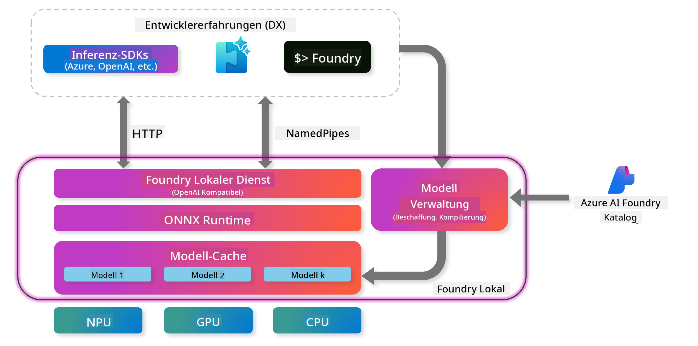
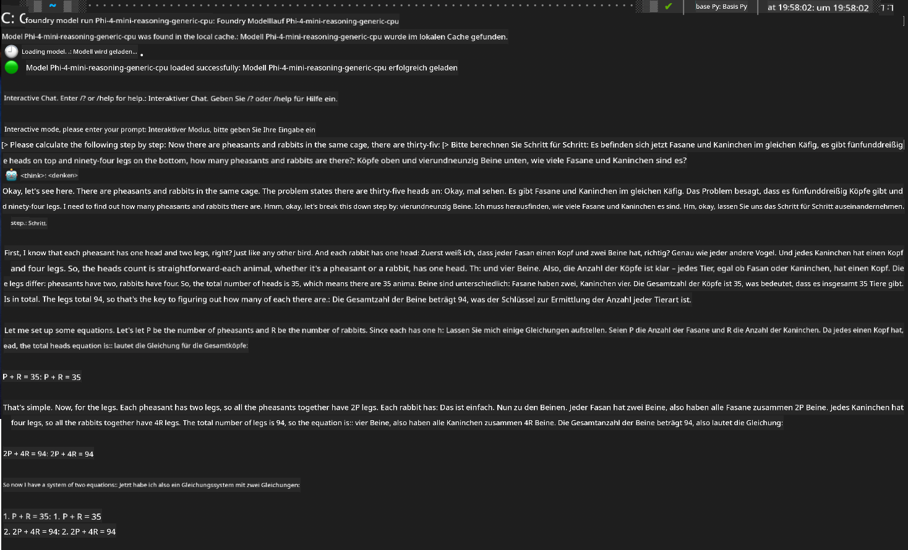

<!--
CO_OP_TRANSLATOR_METADATA:
{
  "original_hash": "52973a5680a65a810aa80b7036afd31f",
  "translation_date": "2025-07-16T19:41:48+00:00",
  "source_file": "md/01.Introduction/02/07.FoundryLocal.md",
  "language_code": "de"
}
-->
## Einstieg in Phi-Family-Modelle mit Foundry Local

### Einführung in Foundry Local

Foundry Local ist eine leistungsstarke On-Device-AI-Inferenzlösung, die KI-Funktionen in Unternehmensqualität direkt auf Ihre lokale Hardware bringt. Dieses Tutorial führt Sie durch die Einrichtung und Nutzung von Phi-Family-Modellen mit Foundry Local und bietet Ihnen volle Kontrolle über Ihre KI-Workloads bei gleichzeitiger Wahrung der Privatsphäre und Kostensenkung.

Foundry Local bietet Vorteile in Bezug auf Leistung, Datenschutz, Anpassung und Kosten, indem KI-Modelle lokal auf Ihrem Gerät ausgeführt werden. Es lässt sich nahtlos in Ihre bestehenden Workflows und Anwendungen integrieren – über eine intuitive CLI, ein SDK und eine REST-API.




### Warum Foundry Local wählen?

Die Vorteile von Foundry Local zu kennen, hilft Ihnen, fundierte Entscheidungen für Ihre KI-Strategie zu treffen:

- **On-Device-Inferenz:** Führen Sie Modelle lokal auf Ihrer eigenen Hardware aus, senken Sie Ihre Kosten und behalten Sie alle Daten auf Ihrem Gerät.

- **Modellanpassung:** Wählen Sie aus voreingestellten Modellen oder verwenden Sie eigene, um spezifische Anforderungen und Anwendungsfälle abzudecken.

- **Kosteneffizienz:** Vermeiden Sie wiederkehrende Cloud-Service-Kosten, indem Sie Ihre vorhandene Hardware nutzen und KI so zugänglicher machen.

- **Nahtlose Integration:** Verbinden Sie sich mit Ihren Anwendungen über SDK, API-Endpunkte oder die CLI und skalieren Sie bei Bedarf einfach zu Azure AI Foundry.

> **Getting Started Note:** Dieses Tutorial konzentriert sich auf die Nutzung von Foundry Local über CLI- und SDK-Schnittstellen. Sie lernen beide Ansätze kennen, um die beste Methode für Ihren Anwendungsfall zu wählen.

## Teil 1: Einrichtung der Foundry Local CLI

### Schritt 1: Installation

Die Foundry Local CLI ist Ihr Einstiegspunkt, um KI-Modelle lokal zu verwalten und auszuführen. Beginnen wir mit der Installation auf Ihrem System.

**Unterstützte Plattformen:** Windows und macOS

Detaillierte Installationsanweisungen finden Sie in der [offiziellen Foundry Local Dokumentation](https://github.com/microsoft/Foundry-Local/blob/main/README.md).

### Schritt 2: Verfügbare Modelle erkunden

Nachdem Sie die Foundry Local CLI installiert haben, können Sie herausfinden, welche Modelle für Ihren Anwendungsfall verfügbar sind. Mit diesem Befehl sehen Sie alle unterstützten Modelle:


```bash
foundry model list
```

### Schritt 3: Phi Family Modelle verstehen

Die Phi Family bietet eine Reihe von Modellen, die für verschiedene Anwendungsfälle und Hardwarekonfigurationen optimiert sind. Hier sind die in Foundry Local verfügbaren Phi-Modelle:

**Verfügbare Phi-Modelle:** 

- **phi-3.5-mini** – Kompaktes Modell für einfache Aufgaben
- **phi-3-mini-128k** – Version mit erweitertem Kontext für längere Gespräche
- **phi-3-mini-4k** – Standard-Kontextmodell für allgemeine Nutzung
- **phi-4** – Fortgeschrittenes Modell mit verbesserten Fähigkeiten
- **phi-4-mini** – Leichtgewichtige Version von Phi-4
- **phi-4-mini-reasoning** – Speziell für komplexe logische Aufgaben

> **Hardware-Kompatibilität:** Jedes Modell kann je nach Systemfähigkeiten für unterschiedliche Hardwarebeschleunigung (CPU, GPU) konfiguriert werden.

### Schritt 4: Ihr erstes Phi-Modell ausführen

Starten wir mit einem praktischen Beispiel. Wir führen das Modell `phi-4-mini-reasoning` aus, das besonders gut darin ist, komplexe Probleme Schritt für Schritt zu lösen.


**Befehl zum Ausführen des Modells:**

```bash
foundry model run Phi-4-mini-reasoning-generic-cpu
```

> **Erstmalige Einrichtung:** Beim ersten Ausführen eines Modells lädt Foundry Local es automatisch auf Ihr lokales Gerät herunter. Die Downloadzeit hängt von Ihrer Netzwerkgeschwindigkeit ab, bitte haben Sie während der Erstinstallation etwas Geduld.

### Schritt 5: Modell mit einem echten Problem testen

Testen wir nun unser Modell mit einem klassischen Logikproblem, um zu sehen, wie es Schritt-für-Schritt-Argumentation anwendet:

**Beispielproblem:**

```txt
Please calculate the following step by step: Now there are pheasants and rabbits in the same cage, there are thirty-five heads on top and ninety-four legs on the bottom, how many pheasants and rabbits are there?
```

**Erwartetes Verhalten:** Das Modell sollte dieses Problem in logische Schritte zerlegen und dabei die Tatsache nutzen, dass Fasane 2 Beine und Kaninchen 4 Beine haben, um das Gleichungssystem zu lösen.

**Ergebnisse:**



## Teil 2: Anwendungen mit Foundry Local SDK entwickeln

### Warum das SDK verwenden?

Während die CLI ideal für Tests und schnelle Interaktionen ist, ermöglicht das SDK die programmatische Integration von Foundry Local in Ihre Anwendungen. Das eröffnet Möglichkeiten für:

- Entwicklung maßgeschneiderter KI-basierter Anwendungen
- Erstellung automatisierter Workflows
- Integration von KI-Funktionen in bestehende Systeme
- Entwicklung von Chatbots und interaktiven Tools

### Unterstützte Programmiersprachen

Foundry Local bietet SDK-Unterstützung für mehrere Programmiersprachen, passend zu Ihren Entwicklungspräferenzen:

**📦 Verfügbare SDKs:**

- **C# (.NET):** [SDK-Dokumentation & Beispiele](https://github.com/microsoft/Foundry-Local/tree/main/sdk/cs)
- **Python:** [SDK-Dokumentation & Beispiele](https://github.com/microsoft/Foundry-Local/tree/main/sdk/python)
- **JavaScript:** [SDK-Dokumentation & Beispiele](https://github.com/microsoft/Foundry-Local/tree/main/sdk/js)
- **Rust:** [SDK-Dokumentation & Beispiele](https://github.com/microsoft/Foundry-Local/tree/main/sdk/rust)

### Nächste Schritte

1. **Wählen Sie das passende SDK** entsprechend Ihrer Entwicklungsumgebung
2. **Folgen Sie der SDK-spezifischen Dokumentation** für detaillierte Implementierungsanleitungen
3. **Beginnen Sie mit einfachen Beispielen**, bevor Sie komplexe Anwendungen entwickeln
4. **Erkunden Sie den Beispielcode**, der in jedem SDK-Repository bereitgestellt wird

## Fazit

Sie haben nun gelernt:
- ✅ Foundry Local CLI zu installieren und einzurichten
- ✅ Phi Family Modelle zu entdecken und auszuführen
- ✅ Modelle mit realen Problemen zu testen
- ✅ SDK-Optionen für die Anwendungsentwicklung zu verstehen

Foundry Local bietet eine leistungsstarke Grundlage, um KI-Funktionen direkt in Ihre lokale Umgebung zu bringen. So behalten Sie die Kontrolle über Leistung, Datenschutz und Kosten und behalten gleichzeitig die Flexibilität, bei Bedarf in Cloud-Lösungen zu skalieren.

**Haftungsausschluss**:  
Dieses Dokument wurde mit dem KI-Übersetzungsdienst [Co-op Translator](https://github.com/Azure/co-op-translator) übersetzt. Obwohl wir uns um Genauigkeit bemühen, beachten Sie bitte, dass automatisierte Übersetzungen Fehler oder Ungenauigkeiten enthalten können. Das Originaldokument in seiner Ursprungssprache ist als maßgebliche Quelle zu betrachten. Für wichtige Informationen wird eine professionelle menschliche Übersetzung empfohlen. Wir übernehmen keine Haftung für Missverständnisse oder Fehlinterpretationen, die aus der Nutzung dieser Übersetzung entstehen.