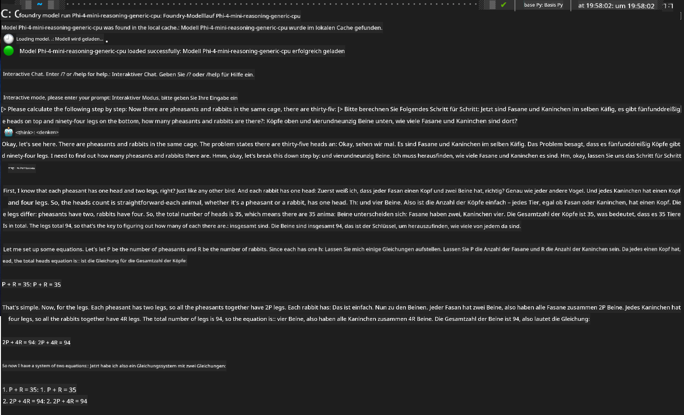

<!--
CO_OP_TRANSLATOR_METADATA:
{
  "original_hash": "52973a5680a65a810aa80b7036afd31f",
  "translation_date": "2025-06-27T13:31:43+00:00",
  "source_file": "md/01.Introduction/02/07.FoundryLocal.md",
  "language_code": "de"
}
-->
## Einstieg in Phi-Family-Modelle mit Foundry Local

### Einführung in Foundry Local

Foundry Local ist eine leistungsstarke On-Device-AI-Inferenzlösung, die KI-Funktionen in Unternehmensqualität direkt auf Ihre lokale Hardware bringt. Dieses Tutorial führt Sie durch die Einrichtung und Nutzung von Phi-Family-Modellen mit Foundry Local und bietet Ihnen vollständige Kontrolle über Ihre KI-Workloads bei gleichzeitiger Wahrung der Privatsphäre und Kostensenkung.

Foundry Local bietet Vorteile in Leistung, Datenschutz, Anpassung und Kosten, indem KI-Modelle lokal auf Ihrem Gerät ausgeführt werden. Es lässt sich nahtlos in Ihre bestehenden Workflows und Anwendungen integrieren – über eine intuitive CLI, SDK und REST API.


### Warum Foundry Local wählen?

Die Vorteile von Foundry Local zu kennen, hilft Ihnen dabei, fundierte Entscheidungen für Ihre KI-Einsatzstrategie zu treffen:

- **On-Device-Inferenz:** Führen Sie Modelle lokal auf Ihrer eigenen Hardware aus, reduzieren Sie Kosten und behalten Sie alle Daten auf Ihrem Gerät.

- **Modellanpassung:** Wählen Sie aus voreingestellten Modellen oder nutzen Sie eigene Modelle, um spezifische Anforderungen und Anwendungsfälle abzudecken.

- **Kosteneffizienz:** Vermeiden Sie wiederkehrende Cloud-Service-Kosten, indem Sie Ihre vorhandene Hardware verwenden – so wird KI zugänglicher.

- **Nahtlose Integration:** Verbinden Sie sich mit Ihren Anwendungen über SDK, API-Endpunkte oder die CLI und skalieren Sie bei Bedarf problemlos zu Azure AI Foundry.

> **Getting Started Note:** Dieses Tutorial konzentriert sich auf die Nutzung von Foundry Local über CLI- und SDK-Schnittstellen. Sie lernen beide Methoden kennen, um die beste Lösung für Ihren Anwendungsfall auszuwählen.

## Teil 1: Einrichtung der Foundry Local CLI

### Schritt 1: Installation

Die Foundry Local CLI ist Ihr Einstiegspunkt, um KI-Modelle lokal zu verwalten und auszuführen. Beginnen wir mit der Installation auf Ihrem System.

**Unterstützte Plattformen:** Windows und macOS

Detaillierte Installationsanweisungen finden Sie in der [offiziellen Foundry Local Dokumentation](https://github.com/microsoft/Foundry-Local/blob/main/README.md).

### Schritt 2: Verfügbare Modelle erkunden

Nachdem Sie die Foundry Local CLI installiert haben, können Sie herausfinden, welche Modelle für Ihren Anwendungsfall verfügbar sind. Mit diesem Befehl sehen Sie alle unterstützten Modelle:


```bash
foundry model list
```

### Schritt 3: Phi Family Modelle verstehen

Die Phi Family bietet eine Reihe von Modellen, die für unterschiedliche Anwendungsfälle und Hardwarekonfigurationen optimiert sind. Hier sind die in Foundry Local verfügbaren Phi-Modelle:

**Verfügbare Phi-Modelle:** 

- **phi-3.5-mini** – Kompaktes Modell für einfache Aufgaben
- **phi-3-mini-128k** – Version mit erweitertem Kontext für längere Gespräche
- **phi-3-mini-4k** – Standardmodell mit mittlerem Kontext für allgemeine Nutzung
- **phi-4** – Fortgeschrittenes Modell mit verbesserten Fähigkeiten
- **phi-4-mini** – Leichtgewichtige Variante von Phi-4
- **phi-4-mini-reasoning** – Speziell für komplexe logische Aufgaben

> **Hardware-Kompatibilität:** Jedes Modell kann je nach Systemkapazität für verschiedene Hardwarebeschleunigungen (CPU, GPU) konfiguriert werden.

### Schritt 4: Ihr erstes Phi-Modell ausführen

Beginnen wir mit einem praktischen Beispiel. Wir führen das Modell `phi-4-mini-reasoning` aus, das sich besonders gut für die schrittweise Lösung komplexer Probleme eignet.


**Befehl zum Ausführen des Modells:**

```bash
foundry model run Phi-4-mini-reasoning-generic-cpu
```

> **Erstmalige Einrichtung:** Beim ersten Ausführen eines Modells lädt Foundry Local dieses automatisch auf Ihr Gerät herunter. Die Downloadzeit hängt von Ihrer Netzwerkgeschwindigkeit ab, bitte haben Sie während der Einrichtung etwas Geduld.

### Schritt 5: Modell mit einem echten Problem testen

Testen wir nun unser Modell mit einem klassischen Logikproblem, um zu sehen, wie es schrittweises logisches Denken anwendet:

**Beispielproblem:**

```txt
Please calculate the following step by step: Now there are pheasants and rabbits in the same cage, there are thirty-five heads on top and ninety-four legs on the bottom, how many pheasants and rabbits are there?
```

**Erwartetes Verhalten:** Das Modell sollte dieses Problem in logische Schritte zerlegen und dabei die Tatsache nutzen, dass Fasane 2 Beine und Kaninchen 4 Beine haben, um das Gleichungssystem zu lösen.

**Ergebnisse:**



## Teil 2: Anwendungen mit Foundry Local SDK entwickeln

### Warum das SDK verwenden?

Während die CLI ideal für Tests und schnelle Interaktionen ist, ermöglicht das SDK die programmgesteuerte Integration von Foundry Local in Ihre Anwendungen. Dadurch eröffnen sich Möglichkeiten wie:

- Entwicklung maßgeschneiderter KI-gestützter Anwendungen
- Erstellung automatisierter Workflows
- Einbindung von KI-Funktionen in bestehende Systeme
- Entwicklung von Chatbots und interaktiven Tools

### Unterstützte Programmiersprachen

Foundry Local bietet SDK-Unterstützung für mehrere Programmiersprachen, um Ihren Entwicklungspräferenzen gerecht zu werden:

**📦 Verfügbare SDKs:**

- **C# (.NET):** [SDK-Dokumentation & Beispiele](https://github.com/microsoft/Foundry-Local/tree/main/sdk/cs)
- **Python:** [SDK-Dokumentation & Beispiele](https://github.com/microsoft/Foundry-Local/tree/main/sdk/python)
- **JavaScript:** [SDK-Dokumentation & Beispiele](https://github.com/microsoft/Foundry-Local/tree/main/sdk/js)
- **Rust:** [SDK-Dokumentation & Beispiele](https://github.com/microsoft/Foundry-Local/tree/main/sdk/rust)

### Nächste Schritte

1. **Wählen Sie das für Sie passende SDK** basierend auf Ihrer Entwicklungsumgebung
2. **Folgen Sie der SDK-spezifischen Dokumentation** für detaillierte Implementierungsanleitungen
3. **Starten Sie mit einfachen Beispielen**, bevor Sie komplexe Anwendungen entwickeln
4. **Erkunden Sie den Beispielcode**, der in jedem SDK-Repository bereitgestellt wird

## Fazit

Sie haben jetzt gelernt, wie Sie:
- ✅ Foundry Local CLI installieren und einrichten
- ✅ Phi Family Modelle entdecken und ausführen
- ✅ Modelle mit realen Problemen testen
- ✅ SDK-Optionen für die Anwendungsentwicklung verstehen

Foundry Local bietet eine leistungsstarke Grundlage, um KI-Funktionen direkt in Ihre lokale Umgebung zu bringen. So behalten Sie die Kontrolle über Leistung, Datenschutz und Kosten und bleiben gleichzeitig flexibel, bei Bedarf auf Cloud-Lösungen zu skalieren.

**Haftungsausschluss**:  
Dieses Dokument wurde mit dem KI-Übersetzungsdienst [Co-op Translator](https://github.com/Azure/co-op-translator) übersetzt. Obwohl wir uns um Genauigkeit bemühen, beachten Sie bitte, dass automatisierte Übersetzungen Fehler oder Ungenauigkeiten enthalten können. Das Originaldokument in seiner ursprünglichen Sprache ist als maßgebliche Quelle zu betrachten. Für wichtige Informationen wird eine professionelle menschliche Übersetzung empfohlen. Wir übernehmen keine Haftung für Missverständnisse oder Fehlinterpretationen, die durch die Verwendung dieser Übersetzung entstehen.