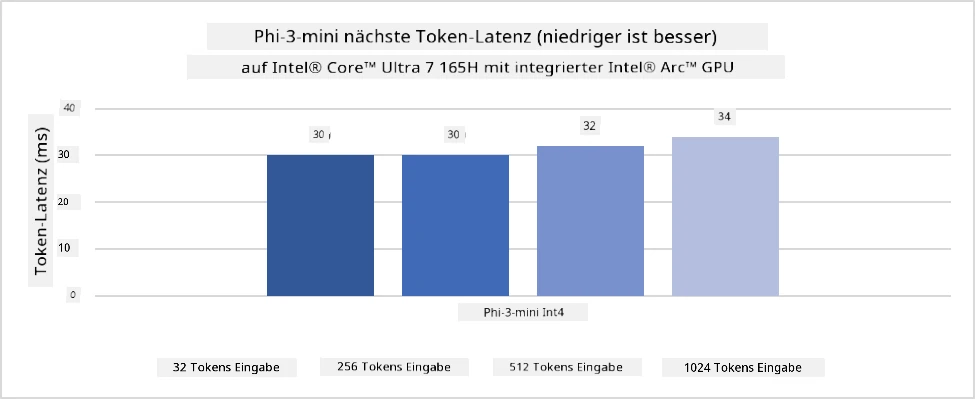
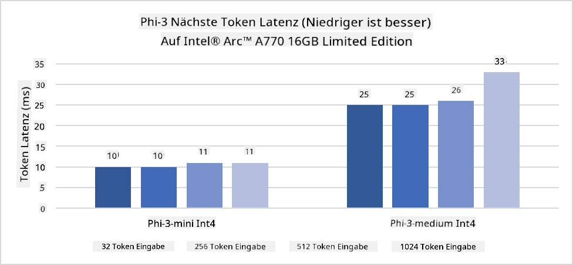
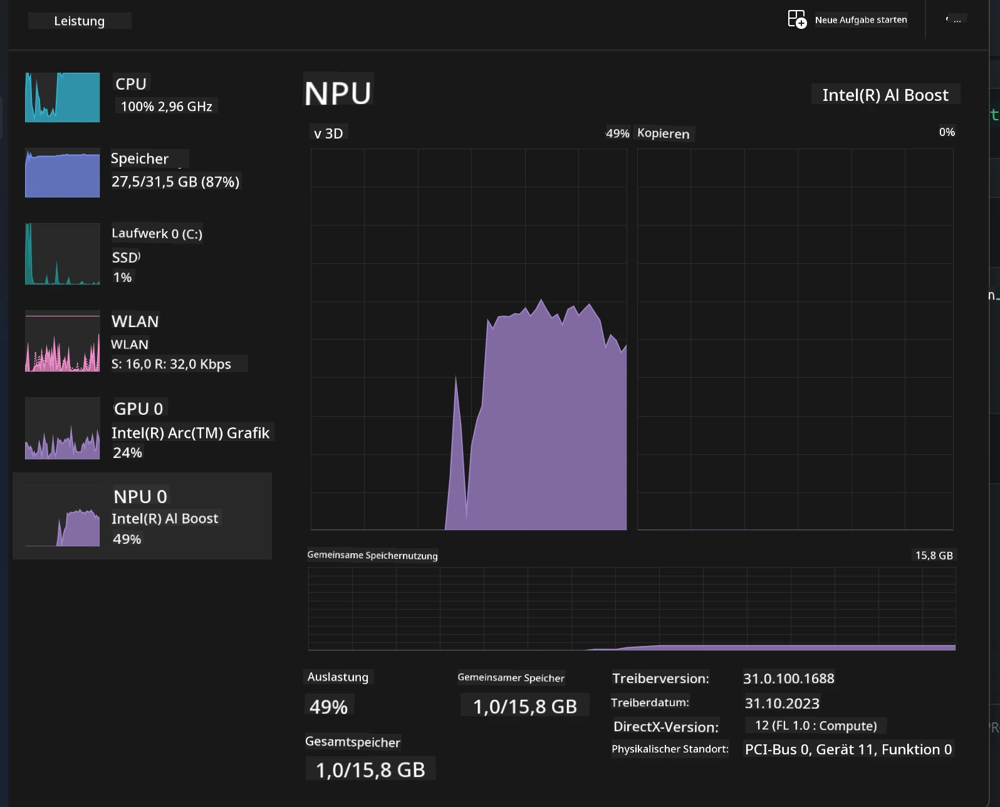
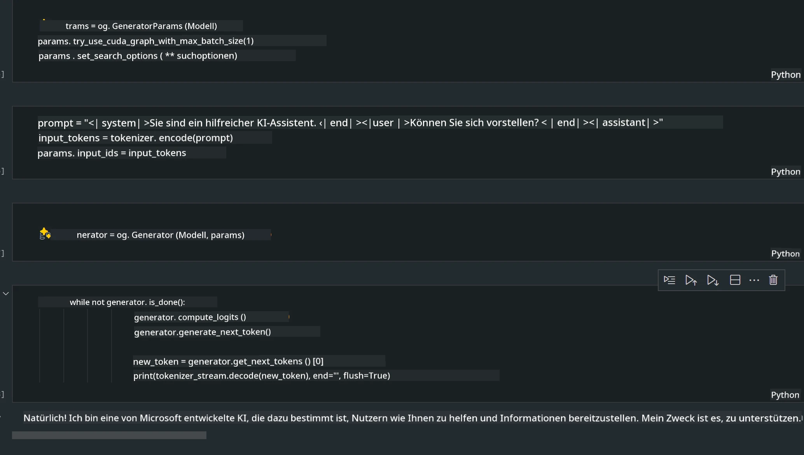
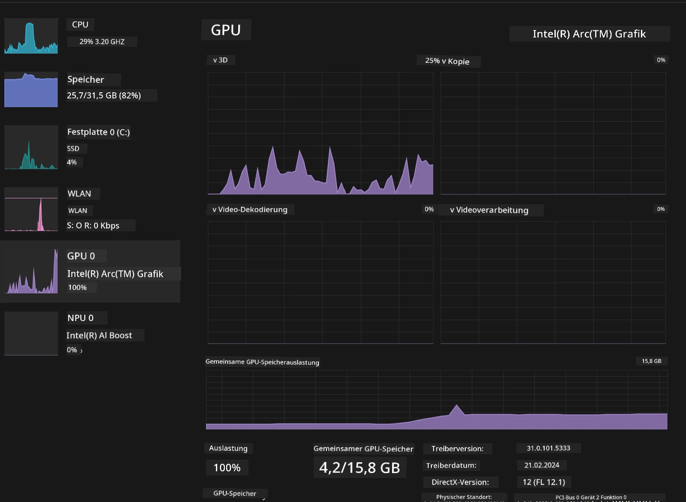

<!--
CO_OP_TRANSLATOR_METADATA:
{
  "original_hash": "e08ce816e23ad813244a09ca34ebb8ac",
  "translation_date": "2025-07-16T19:53:40+00:00",
  "source_file": "md/01.Introduction/03/AIPC_Inference.md",
  "language_code": "de"
}
-->
# **Inference Phi-3 auf AI-PCs**

Mit dem Fortschritt generativer KI und der Verbesserung der Hardwarefähigkeiten von Edge-Geräten können immer mehr generative KI-Modelle in die Bring Your Own Device (BYOD)-Geräte der Nutzer integriert werden. AI-PCs gehören zu diesen Modellen. Ab 2024 haben Intel, AMD und Qualcomm in Zusammenarbeit mit PC-Herstellern AI-PCs eingeführt, die durch Hardwareanpassungen die Bereitstellung lokaler generativer KI-Modelle ermöglichen. In dieser Diskussion konzentrieren wir uns auf Intel AI-PCs und zeigen, wie Phi-3 auf einem Intel AI-PC eingesetzt werden kann.

### Was ist eine NPU

Eine NPU (Neural Processing Unit) ist ein dedizierter Prozessor oder Verarbeitungseinheit auf einem größeren SoC, der speziell für die Beschleunigung von neuronalen Netzwerkoperationen und KI-Aufgaben entwickelt wurde. Im Gegensatz zu allgemeinen CPUs und GPUs sind NPUs für datengetriebene parallele Berechnungen optimiert, was sie besonders effizient bei der Verarbeitung großer Multimedia-Datenmengen wie Videos und Bildern sowie bei der Datenverarbeitung für neuronale Netzwerke macht. Sie sind besonders gut geeignet für KI-bezogene Aufgaben wie Spracherkennung, Hintergrundunschärfe bei Videoanrufen und Foto- oder Videobearbeitungsprozesse wie Objekterkennung.

## NPU vs GPU

Viele KI- und Machine-Learning-Workloads laufen zwar auf GPUs, aber es gibt einen wichtigen Unterschied zwischen GPUs und NPUs.  
GPUs sind bekannt für ihre parallelen Rechenfähigkeiten, aber nicht alle GPUs sind über die Grafikverarbeitung hinaus gleich effizient. NPUs hingegen sind speziell für die komplexen Berechnungen neuronaler Netzwerke entwickelt und daher besonders effektiv für KI-Aufgaben.

Zusammengefasst sind NPUs die Mathe-Genies, die KI-Berechnungen beschleunigen, und sie spielen eine Schlüsselrolle in der aufkommenden Ära der AI-PCs!

***Dieses Beispiel basiert auf Intels neuestem Intel Core Ultra Prozessor***

## **1. Verwendung der NPU zur Ausführung des Phi-3 Modells**

Das Intel® NPU-Gerät ist ein KI-Inferenzbeschleuniger, der in Intel-Client-CPUs ab der Intel® Core™ Ultra Generation (früher bekannt als Meteor Lake) integriert ist. Es ermöglicht eine energieeffiziente Ausführung künstlicher neuronaler Netzwerke.





**Intel NPU Acceleration Library**

Die Intel NPU Acceleration Library [https://github.com/intel/intel-npu-acceleration-library](https://github.com/intel/intel-npu-acceleration-library) ist eine Python-Bibliothek, die die Effizienz Ihrer Anwendungen steigert, indem sie die Leistung der Intel Neural Processing Unit (NPU) nutzt, um Hochgeschwindigkeitsberechnungen auf kompatibler Hardware durchzuführen.

Beispiel für Phi-3-mini auf einem AI-PC mit Intel® Core™ Ultra Prozessoren.


Installation der Python-Bibliothek mit pip

```bash

   pip install intel-npu-acceleration-library

```

***Hinweis*** Das Projekt befindet sich noch in der Entwicklung, aber das Referenzmodell ist bereits sehr ausgereift.

### **Ausführen von Phi-3 mit der Intel NPU Acceleration Library**

Mit der Intel NPU-Beschleunigung beeinflusst diese Bibliothek den traditionellen Kodierungsprozess nicht. Sie müssen lediglich diese Bibliothek verwenden, um das ursprüngliche Phi-3-Modell zu quantisieren, z. B. FP16, INT8, INT4, wie

```python
from transformers import AutoTokenizer, pipeline,TextStreamer
from intel_npu_acceleration_library import NPUModelForCausalLM, int4
from intel_npu_acceleration_library.compiler import CompilerConfig
import warnings

model_id = "microsoft/Phi-3-mini-4k-instruct"

compiler_conf = CompilerConfig(dtype=int4)
model = NPUModelForCausalLM.from_pretrained(
    model_id, use_cache=True, config=compiler_conf, attn_implementation="sdpa"
).eval()

tokenizer = AutoTokenizer.from_pretrained(model_id)

text_streamer = TextStreamer(tokenizer, skip_prompt=True)
```

Nach erfolgreicher Quantisierung wird die Ausführung fortgesetzt, um die NPU zum Ausführen des Phi-3-Modells aufzurufen.

```python
generation_args = {
   "max_new_tokens": 1024,
   "return_full_text": False,
   "temperature": 0.3,
   "do_sample": False,
   "streamer": text_streamer,
}

pipe = pipeline(
   "text-generation",
   model=model,
   tokenizer=tokenizer,
)

query = "<|system|>You are a helpful AI assistant.<|end|><|user|>Can you introduce yourself?<|end|><|assistant|>"

with warnings.catch_warnings():
    warnings.simplefilter("ignore")
    pipe(query, **generation_args)
```

Während der Codeausführung kann der Status der NPU über den Task-Manager eingesehen werden.



***Beispiele*** : [AIPC_NPU_DEMO.ipynb](../../../../../code/03.Inference/AIPC/AIPC_NPU_DEMO.ipynb)

## **2. Verwendung von DirectML + ONNX Runtime zur Ausführung des Phi-3 Modells**

### **Was ist DirectML**

[DirectML](https://github.com/microsoft/DirectML) ist eine leistungsstarke, hardwarebeschleunigte DirectX 12-Bibliothek für maschinelles Lernen. DirectML bietet GPU-Beschleunigung für gängige Machine-Learning-Aufgaben auf einer breiten Palette unterstützter Hardware und Treiber, einschließlich aller DirectX 12-fähigen GPUs von Herstellern wie AMD, Intel, NVIDIA und Qualcomm.

Als eigenständige API ist DirectML eine Low-Level-DirectX-12-Bibliothek und eignet sich für leistungsstarke, latenzarme Anwendungen wie Frameworks, Spiele und andere Echtzeitanwendungen. Die nahtlose Interoperabilität von DirectML mit Direct3D 12 sowie der geringe Overhead und die Hardwarekonformität machen DirectML ideal zur Beschleunigung von Machine Learning, wenn sowohl hohe Leistung als auch Zuverlässigkeit und Vorhersagbarkeit der Ergebnisse über verschiedene Hardware hinweg wichtig sind.

***Hinweis*** : Die neueste DirectML-Version unterstützt bereits NPU (https://devblogs.microsoft.com/directx/introducing-neural-processor-unit-npu-support-in-directml-developer-preview/)

### DirectML und CUDA im Vergleich hinsichtlich Fähigkeiten und Leistung:

**DirectML** ist eine von Microsoft entwickelte Machine-Learning-Bibliothek. Sie ist darauf ausgelegt, Machine-Learning-Workloads auf Windows-Geräten wie Desktops, Laptops und Edge-Geräten zu beschleunigen.  
- DX12-basiert: DirectML baut auf DirectX 12 (DX12) auf und unterstützt eine breite Palette von GPUs, darunter NVIDIA und AMD.  
- Breitere Unterstützung: Da es DX12 nutzt, funktioniert DirectML mit jeder GPU, die DX12 unterstützt, auch integrierte GPUs.  
- Bildverarbeitung: DirectML verarbeitet Bilder und andere Daten mit neuronalen Netzwerken, was es für Aufgaben wie Bilderkennung, Objekterkennung und mehr geeignet macht.  
- Einfache Einrichtung: Die Einrichtung von DirectML ist unkompliziert und erfordert keine speziellen SDKs oder Bibliotheken von GPU-Herstellern.  
- Leistung: In manchen Fällen ist DirectML leistungsfähig und kann schneller als CUDA sein, insbesondere bei bestimmten Workloads.  
- Einschränkungen: Es gibt jedoch Fälle, in denen DirectML langsamer ist, insbesondere bei float16 großen Batch-Größen.

**CUDA** ist NVIDIAs parallele Computing-Plattform und Programmiermodell. Es ermöglicht Entwicklern, die Leistung von NVIDIA-GPUs für allgemeine Berechnungen, einschließlich Machine Learning und wissenschaftlicher Simulationen, zu nutzen.  
- NVIDIA-spezifisch: CUDA ist eng mit NVIDIA-GPUs integriert und speziell für diese entwickelt.  
- Hochoptimiert: Es bietet exzellente Leistung für GPU-beschleunigte Aufgaben, besonders mit NVIDIA-GPUs.  
- Weit verbreitet: Viele Machine-Learning-Frameworks und Bibliotheken (wie TensorFlow und PyTorch) unterstützen CUDA.  
- Anpassbar: Entwickler können CUDA-Einstellungen für spezifische Aufgaben feinjustieren, was zu optimaler Leistung führt.  
- Einschränkungen: Die Abhängigkeit von NVIDIA-Hardware kann die Kompatibilität mit anderen GPUs einschränken.

### Wahl zwischen DirectML und CUDA

Die Entscheidung zwischen DirectML und CUDA hängt von Ihrem spezifischen Anwendungsfall, der verfügbaren Hardware und Ihren Präferenzen ab.  
Wenn Sie eine breitere Kompatibilität und einfache Einrichtung wünschen, ist DirectML eine gute Wahl. Haben Sie jedoch NVIDIA-GPUs und benötigen hochoptimale Leistung, bleibt CUDA eine starke Option. Zusammenfassend haben sowohl DirectML als auch CUDA ihre Stärken und Schwächen, daher sollten Sie Ihre Anforderungen und verfügbare Hardware bei der Entscheidung berücksichtigen.

### **Generative KI mit ONNX Runtime**

In der KI-Ära ist die Portabilität von KI-Modellen sehr wichtig. ONNX Runtime ermöglicht die einfache Bereitstellung trainierter Modelle auf verschiedenen Geräten. Entwickler müssen sich nicht um das Inferenz-Framework kümmern und können mit einer einheitlichen API die Modellausführung durchführen. In der Ära der generativen KI hat ONNX Runtime auch Code-Optimierungen vorgenommen (https://onnxruntime.ai/docs/genai/). Durch die optimierte ONNX Runtime kann das quantisierte generative KI-Modell auf verschiedenen Endgeräten inferiert werden. Bei Generative AI mit ONNX Runtime können Sie die KI-Modell-API über Python, C#, C / C++ ansprechen. Natürlich kann die Bereitstellung auf dem iPhone die Generative AI mit der ONNX Runtime API in C++ nutzen.

[Beispielcode](https://github.com/Azure-Samples/Phi-3MiniSamples/tree/main/onnx)

***Generative AI mit ONNX Runtime Bibliothek kompilieren***

```bash

winget install --id=Kitware.CMake  -e

git clone https://github.com/microsoft/onnxruntime.git

cd .\onnxruntime\

./build.bat --build_shared_lib --skip_tests --parallel --use_dml --config Release

cd ../

git clone https://github.com/microsoft/onnxruntime-genai.git

cd .\onnxruntime-genai\

mkdir ort

cd ort

mkdir include

mkdir lib

copy ..\onnxruntime\include\onnxruntime\core\providers\dml\dml_provider_factory.h ort\include

copy ..\onnxruntime\include\onnxruntime\core\session\onnxruntime_c_api.h ort\include

copy ..\onnxruntime\build\Windows\Release\Release\*.dll ort\lib

copy ..\onnxruntime\build\Windows\Release\Release\onnxruntime.lib ort\lib

python build.py --use_dml


```

**Bibliothek installieren**

```bash

pip install .\onnxruntime_genai_directml-0.3.0.dev0-cp310-cp310-win_amd64.whl

```

Dies ist das Ergebnis der Ausführung



***Beispiele*** : [AIPC_DirectML_DEMO.ipynb](../../../../../code/03.Inference/AIPC/AIPC_DirectML_DEMO.ipynb)

## **3. Verwendung von Intel OpenVINO zur Ausführung des Phi-3 Modells**

### **Was ist OpenVINO**

[OpenVINO](https://github.com/openvinotoolkit/openvino) ist ein Open-Source-Toolkit zur Optimierung und Bereitstellung von Deep-Learning-Modellen. Es bietet verbesserte Deep-Learning-Leistung für Vision-, Audio- und Sprachmodelle aus beliebten Frameworks wie TensorFlow, PyTorch und mehr. Starten Sie mit OpenVINO. OpenVINO kann auch in Kombination mit CPU und GPU verwendet werden, um das Phi-3-Modell auszuführen.

***Hinweis***: Derzeit unterstützt OpenVINO keine NPU.

### **OpenVINO-Bibliothek installieren**

```bash

 pip install git+https://github.com/huggingface/optimum-intel.git

 pip install git+https://github.com/openvinotoolkit/nncf.git

 pip install openvino-nightly

```

### **Ausführen von Phi-3 mit OpenVINO**

Wie bei der NPU erfolgt der Aufruf generativer KI-Modelle durch Ausführung quantisierter Modelle. Zuerst muss das Phi-3-Modell quantisiert werden, was über die Kommandozeile mit optimum-cli erledigt wird.

**INT4**

```bash

optimum-cli export openvino --model "microsoft/Phi-3-mini-4k-instruct" --task text-generation-with-past --weight-format int4 --group-size 128 --ratio 0.6  --sym  --trust-remote-code ./openvinomodel/phi3/int4

```

**FP16**

```bash

optimum-cli export openvino --model "microsoft/Phi-3-mini-4k-instruct" --task text-generation-with-past --weight-format fp16 --trust-remote-code ./openvinomodel/phi3/fp16

```

Das konvertierte Format sieht so aus


Laden Sie Modellpfade (model_dir), zugehörige Konfigurationen (ov_config = {"PERFORMANCE_HINT": "LATENCY", "NUM_STREAMS": "1", "CACHE_DIR": ""}) und hardwarebeschleunigte Geräte (GPU.0) über OVModelForCausalLM

```python

ov_model = OVModelForCausalLM.from_pretrained(
     model_dir,
     device='GPU.0',
     ov_config=ov_config,
     config=AutoConfig.from_pretrained(model_dir, trust_remote_code=True),
     trust_remote_code=True,
)

```

Während der Codeausführung kann der Status der GPU über den Task-Manager eingesehen werden.



***Beispiele*** : [AIPC_OpenVino_Demo.ipynb](../../../../../code/03.Inference/AIPC/AIPC_OpenVino_Demo.ipynb)

### ***Hinweis*** : Die oben genannten drei Methoden haben jeweils ihre Vorteile, aber für die Inferenz auf AI-PCs wird die NPU-Beschleunigung empfohlen.

**Haftungsausschluss**:  
Dieses Dokument wurde mit dem KI-Übersetzungsdienst [Co-op Translator](https://github.com/Azure/co-op-translator) übersetzt. Obwohl wir uns um Genauigkeit bemühen, beachten Sie bitte, dass automatisierte Übersetzungen Fehler oder Ungenauigkeiten enthalten können. Das Originaldokument in seiner Ursprungssprache gilt als maßgebliche Quelle. Für wichtige Informationen wird eine professionelle menschliche Übersetzung empfohlen. Wir übernehmen keine Haftung für Missverständnisse oder Fehlinterpretationen, die aus der Nutzung dieser Übersetzung entstehen.