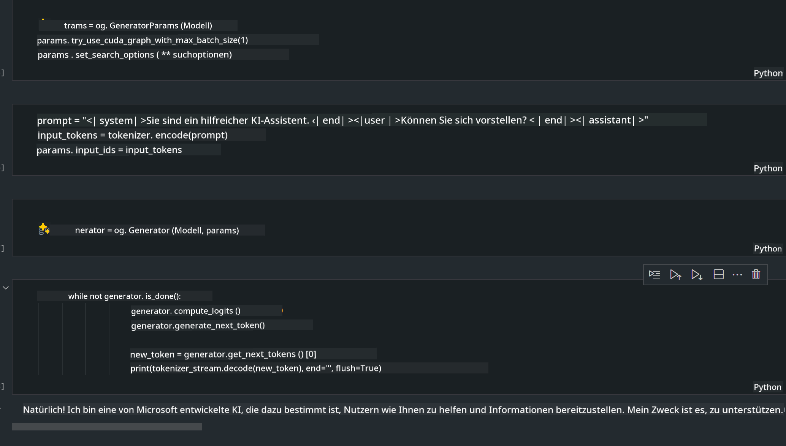
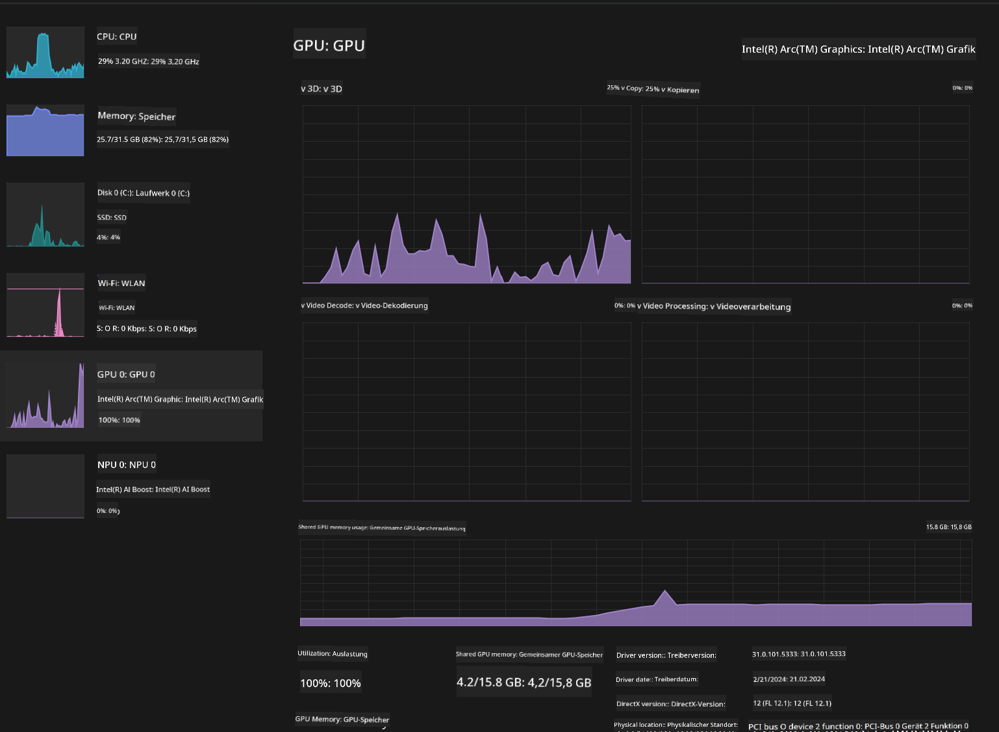

<!--
CO_OP_TRANSLATOR_METADATA:
{
  "original_hash": "e08ce816e23ad813244a09ca34ebb8ac",
  "translation_date": "2025-05-07T10:41:43+00:00",
  "source_file": "md/01.Introduction/03/AIPC_Inference.md",
  "language_code": "de"
}
-->
# **Inference Phi-3 auf AI PC**

Mit dem Fortschritt der generativen KI und der Verbesserung der Hardwarefähigkeiten von Edge-Geräten können immer mehr generative KI-Modelle in die Bring Your Own Device (BYOD)-Geräte der Nutzer integriert werden. AI PCs gehören zu diesen Modellen. Ab 2024 arbeiten Intel, AMD und Qualcomm mit PC-Herstellern zusammen, um AI PCs vorzustellen, die durch Hardwareanpassungen die Bereitstellung lokaler generativer KI-Modelle ermöglichen. In dieser Diskussion konzentrieren wir uns auf Intel AI PCs und zeigen, wie man Phi-3 auf einem Intel AI PC bereitstellt.

### Was ist eine NPU

Eine NPU (Neural Processing Unit) ist ein spezieller Prozessor oder Verarbeitungseinheit auf einem größeren SoC, der speziell zur Beschleunigung von neuronalen Netzwerkoperationen und KI-Aufgaben entwickelt wurde. Im Gegensatz zu allgemeinen CPUs und GPUs sind NPUs auf datengetriebene parallele Berechnungen optimiert, wodurch sie besonders effizient bei der Verarbeitung großer Multimedia-Datenmengen wie Videos und Bildern sowie bei der Datenverarbeitung für neuronale Netzwerke sind. Sie sind besonders gut geeignet für KI-bezogene Aufgaben wie Spracherkennung, Hintergrundunschärfe bei Videokonferenzen und Foto- oder Videobearbeitung wie Objekterkennung.

## NPU vs GPU

Während viele KI- und Machine-Learning-Aufgaben auf GPUs ausgeführt werden, gibt es einen entscheidenden Unterschied zwischen GPUs und NPUs. GPUs sind für ihre parallelen Rechenfähigkeiten bekannt, aber nicht alle GPUs sind gleichermaßen effizient über die Grafikverarbeitung hinaus. NPUs hingegen sind speziell für die komplexen Berechnungen neuronaler Netzwerke gebaut, was sie für KI-Aufgaben besonders leistungsfähig macht.

Zusammenfassend sind NPUs die mathematischen Experten, die KI-Berechnungen beschleunigen, und sie spielen eine Schlüsselrolle in der aufkommenden Ära der AI PCs!

***Dieses Beispiel basiert auf Intels neuestem Intel Core Ultra Prozessor***

## **1. Nutzung der NPU zur Ausführung des Phi-3 Modells**

Intel® NPU ist ein AI-Inferenzbeschleuniger, der in Intel-Client-CPUs ab der Intel® Core™ Ultra Generation (früher Meteor Lake genannt) integriert ist. Er ermöglicht eine energieeffiziente Ausführung künstlicher neuronaler Netzwerke.


**Intel NPU Acceleration Library**

Die Intel NPU Acceleration Library [https://github.com/intel/intel-npu-acceleration-library](https://github.com/intel/intel-npu-acceleration-library) ist eine Python-Bibliothek, die die Effizienz Ihrer Anwendungen steigert, indem sie die Leistungsfähigkeit der Intel Neural Processing Unit (NPU) nutzt, um Hochgeschwindigkeitsberechnungen auf kompatibler Hardware durchzuführen.

Beispiel für Phi-3-mini auf einem AI PC mit Intel® Core™ Ultra Prozessoren.


Installation der Python-Bibliothek mit pip

```bash

   pip install intel-npu-acceleration-library

```

***Hinweis*** Das Projekt befindet sich noch in der Entwicklung, aber das Referenzmodell ist bereits sehr umfangreich.

### **Ausführung von Phi-3 mit der Intel NPU Acceleration Library**

Mit der Intel NPU-Beschleunigung beeinflusst diese Bibliothek den herkömmlichen Kodierungsprozess nicht. Sie müssen lediglich diese Bibliothek verwenden, um das ursprüngliche Phi-3-Modell zu quantisieren, beispielsweise in FP16, INT8, INT4, wie hier:

```python
from transformers import AutoTokenizer, pipeline,TextStreamer
from intel_npu_acceleration_library import NPUModelForCausalLM, int4
from intel_npu_acceleration_library.compiler import CompilerConfig
import warnings

model_id = "microsoft/Phi-3-mini-4k-instruct"

compiler_conf = CompilerConfig(dtype=int4)
model = NPUModelForCausalLM.from_pretrained(
    model_id, use_cache=True, config=compiler_conf, attn_implementation="sdpa"
).eval()

tokenizer = AutoTokenizer.from_pretrained(model_id)

text_streamer = TextStreamer(tokenizer, skip_prompt=True)
```

Nach erfolgreicher Quantisierung wird die Ausführung fortgesetzt, um die NPU zur Ausführung des Phi-3 Modells aufzurufen.

```python
generation_args = {
   "max_new_tokens": 1024,
   "return_full_text": False,
   "temperature": 0.3,
   "do_sample": False,
   "streamer": text_streamer,
}

pipe = pipeline(
   "text-generation",
   model=model,
   tokenizer=tokenizer,
)

query = "<|system|>You are a helpful AI assistant.<|end|><|user|>Can you introduce yourself?<|end|><|assistant|>"

with warnings.catch_warnings():
    warnings.simplefilter("ignore")
    pipe(query, **generation_args)
```

Während der Codeausführung kann der Status der NPU im Task-Manager eingesehen werden.


***Beispiele*** : [AIPC_NPU_DEMO.ipynb](../../../../../code/03.Inference/AIPC/AIPC_NPU_DEMO.ipynb)

## **2. Nutzung von DirectML + ONNX Runtime zur Ausführung des Phi-3 Modells**

### **Was ist DirectML**

[DirectML](https://github.com/microsoft/DirectML) ist eine leistungsstarke, hardwarebeschleunigte DirectX 12-Bibliothek für maschinelles Lernen. DirectML bietet GPU-Beschleunigung für gängige Machine-Learning-Aufgaben auf einer breiten Palette unterstützter Hardware und Treiber, einschließlich aller DirectX 12-fähigen GPUs von Herstellern wie AMD, Intel, NVIDIA und Qualcomm.

Als eigenständige Bibliothek ist die DirectML-API eine Low-Level-DirectX-12-Bibliothek, die sich für leistungsstarke, latenzarme Anwendungen wie Frameworks, Spiele und andere Echtzeitanwendungen eignet. Die nahtlose Interoperabilität von DirectML mit Direct3D 12 sowie der geringe Overhead und die Hardwarekonformität machen DirectML ideal, um maschinelles Lernen zu beschleunigen, wenn sowohl hohe Leistung als auch Zuverlässigkeit und Vorhersagbarkeit der Ergebnisse auf verschiedenen Hardwareplattformen wichtig sind.

***Hinweis***: Die neueste DirectML-Version unterstützt bereits NPU (https://devblogs.microsoft.com/directx/introducing-neural-processor-unit-npu-support-in-directml-developer-preview/)

### DirectML und CUDA im Vergleich bezüglich Fähigkeiten und Leistung:

**DirectML** ist eine von Microsoft entwickelte Machine-Learning-Bibliothek. Sie ist darauf ausgelegt, Machine-Learning-Workloads auf Windows-Geräten wie Desktops, Laptops und Edge-Geräten zu beschleunigen.
- DX12-basiert: DirectML baut auf DirectX 12 (DX12) auf und bietet breite Hardwareunterstützung für GPUs, einschließlich NVIDIA und AMD.
- Breitere Unterstützung: Da DirectML DX12 nutzt, funktioniert es mit jeder GPU, die DX12 unterstützt, auch integrierte GPUs.
- Bildverarbeitung: DirectML verarbeitet Bilder und andere Daten mit neuronalen Netzwerken, was es für Aufgaben wie Bilderkennung, Objekterkennung und mehr geeignet macht.
- Einfache Einrichtung: Die Einrichtung von DirectML ist unkompliziert und erfordert keine spezifischen SDKs oder Bibliotheken von GPU-Herstellern.
- Leistung: In manchen Fällen erzielt DirectML gute Leistung und kann schneller als CUDA sein, besonders bei bestimmten Workloads.
- Einschränkungen: Allerdings kann DirectML bei großen Float16-Batchgrößen langsamer sein.

**CUDA** ist NVIDIAs Plattform und Programmiermodell für paralleles Rechnen. Es ermöglicht Entwicklern, die Leistung von NVIDIA-GPUs für allgemeine Berechnungen, einschließlich Machine Learning und wissenschaftlicher Simulationen, zu nutzen.
- NVIDIA-spezifisch: CUDA ist eng mit NVIDIA-GPUs integriert und speziell für diese entwickelt.
- Hochoptimiert: Es bietet exzellente Leistung für GPU-beschleunigte Aufgaben, insbesondere auf NVIDIA-Hardware.
- Weit verbreitet: Viele Machine-Learning-Frameworks und -Bibliotheken (wie TensorFlow und PyTorch) unterstützen CUDA.
- Anpassbar: Entwickler können CUDA-Einstellungen für spezifische Aufgaben feinjustieren, was zu optimaler Leistung führt.
- Einschränkungen: Die Abhängigkeit von NVIDIA-Hardware kann die Kompatibilität mit anderen GPUs einschränken.

### Wahl zwischen DirectML und CUDA

Die Entscheidung zwischen DirectML und CUDA hängt von Ihrem Anwendungsfall, der verfügbaren Hardware und Ihren Präferenzen ab. Wenn Sie breitere Kompatibilität und einfache Einrichtung bevorzugen, ist DirectML eine gute Wahl. Verfügen Sie jedoch über NVIDIA-GPUs und benötigen hochoptimale Leistung, bleibt CUDA eine starke Option. Zusammenfassend haben sowohl DirectML als auch CUDA ihre Stärken und Schwächen, daher sollten Sie Ihre Anforderungen und die vorhandene Hardware berücksichtigen.

### **Generative KI mit ONNX Runtime**

In der KI-Ära ist die Portabilität von KI-Modellen sehr wichtig. ONNX Runtime ermöglicht eine einfache Bereitstellung trainierter Modelle auf verschiedenen Geräten. Entwickler müssen sich nicht um das jeweilige Inferenz-Framework kümmern und können über eine einheitliche API die Modellausführung durchführen. In der Ära der generativen KI optimiert ONNX Runtime den Code (https://onnxruntime.ai/docs/genai/). Durch die optimierte ONNX Runtime kann das quantisierte generative KI-Modell auf verschiedenen Endgeräten inferiert werden. Bei generativer KI mit ONNX Runtime können Sie die AI-Modell-API über Python, C#, C/C++ ansprechen. Natürlich kann die Bereitstellung auf dem iPhone die Generative AI mit der ONNX Runtime API in C++ nutzen.

[Beispielcode](https://github.com/Azure-Samples/Phi-3MiniSamples/tree/main/onnx)

***Kompilieren der generativen KI mit ONNX Runtime Bibliothek***

```bash

winget install --id=Kitware.CMake  -e

git clone https://github.com/microsoft/onnxruntime.git

cd .\onnxruntime\

./build.bat --build_shared_lib --skip_tests --parallel --use_dml --config Release

cd ../

git clone https://github.com/microsoft/onnxruntime-genai.git

cd .\onnxruntime-genai\

mkdir ort

cd ort

mkdir include

mkdir lib

copy ..\onnxruntime\include\onnxruntime\core\providers\dml\dml_provider_factory.h ort\include

copy ..\onnxruntime\include\onnxruntime\core\session\onnxruntime_c_api.h ort\include

copy ..\onnxruntime\build\Windows\Release\Release\*.dll ort\lib

copy ..\onnxruntime\build\Windows\Release\Release\onnxruntime.lib ort\lib

python build.py --use_dml


```

**Bibliothek installieren**

```bash

pip install .\onnxruntime_genai_directml-0.3.0.dev0-cp310-cp310-win_amd64.whl

```

Das ist das Ergebnis der Ausführung



***Beispiele*** : [AIPC_DirectML_DEMO.ipynb](../../../../../code/03.Inference/AIPC/AIPC_DirectML_DEMO.ipynb)

## **3. Nutzung von Intel OpenVino zur Ausführung des Phi-3 Modells**

### **Was ist OpenVINO**

[OpenVINO](https://github.com/openvinotoolkit/openvino) ist ein Open-Source-Toolkit zur Optimierung und Bereitstellung von Deep-Learning-Modellen. Es bietet verbesserte Deep-Learning-Leistung für Modelle aus den Bereichen Vision, Audio und Sprache von beliebten Frameworks wie TensorFlow, PyTorch und anderen. Starten Sie mit OpenVINO. OpenVINO kann auch in Kombination mit CPU und GPU zur Ausführung des Phi-3 Modells verwendet werden.

***Hinweis***: Derzeit unterstützt OpenVINO keine NPU.

### **Installation der OpenVINO-Bibliothek**

```bash

 pip install git+https://github.com/huggingface/optimum-intel.git

 pip install git+https://github.com/openvinotoolkit/nncf.git

 pip install openvino-nightly

```

### **Ausführung von Phi-3 mit OpenVINO**

Ähnlich wie bei der NPU erfolgt der Aufruf generativer KI-Modelle über quantisierte Modelle. Zuerst muss das Phi-3 Modell quantisiert werden. Die Quantisierung wird über die Kommandozeile mit optimum-cli durchgeführt.

**INT4**

```bash

optimum-cli export openvino --model "microsoft/Phi-3-mini-4k-instruct" --task text-generation-with-past --weight-format int4 --group-size 128 --ratio 0.6  --sym  --trust-remote-code ./openvinomodel/phi3/int4

```

**FP16**

```bash

optimum-cli export openvino --model "microsoft/Phi-3-mini-4k-instruct" --task text-generation-with-past --weight-format fp16 --trust-remote-code ./openvinomodel/phi3/fp16

```

Das konvertierte Format sieht so aus


Laden Sie Modellpfade (model_dir), zugehörige Konfigurationen (ov_config = {"PERFORMANCE_HINT": "LATENCY", "NUM_STREAMS": "1", "CACHE_DIR": ""}) und hardwarebeschleunigte Geräte (GPU.0) über OVModelForCausalLM

```python

ov_model = OVModelForCausalLM.from_pretrained(
     model_dir,
     device='GPU.0',
     ov_config=ov_config,
     config=AutoConfig.from_pretrained(model_dir, trust_remote_code=True),
     trust_remote_code=True,
)

```

Während der Codeausführung kann der GPU-Status im Task-Manager eingesehen werden.



***Beispiele*** : [AIPC_OpenVino_Demo.ipynb](../../../../../code/03.Inference/AIPC/AIPC_OpenVino_Demo.ipynb)

### ***Hinweis***: Die oben genannten drei Methoden haben jeweils ihre Vorteile, aber für die Inferenz auf AI PCs wird die Nutzung der NPU-Beschleunigung empfohlen.

**Haftungsausschluss**:  
Dieses Dokument wurde mit dem KI-Übersetzungsdienst [Co-op Translator](https://github.com/Azure/co-op-translator) übersetzt. Obwohl wir uns um Genauigkeit bemühen, beachten Sie bitte, dass automatisierte Übersetzungen Fehler oder Ungenauigkeiten enthalten können. Das Originaldokument in seiner Ursprungssprache ist als maßgebliche Quelle zu betrachten. Für wichtige Informationen wird eine professionelle menschliche Übersetzung empfohlen. Wir übernehmen keine Haftung für Missverständnisse oder Fehlinterpretationen, die aus der Nutzung dieser Übersetzung entstehen.