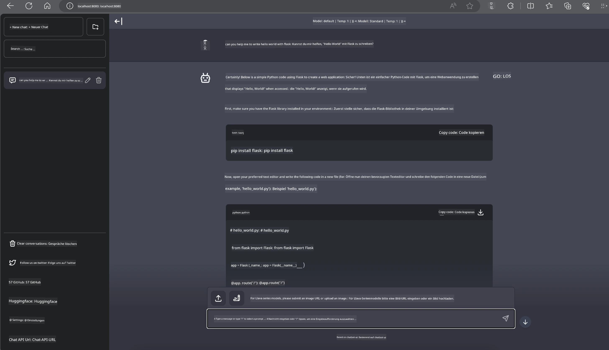

# **Inference Phi-3 auf Nvidia Jetson**

Nvidia Jetson ist eine Serie von Embedded-Computing-Boards von Nvidia. Die Modelle Jetson TK1, TX1 und TX2 sind alle mit einem Tegra-Prozessor (oder SoC) von Nvidia ausgestattet, der eine ARM-Architektur-Zentraleinheit (CPU) integriert. Jetson ist ein energiesparendes System und wurde entwickelt, um maschinelles Lernen zu beschleunigen. Nvidia Jetson wird von professionellen Entwicklern genutzt, um bahnbrechende KI-Produkte in allen Branchen zu schaffen, sowie von Studierenden und Enthusiasten für praxisnahes KI-Lernen und beeindruckende Projekte. SLM wird in Edge-Geräten wie Jetson eingesetzt, was eine bessere Umsetzung industrieller generativer KI-Anwendungsszenarien ermöglicht.

## Deployment auf NVIDIA Jetson:
Entwickler, die an autonomen Robotern und Embedded-Geräten arbeiten, können Phi-3 Mini nutzen. Die vergleichsweise kompakte Größe von Phi-3 macht es ideal für den Einsatz am Edge. Die Parameter wurden während des Trainings sorgfältig abgestimmt, um eine hohe Genauigkeit der Antworten zu gewährleisten.

### TensorRT-LLM Optimierung:
NVIDIAs [TensorRT-LLM Bibliothek](https://github.com/NVIDIA/TensorRT-LLM?WT.mc_id=aiml-138114-kinfeylo) optimiert die Inferenz großer Sprachmodelle. Sie unterstützt das lange Kontextfenster von Phi-3 Mini und verbessert sowohl Durchsatz als auch Latenz. Zu den Optimierungen gehören Techniken wie LongRoPE, FP8 und inflight batching.

### Verfügbarkeit und Deployment:
Entwickler können Phi-3 Mini mit dem 128K Kontextfenster bei [NVIDIAs AI](https://www.nvidia.com/en-us/ai-data-science/generative-ai/) erkunden. Es wird als NVIDIA NIM bereitgestellt, ein Microservice mit einer standardisierten API, der überall eingesetzt werden kann. Zusätzlich sind die [TensorRT-LLM Implementierungen auf GitHub](https://github.com/NVIDIA/TensorRT-LLM) verfügbar.

## **1. Vorbereitung**

a. Jetson Orin NX / Jetson NX

b. JetPack 5.1.2+

c. Cuda 11.8

d. Python 3.8+

## **2. Phi-3 auf Jetson ausführen**

Wir können zwischen [Ollama](https://ollama.com) oder [LlamaEdge](https://llamaedge.com) wählen.

Wenn Sie gguf sowohl in der Cloud als auch auf Edge-Geräten gleichzeitig verwenden möchten, kann LlamaEdge als WasmEdge verstanden werden (WasmEdge ist eine leichtgewichtige, leistungsstarke und skalierbare WebAssembly-Laufzeitumgebung, die sich für Cloud-native, Edge- und dezentrale Anwendungen eignet. Sie unterstützt serverlose Anwendungen, eingebettete Funktionen, Microservices, Smart Contracts und IoT-Geräte. Sie können ggufs quantisiertes Modell über LlamaEdge auf Edge-Geräte und in der Cloud bereitstellen.


Hier sind die Schritte zur Nutzung:

1. Installieren und laden Sie die benötigten Bibliotheken und Dateien herunter

```bash

curl -sSf https://raw.githubusercontent.com/WasmEdge/WasmEdge/master/utils/install.sh | bash -s -- --plugin wasi_nn-ggml

curl -LO https://github.com/LlamaEdge/LlamaEdge/releases/latest/download/llama-api-server.wasm

curl -LO https://github.com/LlamaEdge/chatbot-ui/releases/latest/download/chatbot-ui.tar.gz

tar xzf chatbot-ui.tar.gz

```

**Hinweis**: llama-api-server.wasm und chatbot-ui müssen sich im selben Verzeichnis befinden

2. Skripte im Terminal ausführen

```bash

wasmedge --dir .:. --nn-preload default:GGML:AUTO:{Your gguf path} llama-api-server.wasm -p phi-3-chat

```

Hier das Ergebnis der Ausführung



***Beispielcode*** [Phi-3 mini WASM Notebook Sample](https://github.com/Azure-Samples/Phi-3MiniSamples/tree/main/wasm)

Zusammenfassend stellt Phi-3 Mini einen großen Fortschritt im Bereich der Sprachmodellierung dar, indem es Effizienz, Kontextbewusstsein und NVIDIAs Optimierungs-Know-how vereint. Egal, ob Sie Roboter oder Edge-Anwendungen entwickeln – Phi-3 Mini ist ein leistungsstarkes Werkzeug, das Sie kennen sollten.

**Haftungsausschluss**:  
Dieses Dokument wurde mit dem KI-Übersetzungsdienst [Co-op Translator](https://github.com/Azure/co-op-translator) übersetzt. Obwohl wir uns um Genauigkeit bemühen, beachten Sie bitte, dass automatisierte Übersetzungen Fehler oder Ungenauigkeiten enthalten können. Das Originaldokument in seiner Ursprungssprache ist als maßgebliche Quelle zu betrachten. Für wichtige Informationen wird eine professionelle menschliche Übersetzung empfohlen. Wir übernehmen keine Haftung für Missverständnisse oder Fehlinterpretationen, die aus der Nutzung dieser Übersetzung entstehen.