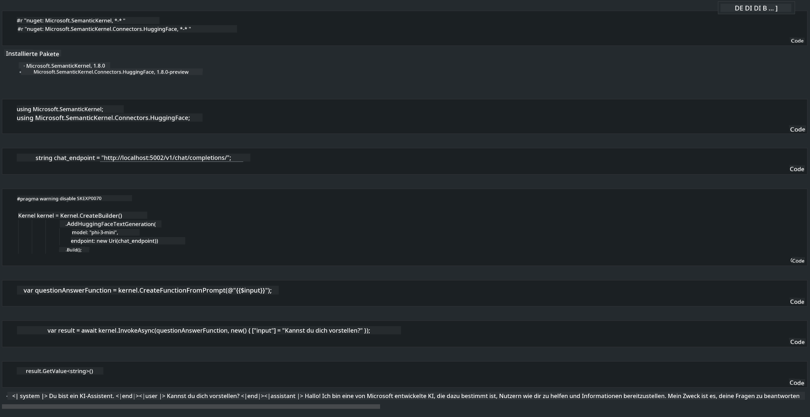

<!--
CO_OP_TRANSLATOR_METADATA:
{
  "original_hash": "bcf5dd7031db0031abdb9dd0c05ba118",
  "translation_date": "2025-05-07T10:43:35+00:00",
  "source_file": "md/01.Introduction/03/Local_Server_Inference.md",
  "language_code": "de"
}
-->
# **Inference Phi-3 auf lokalem Server**

Wir können Phi-3 auf einem lokalen Server bereitstellen. Nutzer können zwischen den Lösungen [Ollama](https://ollama.com) oder [LM Studio](https://llamaedge.com) wählen oder ihren eigenen Code schreiben. Phi-3's lokale Dienste lassen sich über [Semantic Kernel](https://github.com/microsoft/semantic-kernel?WT.mc_id=aiml-138114-kinfeylo) oder [Langchain](https://www.langchain.com/) anbinden, um Copilot-Anwendungen zu erstellen.

## **Semantic Kernel zur Nutzung von Phi-3-mini**

In der Copilot-Anwendung erstellen wir Anwendungen über Semantic Kernel / LangChain. Dieses Anwendungsframework ist in der Regel kompatibel mit Azure OpenAI Service / OpenAI-Modellen und unterstützt auch Open-Source-Modelle von Hugging Face sowie lokale Modelle. Was tun, wenn wir Semantic Kernel nutzen möchten, um auf Phi-3-mini zuzugreifen? Am Beispiel von .NET lässt sich dies mit dem Hugging Face Connector im Semantic Kernel kombinieren. Standardmäßig wird das Modell anhand der Modell-ID auf Hugging Face geladen (beim ersten Mal wird das Modell von Hugging Face heruntergeladen, was einige Zeit in Anspruch nimmt). Alternativ kann man sich auch mit dem lokal aufgebauten Dienst verbinden. Von den beiden Varianten empfehlen wir letztere, da sie eine höhere Autonomie bietet, insbesondere für Unternehmenseinsätze.

Aus der Abbildung wird deutlich, dass der Zugriff auf lokale Dienste über Semantic Kernel eine einfache Verbindung zum selbst aufgebauten Phi-3-mini Modellserver ermöglicht. Hier das Ergebnis der Ausführung:

***Sample Code*** https://github.com/kinfey/Phi3MiniSamples/tree/main/semantickernel

**Haftungsausschluss**:  
Dieses Dokument wurde mithilfe des KI-Übersetzungsdienstes [Co-op Translator](https://github.com/Azure/co-op-translator) übersetzt. Obwohl wir uns um Genauigkeit bemühen, beachten Sie bitte, dass automatisierte Übersetzungen Fehler oder Ungenauigkeiten enthalten können. Das Originaldokument in seiner ursprünglichen Sprache gilt als maßgebliche Quelle. Für wichtige Informationen wird eine professionelle menschliche Übersetzung empfohlen. Wir übernehmen keine Haftung für Missverständnisse oder Fehlinterpretationen, die aus der Verwendung dieser Übersetzung entstehen.