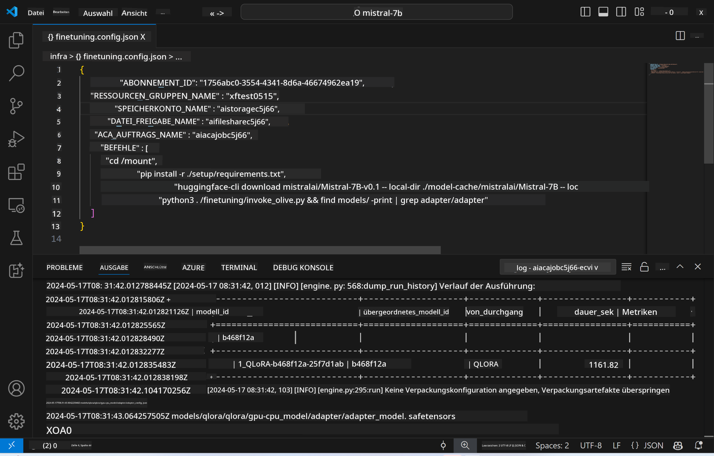
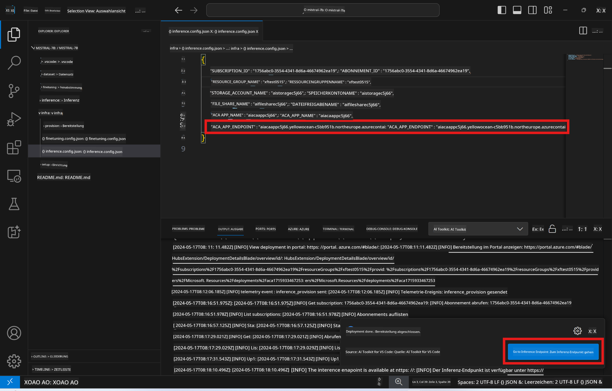

<!--
CO_OP_TRANSLATOR_METADATA:
{
  "original_hash": "a54cd3d65b6963e4e8ce21e143c3ab04",
  "translation_date": "2025-07-16T21:14:46+00:00",
  "source_file": "md/01.Introduction/03/Remote_Interence.md",
  "language_code": "de"
}
-->
# Remote-Inferenz mit dem feinabgestimmten Modell

Nachdem die Adapter in der Remote-Umgebung trainiert wurden, verwenden Sie eine einfache Gradio-Anwendung, um mit dem Modell zu interagieren.



### Azure-Ressourcen bereitstellen  
Sie müssen die Azure-Ressourcen für die Remote-Inferenz einrichten, indem Sie den Befehl `AI Toolkit: Provision Azure Container Apps for inference` aus der Befehls-Palette ausführen. Während der Einrichtung werden Sie aufgefordert, Ihr Azure-Abonnement und die Ressourcengruppe auszuwählen.  


Standardmäßig sollten das Abonnement und die Ressourcengruppe für die Inferenz mit denen übereinstimmen, die auch für das Fine-Tuning verwendet wurden. Die Inferenz nutzt dieselbe Azure Container App Umgebung und greift auf das Modell sowie den Modelladapter zu, die in Azure Files gespeichert sind und während des Fine-Tuning-Schritts erstellt wurden.

## Verwendung des AI Toolkit

### Bereitstellung für die Inferenz  
Wenn Sie den Inferenzcode überarbeiten oder das Inferenzmodell neu laden möchten, führen Sie bitte den Befehl `AI Toolkit: Deploy for inference` aus. Dadurch wird Ihr aktueller Code mit ACA synchronisiert und die Replik neu gestartet.


Nach erfolgreichem Abschluss der Bereitstellung ist das Modell bereit für die Auswertung über diesen Endpunkt.

### Zugriff auf die Inferenz-API

Sie können auf die Inferenz-API zugreifen, indem Sie auf die Schaltfläche "*Go to Inference Endpoint*" klicken, die in der VSCode-Benachrichtigung angezeigt wird. Alternativ finden Sie den Web-API-Endpunkt unter `ACA_APP_ENDPOINT` in der Datei `./infra/inference.config.json` sowie im Ausgabefenster.



> **Hinweis:** Es kann einige Minuten dauern, bis der Inferenz-Endpunkt vollständig einsatzbereit ist.

## Inferenz-Komponenten, die in der Vorlage enthalten sind

| Ordner | Inhalt |
| ------ |-------- |
| `infra` | Enthält alle notwendigen Konfigurationen für den Remote-Betrieb. |
| `infra/provision/inference.parameters.json` | Enthält Parameter für die Bicep-Vorlagen, die für die Bereitstellung der Azure-Ressourcen für die Inferenz verwendet werden. |
| `infra/provision/inference.bicep` | Enthält Vorlagen zur Bereitstellung der Azure-Ressourcen für die Inferenz. |
| `infra/inference.config.json` | Die Konfigurationsdatei, die durch den Befehl `AI Toolkit: Provision Azure Container Apps for inference` generiert wird. Sie dient als Eingabe für andere Remote-Befehle aus der Befehls-Palette. |

### Verwendung des AI Toolkit zur Konfiguration der Azure-Ressourcenbereitstellung  
Konfigurieren Sie das [AI Toolkit](https://marketplace.visualstudio.com/items?itemName=ms-windows-ai-studio.windows-ai-studio)

Führen Sie den Befehl `Provision Azure Container Apps for inference` aus.

Die Konfigurationsparameter finden Sie in der Datei `./infra/provision/inference.parameters.json`. Hier die Details:  
| Parameter | Beschreibung |
| --------- |------------- |
| `defaultCommands` | Befehle zum Starten einer Web-API. |
| `maximumInstanceCount` | Legt die maximale Anzahl der GPU-Instanzen fest. |
| `location` | Standort, an dem die Azure-Ressourcen bereitgestellt werden. Standardmäßig entspricht dieser dem Standort der ausgewählten Ressourcengruppe. |
| `storageAccountName`, `fileShareName`, `acaEnvironmentName`, `acaEnvironmentStorageName`, `acaAppName`, `acaLogAnalyticsName` | Diese Parameter dienen zur Benennung der Azure-Ressourcen für die Bereitstellung. Standardmäßig entsprechen sie den Namen der Fine-Tuning-Ressourcen. Sie können einen neuen, noch nicht verwendeten Ressourcennamen eingeben, um eigene benannte Ressourcen zu erstellen, oder den Namen einer bereits vorhandenen Azure-Ressource angeben, wenn Sie diese verwenden möchten. Details finden Sie im Abschnitt [Using existing Azure Resources](../../../../../md/01.Introduction/03). |

### Verwendung vorhandener Azure-Ressourcen

Standardmäßig verwendet die Inferenz-Bereitstellung dieselbe Azure Container App Umgebung, das Storage-Konto, Azure File Share und Azure Log Analytics, die auch für das Fine-Tuning genutzt wurden. Für die Inferenz-API wird eine separate Azure Container App erstellt.

Wenn Sie die Azure-Ressourcen während des Fine-Tuning-Schritts angepasst haben oder eigene vorhandene Azure-Ressourcen für die Inferenz verwenden möchten, geben Sie deren Namen in der Datei `./infra/inference.parameters.json` an. Führen Sie anschließend den Befehl `AI Toolkit: Provision Azure Container Apps for inference` aus der Befehls-Palette aus. Dadurch werden die angegebenen Ressourcen aktualisiert und fehlende Ressourcen erstellt.

Beispielsweise sollte Ihre `./infra/finetuning.parameters.json` bei einer vorhandenen Azure Container Umgebung so aussehen:

```json
{
    "$schema": "https://schema.management.azure.com/schemas/2019-04-01/deploymentParameters.json#",
    "contentVersion": "1.0.0.0",
    "parameters": {
      ...
      "acaEnvironmentName": {
        "value": "<your-aca-env-name>"
      },
      "acaEnvironmentStorageName": {
        "value": null
      },
      ...
    }
  }
```

### Manuelle Bereitstellung  
Wenn Sie die Azure-Ressourcen lieber manuell konfigurieren möchten, können Sie die bereitgestellten Bicep-Dateien im Ordner `./infra/provision` verwenden. Wenn Sie alle Azure-Ressourcen bereits eingerichtet und konfiguriert haben, ohne das AI Toolkit zu verwenden, können Sie einfach die Ressourcennamen in der Datei `inference.config.json` eintragen.

Zum Beispiel:

```json
{
  "SUBSCRIPTION_ID": "<your-subscription-id>",
  "RESOURCE_GROUP_NAME": "<your-resource-group-name>",
  "STORAGE_ACCOUNT_NAME": "<your-storage-account-name>",
  "FILE_SHARE_NAME": "<your-file-share-name>",
  "ACA_APP_NAME": "<your-aca-name>",
  "ACA_APP_ENDPOINT": "<your-aca-endpoint>"
}
```

**Haftungsausschluss**:  
Dieses Dokument wurde mit dem KI-Übersetzungsdienst [Co-op Translator](https://github.com/Azure/co-op-translator) übersetzt. Obwohl wir uns um Genauigkeit bemühen, beachten Sie bitte, dass automatisierte Übersetzungen Fehler oder Ungenauigkeiten enthalten können. Das Originaldokument in seiner Ursprungssprache ist als maßgebliche Quelle zu betrachten. Für wichtige Informationen wird eine professionelle menschliche Übersetzung empfohlen. Wir übernehmen keine Haftung für Missverständnisse oder Fehlinterpretationen, die aus der Nutzung dieser Übersetzung entstehen.