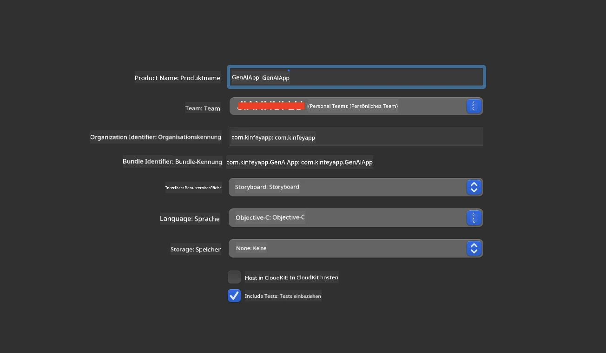
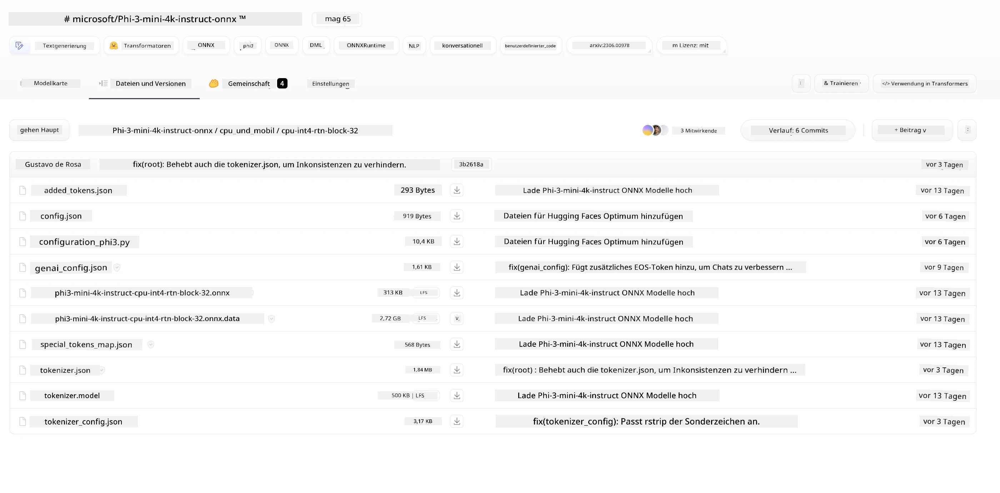
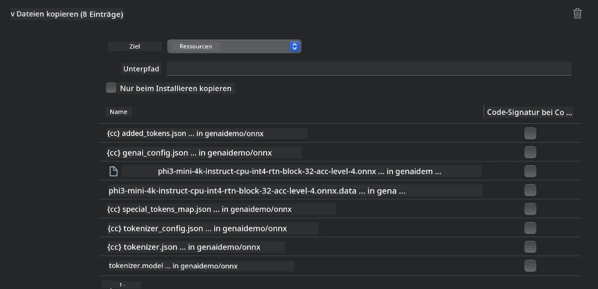
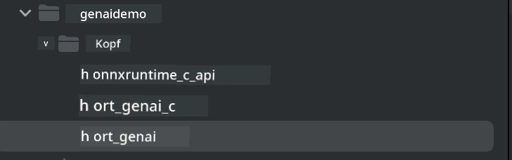
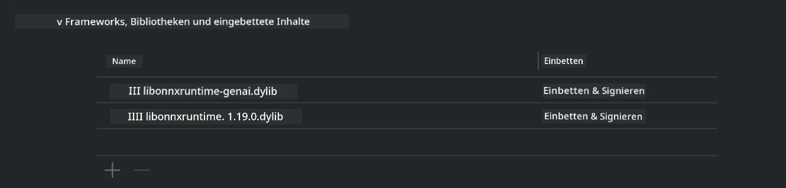
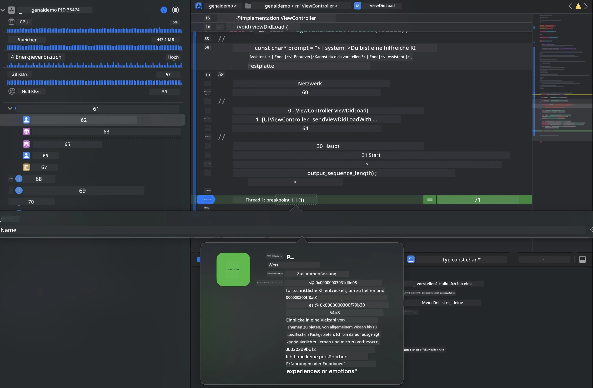

# **Inference Phi-3 auf iOS**

Phi-3-mini ist eine neue Modellreihe von Microsoft, die die Bereitstellung von Large Language Models (LLMs) auf Edge-Geräten und IoT-Geräten ermöglicht. Phi-3-mini ist für iOS, Android und Edge-Geräte verfügbar und erlaubt den Einsatz generativer KI in BYOD-Umgebungen. Das folgende Beispiel zeigt, wie man Phi-3-mini auf iOS bereitstellt.

## **1. Vorbereitung**

- **a.** macOS 14+
- **b.** Xcode 15+
- **c.** iOS SDK 17.x (iPhone 14 A16 oder höher)
- **d.** Python 3.10+ installieren (Conda wird empfohlen)
- **e.** Die Python-Bibliothek `python-flatbuffers` installieren
- **f.** CMake installieren

### Semantic Kernel und Inferenz

Semantic Kernel ist ein Anwendungsframework, mit dem Sie Anwendungen erstellen können, die mit Azure OpenAI Service, OpenAI-Modellen und sogar lokalen Modellen kompatibel sind. Der Zugriff auf lokale Dienste über Semantic Kernel ermöglicht eine einfache Integration mit Ihrem selbst gehosteten Phi-3-mini Modellserver.

### Aufruf quantisierter Modelle mit Ollama oder LlamaEdge

Viele Nutzer bevorzugen quantisierte Modelle, um Modelle lokal auszuführen. [Ollama](https://ollama.com) und [LlamaEdge](https://llamaedge.com) ermöglichen es, verschiedene quantisierte Modelle aufzurufen:

#### **Ollama**

Sie können `ollama run phi3` direkt ausführen oder es offline konfigurieren. Erstellen Sie eine Modelfile mit dem Pfad zu Ihrer `gguf`-Datei. Beispielcode zum Ausführen des Phi-3-mini quantisierten Modells:

```gguf
FROM {Add your gguf file path}
TEMPLATE \"\"\"<|user|> .Prompt<|end|> <|assistant|>\"\"\"
PARAMETER stop <|end|>
PARAMETER num_ctx 4096
```

#### **LlamaEdge**

Wenn Sie `gguf` sowohl in der Cloud als auch auf Edge-Geräten gleichzeitig verwenden möchten, ist LlamaEdge eine gute Option.

## **2. Kompilieren von ONNX Runtime für iOS**

```bash

git clone https://github.com/microsoft/onnxruntime.git

cd onnxruntime

./build.sh --build_shared_lib --ios --skip_tests --parallel --build_dir ./build_ios --ios --apple_sysroot iphoneos --osx_arch arm64 --apple_deploy_target 17.5 --cmake_generator Xcode --config Release

cd ../

```

### **Hinweis**

- **a.** Stellen Sie vor dem Kompilieren sicher, dass Xcode richtig konfiguriert ist und setzen Sie es als aktives Entwicklerverzeichnis im Terminal:

    ```bash
    sudo xcode-select -switch /Applications/Xcode.app/Contents/Developer
    ```

- **b.** ONNX Runtime muss für verschiedene Plattformen kompiliert werden. Für iOS können Sie für `arm64` oder `x86_64` kompilieren.

- **c.** Es wird empfohlen, das neueste iOS SDK für die Kompilierung zu verwenden. Sie können jedoch auch eine ältere Version nutzen, wenn Sie Kompatibilität mit früheren SDKs benötigen.

## **3. Kompilieren von Generative AI mit ONNX Runtime für iOS**

> **Note:** Da Generative AI mit ONNX Runtime sich noch in der Vorschau befindet, sollten Sie mögliche Änderungen beachten.

```bash

git clone https://github.com/microsoft/onnxruntime-genai
 
cd onnxruntime-genai
 
mkdir ort
 
cd ort
 
mkdir include
 
mkdir lib
 
cd ../
 
cp ../onnxruntime/include/onnxruntime/core/session/onnxruntime_c_api.h ort/include
 
cp ../onnxruntime/build_ios/Release/Release-iphoneos/libonnxruntime*.dylib* ort/lib
 
export OPENCV_SKIP_XCODEBUILD_FORCE_TRYCOMPILE_DEBUG=1
 
python3 build.py --parallel --build_dir ./build_ios --ios --ios_sysroot iphoneos --ios_arch arm64 --ios_deployment_target 17.5 --cmake_generator Xcode --cmake_extra_defines CMAKE_XCODE_ATTRIBUTE_CODE_SIGNING_ALLOWED=NO

```

## **4. Erstellen einer App-Anwendung in Xcode**

Ich habe Objective-C als Entwicklungsweg für die App gewählt, da die Verwendung von Generative AI mit der ONNX Runtime C++ API in Objective-C besser kompatibel ist. Natürlich können Sie die entsprechenden Aufrufe auch über Swift-Bridging realisieren.



## **5. Kopieren des ONNX quantisierten INT4 Modells in das App-Projekt**

Wir müssen das INT4-Quantisierungsmodell im ONNX-Format importieren, das zuerst heruntergeladen werden muss.



Nach dem Herunterladen fügen Sie es dem Ressourcenverzeichnis des Projekts in Xcode hinzu.



## **6. Hinzufügen der C++ API in ViewControllers**

> **Hinweis:**

- **a.** Fügen Sie die entsprechenden C++ Header-Dateien zum Projekt hinzu.

  

- **b.** Binden Sie die dynamische Bibliothek `onnxruntime-genai` in Xcode ein.

  

- **c.** Verwenden Sie den C-Sample-Code zum Testen. Sie können auch zusätzliche Funktionen wie ChatUI hinzufügen, um den Funktionsumfang zu erweitern.

- **d.** Da Sie C++ im Projekt verwenden müssen, benennen Sie `ViewController.m` in `ViewController.mm` um, um Objective-C++ zu aktivieren.

```objc

    NSString *llmPath = [[NSBundle mainBundle] resourcePath];
    char const *modelPath = llmPath.cString;

    auto model =  OgaModel::Create(modelPath);

    auto tokenizer = OgaTokenizer::Create(*model);

    const char* prompt = "<|system|>You are a helpful AI assistant.<|end|><|user|>Can you introduce yourself?<|end|><|assistant|>";

    auto sequences = OgaSequences::Create();
    tokenizer->Encode(prompt, *sequences);

    auto params = OgaGeneratorParams::Create(*model);
    params->SetSearchOption("max_length", 100);
    params->SetInputSequences(*sequences);

    auto output_sequences = model->Generate(*params);
    const auto output_sequence_length = output_sequences->SequenceCount(0);
    const auto* output_sequence_data = output_sequences->SequenceData(0);
    auto out_string = tokenizer->Decode(output_sequence_data, output_sequence_length);
    
    auto tmp = out_string;

```

## **7. Ausführen der Anwendung**

Sobald die Einrichtung abgeschlossen ist, können Sie die Anwendung starten, um die Ergebnisse der Phi-3-mini Modellinferenz zu sehen.



Für weitere Beispielcodes und detaillierte Anleitungen besuchen Sie das [Phi-3 Mini Samples Repository](https://github.com/Azure-Samples/Phi-3MiniSamples/tree/main/ios).

**Haftungsausschluss**:  
Dieses Dokument wurde mit dem KI-Übersetzungsdienst [Co-op Translator](https://github.com/Azure/co-op-translator) übersetzt. Obwohl wir uns um Genauigkeit bemühen, beachten Sie bitte, dass automatisierte Übersetzungen Fehler oder Ungenauigkeiten enthalten können. Das Originaldokument in seiner Ursprungssprache ist als maßgebliche Quelle zu betrachten. Für wichtige Informationen wird eine professionelle menschliche Übersetzung empfohlen. Wir übernehmen keine Haftung für Missverständnisse oder Fehlinterpretationen, die aus der Nutzung dieser Übersetzung entstehen.