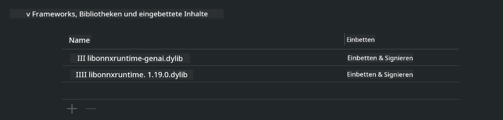
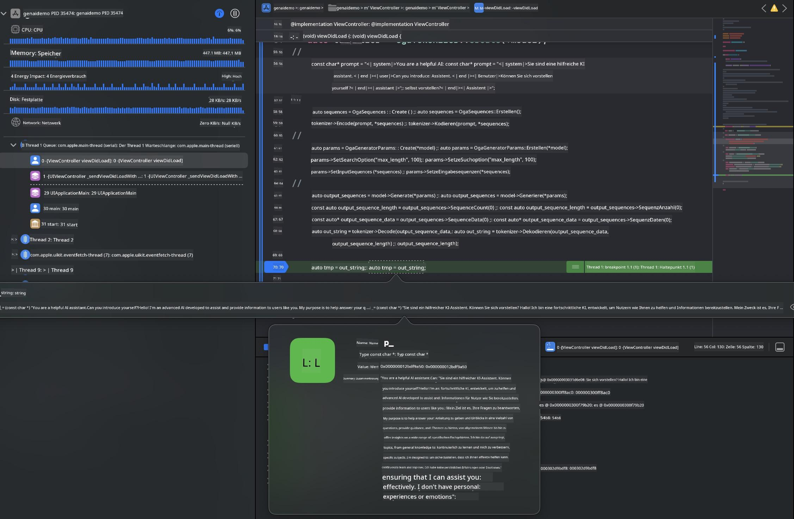

<!--
CO_OP_TRANSLATOR_METADATA:
{
  "original_hash": "82af197df38d25346a98f1f0e84d1698",
  "translation_date": "2025-05-07T10:44:59+00:00",
  "source_file": "md/01.Introduction/03/iOS_Inference.md",
  "language_code": "de"
}
-->
# **Inference Phi-3 auf iOS**

Phi-3-mini ist eine neue Modellreihe von Microsoft, die die Bereitstellung von Large Language Models (LLMs) auf Edge- und IoT-Geräten ermöglicht. Phi-3-mini ist für iOS, Android und Edge-Geräte verfügbar und erlaubt den Einsatz generativer KI in BYOD-Umgebungen. Das folgende Beispiel zeigt, wie man Phi-3-mini auf iOS bereitstellt.

## **1. Vorbereitung**

- **a.** macOS 14+
- **b.** Xcode 15+
- **c.** iOS SDK 17.x (iPhone 14 A16 oder höher)
- **d.** Installiere Python 3.10+ (Conda wird empfohlen)
- **e.** Installiere die Python-Bibliothek: `python-flatbuffers`
- **f.** Installiere CMake

### Semantic Kernel und Inferenz

Semantic Kernel ist ein Anwendungsframework, mit dem du Anwendungen erstellen kannst, die mit Azure OpenAI Service, OpenAI-Modellen und sogar lokalen Modellen kompatibel sind. Der Zugriff auf lokale Dienste über Semantic Kernel ermöglicht eine einfache Integration mit deinem selbstgehosteten Phi-3-mini Modellserver.

### Aufruf quantisierter Modelle mit Ollama oder LlamaEdge

Viele Nutzer bevorzugen quantisierte Modelle, um Modelle lokal auszuführen. [Ollama](https://ollama.com) und [LlamaEdge](https://llamaedge.com) ermöglichen es, verschiedene quantisierte Modelle aufzurufen:

#### **Ollama**

Du kannst `ollama run phi3` direkt ausführen oder offline konfigurieren. Erstelle eine Modelfile mit dem Pfad zu deiner `gguf` Datei. Beispielcode zum Ausführen des Phi-3-mini quantisierten Modells:

```gguf
FROM {Add your gguf file path}
TEMPLATE \"\"\"<|user|> .Prompt<|end|> <|assistant|>\"\"\"
PARAMETER stop <|end|>
PARAMETER num_ctx 4096
```

#### **LlamaEdge**

Wenn du `gguf` sowohl in der Cloud als auch auf Edge-Geräten gleichzeitig verwenden möchtest, ist LlamaEdge eine gute Wahl.

## **2. ONNX Runtime für iOS kompilieren**

```bash

git clone https://github.com/microsoft/onnxruntime.git

cd onnxruntime

./build.sh --build_shared_lib --ios --skip_tests --parallel --build_dir ./build_ios --ios --apple_sysroot iphoneos --osx_arch arm64 --apple_deploy_target 17.5 --cmake_generator Xcode --config Release

cd ../

```

### **Hinweis**

- **a.** Stelle vor dem Kompilieren sicher, dass Xcode richtig konfiguriert ist und setze es im Terminal als aktives Entwicklerverzeichnis:

    ```bash
    sudo xcode-select -switch /Applications/Xcode.app/Contents/Developer
    ```

- **b.** ONNX Runtime muss für verschiedene Plattformen kompiliert werden. Für iOS kannst du für `arm64` or `x86_64` kompilieren.

- **c.** Es wird empfohlen, das neueste iOS SDK für die Kompilierung zu verwenden. Du kannst aber auch eine ältere Version nutzen, falls Kompatibilität zu vorherigen SDKs erforderlich ist.

## **3. Generative AI mit ONNX Runtime für iOS kompilieren**

> **Note:** Da Generative AI mit ONNX Runtime sich noch in der Vorschauphase befindet, können sich Änderungen ergeben.

```bash

git clone https://github.com/microsoft/onnxruntime-genai
 
cd onnxruntime-genai
 
mkdir ort
 
cd ort
 
mkdir include
 
mkdir lib
 
cd ../
 
cp ../onnxruntime/include/onnxruntime/core/session/onnxruntime_c_api.h ort/include
 
cp ../onnxruntime/build_ios/Release/Release-iphoneos/libonnxruntime*.dylib* ort/lib
 
export OPENCV_SKIP_XCODEBUILD_FORCE_TRYCOMPILE_DEBUG=1
 
python3 build.py --parallel --build_dir ./build_ios --ios --ios_sysroot iphoneos --ios_arch arm64 --ios_deployment_target 17.5 --cmake_generator Xcode --cmake_extra_defines CMAKE_XCODE_ATTRIBUTE_CODE_SIGNING_ALLOWED=NO

```

## **4. Erstelle eine App-Anwendung in Xcode**

Ich habe Objective-C als Entwicklungsumgebung gewählt, da die Nutzung von Generative AI mit der ONNX Runtime C++ API in Objective-C besser kompatibel ist. Natürlich kannst du die entsprechenden Aufrufe auch über Swift-Bridge realisieren.


## **5. Kopiere das ONNX quantisierte INT4 Modell in das App-Projekt**

Wir müssen das INT4 quantisierte Modell im ONNX-Format importieren, das vorher heruntergeladen werden muss.


Nach dem Download muss es zum Resources-Verzeichnis des Projekts in Xcode hinzugefügt werden.


## **6. Hinzufügen der C++ API in ViewControllers**

> **Hinweis:**

- **a.** Füge die entsprechenden C++ Header-Dateien zum Projekt hinzu.

  

- **b.** Binde `onnxruntime-genai` dynamic library in Xcode.

  

- **c.** Use the C Samples code for testing. You can also add additional features like ChatUI for more functionality.

- **d.** Since you need to use C++ in your project, rename `ViewController.m` to `ViewController.mm` ein, um Objective-C++ Unterstützung zu aktivieren.

```objc

    NSString *llmPath = [[NSBundle mainBundle] resourcePath];
    char const *modelPath = llmPath.cString;

    auto model =  OgaModel::Create(modelPath);

    auto tokenizer = OgaTokenizer::Create(*model);

    const char* prompt = "<|system|>You are a helpful AI assistant.<|end|><|user|>Can you introduce yourself?<|end|><|assistant|>";

    auto sequences = OgaSequences::Create();
    tokenizer->Encode(prompt, *sequences);

    auto params = OgaGeneratorParams::Create(*model);
    params->SetSearchOption("max_length", 100);
    params->SetInputSequences(*sequences);

    auto output_sequences = model->Generate(*params);
    const auto output_sequence_length = output_sequences->SequenceCount(0);
    const auto* output_sequence_data = output_sequences->SequenceData(0);
    auto out_string = tokenizer->Decode(output_sequence_data, output_sequence_length);
    
    auto tmp = out_string;

```

## **7. Anwendung ausführen**

Sobald die Einrichtung abgeschlossen ist, kannst du die Anwendung starten, um die Ergebnisse der Phi-3-mini Modellinferenz zu sehen.



Für weitere Beispielcodes und detaillierte Anleitungen besuche das [Phi-3 Mini Samples repository](https://github.com/Azure-Samples/Phi-3MiniSamples/tree/main/ios).

**Haftungsausschluss**:  
Dieses Dokument wurde mithilfe des KI-Übersetzungsdienstes [Co-op Translator](https://github.com/Azure/co-op-translator) übersetzt. Obwohl wir uns um Genauigkeit bemühen, beachten Sie bitte, dass automatisierte Übersetzungen Fehler oder Ungenauigkeiten enthalten können. Das Originaldokument in seiner Originalsprache gilt als maßgebliche Quelle. Für wichtige Informationen wird eine professionelle menschliche Übersetzung empfohlen. Wir übernehmen keine Haftung für Missverständnisse oder Fehlinterpretationen, die durch die Nutzung dieser Übersetzung entstehen.