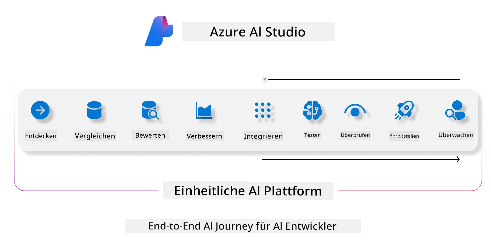
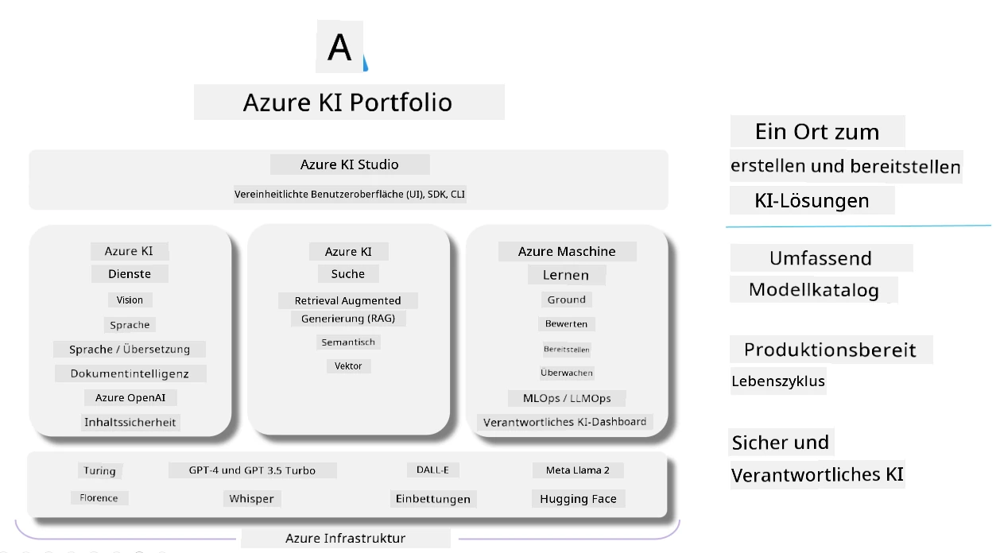

<!--
CO_OP_TRANSLATOR_METADATA:
{
  "original_hash": "7b4235159486df4000e16b7b46ddfec3",
  "translation_date": "2025-07-16T22:28:23+00:00",
  "source_file": "md/01.Introduction/05/AIFoundry.md",
  "language_code": "de"
}
-->
# **Verwendung von Azure AI Foundry zur Bewertung**

Wie Sie Ihre generative KI-Anwendung mit [Azure AI Foundry](https://ai.azure.com?WT.mc_id=aiml-138114-kinfeylo) bewerten können. Egal, ob Sie Einzel- oder Mehrfachdialoge analysieren möchten, Azure AI Foundry bietet Werkzeuge zur Bewertung der Modellleistung und Sicherheit.

## So bewerten Sie generative KI-Anwendungen mit Azure AI Foundry
Detaillierte Anleitungen finden Sie in der [Azure AI Foundry Dokumentation](https://learn.microsoft.com/azure/ai-studio/how-to/evaluate-generative-ai-app?WT.mc_id=aiml-138114-kinfeylo)

Hier sind die Schritte für den Einstieg:

## Bewertung generativer KI-Modelle in Azure AI Foundry

**Voraussetzungen**

- Ein Testdatensatz im CSV- oder JSON-Format.
- Ein bereitgestelltes generatives KI-Modell (z. B. Phi-3, GPT 3.5, GPT 4 oder Davinci-Modelle).
- Eine Laufzeitumgebung mit einer Compute-Instanz zur Durchführung der Bewertung.

## Eingebaute Bewertungsmetriken

Azure AI Foundry ermöglicht die Bewertung sowohl von Einzel- als auch von komplexen Mehrfachdialogen.  
Für Retrieval Augmented Generation (RAG)-Szenarien, bei denen das Modell auf spezifischen Daten basiert, können Sie die Leistung mit integrierten Bewertungsmetriken messen.  
Darüber hinaus können Sie allgemeine Einzel-Fragen-Antwort-Szenarien (nicht RAG) bewerten.

## Erstellen eines Bewertungsdurchlaufs

Navigieren Sie in der Azure AI Foundry Benutzeroberfläche zur Seite „Evaluate“ oder „Prompt Flow“.  
Folgen Sie dem Assistenten zur Erstellung einer Bewertung, um einen Bewertungsdurchlauf einzurichten. Geben Sie optional einen Namen für Ihre Bewertung an.  
Wählen Sie das Szenario aus, das den Zielen Ihrer Anwendung entspricht.  
Wählen Sie eine oder mehrere Bewertungsmetriken aus, um die Ausgabe des Modells zu beurteilen.

## Benutzerdefinierter Bewertungsablauf (optional)

Für mehr Flexibilität können Sie einen benutzerdefinierten Bewertungsablauf erstellen. Passen Sie den Bewertungsprozess an Ihre spezifischen Anforderungen an.

## Ergebnisse anzeigen

Nach dem Durchführen der Bewertung können Sie detaillierte Bewertungsmetriken in Azure AI Foundry protokollieren, anzeigen und analysieren. Erhalten Sie Einblicke in die Stärken und Schwächen Ihrer Anwendung.

**Note** Azure AI Foundry befindet sich derzeit in der öffentlichen Vorschau, daher sollte es vor allem für Experimente und Entwicklungszwecke genutzt werden. Für produktive Einsätze sollten Sie andere Optionen in Betracht ziehen. Weitere Details und Schritt-für-Schritt-Anleitungen finden Sie in der offiziellen [AI Foundry Dokumentation](https://learn.microsoft.com/azure/ai-studio/?WT.mc_id=aiml-138114-kinfeylo).

**Haftungsausschluss**:  
Dieses Dokument wurde mit dem KI-Übersetzungsdienst [Co-op Translator](https://github.com/Azure/co-op-translator) übersetzt. Obwohl wir uns um Genauigkeit bemühen, beachten Sie bitte, dass automatisierte Übersetzungen Fehler oder Ungenauigkeiten enthalten können. Das Originaldokument in seiner Ursprungssprache gilt als maßgebliche Quelle. Für wichtige Informationen wird eine professionelle menschliche Übersetzung empfohlen. Wir übernehmen keine Haftung für Missverständnisse oder Fehlinterpretationen, die aus der Nutzung dieser Übersetzung entstehen.