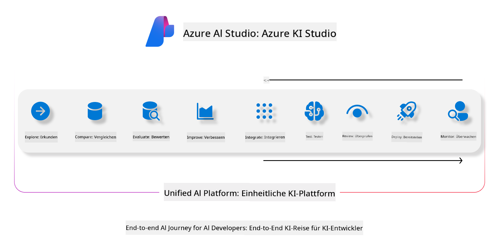
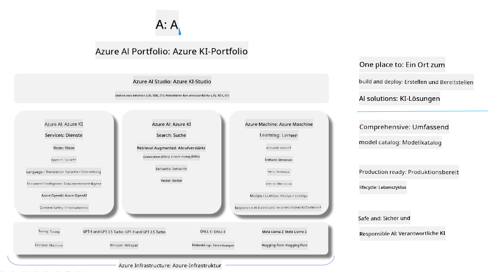

<!--
CO_OP_TRANSLATOR_METADATA:
{
  "original_hash": "7b4235159486df4000e16b7b46ddfec3",
  "translation_date": "2025-05-07T10:36:35+00:00",
  "source_file": "md/01.Introduction/05/AIFoundry.md",
  "language_code": "de"
}
-->
# **Verwendung von Azure AI Foundry zur Bewertung**

Wie Sie Ihre generative KI-Anwendung mit [Azure AI Foundry](https://ai.azure.com?WT.mc_id=aiml-138114-kinfeylo) bewerten können. Egal, ob Sie Einzel- oder Mehrfachdialoge analysieren möchten – Azure AI Foundry bietet Werkzeuge zur Bewertung der Modellleistung und Sicherheit.

## Wie man generative KI-Apps mit Azure AI Foundry bewertet
Für detaillierte Anleitungen siehe die [Azure AI Foundry Dokumentation](https://learn.microsoft.com/azure/ai-studio/how-to/evaluate-generative-ai-app?WT.mc_id=aiml-138114-kinfeylo)

Hier sind die Schritte zum Einstieg:

## Bewertung generativer KI-Modelle in Azure AI Foundry

**Voraussetzungen**

- Ein Testdatensatz im CSV- oder JSON-Format.
- Ein bereitgestelltes generatives KI-Modell (wie Phi-3, GPT 3.5, GPT 4 oder Davinci-Modelle).
- Eine Laufzeitumgebung mit einer Compute-Instanz für die Bewertung.

## Eingebaute Bewertungsmetriken

Azure AI Foundry ermöglicht die Bewertung von Einzel- und komplexen Mehrfachdialogen.
Für Retrieval Augmented Generation (RAG)-Szenarien, bei denen das Modell auf spezifischen Daten basiert, können Sie die Leistung mit integrierten Bewertungsmetriken messen.
Außerdem können Sie allgemeine Einzelantwort-Szenarien (nicht-RAG) bewerten.

## Erstellen eines Bewertungslaufs

Navigieren Sie in der Azure AI Foundry Benutzeroberfläche zur Seite Evaluate oder Prompt Flow.
Folgen Sie dem Assistenten zur Erstellung einer Bewertung, um einen Bewertungslauf einzurichten. Geben Sie optional einen Namen für Ihre Bewertung an.
Wählen Sie das Szenario, das zu den Zielen Ihrer Anwendung passt.
Wählen Sie eine oder mehrere Bewertungsmetriken, um die Ausgabe des Modells zu beurteilen.

## Benutzerdefinierter Bewertungsablauf (optional)

Für mehr Flexibilität können Sie einen benutzerdefinierten Bewertungsablauf einrichten. Passen Sie den Bewertungsprozess an Ihre speziellen Anforderungen an.

## Ergebnisse anzeigen

Nach der Bewertung können Sie detaillierte Bewertungsmetriken in Azure AI Foundry protokollieren, ansehen und analysieren. Erhalten Sie Einblicke in die Fähigkeiten und Grenzen Ihrer Anwendung.

**Note** Azure AI Foundry befindet sich derzeit in der öffentlichen Vorschau, daher sollte es für Experimente und Entwicklungszwecke genutzt werden. Für produktive Einsätze empfehlen sich andere Optionen. Weitere Informationen und Schritt-für-Schritt-Anleitungen finden Sie in der offiziellen [AI Foundry Dokumentation](https://learn.microsoft.com/azure/ai-studio/?WT.mc_id=aiml-138114-kinfeylo).

**Haftungsausschluss**:  
Dieses Dokument wurde mit dem KI-Übersetzungsdienst [Co-op Translator](https://github.com/Azure/co-op-translator) übersetzt. Obwohl wir auf Genauigkeit achten, beachten Sie bitte, dass automatisierte Übersetzungen Fehler oder Ungenauigkeiten enthalten können. Das Originaldokument in seiner ursprünglichen Sprache gilt als maßgebliche Quelle. Für wichtige Informationen wird eine professionelle menschliche Übersetzung empfohlen. Wir übernehmen keine Haftung für Missverständnisse oder Fehlinterpretationen, die aus der Nutzung dieser Übersetzung entstehen.